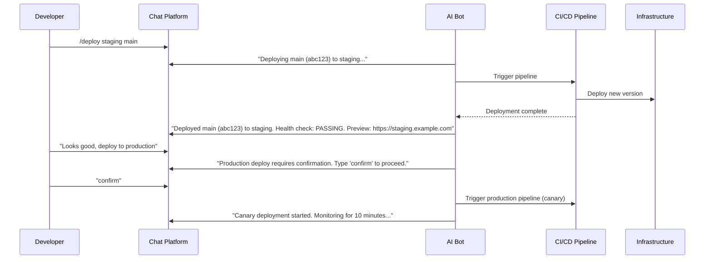
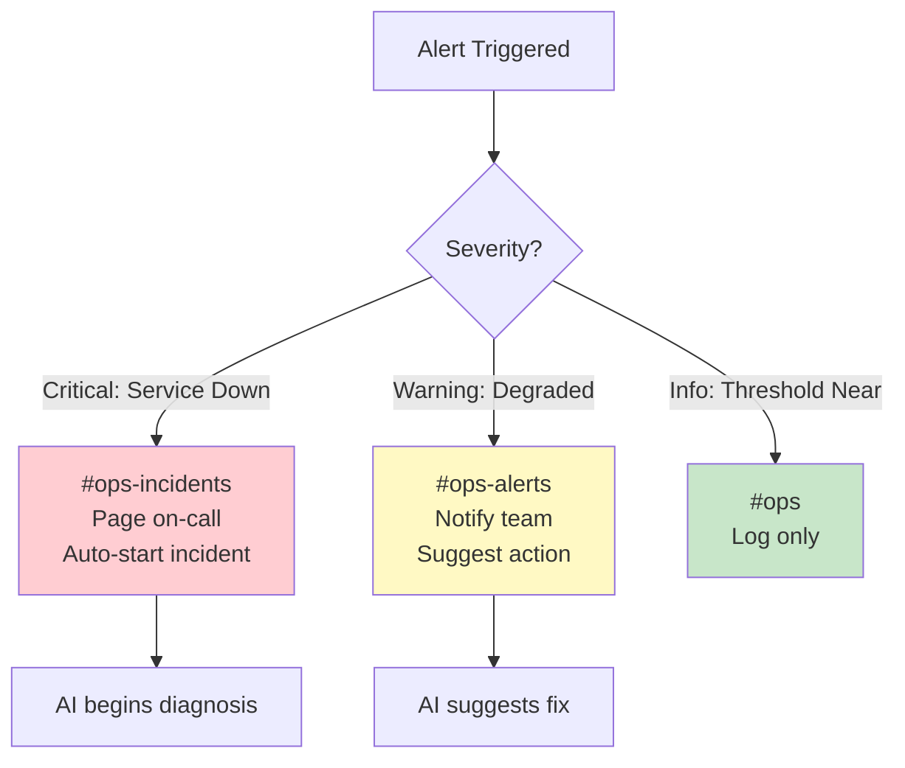

# Module 03: ChatOps Fundamentals

---

## Learning Objectives

By the end of this module, you will be able to:

- [ ] Define ChatOps and explain why chat is the ideal operations interface
- [ ] Design ChatOps workflows for common operations tasks
- [ ] Implement deployment, status, and scaling commands via chat
- [ ] Build notification and alerting patterns
- [ ] Create self-documenting operations through chat logs

---

## 1. What Is ChatOps?

ChatOps is the practice of **running operations workflows directly from a chat platform** (Slack or Teams). Every action happens in chat, and the chat log becomes the operations record.

### Why Chat?

| Benefit | Explanation |
|---------|-------------|
| **Visibility** | Everyone on the team can see what's happening |
| **Auditability** | Chat logs are a natural audit trail |
| **Low friction** | No switching between terminals, dashboards, and consoles |
| **Onboarding** | New team members learn by watching operations happen |
| **Context** | Discussions happen alongside the operations they trigger |

### The ChatOps Flow



---

## 2. Core ChatOps Workflows

### Workflow 1: Deployments

The most common ChatOps workflow. Here's the pattern:

**Simple deploy:**
```
User:  /deploy staging main
Bot:   Building main (commit abc123, "Fix login timeout")...
Bot:   Build complete. Running tests...
Bot:   Tests passed (142/142). Deploying to staging...
Bot:   Deployed to staging. Health check: PASSING
       Preview: https://staging.example.com
       Rollback: /rollback staging
```

**Production deploy with approval:**
```
User:  /deploy production main
Bot:   Production deployment request:
       - Branch: main (abc123)
       - Changes: 3 commits, 7 files modified
       - Last staging deploy: 2h ago, healthy
       - Risk assessment: LOW (no database changes)

       Requires approval. @team-lead please react with a check to approve.

Lead:  [reacts with checkmark]
Bot:   Approved by @team-lead. Starting canary deployment...
Bot:   Canary (10% traffic): healthy after 5 minutes
Bot:   Canary (50% traffic): healthy after 10 minutes
Bot:   Full rollout complete. All instances healthy.
```

### Workflow 2: Status Checks

```
User:  /status all
Bot:   Service Status (2026-03-22 14:30 UTC)

       api-service     HEALTHY  3/3 pods   CPU: 42%   Mem: 68%   p99: 120ms
       web-frontend    HEALTHY  2/2 pods   CPU: 15%   Mem: 34%   p99: 45ms
       worker-service  WARNING  2/2 pods   CPU: 89%   Mem: 72%   p99: N/A
       auth-service    HEALTHY  2/2 pods   CPU: 23%   Mem: 45%   p99: 35ms

       database        HEALTHY  Connections: 42/100   Storage: 67%
       redis           HEALTHY  Memory: 1.2GB/4GB     Hit rate: 94%

       Warning: worker-service CPU is elevated. Recent spike started 15 min ago.
       Suggested: Check for stuck jobs or scale up. Run /logs worker-service for details.
```

### Workflow 3: Scaling

```
User:  We're launching a marketing campaign tomorrow. Prepare for 5x traffic.
Bot:   Preparing for 5x traffic increase. Here's my plan:

       Service          Current    Proposed    Cost Impact
       api-service      3 pods     15 pods     +$180/day
       web-frontend     2 pods     6 pods      +$60/day
       worker-service   2 pods     8 pods      +$90/day
       auth-service     2 pods     6 pods      +$60/day

       Redis: Upgrade from cache.t3.medium to cache.r6g.large (+$45/day)
       RDS: Add read replica (+$120/day)

       Total additional cost: ~$555/day

       Auto-scale-down scheduled for 48h from now.

       Proceed? Type 'confirm' to apply.
```

### Workflow 4: Log Investigation

```
User:  Why are we seeing 503 errors on the checkout page?
Bot:   Investigating 503 errors on checkout...

       Findings:
       - 503 errors started at 14:15 UTC (23 minutes ago)
       - 47 occurrences, affecting ~5% of checkout requests
       - All errors originate from api-service -> payment-gateway
       - Payment gateway response time jumped from 200ms to 8500ms at 14:15
       - No recent deployments to api-service

       Root cause: Payment gateway (external) is experiencing degraded performance

       Recommended actions:
       1. Increase timeout on payment-gateway calls from 5s to 15s (temporary)
       2. Enable circuit breaker to fail fast after 3 consecutive timeouts
       3. Show users a "retry in a moment" message instead of a 503

       Shall I apply option 1 and 2?
```

---

## 3. Designing Effective ChatOps Commands

### Command Design Principles

1. **Progressive disclosure**: Show summary first, details on request
2. **Sensible defaults**: `/deploy staging` should deploy `main` by default
3. **Confirmation for danger**: Any destructive or production action needs explicit confirmation
4. **Rich responses**: Use formatting, links, and suggestions
5. **Actionable output**: Every response should suggest a next step

### Command Naming Conventions

| Pattern | Examples | When to Use |
|---------|----------|-------------|
| Verb | `/deploy`, `/scale`, `/restart` | Actions that change state |
| Noun | `/status`, `/logs`, `/metrics` | Queries that read state |
| Verb + target | `/deploy staging`, `/restart api` | When target is needed |
| Natural language | "How's the API doing?" | When using AI chat (not slash commands) |

### Error Messages That Help

**Bad:**
```
Bot: Error: deployment failed
```

**Good:**
```
Bot: Deployment to staging failed.

     Cause: Docker build failed at step 7/12 (npm install)
     Error: Package 'leftpad@2.0.0' not found in registry

     This usually means a dependency was removed from npm.

     Fix options:
     1. Check if leftpad was renamed or moved
     2. Pin to the last known working version
     3. Find an alternative package

     Recent changes to package.json: commit def456 by @alice (2h ago)
     "Added leftpad for string formatting"
```

---

## 4. Notification and Alerting Patterns

### Alert Routing



### Smart Alert Formatting

```
ALERT: api-service response time degraded

Severity:  WARNING
Service:   api-service (production)
Metric:    p99 latency: 850ms (threshold: 500ms)
Started:   2026-03-22 14:15 UTC (8 minutes ago)
Trend:     Rising (was 200ms at 14:00)

Context:
- Last deployment: 6 hours ago (unlikely cause)
- CPU: 78% (elevated from baseline 45%)
- Active connections: 2,847 (normal range: 1,500-3,000)
- Database: response time normal

AI Assessment: Likely caused by increased organic traffic.
               CPU is elevated but not critical.

Suggested: Scale api-service from 3 to 5 replicas.
           /scale api-service 5
```

### Alert Deduplication

Avoid alert fatigue by:
- Grouping related alerts (10 pod restarts = 1 alert, not 10)
- Suppressing alerts during known maintenance windows
- Adding cooldown periods (don't re-alert for same issue within 30 minutes)
- Correlating alerts across services (API slow + DB slow = probably DB issue)

---

## 5. Self-Documenting Operations

One of ChatOps' greatest strengths: **the chat log IS the documentation**.

### What Gets Captured Automatically

- Who requested what, when
- What the AI planned to do
- Who approved it
- What actually happened
- Any errors and how they were resolved

### Enhancing Documentation

Ask the AI to summarize after operations:

```
User:  Summarize what we did today in #ops
Bot:   Operations Summary (2026-03-22):

       Deployments:
       - 10:30 UTC: Deployed main (abc123) to staging - @henry
       - 14:00 UTC: Promoted to production (canary) - @henry, approved by @alice

       Scaling:
       - 09:00 UTC: Scaled worker-service 2 -> 4 (campaign prep) - @henry

       Incidents:
       - 14:15-14:45 UTC: Payment gateway degradation (external)
         - Impact: 5% checkout failures for 30 minutes
         - Resolution: Increased timeout, enabled circuit breaker
         - Post-mortem pending

       Alerts:
       - 3 warnings (all resolved)
       - 0 critical
```

---

## 6. Try It Yourself

### Exercise: Design a ChatOps Workflow

Design the ChatOps interaction for this scenario:

> Your team is about to do a database migration. Design the chat-based workflow including:
> 1. How the migration is initiated
> 2. What checks happen before it runs
> 3. How progress is reported
> 4. How rollback works if something goes wrong
> 5. How success is confirmed

<details>
<summary>Sample Solution</summary>

```
User:  /migrate production run-migration-042
Bot:   Database Migration Request: migration-042

       Pre-flight checks:
       [ok] Migration file exists and is valid SQL
       [ok] Migration tested on staging (passed 2026-03-21)
       [ok] Database backup completed (5 minutes ago)
       [ok] Current connections: 34 (low traffic period)
       [WARNING] No rollback migration found. Is this intentional?

       Migration details:
       - Adds index on orders.customer_id
       - Estimated duration: 2-5 minutes
       - Expected lock: orders table (brief, during index creation)

       Risk: LOW (additive change, no data modification)

       Requires team-lead approval. @team-lead please review.

Lead:  confirm

Bot:   Starting migration-042...
       [14:30:01] Enabling maintenance mode for order-service...
       [14:30:03] Beginning index creation on orders.customer_id...
       [14:30:15] Index creation: 30% complete...
       [14:30:45] Index creation: 70% complete...
       [14:31:02] Index creation complete. Verifying...
       [14:31:05] Verification passed. Index is active.
       [14:31:06] Disabling maintenance mode...
       [14:31:08] Migration complete.

       Results:
       - Duration: 67 seconds
       - Rows indexed: 2,847,392
       - Query performance: SELECT on orders.customer_id improved 94% (1200ms -> 72ms)

       Rollback available for 24h: /rollback migration-042
```

</details>

---

## Quiz

**Q1: What are the five core principles of ChatOps command design?**

<details>
<summary>Answer</summary>

1. Progressive disclosure -- summary first, details on request
2. Sensible defaults -- commands work with minimal input
3. Confirmation for danger -- destructive/production actions need explicit approval
4. Rich responses -- use formatting, links, and context
5. Actionable output -- every response suggests a next step

</details>

**Q2: Why is the chat log valuable as an operations record?**

<details>
<summary>Answer</summary>

It automatically captures who requested what, when, what was planned, who approved it, what actually happened, and any errors and resolutions. This creates a natural audit trail without requiring anyone to write documentation separately.

</details>

**Q3: How should alerts be designed to avoid alert fatigue?**

<details>
<summary>Answer</summary>

Group related alerts (e.g., multiple pod restarts as one alert), suppress during known maintenance windows, add cooldown periods (don't re-alert for the same issue within a set time), and correlate alerts across services to surface root causes instead of symptoms.

</details>

---

## Next Module

When things go wrong, vibe ops shines brightest. Continue to [Module 04: AI-Driven Incident Management](04_incident_management.md).
