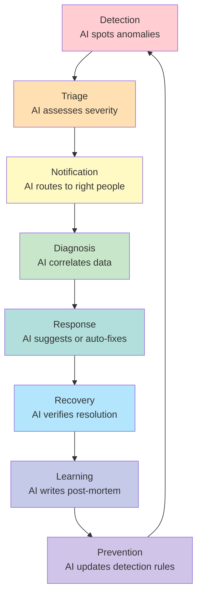
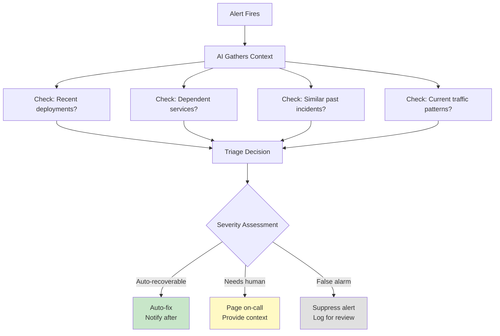
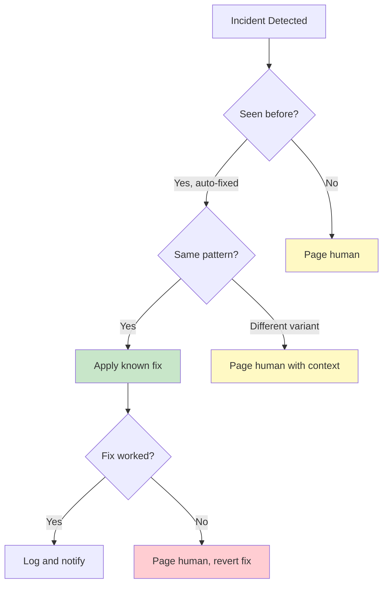

# Module 04: AI-Driven Incident Management

---

## Learning Objectives

By the end of this module, you will be able to:

- [ ] Design an AI-assisted incident response lifecycle
- [ ] Implement automated detection and triage
- [ ] Build AI-powered diagnosis workflows
- [ ] Create self-healing patterns for common failures
- [ ] Generate automated post-mortems and learning loops

---

## 1. The AI Incident Lifecycle

Traditional incident management follows a rigid process. AI-driven incident management makes each step faster and smarter:



---

## 2. Automated Detection

### Traditional vs. AI Detection

| Approach | What It Catches | What It Misses |
|----------|----------------|----------------|
| **Threshold alerts** | CPU > 90%, latency > 500ms | Slow degradation, unusual patterns |
| **AI anomaly detection** | Unusual patterns, trend shifts, correlations | Novel failure modes never seen before |
| **Combined** | Best of both | Minimal blind spots |

### Setting Up Detection

**Threshold-based alerts** (the foundation):

```yaml
# alerts.yaml
alerts:
  - name: high_latency
    metric: api.response_time.p99
    condition: "> 500ms for 5 minutes"
    severity: warning

  - name: error_rate_spike
    metric: api.error_rate
    condition: "> 5% for 2 minutes"
    severity: critical

  - name: disk_space_low
    metric: host.disk.used_percent
    condition: "> 85%"
    severity: warning
```

**AI-enhanced detection** (layered on top):

Ask your AI to watch for:

> Monitor these services and alert me if you notice:
> - Response times trending upward over 30 minutes (even if under threshold)
> - Error patterns that correlate with specific user actions
> - Resource usage patterns that suggest a memory leak (gradual increase without recovery)
> - Traffic patterns that differ significantly from the same time last week
> - Any combination of metrics that historically preceded an outage

---

## 3. AI-Powered Triage

When an alert fires, the AI triages it automatically:



### Triage Output Example

```
INCIDENT TRIAGE - Auto-generated

Alert:    api-service error rate at 8% (threshold: 5%)
Time:     2026-03-22 14:15 UTC
Duration: 3 minutes and counting

Context gathered:
  [check] Recent deployments: YES - abc123 deployed 12 min ago by @henry
  [check] Dependent services: payment-gateway responding slowly (4200ms avg)
  [check] Similar past incidents: 2 matches found
          - 2026-02-15: Payment gateway timeout caused 503s (resolved by gateway team)
          - 2026-01-30: Deployment caused N+1 query (rolled back)
  [check] Traffic: Normal for this time of day

AI Assessment:
  Two possible causes identified:
  1. Recent deployment (abc123) may have introduced a regression
  2. Payment gateway degradation may be causing cascading failures

  Recommended investigation order:
  1. Check if errors correlate with payment-related endpoints
  2. If yes -> payment gateway issue (external, add timeout/circuit breaker)
  3. If no -> likely deployment regression (rollback abc123)

Severity: HIGH - User-facing impact
Action:   Paging @henry (deployer) and @on-call
```

---

## 4. Diagnosis Workflows

### The Five Whys (AI-Assisted)

The AI can perform a structured root-cause analysis:

```
User:  Diagnose why users can't log in

Bot:   Starting diagnosis...

       Why can't users log in?
       -> auth-service is returning 500 errors (confirmed: 23% error rate)

       Why is auth-service returning 500s?
       -> Database connection pool is exhausted (0 available connections)

       Why is the connection pool exhausted?
       -> Connections are being opened but not returned to the pool

       Why are connections not being returned?
       -> Recent deployment (abc123, 45 min ago) added a new query path
          that doesn't close connections in the error case

       Why does it not close connections on error?
       -> The new code uses a try block without a finally clause
          for the database connection cleanup

       Root Cause: Missing finally clause in new auth query
       Fix: Add connection cleanup in finally block
       Immediate Mitigation: Rollback deployment abc123
       Permanent Fix: PR with the connection leak fix + add connection pool monitoring

       Shall I initiate the rollback?
```

### Correlation Analysis

AI excels at connecting data across systems:

```
User:  What's causing the checkout failures?

Bot:   Cross-system correlation analysis:

       Timeline:
       14:00  Normal operations
       14:12  Payment gateway latency increases (200ms -> 3500ms)
       14:15  api-service timeout errors begin (payment calls)
       14:16  Circuit breaker not configured -- api-service threads blocked
       14:18  api-service connection pool saturated
       14:20  All api-service endpoints affected (not just payment)
       14:22  Load balancer marks api-service instances as unhealthy

       Cascade:
       Payment Gateway Slow -> API Threads Blocked -> Pool Exhausted -> All Endpoints Down

       This is a classic cascading failure pattern.

       Immediate fix:
       1. Restart api-service pods (clears blocked connections)
       2. Add circuit breaker for payment-gateway calls
       3. Set timeout on payment calls to 5 seconds

       Long-term fix:
       - Implement circuit breaker pattern for all external service calls
       - Add bulkhead isolation (separate thread pools per external service)
       - Set up payment gateway health check in monitoring
```

---

## 5. Self-Healing Patterns

Some incidents can be resolved automatically:

### Pattern 1: Automatic Pod Restart

```
Trigger:  Pod OOMKilled (out of memory)
AI Check: Is this a known memory leak in this service? Has a restart fixed it before?
Action:   Restart the pod, increase memory limit by 25%, notify team
Verify:   Monitor memory for 10 minutes after restart
Escalate: If it happens 3 times in 1 hour, page on-call
```

### Pattern 2: Automatic Scaling

```
Trigger:  CPU > 80% sustained for 5 minutes
AI Check: Is this organic traffic growth or a runaway process?
Action:   If organic traffic -> scale up, set scale-down timer
          If runaway process -> restart the offending pod, investigate
Verify:   CPU drops below 60% within 5 minutes of scaling
Escalate: If scaling doesn't help, page on-call
```

### Pattern 3: Automatic Rollback

```
Trigger:  Error rate > 10% within 5 minutes of a deployment
AI Check: Error rate before deployment was < 1%
Action:   Automatically rollback to previous version
Verify:   Error rate returns to pre-deployment levels
Notify:   Inform deployer and team of automatic rollback with reason
```

### Self-Healing Decision Matrix



---

## 6. Automated Post-Mortems

After every incident, the AI generates a post-mortem:

### Template

```markdown
# Incident Post-Mortem: [Title]

**Date:** 2026-03-22
**Duration:** 14:15 - 14:45 UTC (30 minutes)
**Severity:** HIGH
**Services Affected:** api-service, checkout flow
**Users Impacted:** ~500 (5% of active users)

## Summary
Payment gateway experienced degraded performance, causing cascading
failures in api-service due to missing circuit breaker pattern.

## Timeline
| Time (UTC) | Event |
|------------|-------|
| 14:12 | Payment gateway latency increases to 3500ms |
| 14:15 | api-service 503 errors begin |
| 14:18 | Alert fires in #ops-alerts |
| 14:20 | @henry begins investigation |
| 14:25 | Root cause identified (payment gateway + no circuit breaker) |
| 14:30 | Timeout increased, circuit breaker added |
| 14:35 | Error rate returning to normal |
| 14:45 | All metrics healthy, incident closed |

## Root Cause
External payment gateway degradation combined with missing circuit
breaker pattern in api-service caused thread pool exhaustion and
cascading failure to all endpoints.

## What Went Well
- Alert fired within 3 minutes of impact
- Root cause identified in 7 minutes
- Fix deployed in 12 minutes

## What Could Be Improved
- No circuit breaker on external service calls
- No timeout configured on payment gateway calls
- Alert could have fired sooner with trend-based detection

## Action Items
| Action | Owner | Due Date | Status |
|--------|-------|----------|--------|
| Add circuit breakers to all external calls | @henry | 2026-03-29 | TODO |
| Configure timeouts for all HTTP clients | @alice | 2026-03-29 | TODO |
| Add payment gateway health check to monitoring | @ops | 2026-03-25 | TODO |
| Review all services for similar vulnerability | @team | 2026-04-05 | TODO |
```

---

## 7. Try It Yourself

### Exercise: Incident Simulation

Simulate an incident using your vibe ops lab setup from Module 02.

**Scenario:** Your api-service is returning 500 errors. The error started 10 minutes ago. Walk through the complete incident lifecycle with Claude Code:

1. Ask Claude to simulate the detection alert
2. Ask Claude to perform triage and gather context
3. Walk through diagnosis (ask "why" repeatedly)
4. Ask Claude to suggest and implement a fix
5. Ask Claude to verify the fix
6. Ask Claude to generate a post-mortem

<details>
<summary>Sample starting prompt</summary>

> Simulate an incident scenario: our api-service started returning HTTP 500 errors 10 minutes ago. Error rate is currently 15% and rising. Walk me through the incident response process step by step. Start with the detection alert, then triage, diagnosis, response, and recovery. Generate realistic data and a post-mortem at the end.

</details>

### Exercise: Design a Self-Healing Rule

Create a self-healing rule for this scenario:

> Your background worker occasionally gets stuck processing a job, causing the job queue to back up. When the queue exceeds 1000 pending jobs and no job has been completed in 5 minutes, the worker needs to be restarted.

<details>
<summary>Sample Solution</summary>

```yaml
self_healing_rule:
  name: stuck_worker_restart
  trigger:
    conditions:
      - metric: worker.queue.pending
        operator: ">"
        value: 1000
      - metric: worker.jobs.completed.last_5m
        operator: "="
        value: 0
    evaluation: all  # Both conditions must be true

  check:
    - Is there a deployment in progress? If yes, wait.
    - Has this rule fired in the last 30 minutes? If yes, escalate instead.
    - Are there any other worker issues? If yes, escalate.

  action:
    - Gracefully restart worker-service pods (rolling restart)
    - Wait 60 seconds for new pods to start processing
    - Verify: queue size decreasing and jobs completing

  escalation:
    - If queue still growing after restart: page on-call
    - If fired 3 times in 2 hours: page team lead
    - Post in #ops-alerts with full context

  notification:
    channel: "#ops-alerts"
    message: "Self-healed: worker-service restarted due to stuck queue ({queue_size} pending). Monitoring recovery."
```

</details>

---

## Quiz

**Q1: What are the eight stages of the AI incident lifecycle?**

<details>
<summary>Answer</summary>

1. Detection -- AI spots anomalies
2. Triage -- AI assesses severity and gathers context
3. Notification -- AI routes to the right people
4. Diagnosis -- AI correlates data across systems
5. Response -- AI suggests fixes or auto-remediates
6. Recovery -- AI verifies the fix worked
7. Learning -- AI generates a post-mortem
8. Prevention -- AI updates detection rules to prevent recurrence

</details>

**Q2: What is a cascading failure and how can it be prevented?**

<details>
<summary>Answer</summary>

A cascading failure is when one service's degradation causes other services to fail, which in turn causes more failures. Example: a slow external service ties up connection threads, which exhausts the connection pool, which causes all endpoints to fail. Prevention patterns include circuit breakers (fail fast instead of waiting), bulkhead isolation (separate resources per dependency), timeouts on all external calls, and graceful degradation (serve partial results instead of failing completely).

</details>

**Q3: When should self-healing NOT be used?**

<details>
<summary>Answer</summary>

Self-healing should not be used when the fix has already been attempted recently (to avoid infinite loops), when the incident involves data integrity or security, when the root cause is unknown (restarting might mask the problem), or when the fix could have unintended side effects (like restarting a service during a database migration).

</details>

---

## Next Module

Time to practice everything together. Continue to [Module 05: Interactive Exercises](05_exercises.md).
