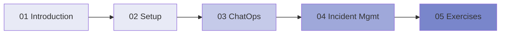

# Vibe Ops: AI-Driven Operations for Developer Productivity

> An interactive course on applying natural language AI to infrastructure, deployment, monitoring, and incident management.

---

## Course Overview

Vibe Ops extends the "vibe coding" philosophy to operations: instead of writing YAML, Terraform, or shell scripts by hand, you describe your infrastructure and operational needs in natural language and let AI handle the implementation. The goal is to make operational concerns nearly invisible to developers, keeping them in a flow state.

This course covers the principles, tools, and patterns for implementing AI-driven operations in your team or organization.

## Prerequisites

- Basic understanding of what servers, deployments, and monitoring mean
- Familiarity with a chat platform (Slack or Microsoft Teams)
- Completion of the [Vibe Coding course](../vibe_coding/README.md) recommended but not required

## Course Modules

| Module | Title | Duration | Description |
|--------|-------|----------|-------------|
| [01](01_introduction.md) | Introduction to Vibe Ops | 30 min | What vibe ops is, how it evolved, and why it matters |
| [02](02_setup.md) | Setting Up Vibe Ops | 60 min | Tools, integrations, and infrastructure |
| [03](03_chatops.md) | ChatOps Fundamentals | 60 min | Running operations from chat platforms |
| [04](04_incident_management.md) | AI-Driven Incident Management | 60 min | Detecting, responding to, and learning from incidents |
| [05](05_exercises.md) | Interactive Exercises | Open-ended | Practice scenarios with solutions |

## Learning Path

## What You Will Learn

1. Explain what vibe ops is and how it differs from traditional DevOps
2. Set up AI-assisted operations tooling
3. Implement ChatOps workflows for common operations tasks
4. Build AI-driven incident detection and response pipelines
5. Create self-healing infrastructure patterns
6. Evaluate when AI ops is appropriate vs. manual ops
