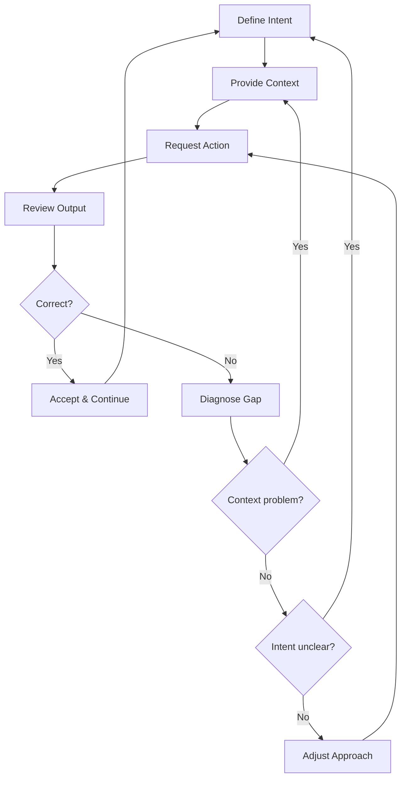

# The Craft of AI Pair Programming

> Practical techniques for getting the most out of Claude Code as a collaborative coding partner.

## What This Is

This collection distills field-tested patterns for working effectively with AI coding assistants, specifically Claude Code. It is not about prompting tricks or "hacks" -- it is about developing a repeatable craft: the habits, mental models, and workflows that separate productive AI-assisted sessions from frustrating ones.

## Why "Craft"?

The best developers using AI assistants are not the ones who write the cleverest prompts. They are the ones who:

- **Plan before they type** -- they know what they want before asking
- **Maintain context deliberately** -- they manage what the AI knows and does not know
- **Verify relentlessly** -- they treat AI output as a draft, never as truth
- **Iterate in tight loops** -- they course-correct early rather than hoping for perfection
- **Build reusable patterns** -- they extract workflows they can repeat across sessions

These are skills, not tricks. They improve with practice.

## The Files

| File | What It Covers |
|------|---------------|
| [conversation_patterns.md](conversation_patterns.md) | Session planning, plan mode, course correction, iterative refinement, context management |
| [debugging_with_ai.md](debugging_with_ai.md) | Systematic debugging workflows: reproduction, hypothesis testing, binary search, root cause analysis |
| [architecture_with_ai.md](architecture_with_ai.md) | System design sessions, trade-off analysis, design reviews, documentation generation |
| [refactoring_with_ai.md](refactoring_with_ai.md) | Safe refactoring: incremental approaches, test-first strategies, large codebase techniques |
| [context_management.md](context_management.md) | Context windows, /compact strategies, CLAUDE.md optimization, multi-file awareness |
| [mental_models.md](mental_models.md) | Capabilities and limitations, when to trust vs. verify, the human's role, skill development |

## How to Use This

**If you are new to AI pair programming:** Start with [mental_models.md](mental_models.md) to calibrate your expectations, then read [conversation_patterns.md](conversation_patterns.md) for session workflow.

**If you are already productive but want to level up:** Jump to [context_management.md](context_management.md) and [refactoring_with_ai.md](refactoring_with_ai.md) for techniques that scale.

**If you are debugging a specific problem right now:** Go directly to [debugging_with_ai.md](debugging_with_ai.md) for a step-by-step workflow.

## The Core Loop

Every effective AI coding session follows the same fundamental loop:

When a session is going poorly, it is almost always because one of these steps was skipped or rushed:

1. **Intent was vague** -- you did not know what "done" looks like
2. **Context was missing** -- the AI lacked information it needed
3. **Review was skipped** -- you accepted output without reading it
4. **Diagnosis was lazy** -- you re-prompted instead of understanding why the output was wrong

## Principles

1. **The AI is a tool, not an oracle.** It generates plausible code, not correct code. Your judgment is the quality gate.
2. **Context is the bottleneck.** The quality of AI output is bounded by the quality of context you provide.
3. **Small steps compound.** Incremental, verified changes beat ambitious one-shot attempts every time.
4. **Plan mode is not optional for non-trivial work.** The few minutes spent planning save hours of rework.
5. **Name things.** Name your sessions, name your plans, name your decisions. Future-you will thank present-you.

## Sources

- [Best Practices for Claude Code - Official Docs](https://code.claude.com/docs/en/best-practices)
- [Addy Osmani - My LLM Coding Workflow Going Into 2026](https://addyosmani.com/blog/ai-coding-workflow/)
- [Trust Calibration for AI Software Builders - Fly.io](https://fly.io/blog/trust-calibration-for-ai-software-builders/)
- [The Trust, But Verify Pattern for AI-Assisted Engineering](https://addyo.substack.com/p/the-trust-but-verify-pattern-for)
- [50 Claude Code Tips and Best Practices](https://www.builder.io/blog/claude-code-tips-best-practices)
