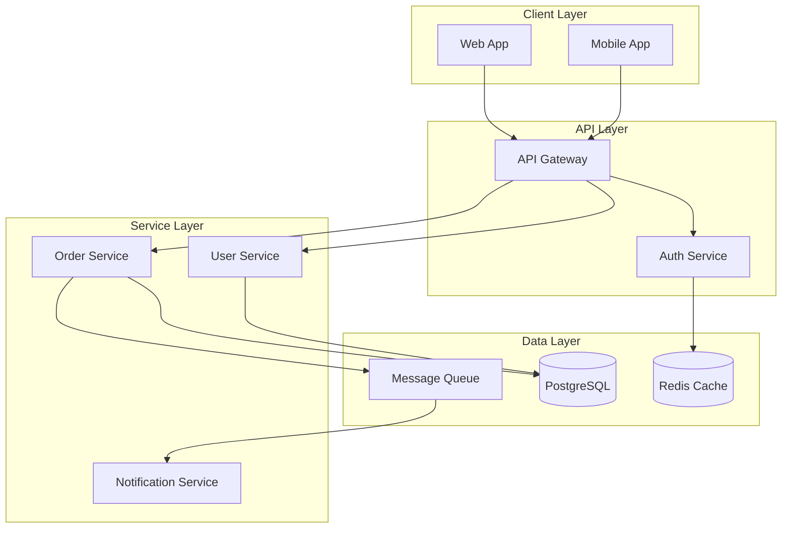

# Architecture Design with AI

> Using Claude Code as a thinking partner for system design, trade-off analysis, and design reviews.

---

## AI's Role in Architecture

AI is a **reasoning accelerator**, not a decision maker. It excels at:

- Articulating textbook trade-offs between approaches
- Surveying a codebase to map current architecture
- Generating alternatives you might not have considered
- Documenting decisions in structured formats
- Identifying inconsistencies in a proposed design

It struggles with:

- Understanding your specific business context, team dynamics, and organizational constraints
- Making judgment calls where the "right" answer depends on factors outside the codebase
- Predicting operational costs and real-world performance characteristics
- Knowing what your users actually need vs. what the code says they need

Your job is to bring the context. Claude's job is to bring the breadth.

---

## 1. System Design Sessions

### The Structured Design Conversation

Use plan mode for all architecture discussions. The goal is to explore the design space before committing to code.

**Opening prompt template:**

```
I need to design [system/feature]. Here's the context:

Problem: [what problem does this solve]
Users: [who uses it and how]
Scale: [expected load, data volume, growth]
Constraints: [technical, business, timeline, team]
Existing system: [what's already built that this interacts with]

Start by proposing 2-3 fundamentally different approaches.
For each, outline the architecture, key components, and the
main trade-offs. Use a diagram for each approach.
```

### The Exploration Phase

Do not rush to a decision. Use Claude to explore the design space:

```
For approach #2, let's go deeper:

1. How would this handle [specific scenario]?
2. What happens when [failure mode]?
3. How would we migrate from current state to this?
4. What's the operational burden of running this?
5. Where are the scaling bottlenecks?
```

### The Narrowing Phase

Once you have explored, narrow with explicit criteria:

```
Let's evaluate these approaches against our actual criteria:

1. Time to implement (we have 3 weeks)
2. Operational complexity (small team, no dedicated SRE)
3. Scaling to [target] without re-architecture
4. Compatibility with existing [system/pattern]
5. Reversibility if we're wrong

Score each approach 1-5 on these dimensions and explain
the scores.
```

---

## 2. Trade-Off Analysis

### The Trade-Off Matrix

Ask Claude to produce explicit trade-off matrices:

```
We're choosing between [A] and [B] for [component].

Create a trade-off matrix covering:
- Performance (latency, throughput)
- Complexity (implementation, operational)
- Cost (infrastructure, development time)
- Scalability (horizontal, vertical)
- Reliability (failure modes, recovery)
- Team fit (existing skills, learning curve)
- Reversibility (how hard to change later)

For each dimension, explain the trade-off, not just score it.
```

### The Devil's Advocate Pattern

Force Claude to argue against its own recommendation:

```
You recommended approach A. Now argue against it:

1. What are the strongest reasons NOT to do this?
2. Under what conditions would this fail?
3. What would a senior engineer who disagrees say?
4. What are we giving up by choosing this?
```

### The "What Could Go Wrong?" Pattern

```
We've decided on [approach]. Before we start building,
enumerate everything that could go wrong:

1. Technical risks (what breaks, what's fragile)
2. Scaling risks (what doesn't scale, what's expensive)
3. Operational risks (what's hard to debug, monitor, deploy)
4. Integration risks (what doesn't play well with existing systems)
5. Migration risks (what's hard to change if we're wrong)

For each risk, rate it (low/medium/high likelihood and impact)
and suggest a mitigation.
```

---

## 3. Design Reviews

### Reviewing Existing Architecture

Use Claude to audit your current architecture:

```
Analyze our current architecture for [system]. The key files
are:
- [list entry points, config, core modules]

Produce:
1. A component diagram showing the current architecture
2. A list of architectural strengths
3. A list of architectural concerns (with severity)
4. Suggestions for improvement, prioritized by
   impact-to-effort ratio
```

### Reviewing a Proposed Design

```
Here's a proposed design for [feature]:

[paste design doc or describe the design]

Review this design:
1. Does it solve the stated problem?
2. What edge cases are unaddressed?
3. What are the implicit assumptions?
4. How does this interact with existing systems?
5. What's the operational story (deployment, monitoring,
   rollback)?
6. What would you change?
```

### The "Questions I Should Be Asking" Pattern

When you are unsure what you do not know:

```
We're designing [system]. I've described the requirements
and constraints. What questions should I be asking that
I haven't asked yet? What information is missing from
this design discussion?
```

---

## 4. Architecture Documentation

### Generating Architecture Decision Records (ADRs)

```
Document the decision we just made as an Architecture
Decision Record (ADR):

Title: [short title]
Context: [the situation and problem]
Decision: [what we decided]
Alternatives considered: [what we rejected and why]
Consequences: [positive and negative outcomes]
Status: Accepted

Use the standard ADR format. Be specific about trade-offs.
```

### Generating System Diagrams

Claude can produce Mermaid diagrams directly:

```
Create a Mermaid diagram showing:
1. The high-level system architecture (C4 context level)
2. The data flow for [primary use case]
3. The deployment architecture

Use separate diagrams for each. Keep them readable --
no more than 10-12 nodes per diagram.
```

**Example output:**



### Documenting Integration Points

```
Document all integration points for [service]:

For each integration:
1. What it connects to
2. Protocol and data format
3. Authentication method
4. Failure modes and retry behavior
5. SLA expectations
6. Owner/team

Format as a table with a diagram showing the connections.
```

---

## 5. Architecture Slash Commands

### `.claude/commands/design-review.md`

```markdown
Review the architecture of a system or component.

Arguments: $ARGUMENTS

1. Identify the key files and entry points for the specified system
2. Map the component architecture (produce a Mermaid diagram)
3. Identify the data flow for the primary use case
4. List architectural strengths
5. List architectural concerns with severity ratings
6. Suggest improvements prioritized by impact-to-effort ratio

Format the output as a design review document.
```

### `.claude/commands/tradeoff-analysis.md`

```markdown
Perform a trade-off analysis between two or more approaches.

Arguments: $ARGUMENTS

Parse the arguments for the approaches to compare. Then:

1. Define evaluation dimensions (performance, complexity, cost,
   scalability, reliability, team fit, reversibility)
2. Score each approach on each dimension (1-5)
3. Explain each score with specific reasoning
4. Produce a summary recommendation with caveats
5. List conditions under which the recommendation would change

Present as a comparison table with narrative explanation.
```

### `.claude/commands/adr.md`

```markdown
Generate an Architecture Decision Record.

Arguments: $ARGUMENTS

Create an ADR with the following sections:
- **Title**: Short descriptive title
- **Date**: Today's date
- **Status**: Proposed | Accepted | Deprecated | Superseded
- **Context**: The situation, problem, and forces at play
- **Decision**: What was decided
- **Alternatives Considered**: Each alternative with pros/cons
- **Consequences**: Positive and negative outcomes of the decision
- **Related Decisions**: Links to related ADRs if any

Save to the project's ADR directory (docs/decisions/ or similar).
```

---

## 6. Patterns to Avoid

| Anti-Pattern | Why It Fails | What to Do Instead |
|-------------|-------------|-------------------|
| "Design the best architecture for X" | No constraints = meaningless answer | Provide specific constraints, scale, and team context |
| Accepting AI's first design proposal | First proposals are generic, not contextual | Iterate: explore, challenge, refine |
| Using AI to validate a decision you already made | Confirmation bias -- AI will agree with you | Use the devil's advocate pattern |
| Skipping trade-off analysis | Leads to "obvious" choices that are wrong for your context | Always enumerate trade-offs explicitly |
| Designing too far ahead | Architecture that solves problems you do not have yet | Design for current needs with known extension points |
| Ignoring operational concerns | Beautiful architecture, painful to run | Always ask "what's the operational story?" |

---

## Key Principle

> AI can clearly articulate the textbook trade-offs of different approaches. This is not sufficient for making the decision -- your specific context matters. But asking "what are the trade-offs of X vs. Y?" and treating the response as a starting checklist ensures you are aware of standard considerations before applying your judgment.

## Sources

- [Leveraging AI for System Design and Architecture Decisions - MetaCTO](https://www.metacto.com/blogs/leveraging-ai-for-system-design-and-architecture-decisions)
- [AI Coding Assistants: Architectural Decision-Making - Martin Jordanovski](https://medium.com/@martin.jordanovski/ai-coding-assistants-architectural-decision-making-ais-role-1bcd0cb893eb)
- [AI and Software Architecture: A Dangerous Convenience - Super Productivity](https://super-productivity.com/blog/ai-software-architecture-guide/)
- [AI in Architecture Design for Software Development - ThinkPalm](https://thinkpalm.com/blogs/ai-in-architecture-design-for-software-development/)
- [Generative AI for Software Architecture - arXiv](https://arxiv.org/html/2503.13310v2)
