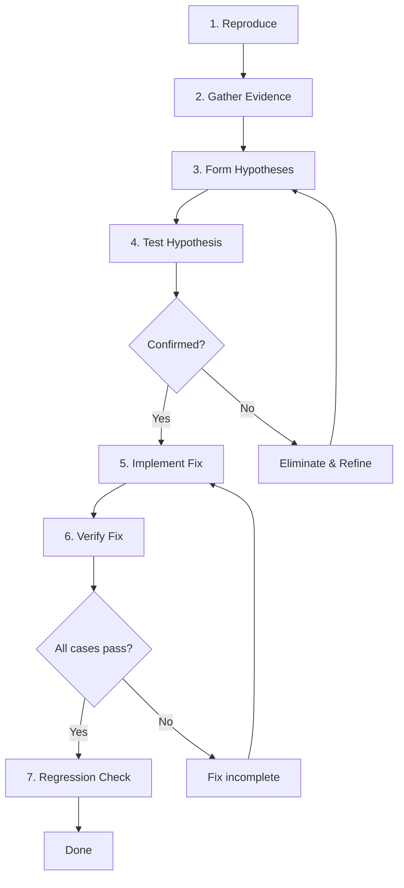

# Systematic Debugging with AI

> Structured workflows for finding and fixing bugs with Claude Code as your debugging partner.

---

## The Debugging Mindset with AI

AI is excellent at pattern matching across codebases, generating hypotheses, and executing tedious search tasks. It is not good at intuition, understanding subtle business logic, or knowing what "should" happen when the spec is ambiguous.

Your role: direct the investigation. Claude's role: execute the search, test hypotheses, and surface information.

---

## 1. The Systematic Debugging Workflow

Every debugging session should follow this structure:



### Step 1: Reproduce the Bug

Before anything else, establish a reliable reproduction.

```
I have a bug to investigate. Here's what I know:

Symptom: [what's happening]
Expected: [what should happen]
Steps to reproduce: [exact steps]
Environment: [relevant details]

First, let's confirm I can reproduce this. Run [command]
and show me the output.
```

**If you cannot reproduce:** That is critical information. The bug may be environment-specific, timing-dependent, or data-dependent. Tell Claude:

```
I can't reproduce this locally. The bug was reported in
[environment]. What differences between local and
[environment] could cause [symptom]? Check configuration
files, environment variables, and any conditional code paths.
```

### Step 2: Gather Evidence

Use Claude's ability to search across the codebase:

```
Before we hypothesize, let's gather evidence:

1. Find all code paths that could produce [error message/symptom]
2. Check the git log for recent changes to [relevant area]
3. Look for similar patterns elsewhere that work correctly
4. Check if there are existing tests covering this case
```

### Step 3: Form Hypotheses

Ask Claude to generate multiple hypotheses, ranked by likelihood:

```
Based on the evidence, list 3-5 possible causes of this bug,
ranked from most to least likely. For each, explain:
- Why you think it could be the cause
- What evidence supports or contradicts it
- How we would confirm or eliminate it
```

### Step 4: Test Hypotheses (Cheapest First)

Always test the cheapest hypothesis first:

```
Let's test hypothesis #1 first since it's the quickest to
confirm or eliminate. [Specific instruction for testing].
```

**Cheap tests** (do these first):
- Read a config value
- Check a log output
- Add a console.log/print statement
- Check types or interfaces

**Expensive tests** (do these later):
- Modify and restart the application
- Write a new test
- Change infrastructure

### Step 5: Implement the Fix

Once the root cause is confirmed:

```
Root cause confirmed: [description]. Implement the fix.

Requirements:
- Fix must handle [edge case]
- Must not break [related feature]
- Follow the existing error handling pattern in [file]

Before making changes, explain exactly what you'll change
and why.
```

### Step 6: Verify the Fix

```
Run the reproduction steps again to confirm the fix works.
Then run the full test suite to check for regressions.
```

### Step 7: Add a Regression Test

```
Write a test that would have caught this bug. It should:
- Reproduce the exact scenario that triggered the bug
- Verify the correct behavior
- Live alongside the existing tests in [test directory]
```

---

## 2. Debugging Patterns

### The Binary Search Pattern

When a bug is somewhere in a large change or a long process:

```
This feature was working as of commit [hash] and is broken
now. Let's do a binary search:

1. Find the midpoint commit between [working] and [broken]
2. Check if the bug exists at the midpoint
3. Narrow the range and repeat

Start by listing the commits between those two hashes.
```

For runtime binary search (e.g., a pipeline with many steps):

```
The data is correct at the input but wrong at the output.
This pipeline has 8 stages. Add logging at the midpoint
(after stage 4) to determine which half corrupts the data.
```

### The Comparison Pattern

When something works in one context but not another:

```
This endpoint works correctly for admin users but fails for
regular users. Compare:

1. The code path for admin vs. regular users
2. The middleware chain for both
3. The database queries executed for both
4. Any permission checks or filters applied

What differs between the two paths?
```

### The Isolation Pattern

When you cannot pinpoint the cause in a complex system:

```
Let's isolate the problem. Create a minimal reproduction:

1. Strip the function down to the bare minimum that
   still triggers the bug
2. Remove dependencies one at a time until we find which
   dependency is involved
3. Test with hardcoded data to rule out data-related causes
```

### The Timeline Pattern

For bugs that are intermittent or timing-dependent:

```
This bug happens intermittently. Let's build a timeline:

1. Add timestamps to all log messages in [module]
2. Run the scenario 10 times
3. Compare the logs from successful vs. failing runs
4. Look for ordering differences or timing gaps
```

### The "What Changed?" Pattern

For regressions:

```
This was working yesterday. Show me:
1. All commits since [date/hash]
2. Any config or environment changes
3. Any dependency updates
4. Any infrastructure changes

Focus on changes that touch [relevant area].
```

---

## 3. Working with Error Messages

### Decoding Stack Traces

```
Here's the stack trace:

[paste stack trace]

Analyze this trace:
1. What is the actual error (not just the symptom)?
2. Where in OUR code does the error originate?
   (ignore framework/library frames)
3. What are the likely causes at that location?
4. Read the relevant source code and explain what's happening.
```

### Cryptic Error Messages

```
I'm getting this error: [error message]

This error message is unhelpful. Search the codebase and
its dependencies for where this error is thrown. What
conditions trigger it?
```

### Silent Failures

```
No error is thrown, but the result is wrong. The function
returns [wrong value] instead of [expected value].

Add assertions/logging at each step of the computation in
[function] so we can see where the value diverges from
what's expected.
```

---

## 4. Debugging Slash Commands

Create these as reusable commands in `.claude/commands/`:

### `.claude/commands/debug-start.md`

```markdown
Start a debugging session for a reported bug.

1. Ask me to describe the symptom, expected behavior, and reproduction steps
2. Identify the relevant files and code paths
3. Generate 3-5 ranked hypotheses
4. Propose the cheapest test for the top hypothesis
5. Wait for my approval before making any changes

Do not modify any files until I explicitly approve a fix.
```

### `.claude/commands/debug-bisect.md`

```markdown
Perform a git bisect to find the commit that introduced a bug.

Arguments: $ARGUMENTS

Parse the arguments for:
- Description of the bug (what to test)
- Known good commit (optional, defaults to 10 commits back)
- Known bad commit (optional, defaults to HEAD)

For each bisect step:
1. Check out the midpoint commit
2. Run the reproduction test
3. Report whether the bug exists
4. Narrow the range

Report the first bad commit with a summary of what it changed.
```

### `.claude/commands/debug-compare.md`

```markdown
Compare a working case with a broken case to find the difference.

Arguments: $ARGUMENTS

Parse for working case and broken case descriptions. Then:
1. Trace the code path for the working case
2. Trace the code path for the broken case
3. Diff the two paths
4. Identify where they diverge
5. Explain what causes the divergence
```

---

## 5. Common Debugging Anti-Patterns

| Anti-Pattern | Why It Fails | What to Do Instead |
|-------------|-------------|-------------------|
| "Fix this error: [paste error]" | No context, no reproduction | Provide symptom + expected + reproduction |
| Letting Claude guess without evidence | Generates plausible but often wrong fixes | Gather evidence first, then hypothesize |
| Accepting the first fix without testing | The fix may address a symptom, not the cause | Always reproduce, fix, verify, regress |
| Modifying code before understanding the bug | Creates new bugs on top of old ones | Read and understand before changing |
| Debugging in production-like mode | Slow feedback loops | Create a minimal local reproduction first |
| Ignoring intermittent failures | They come back worse | Investigate timing, state, and concurrency |

---

## 6. When AI Debugging Struggles

AI debugging is less effective when:

- **The bug is in the interaction between systems** (e.g., race conditions, distributed state)
- **The bug depends on specific data** that is not in the codebase
- **The bug is in a custom/internal library** with no public documentation
- **The "bug" is actually a misunderstanding** of the requirements

In these cases, your domain knowledge is the critical input. Provide more context, not more prompts.

---

## Quick Reference

```
Reproduce -> Gather Evidence -> Hypothesize -> Test (cheapest first)
-> Fix -> Verify -> Regression Test
```

Always:
- Start with reproduction
- Test the cheapest hypothesis first
- Verify the fix addresses the root cause, not just the symptom
- Add a regression test

## Sources

- [Generative AI in Debugging: Best Practices 2025](https://www.lockedinai.com/blog/generative-ai-in-debugging-best-practices-2025)
- [Addy Osmani - My LLM Coding Workflow Going Into 2026](https://addyosmani.com/blog/ai-coding-workflow/)
- [AI-Powered Debugging Tools - Graphite](https://graphite.com/guides/ai-powered-debugging-tools)
- [Best Practices for Claude Code - Official Docs](https://code.claude.com/docs/en/best-practices)
