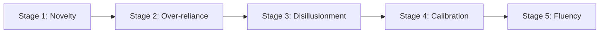

# Mental Models for AI Collaboration

> How to think about what AI can and cannot do, when to trust it, and how to develop your skill as the human half of the pair.

---

## The Fundamental Model

Claude Code is a **stateless pattern matcher with extraordinary breadth and zero judgment**. It has seen more code than any human ever will, but it does not understand your business, your users, or your constraints unless you tell it.

This creates a specific collaboration dynamic:

| Dimension | Human Strength | AI Strength |
|-----------|---------------|-------------|
| **Breadth of knowledge** | Narrow but deep | Vast but shallow |
| **Context** | Knows the full picture | Knows only what it is told |
| **Judgment** | Can weigh ambiguous trade-offs | Cannot -- it will pick confidently and often wrong |
| **Consistency** | Fatigues, makes different mistakes | Tireless, makes the same mistakes |
| **Pattern recognition** | Slow across large codebases | Fast across any amount of code |
| **Creativity** | Novel solutions from experience | Recombinations of seen patterns |
| **Verification** | Expensive but authoritative | Cheap but unreliable |

---

## 1. Capabilities and Limitations

### What AI Does Well

**Code generation from clear specifications:**
When the input is unambiguous (type signature, test case, well-described behavior), AI produces correct code the majority of the time. The more constrained the problem, the better the output.

**Pattern application across a codebase:**
"Apply pattern X from file A to files B, C, and D" is a near-perfect use case. The AI excels at mechanical, repetitive transformations where the pattern is established.

**Code search and navigation:**
"Find all places where X is used" or "trace the call path from A to B" -- tasks that would take a human minutes to hours take Claude seconds.

**Boilerplate and glue code:**
Tests, API handlers, data transfer objects, configuration files, migration scripts -- anything formulaic where the shape is known.

**Explaining code:**
Claude can read a function and explain what it does, trace data flow, and identify potential issues. Useful for onboarding into unfamiliar codebases.

**Generating documentation:**
API docs, architecture overviews, README updates, inline comments -- AI produces competent first drafts that you refine.

### What AI Does Poorly

**Judgment under ambiguity:**
When there is no single right answer and the choice depends on factors outside the code (team preference, business priorities, operational constraints), AI will pick confidently and often incorrectly.

**Understanding implicit requirements:**
The code says one thing; the business needs another. AI follows the code. You need to supply the business context.

**Multi-step reasoning across large codebases:**
As the number of interacting components grows, AI accuracy degrades. It handles individual components well but struggles with emergent behavior of the whole system.

**Knowing when to stop:**
AI will keep generating, elaborating, and adding features unless you tell it to stop. It does not know what "good enough" looks like for your situation.

**Security-critical decisions:**
Auth flows, cryptographic choices, permission models -- AI knows the patterns but not your threat model. Always have a human review security-critical code.

**Novel algorithms and domain-specific logic:**
If the problem is not well-represented in training data (internal libraries, custom protocols, novel algorithms), AI output quality drops significantly.

---

## 2. When to Trust and When to Verify

### The Trust Spectrum

```
High Trust                                          Low Trust
|-------|-------|-------|-------|-------|-------|-------|
Format   Boiler  Known   API    Logic   Archi   Secu
-ting    plate   pattern  glue          tecture  rity
```

**High trust (quick review is sufficient):**
- Formatting and style changes
- Boilerplate generation (tests, handlers, configs)
- Applying a pattern you have already validated elsewhere
- Import management and file organization
- Documentation updates

**Medium trust (careful review required):**
- Business logic implementations
- Database queries and data transformations
- API endpoint implementations
- Error handling paths
- Test logic (especially edge cases)

**Low trust (line-by-line review, manual testing required):**
- Security-related code (auth, permissions, crypto)
- Performance-critical paths
- Data migration scripts
- Concurrency and distributed systems logic
- Anything involving money, PII, or irreversible operations

### Verification Techniques

**For code correctness:**
- Run the test suite (obvious but often skipped)
- Read the diff carefully, focusing on logic rather than structure
- Test edge cases manually
- Ask Claude to explain its logic step-by-step

**For architectural decisions:**
- Use the devil's advocate pattern ("argue against this choice")
- Check that the approach matches your constraints
- Validate with a second opinion (colleague, another AI session)

**For security:**
- Never accept security-critical code without human review
- Run static analysis tools
- Check against known vulnerability patterns (OWASP, etc.)
- Test with adversarial inputs

### The "Plausible but Wrong" Problem

AI generates code that looks correct, follows conventions, and passes a casual review -- but contains subtle bugs. This is the most dangerous failure mode because it bypasses your defenses.

Common manifestations:
- Off-by-one errors in boundary conditions
- Incorrect handling of null/undefined/empty cases
- Race conditions in async code
- Subtly wrong SQL queries that return "close enough" results
- Error handling that swallows important information

**Mitigation:** Write tests for edge cases before asking Claude to implement the code. Then the tests catch these subtle bugs automatically.

---

## 3. The Human's Role

### You Are the Quality Gate

In AI pair programming, the human is the judgment layer. Your job is not to type code -- it is to:

1. **Define intent:** What are we building and why?
2. **Provide context:** What does the AI need to know?
3. **Guide approach:** Which direction should we go?
4. **Review output:** Is this correct and appropriate?
5. **Make decisions:** When trade-offs arise, you choose.
6. **Maintain standards:** The AI will match whatever bar you set.

### The Director/Executor Model

Think of yourself as a film director and Claude as an exceptionally skilled but literal-minded crew. The crew can build anything you describe, but they will build exactly what you describe -- including your mistakes.

- **Good direction:** "Build a login page that validates email format, shows inline errors, and submits via the existing auth API."
- **Bad direction:** "Build a login page." (The crew will build *something*, but it may not be what you wanted.)

### The Reviewer Mindset

Adopt the same mindset you would use reviewing a pull request from a junior developer who is extremely fast but sometimes overconfident:

- Read every line of the diff
- Question anything that seems "too clever"
- Check edge cases and error paths
- Verify that tests actually test what they claim
- Look for unintended side effects

### When to Take Over

Sometimes it is faster to write the code yourself:

- Small, precise changes where explaining takes longer than doing
- Code that requires deep domain knowledge the AI does not have
- Debugging when you have a strong intuition about the cause
- Security-critical sections where you need full understanding
- When the AI has failed twice at the same task (the problem is likely in the prompt, not the code, but sometimes you know best)

---

## 4. Skill Development

### The Learning Curve

AI pair programming is a skill that develops in stages:



**Stage 1: Novelty.** Everything feels magical. You accept most output uncritically.

**Stage 2: Over-reliance.** You start using AI for everything. Quality drops because you are not reviewing carefully enough.

**Stage 3: Disillusionment.** You hit a wall where AI output is wrong in ways you did not catch. You start distrusting the tool.

**Stage 4: Calibration.** You develop an intuition for what AI does well and where it needs help. You review appropriately based on risk.

**Stage 5: Fluency.** The collaboration is automatic. You naturally provide the right context, verify at the right level, and use the right tool for each task.

Most developers get stuck between stages 2 and 3. The path to stage 5 is deliberate practice at calibrating trust.

### Building Your Intuition

**Track failures:** When AI output is wrong, ask yourself: What kind of error was this? Could I have prevented it with better context? Was this a task where I should have reviewed more carefully?

**Classify tasks:** Over time, develop your own list of "high-confidence tasks" (where AI is reliably correct) and "review-intensive tasks" (where it needs close inspection).

**Practice prompting:** When a prompt produces poor results, rewrite it and try again. Notice what made the second version better. Was it more context? Clearer constraints? A better example?

**Watch for patterns in your corrections:** If you are always correcting the same type of mistake, add a standing instruction to CLAUDE.md to prevent it.

### Skills That Transfer

The skills you build in AI pair programming improve your general engineering:

- **Precise specification:** Learning to prompt well makes you better at writing tickets, design docs, and requirements
- **Code review:** Reviewing AI output sharpens your review skills for human code
- **Architecture thinking:** Explaining system context to AI forces you to clarify your own understanding
- **Testing discipline:** The need to verify AI output builds stronger testing habits
- **Communication:** Articulating intent clearly is a universal engineering skill

---

## 5. Anti-Patterns

| Anti-Pattern | The Problem | The Fix |
|-------------|------------|---------|
| **The Autopilot** | Accepting all AI output without review | Treat every output as a PR from a junior dev |
| **The Micromanager** | Dictating every line, losing the productivity benefit | Give intent and constraints, let AI choose the implementation |
| **The Blamer** | "The AI gave me bad code" when you gave it bad context | Diagnose root cause: was it your prompt or the AI's limitation? |
| **The Context Hoarder** | Dumping entire files into context "just in case" | Read targeted files, follow the breadcrumb pattern |
| **The One-Shotter** | Expecting perfect output on the first try | Plan for iteration: draft, review, refine |
| **The Trust Oscillator** | Alternating between blind trust and total distrust | Develop consistent trust calibration based on task type |
| **The Tool Maximizer** | Using AI for everything, including tasks where it is slower | Use AI where it has leverage; do simple things yourself |

---

## 6. The Collaboration Checklist

Before each session:
- [ ] I know what I want to accomplish (clear intent)
- [ ] I know what "done" looks like (acceptance criteria)
- [ ] I have identified the context Claude will need
- [ ] I have decided the trust level for this task

During each session:
- [ ] I am reviewing output before accepting
- [ ] I am running tests after changes
- [ ] I am course-correcting when the direction is wrong
- [ ] I am managing context proactively

After each session:
- [ ] I reviewed the full diff of changes made
- [ ] Tests pass
- [ ] I understand every change (no "black box" code)
- [ ] I noted what worked well and what I would do differently

---

## Key Principle

> The goal is not to type less code. The goal is to produce better software faster by combining human judgment with AI capability. If you are not exercising judgment, you are not pair programming -- you are delegating to an unreliable agent.

## Sources

- [Understanding User Mental Models in AI-Driven Code Completion Tools - ScienceDirect](https://www.sciencedirect.com/science/article/pii/S1071581925002058)
- [Trust Calibration for AI Software Builders - Fly.io](https://fly.io/blog/trust-calibration-for-ai-software-builders/)
- [The "Trust, But Verify" Pattern for AI-Assisted Engineering](https://addyo.substack.com/p/the-trust-but-verify-pattern-for)
- [Mental Models - People + AI Research (Google)](https://pair.withgoogle.com/chapter/mental-models/)
- [AI Coding Tool Limitations - Moonbeam](https://moonbeamdevelopment.com/ai-coding-tool-limitations/)
- [Addy Osmani - My LLM Coding Workflow Going Into 2026](https://addyosmani.com/blog/ai-coding-workflow/)
- [Best Practices for Claude Code - Official Docs](https://code.claude.com/docs/en/best-practices)
