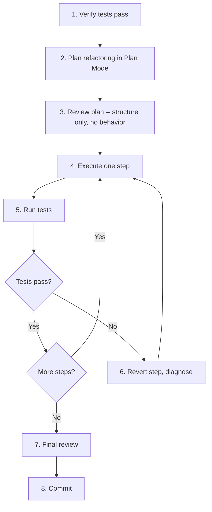

# Safe Refactoring with AI

> Strategies for refactoring code with Claude Code: incremental approaches, test-first workflows, and techniques for large codebases.

---

## The Refactoring Contract

Refactoring changes structure without changing behavior. This contract is sacred, and it is the single biggest risk when refactoring with AI: Claude will confidently "improve" behavior while refactoring structure if you do not enforce the boundary.

**Rule: Every refactoring session starts with passing tests and ends with the same tests passing.**

---

## 1. The Test-First Refactoring Workflow



### Step 1: Establish the Safety Net

```
Before we start refactoring, let's verify our safety net:

1. Run the full test suite
2. Show me the test coverage for [files we'll change]
3. If coverage is low, we need to add characterization
   tests first

Do NOT proceed with refactoring until tests are green.
```

### Step 2: Plan in Plan Mode

```
(Plan Mode) I want to refactor [module/component].

Goal: [what structural improvement]
Constraint: No behavior changes. Same inputs, same outputs.

Analyze the current code and propose a step-by-step
refactoring plan. Each step must be independently testable
-- tests must pass after every step, not just at the end.
```

### Step 3: Review the Plan

Check each step:
- Does it change only structure, not behavior?
- Can tests verify correctness after this step?
- Is the step small enough to review?
- Is the step reversible?

### Step 4: Execute One Step at a Time

```
Execute step 1 of the refactoring plan only. Make the
minimal changes needed. Then run the test suite.
```

**Never let Claude execute multiple refactoring steps at once.** If a test fails, you need to know which step caused it.

### Step 5: Run Tests After Every Step

```
Run the tests. If anything fails, stop and show me the
failure. Do not attempt to fix it -- I need to understand
what went wrong first.
```

---

## 2. Incremental Refactoring Strategies

### The Strangler Fig Pattern

Replace a component gradually by routing traffic to a new implementation piece by piece:

```
We're replacing the old UserService with a new implementation.
The strategy is Strangler Fig:

1. Create the new UserService alongside the old one
2. Add a feature flag to route calls to the new service
3. Migrate one method at a time:
   a. Implement the method in the new service
   b. Route that specific method through the flag
   c. Verify with tests
   d. Repeat for the next method
4. Once all methods are migrated, remove the old service

Start with step 1: create the new service file with the
same interface as the old one, but no implementation yet.
```

### The Extract-and-Replace Pattern

Extract code into a new module, then replace usage sites:

```
The function processOrder() in src/orders.ts is 200 lines
long and does too much.

Step 1: Identify the distinct responsibilities
Step 2: Extract each into its own function (in the same file first)
Step 3: Run tests
Step 4: Move extracted functions to appropriate modules
Step 5: Run tests
Step 6: Update imports across the codebase
Step 7: Run tests

Start with step 1: analyze processOrder() and identify
the distinct responsibilities.
```

### The Parallel Implementation Pattern

For risky refactors, build the new version alongside the old:

```
We need to refactor the pricing engine. The risk is too
high to do it in-place.

1. Create a new pricing module that implements the same
   interface
2. Add a comparison mode that runs BOTH old and new on
   every request and logs differences
3. Monitor in production until we're confident the new
   implementation matches
4. Switch over
5. Remove the old implementation

Start with step 1.
```

---

## 3. Large Codebase Strategies

### Scoping the Blast Radius

Before refactoring in a large codebase, understand the impact:

```
I want to refactor [component]. Before we start:

1. Find all files that import from or depend on [component]
2. Find all files that [component] depends on
3. Map the dependency graph (Mermaid diagram)
4. Identify the "blast radius" -- what could break

Show me the dependency graph before we plan any changes.
```

### The Batch Pattern

For refactors that touch many files (e.g., renaming, API changes):

```
We need to rename the `getUser` method to `fetchUser` across
the codebase.

Do this in batches:
1. Find all call sites (show me the count)
2. Update the core definition and its tests first
3. Update call sites in batches of 5-10 files
4. Run tests after each batch
5. Update any documentation or comments

Start with step 1.
```

### The Interface-First Pattern

When refactoring a shared module, change the interface first:

```
We're changing the return type of UserService.getUser()
from User to UserDTO.

Strategy:
1. Create the UserDTO type
2. Add a toDTO() method to User
3. Create a new method getUserDTO() that wraps getUser()
4. Migrate consumers one at a time to use getUserDTO()
5. Once all consumers are migrated, rename getUserDTO()
   to getUser() and remove the old method
6. Run tests after each migration

This avoids a big-bang change. Start with step 1.
```

---

## 4. Refactoring-Specific Slash Commands

### `.claude/commands/refactor-plan.md`

```markdown
Create a refactoring plan for a component or module.

Arguments: $ARGUMENTS

1. Read the target code and identify current responsibilities
2. Map dependencies (imports from, imported by)
3. Check test coverage for the target
4. Propose a step-by-step refactoring plan where:
   - Each step is independently testable
   - No step changes behavior
   - Steps are ordered by risk (safest first)
5. Estimate the blast radius (files affected)

Present as a numbered plan with checkboxes.
Do NOT execute any changes -- plan only.
```

### `.claude/commands/refactor-step.md`

```markdown
Execute one step of a refactoring plan.

Arguments: $ARGUMENTS

Parse the step number from arguments. Then:
1. State what this step will change
2. Make the minimal changes
3. Run the test suite
4. Report: tests pass/fail, files changed, diff summary

If tests fail, revert the changes and report the failure.
Do NOT proceed to the next step.
```

### `.claude/commands/characterization-tests.md`

```markdown
Generate characterization tests for code that lacks test coverage.

Arguments: $ARGUMENTS

For the specified file or function:
1. Identify all public methods/functions
2. Trace the possible execution paths
3. Write tests that capture the CURRENT behavior
   (not the desired behavior -- these are safety nets)
4. Include edge cases: null inputs, empty collections,
   boundary values
5. Run the tests to verify they pass against current code

These tests exist to detect unintended behavior changes
during refactoring. They are NOT specification tests.
```

---

## 5. What Claude Is Good At During Refactoring

| Task | How to Use Claude |
|------|------------------|
| Finding all usage sites | "Find every file that calls X or imports Y" |
| Generating characterization tests | "Write tests that capture the current behavior of Z" |
| Identifying code smells | "Analyze this module for code smells and duplication" |
| Mechanical transformations | "Rename X to Y across all files" (with tests between batches) |
| Extracting interfaces | "Extract an interface from this class" |
| Untangling dependencies | "Map the dependency graph and suggest how to reduce coupling" |
| Updating import paths | "Update all imports after moving X from A to B" |

## 6. What Claude Gets Wrong During Refactoring

| Risk | Mitigation |
|------|-----------|
| "Improving" behavior while refactoring | Explicit instruction: "structure only, no behavior changes" |
| Changing too many things at once | One step at a time, tests between each |
| Not understanding implicit contracts | Ask Claude to identify assumptions before changing code |
| Optimistic about test coverage | Verify coverage before starting; add characterization tests if needed |
| Renaming things inconsistently | Use batch pattern with verification after each batch |
| Breaking internal-only APIs | Map all consumers before changing interfaces |

---

## 7. The Refactoring Checklist

Before starting:
- [ ] Tests pass (green)
- [ ] Test coverage is adequate for the area being changed
- [ ] Dependencies are mapped
- [ ] Plan is reviewed and approved
- [ ] Each step is independently testable

During:
- [ ] One step at a time
- [ ] Tests after every step
- [ ] Revert on failure, diagnose, then retry
- [ ] No behavior changes

After:
- [ ] All tests pass
- [ ] Manual smoke test of affected features
- [ ] Review the full diff for unintended changes
- [ ] Commit with clear message explaining the refactoring

## Sources

- [AI Code Refactoring: Tools, Tactics, and Best Practices - Augment Code](https://www.augmentcode.com/tools/ai-code-refactoring-tools-tactics-and-best-practices)
- [How to Effectively Utilise AI for Large-Scale Refactoring - Atlassian](https://www.atlassian.com/blog/developer/how-to-effectively-utilise-ai-to-enhance-large-scale-refactoring)
- [Simplifying Refactoring for Large Codebases with AI - Zencoder](https://zencoder.ai/blog/simplifying-refactoring-for-large-codebases-with-ai)
- [How to Refactor Code with GitHub Copilot - GitHub Blog](https://github.blog/ai-and-ml/github-copilot/how-to-refactor-code-with-github-copilot/)
- [Claude Code Plan Mode: Design Review-First Refactoring Loops - DataCamp](https://www.datacamp.com/tutorial/claude-code-plan-mode)
