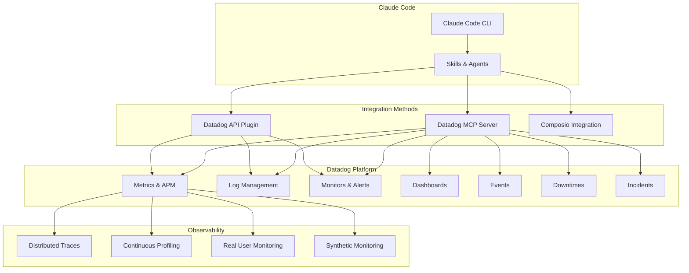

# Datadog Integration with Claude Code

## Overview

Claude Code integrates with Datadog through the official Datadog MCP Server, the Datadog API Claude Plugin, and Datadog's AI Agents Console. This enables AI-powered monitoring, alerting, dashboard creation, and incident investigation directly from your development environment.

## Architecture



## Quick Start

### Option 1: Datadog MCP Server (Recommended)

```bash
# Install the Datadog MCP server
claude mcp add datadog \
  --transport stdio \
  -- npx -y @datadog/mcp-server
```

Configure in `.claude/mcp.json`:

```json
{
  "mcpServers": {
    "datadog": {
      "command": "npx",
      "args": ["-y", "@datadog/mcp-server"],
      "env": {
        "DD_API_KEY": "your-api-key",
        "DD_APP_KEY": "your-app-key",
        "DD_SITE": "datadoghq.com"
      }
    }
  }
}
```

### Option 2: Datadog API Plugin

The official plugin connects directly through the Datadog CLI (Pup) without requiring MCP:

```bash
# Install the Datadog API Claude Plugin
pip install datadog-api-claude-plugin

# Configure
export DD_API_KEY="your-api-key"
export DD_APP_KEY="your-app-key"
```

### Option 3: Composio Integration

```bash
# Install Composio with Datadog toolkit
pip install composio-claude
composio add datadog
```

## MCP Server Capabilities

| Tool | Description |
|------|-------------|
| `create_dashboard` | Create Datadog dashboards with widgets |
| `update_dashboard` | Modify existing dashboards |
| `create_monitor` | Create alerts and monitors |
| `update_monitor` | Modify monitor thresholds and conditions |
| `search_logs` | Query logs with Datadog query syntax |
| `get_metrics` | Fetch metric time series data |
| `create_downtime` | Schedule maintenance windows |
| `list_events` | Query events by source, tag, or time |
| `get_incidents` | List and manage incidents |
| `create_notebook` | Create investigation notebooks |

## Monitoring Claude Code with Datadog

Datadog's AI Agents Console provides visibility into Claude Code usage:

- **Usage tracking**: Sessions, tokens, cost per user/model
- **Performance metrics**: Latency percentiles, error rates
- **Repository insights**: Usage by project/repo
- **Cost management**: Model-level spend trends

### Setup OTLP Metrics Export

```bash
# Enable Claude Code metrics via OTLP
export OTEL_EXPORTER_OTLP_ENDPOINT="https://api.datadoghq.com/api/intake/otlp"
export OTEL_EXPORTER_OTLP_HEADERS="DD-API-KEY=your-api-key"
```

## File Index

- [skills.md](skills.md) - Datadog monitoring skills
- [agents.md](agents.md) - Datadog agents (alert analyst, dashboard builder)
- [slash_commands.md](slash_commands.md) - Datadog slash commands

## Sources

- [Datadog Claude Code Monitoring Blog](https://www.datadoghq.com/blog/claude-code-monitoring/)
- [Datadog API Claude Plugin](https://github.com/DataDog/datadog-api-claude-plugin)
- [Datadog MCP via Composio](https://composio.dev/toolkits/datadog/framework/claude-code)
- [Monitoring Claude Code with Datadog](https://ma.rtin.so/posts/monitoring-claude-code-with-datadog/)
