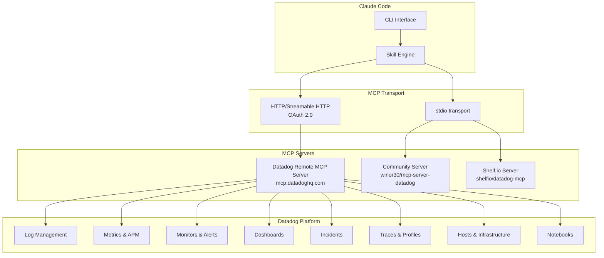

# Setting Up MCP Servers for Datadog

## Overview

The Model Context Protocol (MCP) connects Claude Code to Datadog's observability platform, enabling AI-powered monitoring, log analysis, dashboard management, and incident investigation directly from your terminal. Datadog provides an official remote MCP server with OAuth authentication, plus community alternatives.

## Architecture



## Prerequisites

```bash
# Verify requirements
node --version    # 18+ (for community servers)
claude --version  # Latest
```

You also need:
- A Datadog account with appropriate permissions
- The **MCP Read** permission (and **MCP Write** for write operations) on your Datadog user

## Option 1: Datadog Remote MCP Server (Recommended)

The official Datadog remote MCP server uses OAuth 2.0 authentication -- no API keys to manage. Authentication happens via browser on first launch.

### Install via CLI

```bash
claude mcp add datadog \
  --transport http \
  --url "https://mcp.datadoghq.com/api/unstable/mcp-server/mcp"
```

### Configuration File

```json
// .claude/mcp.json
{
  "mcpServers": {
    "datadog": {
      "type": "http",
      "url": "https://mcp.datadoghq.com/api/unstable/mcp-server/mcp"
    }
  }
}
```

On first connection, Claude Code opens your browser to complete the OAuth flow. Credentials are stored locally so you do not need to re-authenticate until the token expires.

### Enabling Specific Toolsets

Append the `toolsets` query parameter to the URL to enable product-specific tools:

```json
{
  "mcpServers": {
    "datadog": {
      "type": "http",
      "url": "https://mcp.datadoghq.com/api/unstable/mcp-server/mcp?toolsets=core,alerting,apm,cases,dbm"
    }
  }
}
```

**Available toolsets:**
| Toolset | Capabilities |
|---------|-------------|
| `core` | Logs, metrics, traces, dashboards, monitors, incidents, hosts, services, events, notebooks |
| `alerting` | Alert management and configuration |
| `apm` | Application performance monitoring |
| `cases` | Case management and tracking |
| `dbm` | Database monitoring |

### Site-Specific Endpoints

If your Datadog account is on a non-US site, use the appropriate endpoint:

| Datadog Site | MCP Server URL |
|-------------|----------------|
| US1 (default) | `https://mcp.datadoghq.com/api/unstable/mcp-server/mcp` |
| US3 | `https://mcp.us3.datadoghq.com/api/unstable/mcp-server/mcp` |
| US5 | `https://mcp.us5.datadoghq.com/api/unstable/mcp-server/mcp` |
| EU1 | `https://mcp.datadoghq.eu/api/unstable/mcp-server/mcp` |
| AP1 | `https://mcp.ap1.datadoghq.com/api/unstable/mcp-server/mcp` |

### Headless / API Key Authentication

If you cannot use the browser OAuth flow (e.g., on a server), provide API keys as headers:

```json
{
  "mcpServers": {
    "datadog": {
      "type": "http",
      "url": "https://mcp.datadoghq.com/api/unstable/mcp-server/mcp",
      "headers": {
        "DD-API-KEY": "${DD_API_KEY}",
        "DD-APPLICATION-KEY": "${DD_APP_KEY}"
      }
    }
  }
}
```

## Option 2: Local MCP Server via npx

For local execution using Datadog API keys:

```bash
claude mcp add datadog \
  --transport stdio \
  -- npx -y @datadog/mcp-server
```

```json
// .claude/mcp.json
{
  "mcpServers": {
    "datadog": {
      "command": "npx",
      "args": ["-y", "@datadog/mcp-server"],
      "env": {
        "DD_API_KEY": "${DD_API_KEY}",
        "DD_APP_KEY": "${DD_APP_KEY}",
        "DD_SITE": "datadoghq.com"
      }
    }
  }
}
```

## Option 3: Community MCP Server (winor30)

A community-maintained server with broad API coverage:

```bash
claude mcp add datadog-community \
  --transport stdio \
  -- npx -y @winor30/mcp-server-datadog
```

```json
{
  "mcpServers": {
    "datadog-community": {
      "command": "npx",
      "args": ["-y", "@winor30/mcp-server-datadog"],
      "env": {
        "DATADOG_API_KEY": "${DD_API_KEY}",
        "DATADOG_APP_KEY": "${DD_APP_KEY}",
        "DATADOG_SITE": "datadoghq.com"
      }
    }
  }
}
```

## Option 4: Composio Integration

```bash
pip install composio-claude
composio add datadog
```

---

## Authentication Setup

### Get API and Application Keys

1. Go to https://app.datadoghq.com/organization-settings/api-keys
2. Click "New Key" -- this is your **API Key** (for sending data)
3. Go to https://app.datadoghq.com/organization-settings/application-keys
4. Click "New Key" -- this is your **Application Key** (for reading data)

### Required Permissions

For the remote MCP server, your Datadog user needs:
- **MCP Read**: Required for all read operations
- **MCP Write**: Required for creating/updating dashboards, monitors, etc.

### Store Keys Securely

```bash
# Shell profile
echo 'export DD_API_KEY="your-api-key"' >> ~/.zshrc
echo 'export DD_APP_KEY="your-app-key"' >> ~/.zshrc

# macOS Keychain
security add-generic-password -s "datadog-api" -a "$USER" -w "your-api-key"
security add-generic-password -s "datadog-app" -a "$USER" -w "your-app-key"
```

## MCP Server Tools

| Tool | Description |
|------|-------------|
| `search_logs` | Query logs using Datadog log query syntax |
| `get_metrics` | Fetch metric time series data |
| `create_dashboard` | Create dashboards with widgets |
| `update_dashboard` | Modify existing dashboards |
| `create_monitor` | Create alerts and monitors |
| `update_monitor` | Modify monitor thresholds and conditions |
| `list_monitors` | List monitors with filters |
| `get_incidents` | List and query incidents |
| `create_downtime` | Schedule maintenance windows |
| `list_events` | Query events by source, tag, or time |
| `create_notebook` | Create investigation notebooks |
| `get_hosts` | List infrastructure hosts |
| `get_service_map` | Get APM service dependency map |
| `query_traces` | Search and analyze distributed traces |

---

## Verification

After setup, verify the MCP server is connected:

```bash
# List configured MCP servers
claude mcp list

# Test the connection
claude "Use Datadog to show me the top 10 error logs from the last hour"

# Check server health
/mcp
```

## Troubleshooting

| Issue | Solution |
|-------|----------|
| `OAuth flow does not open browser` | Ensure your default browser is set; try copying the URL manually |
| `403 Forbidden` | Check that your Datadog user has MCP Read/Write permissions |
| `Invalid API key` | Verify keys at Organization Settings > API/Application Keys |
| `Wrong site` | Ensure `DD_SITE` matches your Datadog region (datadoghq.com, datadoghq.eu, etc.) |
| `MCP server timeout` | Increase timeout in config: `"timeout": 30000` |
| `No data returned` | Verify your Datadog account has data in the queried timeframe |

## Sources

- [Datadog MCP Server Documentation](https://docs.datadoghq.com/bits_ai/mcp_server/)
- [Datadog MCP Server Setup Guide](https://docs.datadoghq.com/bits_ai/mcp_server/setup/)
- [Datadog Remote MCP Server Blog](https://www.datadoghq.com/blog/datadog-remote-mcp-server/)
- [Community MCP Server (winor30)](https://github.com/winor30/mcp-server-datadog)
- [Shelf.io Datadog MCP](https://github.com/shelfio/datadog-mcp)
- [Claude Code MCP Documentation](https://code.claude.com/docs/en/mcp)
