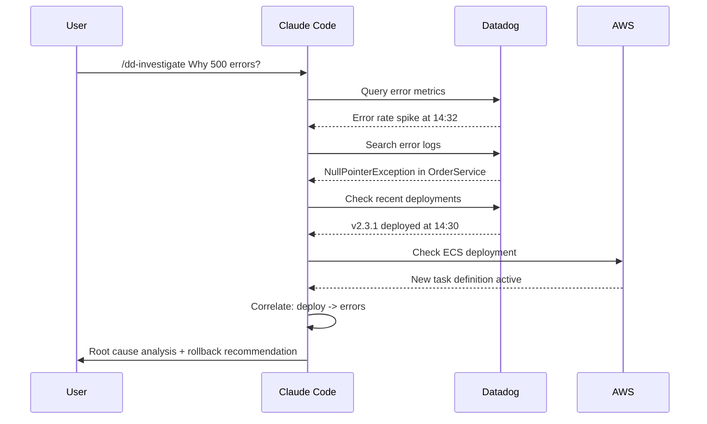

# Datadog Slash Commands

## Command Reference

| Command | Description | Example |
|---------|-------------|---------|
| `/dd-health` | System health overview | `/dd-health Check production` |
| `/dd-logs` | Search and analyze logs | `/dd-logs Find errors in auth service` |
| `/dd-metrics` | Query and analyze metrics | `/dd-metrics Show API latency trends` |
| `/dd-dashboard` | Create or update a dashboard | `/dd-dashboard Create service dashboard for payments` |
| `/dd-monitor` | Create or manage monitors | `/dd-monitor Create high error rate alert for checkout` |
| `/dd-investigate` | Deep investigation of an issue | `/dd-investigate Why is the API slow?` |
| `/dd-slo` | Manage SLOs | `/dd-slo Show error budget for API availability` |

---

## `/dd-health`

```yaml
---
name: dd-health
description: Quick health check of monitored services from Datadog
user-invocable: true
allowed-tools:
  - Bash
  - mcp__datadog__*
---
```

### Usage

```
/dd-health
/dd-health Check production services
/dd-health What alerts are firing right now?
```

### Output Example

```
## System Health: DEGRADED

### Firing Alerts (2)
| Monitor | Service | Status | Since |
|---------|---------|--------|-------|
| High Error Rate | checkout | ALERT | 14:32 UTC |
| p99 Latency | api-gateway | WARN | 14:35 UTC |

### SLO Status
| SLO | Budget Remaining |
|-----|-----------------|
| API Availability 99.9% | 72% (healthy) |
| Checkout Latency 99% | 15% (at risk) |

### Infrastructure
- Hosts: 24/24 reporting
- Containers: 156 running, 0 restarting
- Cloud Cost: $142.30 today (projected: $4,270/mo)
```

---

## `/dd-logs`

### Usage

```
# Find errors
/dd-logs Show errors in the auth service in the last hour

# Pattern search
/dd-logs Find all timeout errors across production services

# Trace a request
/dd-logs Trace request with ID abc-123-def through all services
```

---

## `/dd-metrics`

### Usage

```
# Check a specific metric
/dd-metrics What's the current request rate for the API?

# Compare periods
/dd-metrics Compare today's error rate with yesterday

# Anomaly check
/dd-metrics Is the checkout service traffic normal for this time of day?
```

---

## `/dd-dashboard`

### Usage

```
# Create a new dashboard
/dd-dashboard Create a RED metrics dashboard for the payments service

# Update existing
/dd-dashboard Add a deployment tracker to the API dashboard

# Generate from architecture
/dd-dashboard Create dashboards for all services in our microservices architecture
```

---

## `/dd-monitor`

### Usage

```
# Create a monitor
/dd-monitor Alert when checkout error rate exceeds 2%

# Manage existing
/dd-monitor Mute the staging alerts for 2 hours

# Audit monitors
/dd-monitor List monitors that haven't triggered in 90 days
```

---

## `/dd-investigate`

```yaml
---
name: dd-investigate
description: Deep investigation of a production issue using Datadog data
user-invocable: true
allowed-tools:
  - Bash
  - Read
  - mcp__datadog__*
  - mcp__aws-api__*
---
```

### Usage

```
# Investigate a symptom
/dd-investigate Why are we seeing increased 500 errors?

# Follow up on an alert
/dd-investigate The checkout latency alert fired - what's going on?

# Proactive investigation
/dd-investigate Our error budget is burning fast - why?
```

### Investigation Workflow



---

## `/dd-slo`

### Usage

```
# Check SLO status
/dd-slo How are our SLOs looking?

# Create SLO
/dd-slo Create a 99.9% availability SLO for the payments API

# Error budget report
/dd-slo Generate weekly error budget report

# Burn rate analysis
/dd-slo Which SLOs are burning budget fastest?
```
