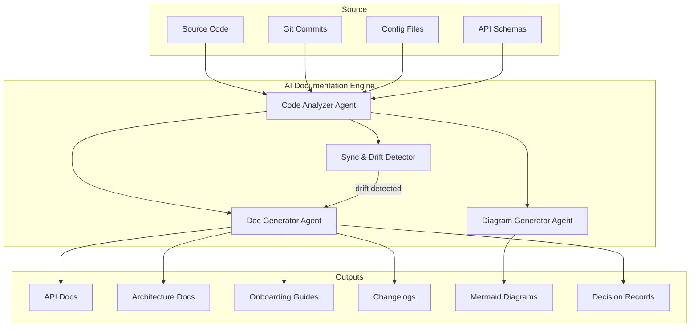

# AI-Assisted Documentation

> A comprehensive guide to using Claude Code for automated documentation generation, maintenance, and knowledge management.

---

## Overview

AI-assisted documentation transforms how teams create, maintain, and evolve their technical documentation. Instead of treating docs as an afterthought, AI enables a **docs-as-code** workflow where documentation is generated from source code, kept in sync automatically, and improved continuously through intelligent analysis.

This module covers six core capabilities:

| Capability | File | Description |
|-----------|------|-------------|
| API Documentation | [api_docs.md](api_docs.md) | OpenAPI specs, SDK docs, examples, versioning |
| Architecture Documentation | [architecture_docs.md](architecture_docs.md) | C4 models, ADRs, system diagrams, tech debt tracking |
| Onboarding Documentation | [onboarding_docs.md](onboarding_docs.md) | Codebase walkthroughs, getting started guides, FAQ generation |
| Changelog Automation | [changelog_automation.md](changelog_automation.md) | Conventional commits, release notes, migration guides |
| Diagram Generation | [diagram_generation.md](diagram_generation.md) | Mermaid diagrams, architecture views, flow charts, ER diagrams |

---

## Architecture



---

## How It Works with Claude Code

### Skills

Skills are `.md` files in `~/.claude/skills/` that provide instructions Claude Code follows when relevant. No SDK, no API, no build step -- just markdown.

```
~/.claude/skills/
  doc_generator.md        # Core documentation generation skill
  api_doc_writer.md       # API documentation specialist
  architecture_mapper.md  # Architecture documentation & C4 models
  onboarding_builder.md   # Onboarding guide generation
  changelog_writer.md     # Changelog & release notes
  diagram_creator.md      # Mermaid diagram generation
```

### Agents

Agents get separate context windows for tasks that need their own memory space. Use agents when:
- Documenting a large codebase (each module gets its own agent)
- Generating diagrams from multiple subsystems in parallel
- Running doc drift detection across the entire repo

### Hooks

Hooks are shell commands that fire automatically on Claude Code events:

| Hook Event | Documentation Use |
|-----------|------------------|
| `PreCommit` | Validate docs are updated when code changes |
| `PostCommit` | Auto-generate changelog entry |
| `PostToolUse` | Update API docs after schema file edits |
| `PrePush` | Run doc freshness check |

### MCP Servers

MCP servers extend Claude Code with external tool access:
- **GitHub MCP**: Read issues, PRs, and discussions for context
- **File System MCP**: Scan large codebases for documentation targets
- **Custom Doc MCP**: Serve existing docs as context for updates

---

## Quick Start

### 1. Install the Documentation Skills

```bash
# Copy skills to your Claude Code skills directory
mkdir -p ~/.claude/skills
cp documentation/skills/*.md ~/.claude/skills/
```

### 2. Configure Hooks

Add to your `.claude/settings.json`:

```json
{
  "hooks": {
    "PreCommit": [
      {
        "command": "bash -c 'python3 scripts/check_doc_freshness.py'",
        "description": "Check if documentation needs updating"
      }
    ],
    "PostCommit": [
      {
        "command": "bash -c 'python3 scripts/update_changelog.py'",
        "description": "Auto-update changelog from commit"
      }
    ]
  }
}
```

### 3. Generate Documentation

```
# In Claude Code, use natural language:
> Generate API documentation for the /src/api directory
> Create an architecture overview with C4 diagrams
> Build an onboarding guide for new developers
> Generate a changelog from the last 20 commits
```

---

## Documentation Quality Metrics

Track documentation health with these metrics:

| Metric | Target | How to Measure |
|--------|--------|---------------|
| Coverage | >80% of public APIs documented | Count documented vs undocumented endpoints |
| Freshness | Docs updated within 1 sprint of code change | Compare doc timestamps to code timestamps |
| Accuracy | <5% drift from actual behavior | Run doc-code comparison agent |
| Completeness | All ADRs have status and consequences | Lint ADR files for required sections |
| Diagram Currency | Diagrams match current architecture | Compare generated vs committed diagrams |

---

## Tool Landscape (2026)

| Tool | Focus | Integration |
|------|-------|------------|
| [Mintlify](https://mintlify.com) | AI-powered docs from code | CLI + GitHub integration |
| [DocuWriter.ai](https://docuwriter.ai) | Code docs, API refs, UML | IDE plugins |
| [Swimm](https://swimm.io) | Living documentation synced with code | Git hooks |
| [Mermaid Chart AI](https://mermaidchart.com) | AI diagram generation | VS Code, GitHub, Confluence |
| [Structurizr](https://structurizr.com) | C4 model visualization | DSL + CLI |
| [git-cliff](https://git-cliff.org) | Changelog generation | CLI + CI/CD |
| Claude Code | Full-stack AI documentation | Skills, agents, hooks, MCP |

---

## Sources

- [NxCode: Best AI Documentation Generators 2026](https://www.nxcode.io/resources/news/ai-documentation-generator-2026)
- [DEV Community: Top AI Tools for Documentation 2026](https://dev.to/infrasity-learning/top-ai-tools-for-documentation-guide-for-2026-2hhb)
- [Mintlify - The Intelligent Knowledge Platform](https://www.mintlify.com/)
- [DocuWriter.ai](https://www.docuwriter.ai/)
- [Claude Code Hooks Guide](https://code.claude.com/docs/en/hooks-guide)
- [Claude Code Skills, Commands, Hooks & Agents Guide](https://genaiunplugged.substack.com/p/claude-code-skills-commands-hooks-agents)
- [ClickHelp: Documentation 2026 - From Human-Centric to AI-First](https://clickhelp.com/clickhelp-technical-writing-blog/documentation-2026-from-human-centric-to-ai-first/)
