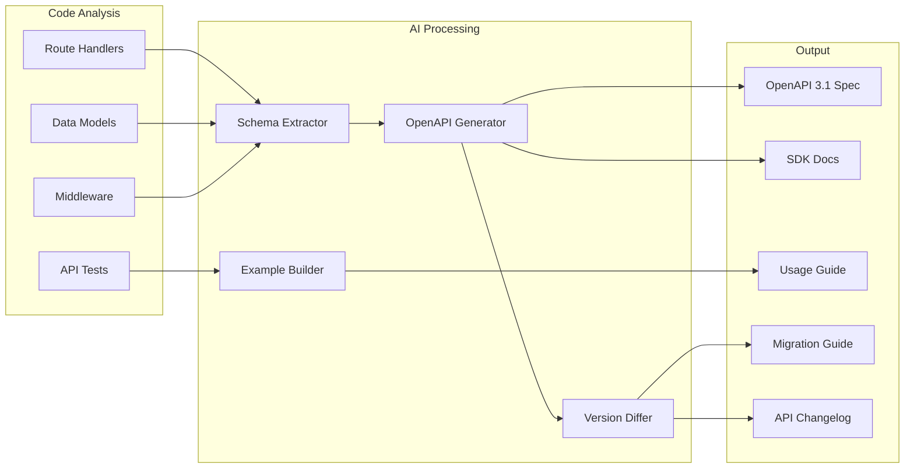

# AI-Generated API Documentation

> Generate, maintain, and version API documentation from code using Claude Code skills, agents, and hooks.

---

## Overview

AI-powered API documentation eliminates the gap between API implementation and its documentation. By analyzing source code, route definitions, schemas, and tests, Claude Code generates accurate OpenAPI specs, SDK documentation, usage examples, and migration guides -- all kept in sync with every commit.

Key capabilities:
- **OpenAPI spec generation** from route handlers and decorators
- **SDK documentation** with language-specific examples
- **Interactive examples** with request/response pairs from tests
- **Version tracking** with breaking change detection
- **Auto-sync** via hooks that trigger on API file changes

---

## Architecture



---

## Working Skill: API Documentation Generator

### Skill File: `~/.claude/skills/api_doc_writer.md`

```markdown
# Skill: API Documentation Writer

## When to activate
Activate when the user asks to generate, update, or review API documentation,
or when files matching `**/routes/**`, `**/api/**`, `**/controllers/**`,
or `**/endpoints/**` are modified.

## Instructions

### Phase 1: Discovery
1. Scan the project for API route definitions. Look for:
   - Express/Fastify/Hono route handlers (`app.get`, `app.post`, `router.use`)
   - Python Flask/FastAPI/Django REST endpoints (`@app.route`, `@router.get`)
   - Go net/http or Gin handlers (`http.HandleFunc`, `r.GET`)
   - Java Spring Boot controllers (`@GetMapping`, `@PostMapping`)
   - Rust Actix/Axum handlers
2. Identify request/response schemas from:
   - TypeScript interfaces and Zod schemas
   - Python Pydantic models and dataclasses
   - Go structs with JSON tags
   - Java DTOs and records
3. Extract authentication and middleware requirements
4. Find existing tests that show request/response examples

### Phase 2: OpenAPI Generation
1. Generate an OpenAPI 3.1 specification in YAML format
2. Include for each endpoint:
   - HTTP method and path
   - Summary and description
   - Request parameters (path, query, header, cookie)
   - Request body schema with examples
   - Response schemas for all status codes (200, 400, 401, 404, 500)
   - Authentication requirements
   - Rate limiting headers if applicable
3. Add `x-code-reference` extensions linking to source file and line number
4. Validate the spec against OpenAPI 3.1 schema

### Phase 3: Documentation Output
1. Generate markdown documentation in `docs/api/` with:
   - `overview.md` -- API overview, base URL, auth guide
   - One file per resource group (e.g., `users.md`, `orders.md`)
   - `errors.md` -- Error code reference
   - `changelog.md` -- API version changelog
2. Include for each endpoint:
   - curl example
   - Language-specific SDK examples (JS, Python, Go)
   - Request/response JSON examples from actual tests
3. Generate `openapi.yaml` at project root

### Phase 4: Version Tracking
1. Compare newly generated spec with existing `openapi.yaml`
2. Detect breaking changes:
   - Removed endpoints
   - Changed required fields
   - Modified response shapes
   - Removed enum values
3. If breaking changes found, generate migration guide at `docs/api/migrations/`
4. Update API changelog with version bump recommendation

## Output format
- OpenAPI spec: YAML
- Documentation: GitHub-flavored Markdown
- Examples: Fenced code blocks with language tags
- Diagrams: Mermaid sequence diagrams for complex flows
```

---

## Working Skill: SDK Documentation Generator

### Skill File: `~/.claude/skills/sdk_doc_writer.md`

```markdown
# Skill: SDK Documentation Writer

## When to activate
Activate when the user asks for SDK docs, client library docs,
or language-specific API usage examples.

## Instructions

### For each supported language, generate:

1. **Installation**
   ```
   npm install @company/api-sdk    # JavaScript/TypeScript
   pip install company-sdk          # Python
   go get github.com/company/sdk   # Go
   ```

2. **Quick Start** -- Minimal working example (under 20 lines)

3. **Authentication** -- All supported auth methods with examples

4. **Resource Documentation** -- For each API resource:
   - List all available methods
   - Show typed function signatures
   - Provide copy-paste examples
   - Document error handling patterns
   - Show pagination patterns for list endpoints

5. **Advanced Usage**
   - Retry configuration
   - Custom HTTP client injection
   - Webhook signature verification
   - Streaming responses (if applicable)

## Style rules
- Use the target language's idiomatic patterns
- Include TypeScript types, Python type hints, Go error handling
- Show both async and sync patterns where relevant
- Always include error handling in examples
```

---

## Working Agent: API Doc Sync Agent

This agent runs as a subagent to continuously monitor API changes and update docs.

### Agent Definition

```markdown
# Agent: API Documentation Sync

## Role
You are an API documentation synchronization agent. Your job is to detect
when API code changes and ensure documentation stays accurate.

## Trigger
Run when any of these file patterns change:
- `src/api/**/*`
- `src/routes/**/*`
- `src/controllers/**/*`
- `**/openapi.yaml`
- `**/swagger.json`

## Process

1. **Diff Analysis**
   - Get the git diff for changed API files
   - Identify which endpoints were added, modified, or removed
   - Check if corresponding docs exist in `docs/api/`

2. **Impact Assessment**
   - Classify changes: additive (new endpoint), modification, breaking
   - For breaking changes, flag with HIGH priority
   - For additive changes, generate docs automatically
   - For modifications, update existing docs

3. **Doc Generation**
   - Use the api_doc_writer skill to regenerate affected sections
   - Preserve any manually-written notes (marked with `<!-- manual -->`)
   - Update the OpenAPI spec
   - Regenerate SDK examples for changed endpoints

4. **Validation**
   - Verify all documented endpoints exist in code
   - Verify all code endpoints are documented
   - Check that examples compile/parse correctly
   - Validate OpenAPI spec

5. **Report**
   - Output a summary: endpoints changed, docs updated, gaps found
   - If breaking changes detected, draft a migration guide section
```

---

## Working Hooks

### Pre-Commit: API Doc Freshness Check

Add to `.claude/settings.json`:

```json
{
  "hooks": {
    "PreCommit": [
      {
        "command": "bash -c 'python3 .claude/hooks/check_api_docs.py'",
        "description": "Verify API docs are updated when API code changes"
      }
    ]
  }
}
```

**Hook Script: `.claude/hooks/check_api_docs.py`**

```python
#!/usr/bin/env python3
"""
Pre-commit hook: Check if API documentation needs updating.
Compares staged API file changes against doc file changes.
Exits non-zero if API files changed but docs did not.
"""
import subprocess
import sys
import json

def get_staged_files():
    result = subprocess.run(
        ["git", "diff", "--cached", "--name-only"],
        capture_output=True, text=True
    )
    return result.stdout.strip().split("\n") if result.stdout.strip() else []

def is_api_file(path):
    api_patterns = ["src/api/", "src/routes/", "src/controllers/",
                    "app/api/", "routes/", "controllers/"]
    return any(path.startswith(p) for p in api_patterns)

def is_doc_file(path):
    return path.startswith("docs/api/") or path == "openapi.yaml"

def main():
    files = get_staged_files()
    api_changed = [f for f in files if is_api_file(f)]
    docs_changed = [f for f in files if is_doc_file(f)]

    if api_changed and not docs_changed:
        print("WARNING: API files changed but documentation was not updated.")
        print(f"  Changed API files: {', '.join(api_changed)}")
        print("  Run: claude 'Update API docs for changed endpoints'")
        print()
        # Return JSON for Claude Code hook format
        result = {"ok": False, "reason": "API docs need updating"}
        print(json.dumps(result))
        sys.exit(1)

    result = {"ok": True}
    print(json.dumps(result))

if __name__ == "__main__":
    main()
```

### Post-Tool-Use: Auto-Update OpenAPI on Schema Change

```json
{
  "hooks": {
    "PostToolUse": [
      {
        "matcher": {
          "tool": "edit",
          "path": "**/schemas/**"
        },
        "command": "bash -c 'echo {\"ok\": true, \"message\": \"Schema changed -- remember to regenerate openapi.yaml\"}'",
        "description": "Remind to update OpenAPI when schemas change"
      }
    ]
  }
}
```

---

## OpenAPI Generation Templates

### Express.js Route Analysis Pattern

When analyzing Express routes, the AI extracts:

```javascript
// Input: Express route handler
router.post('/users',
  authenticate,           // -> securitySchemes: BearerAuth
  validate(createUserSchema), // -> requestBody schema
  async (req, res) => {
    // Response types inferred from res.status().json() calls
    const user = await createUser(req.body);
    res.status(201).json(user);  // -> 201 response schema
  }
);

// Output: OpenAPI path item
```

```yaml
# Generated OpenAPI
paths:
  /users:
    post:
      summary: Create a new user
      security:
        - BearerAuth: []
      requestBody:
        required: true
        content:
          application/json:
            schema:
              $ref: '#/components/schemas/CreateUserRequest'
            example:
              email: "user@example.com"
              name: "Jane Doe"
      responses:
        '201':
          description: User created successfully
          content:
            application/json:
              schema:
                $ref: '#/components/schemas/User'
        '400':
          $ref: '#/components/responses/ValidationError'
        '401':
          $ref: '#/components/responses/Unauthorized'
      x-code-reference:
        file: src/routes/users.js
        line: 42
```

### FastAPI Auto-Documentation Enhancement

```python
# FastAPI already generates OpenAPI, but AI enhances it:
# 1. Adds richer descriptions from docstrings
# 2. Generates realistic examples from test data
# 3. Documents error responses that aren't in decorators
# 4. Adds x-code-reference extensions

@router.post("/users", response_model=UserResponse, status_code=201)
async def create_user(user: CreateUserRequest, db: Session = Depends(get_db)):
    """Create a new user account.

    Validates email uniqueness, hashes the password, and sends a
    verification email. Returns the created user without sensitive fields.

    Raises:
        409: Email already registered
        422: Validation error
    """
    # AI extracts the 409 and 422 from the docstring
    # and adds them to the OpenAPI spec
```

---

## Version Diffing and Migration Guides

### Breaking Change Detection Rules

```yaml
# Rules the AI follows to detect breaking changes
breaking_changes:
  - removed_endpoint: "An endpoint that existed in the previous version is gone"
  - removed_field: "A response field was removed"
  - required_field_added: "A new required request field was added"
  - type_changed: "A field's type changed (string -> number)"
  - enum_value_removed: "An enum lost a valid value"
  - auth_added: "An endpoint now requires authentication"
  - status_code_changed: "Success status code changed (200 -> 201)"

non_breaking_changes:
  - new_endpoint: "A new endpoint was added"
  - optional_field_added: "A new optional field in request or response"
  - enum_value_added: "A new value added to an enum"
  - description_changed: "Only documentation text changed"
```

### Migration Guide Template

```markdown
# API Migration Guide: v2.3 -> v3.0

## Breaking Changes

### 1. `POST /users` -- Request body changes
**What changed**: `username` field renamed to `handle`
**Migration**:
```json
// Before (v2.3)
{ "username": "jdoe", "email": "j@example.com" }

// After (v3.0)
{ "handle": "jdoe", "email": "j@example.com" }
```
**SDK update**: Update to SDK v3.0+ where `username` param is now `handle`

### 2. `GET /users/:id` -- Response shape change
**What changed**: `address` is now a nested object instead of a string
**Migration**: Update response parsing to handle the new structure
```

---

## CI/CD Integration

### GitHub Actions: API Doc Generation

```yaml
name: API Documentation
on:
  push:
    paths:
      - 'src/api/**'
      - 'src/routes/**'
      - 'openapi.yaml'

jobs:
  update-api-docs:
    runs-on: ubuntu-latest
    steps:
      - uses: actions/checkout@v4

      - name: Generate API docs with Claude
        run: |
          claude --print "Analyze all API routes in src/api/ and src/routes/. \
            Generate updated OpenAPI 3.1 spec and markdown docs in docs/api/. \
            Compare with existing openapi.yaml and note any breaking changes."

      - name: Validate OpenAPI spec
        run: npx @redocly/cli lint openapi.yaml

      - name: Commit updated docs
        run: |
          git config user.name "api-doc-bot"
          git config user.email "bot@example.com"
          git add docs/api/ openapi.yaml
          git diff --cached --quiet || git commit -m "docs: update API documentation"
          git push
```

---

## Sources

- [Ferndesk: 6 Best API Documentation Tools 2026](https://ferndesk.com/blog/best-api-documentation-tools)
- [Apidog: Top 10 AI Doc Generators & API Documentation Makers](https://apidog.com/blog/top-10-ai-doc-generators-api-documentation-makers-for-2025/)
- [Treblle: 13 Best OpenAPI Documentation Tools for 2026](https://treblle.com/blog/best-openapi-documentation-tools)
- [Levo.ai: Top 10 API Documentation Tools 2026](https://www.levo.ai/resources/blogs/top-10-api-documentation-tools-2026)
- [Theneo: Build Docs Developers Love](https://www.theneo.io)
- [OpenAPI Generator](https://openapi-generator.tech/)
- [Claude Code Hooks Guide](https://code.claude.com/docs/en/hooks-guide)
