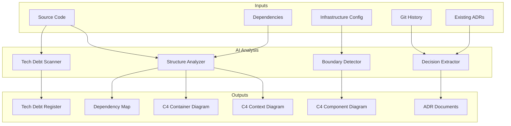
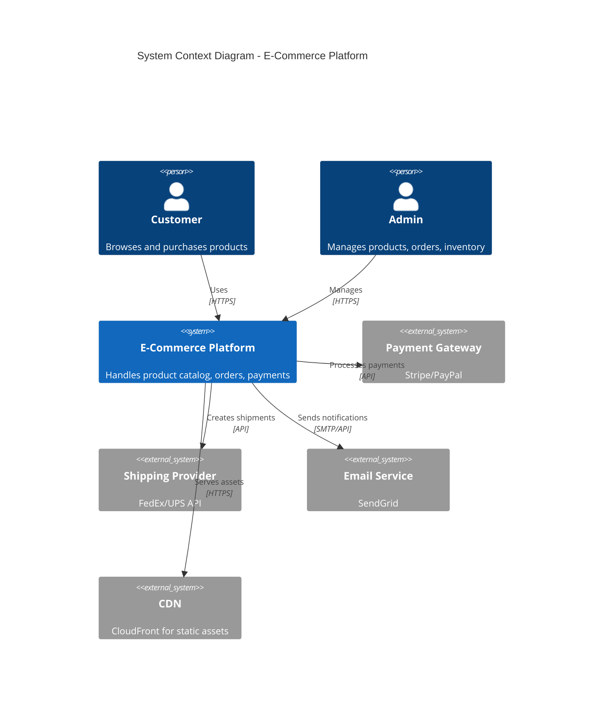
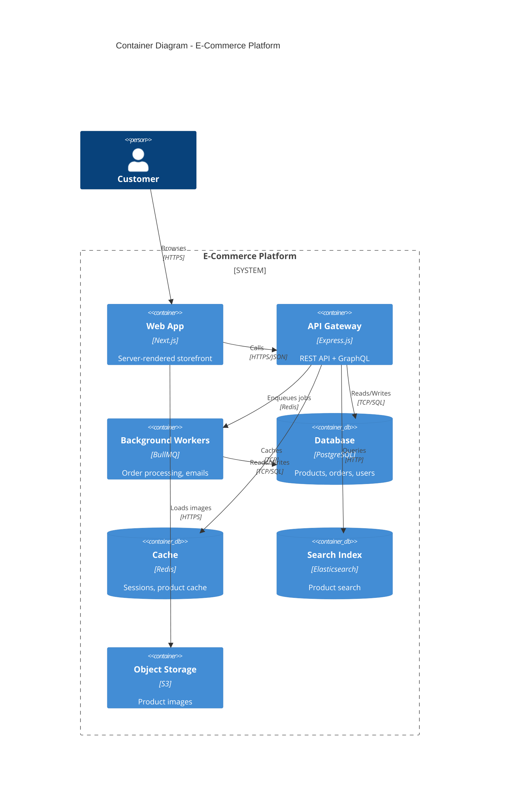
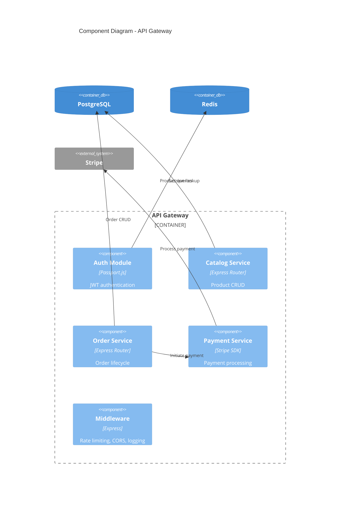
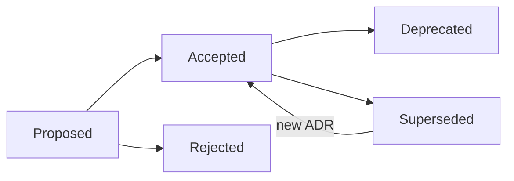

# AI Architecture Documentation

> Generate and maintain architecture documentation using C4 models, Architecture Decision Records (ADRs), system diagrams, and tech debt tracking -- all powered by Claude Code.

---

## Overview

Architecture documentation answers two questions: **what does the system look like** (C4 models, diagrams) and **why does it look that way** (ADRs, decision logs). AI can generate both by analyzing code structure, dependencies, configuration, and git history. The result is living architecture docs that evolve with the codebase.

---

## Architecture of the Architecture Docs System



---

## C4 Model Generation

The [C4 model](https://c4model.com/) provides four levels of abstraction for visualizing software architecture.

### Level 1: System Context



### Level 2: Container Diagram



### Level 3: Component Diagram



---

## Working Skill: Architecture Documentation Generator

### Skill File: `~/.claude/skills/architecture_mapper.md`

```markdown
# Skill: Architecture Documentation Mapper

## When to activate
Activate when the user asks to generate architecture documentation,
create C4 diagrams, document system design, or analyze system structure.

## Instructions

### Phase 1: Codebase Structure Analysis
1. Scan the project root for key indicators:
   - `package.json`, `go.mod`, `Cargo.toml`, `pyproject.toml` -> language/framework
   - `docker-compose.yml`, `Dockerfile` -> container boundaries
   - `terraform/`, `cdk/`, `pulumi/` -> infrastructure
   - `k8s/`, `helm/` -> deployment topology
   - `.env.example` -> external service dependencies
2. Map the directory structure to identify logical boundaries:
   - `src/services/` or `internal/` -> microservice boundaries
   - `src/api/` vs `src/workers/` -> container boundaries
   - `packages/` or `apps/` -> monorepo structure
3. Analyze imports/dependencies to find communication patterns:
   - HTTP clients -> synchronous API calls
   - Queue producers/consumers -> async messaging
   - Database clients -> data store connections

### Phase 2: C4 Model Generation
1. Generate **System Context** (Level 1):
   - The system under development in the center
   - All external systems it communicates with
   - All user/actor types
   - Use mermaid C4Context syntax
2. Generate **Container Diagram** (Level 2):
   - Each deployable unit (web app, API, worker, database, cache)
   - Technology choices for each container
   - Communication protocols between containers
   - Use mermaid C4Container syntax
3. Generate **Component Diagram** (Level 3) for key containers:
   - Major modules/services within each container
   - Internal dependencies
   - Use mermaid C4Component syntax
4. Optionally generate **Code Diagram** (Level 4) for critical components:
   - Class/module relationships
   - Key interfaces and abstractions

### Phase 3: Document Output
Generate files in `docs/architecture/`:
- `system_context.md` -- Level 1 diagram + narrative
- `containers.md` -- Level 2 diagram + technology decisions
- `components/{name}.md` -- Level 3 per major container
- `deployment.md` -- Deployment topology diagram
- `data_flow.md` -- Key data flow sequence diagrams

### Phase 4: Validation
- Verify every external system in diagrams exists in code (env vars, configs)
- Verify every container maps to a real deployable artifact
- Verify component boundaries match actual module boundaries
- Flag any orphaned components (in code but not documented)
```

---

## Working Skill: ADR Generator

### Skill File: `~/.claude/skills/adr_writer.md`

```markdown
# Skill: Architecture Decision Record Writer

## When to activate
Activate when the user:
- Makes or discusses an architectural decision
- Asks to document a decision
- Changes a fundamental technology choice
- Adds a new external dependency
- Modifies system boundaries

## ADR Format (Based on MADR v3.0)

Generate ADRs in `docs/decisions/` with the naming convention:
`NNNN-short-title.md` where NNNN is zero-padded sequential.

## Template

```markdown
# ADR-NNNN: {Title}

## Status
{Proposed | Accepted | Deprecated | Superseded by ADR-XXXX}

## Date
{YYYY-MM-DD}

## Context
{What is the issue? What forces are at play? Include technical and
business context. What constraints exist?}

## Decision
{What is the decision that was made? State it clearly and concisely.}

## Consequences

### Positive
- {List positive outcomes}

### Negative
- {List negative outcomes and trade-offs}

### Neutral
- {List neutral observations}

## Alternatives Considered

### {Alternative 1}
- **Pros**: {list}
- **Cons**: {list}
- **Why rejected**: {reason}

### {Alternative 2}
- **Pros**: {list}
- **Cons**: {list}
- **Why rejected**: {reason}

## References
- {Links to related ADRs, issues, RFCs, documentation}
```

## Rules
- Every ADR must have a clear Status
- Never modify accepted ADRs; create superseding ADRs instead
- Link ADRs to relevant C4 components where applicable
- Include a decision log index at `docs/decisions/README.md`
- Use mermaid diagrams in the Context section when they clarify trade-offs
```

---

## Working Skill: Tech Debt Tracker

### Skill File: `~/.claude/skills/tech_debt_tracker.md`

```markdown
# Skill: Tech Debt Tracker

## When to activate
Activate when the user asks about tech debt, code quality issues,
or asks to audit the codebase for improvement areas.

## Instructions

### Detection Patterns
Scan for these indicators of tech debt:

1. **Code Smells**
   - TODO/FIXME/HACK/WORKAROUND comments
   - Functions longer than 100 lines
   - Files longer than 500 lines
   - Deeply nested conditionals (>4 levels)
   - Duplicated code blocks

2. **Dependency Debt**
   - Dependencies with known vulnerabilities (npm audit, pip-audit)
   - Dependencies >2 major versions behind
   - Deprecated dependencies
   - Unused dependencies

3. **Architecture Debt**
   - Circular dependencies between modules
   - God classes/modules (too many responsibilities)
   - Missing abstraction layers
   - Direct database access from route handlers
   - Hard-coded configuration values

4. **Test Debt**
   - Modules with <50% test coverage
   - Tests that are always skipped
   - No integration tests for critical paths
   - Flaky tests (detect from CI history)

5. **Documentation Debt**
   - Public APIs without documentation
   - Outdated architecture diagrams
   - Missing ADRs for major decisions
   - README that doesn't match current setup

### Output Format
Generate `docs/tech-debt/register.md`:

| ID | Category | Severity | Location | Description | Effort | Impact |
|----|----------|----------|----------|-------------|--------|--------|
| TD-001 | Code | High | src/api/orders.js | 450-line function with 6 nested ifs | 3d | Reduces bug risk |
| TD-002 | Dependency | Critical | package.json | express@3.x (EOL) | 2d | Security fix |

### Severity Levels
- **Critical**: Security risk or blocks development
- **High**: Significant maintenance burden or reliability risk
- **Medium**: Slows development but manageable
- **Low**: Cosmetic or minor improvement

### Tracking
- Each item gets a unique ID (TD-NNN)
- Track status: Open, In Progress, Resolved, Won't Fix
- Link to related ADRs when debt is intentional (accepted trade-off)
```

---

## Working Agent: Architecture Review Agent

```markdown
# Agent: Architecture Review

## Role
You are an architecture review agent. Analyze pull requests and code changes
for architectural impact and ensure documentation stays current.

## Trigger
Run on PRs that modify:
- Infrastructure files (Terraform, Docker, K8s)
- Service boundaries (new directories, new packages)
- Database schemas or migrations
- API contracts (OpenAPI, protobuf, GraphQL schemas)
- Dependency files (package.json, go.mod, requirements.txt)

## Process

1. **Change Classification**
   - Is this a new service/container? -> Update C4 Container diagram
   - Is this a new external dependency? -> Update C4 Context diagram
   - Is this a schema change? -> Check for ADR
   - Is this a technology change? -> Require ADR

2. **ADR Check**
   - Does this change represent an architectural decision?
   - If yes, check if an ADR exists. If not, draft one.
   - If an existing ADR is superseded, mark it and create new.

3. **Diagram Updates**
   - Regenerate affected C4 diagrams
   - Diff against committed diagrams
   - Flag if diagrams are stale

4. **Tech Debt Assessment**
   - Does this change introduce new tech debt?
   - Does it resolve existing tech debt items?
   - Update the debt register accordingly

5. **Output**
   - PR comment summarizing architectural impact
   - Updated diagram files (if needed)
   - New or updated ADR (if needed)
   - Tech debt register updates
```

---

## Working Hooks

### Pre-Commit: ADR Requirement Check

```json
{
  "hooks": {
    "PreCommit": [
      {
        "command": "bash -c 'python3 .claude/hooks/check_adr_required.py'",
        "description": "Check if architectural changes require an ADR"
      }
    ]
  }
}
```

**Hook Script: `.claude/hooks/check_adr_required.py`**

```python
#!/usr/bin/env python3
"""
Pre-commit hook: Check if staged changes require an Architecture Decision Record.
Flags commits that modify infrastructure, schemas, or service boundaries
without a corresponding ADR.
"""
import subprocess
import sys
import json
import os

ADR_TRIGGERS = {
    "docker-compose": "Infrastructure topology change",
    "Dockerfile": "Container definition change",
    "terraform/": "Infrastructure-as-code change",
    "k8s/": "Kubernetes deployment change",
    "migrations/": "Database schema change",
    "proto/": "API contract change (protobuf)",
    "graphql/schema": "API contract change (GraphQL)",
}

def get_staged_files():
    result = subprocess.run(
        ["git", "diff", "--cached", "--name-only"],
        capture_output=True, text=True
    )
    return result.stdout.strip().split("\n") if result.stdout.strip() else []

def check_for_adr(files):
    return any(f.startswith("docs/decisions/") and f.endswith(".md") for f in files)

def main():
    files = get_staged_files()
    triggers_hit = []

    for f in files:
        for pattern, reason in ADR_TRIGGERS.items():
            if pattern in f:
                triggers_hit.append((f, reason))

    has_adr = check_for_adr(files)

    if triggers_hit and not has_adr:
        print("NOTICE: Architectural changes detected without an ADR.")
        for filepath, reason in triggers_hit:
            print(f"  {filepath}: {reason}")
        print()
        print("Consider creating an ADR: claude 'Create ADR for this change'")
        # Warning only, don't block the commit
        result = {"ok": True, "message": "ADR recommended for architectural changes"}
    else:
        result = {"ok": True}

    print(json.dumps(result))

if __name__ == "__main__":
    main()
```

### Post-Commit: Architecture Diagram Staleness Check

```json
{
  "hooks": {
    "PostCommit": [
      {
        "command": "bash -c 'python3 .claude/hooks/check_diagram_freshness.py'",
        "description": "Check if architecture diagrams need regeneration"
      }
    ]
  }
}
```

**Hook Script: `.claude/hooks/check_diagram_freshness.py`**

```python
#!/usr/bin/env python3
"""
Post-commit hook: Compare timestamps of architecture-relevant code
against architecture diagram files. Warn if diagrams may be stale.
"""
import subprocess
import json
import os
from datetime import datetime, timedelta

ARCH_PATTERNS = [
    "docker-compose", "Dockerfile", "terraform/", "k8s/",
    "src/services/", "src/api/", "packages/", "apps/"
]

DIAGRAM_DIR = "docs/architecture/"

def get_last_commit_files():
    result = subprocess.run(
        ["git", "diff-tree", "--no-commit-id", "--name-only", "-r", "HEAD"],
        capture_output=True, text=True
    )
    return result.stdout.strip().split("\n") if result.stdout.strip() else []

def get_file_last_modified(filepath):
    result = subprocess.run(
        ["git", "log", "-1", "--format=%cI", "--", filepath],
        capture_output=True, text=True
    )
    return result.stdout.strip()

def main():
    files = get_last_commit_files()
    arch_changes = [f for f in files if any(p in f for p in ARCH_PATTERNS)]

    if not arch_changes:
        print(json.dumps({"ok": True}))
        return

    if not os.path.isdir(DIAGRAM_DIR):
        print(f"INFO: No architecture docs directory ({DIAGRAM_DIR})")
        print(json.dumps({"ok": True, "message": "No architecture docs to check"}))
        return

    print(f"Architecture-relevant files changed: {len(arch_changes)}")
    for f in arch_changes:
        print(f"  - {f}")
    print(f"\nConsider updating diagrams in {DIAGRAM_DIR}")
    print(json.dumps({"ok": True, "message": "Architecture diagrams may need updating"}))

if __name__ == "__main__":
    main()
```

---

## Decision Log Index Template

Auto-generated at `docs/decisions/README.md`:

```markdown
# Architecture Decision Log

> Auto-generated index of all Architecture Decision Records.

| ADR | Title | Status | Date |
|-----|-------|--------|------|
| [ADR-0001](0001-use-postgresql.md) | Use PostgreSQL as primary database | Accepted | 2026-01-15 |
| [ADR-0002](0002-event-driven-orders.md) | Event-driven order processing | Accepted | 2026-02-01 |
| [ADR-0003](0003-migrate-to-redis-cluster.md) | Migrate to Redis Cluster | Proposed | 2026-03-10 |

## Decision Flow


```

---

## Sources

- [C4 Model Architecture and ADR Integration](https://visual-c4.com/blog/c4-model-architecture-adr-integration)
- [Architecture Decision Records (ADRs)](https://adr.github.io/)
- [GitHub: joelparkerhenderson/architecture-decision-record](https://github.com/joelparkerhenderson/architecture-decision-record)
- [OneUptime: How to Build Architecture Documentation](https://oneuptime.com/blog/post/2026-01-30-architecture-documentation/view)
- [Workik: AI-Powered ADR Generator](https://workik.com/ai-powered-architecture-decision-record-generator)
- [Visual-C4: Documenting Architecture Decision Records](https://visual-c4.com/blog/1-cluster-documenting-architecture-decision-records)
- [Claude Code Hooks Guide](https://code.claude.com/docs/en/hooks-guide)
