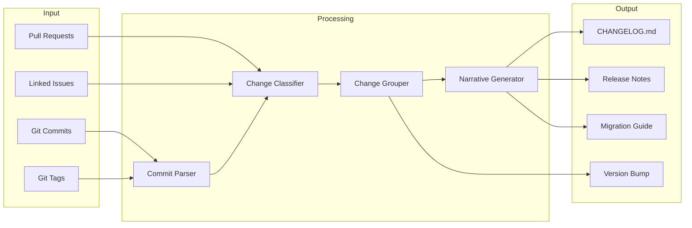

# Automated Changelog Generation

> Generate changelogs, release notes, and migration guides from conventional commits using Claude Code skills, agents, hooks, and CI integration.

---

## Overview

Automated changelog generation transforms git commit history into structured, human-readable release documentation. By combining the [Conventional Commits](https://www.conventionalcommits.org/) specification with AI analysis, teams get accurate changelogs without manual effort -- including intelligent grouping, breaking change highlighting, and auto-generated migration guides.

### The Changelog Pipeline



---

## Conventional Commits Specification

The foundation of automated changelogs is structured commit messages:

```
<type>[optional scope]: <description>

[optional body]

[optional footer(s)]
```

### Commit Types and Their Changelog Sections

| Type | Changelog Section | SemVer Impact | Example |
|------|------------------|---------------|---------|
| `feat` | Features | MINOR | `feat(auth): add OAuth2 login` |
| `fix` | Bug Fixes | PATCH | `fix(api): handle null response` |
| `docs` | Documentation | none | `docs: update API examples` |
| `style` | (hidden) | none | `style: format with prettier` |
| `refactor` | Code Refactoring | none | `refactor(db): extract query builder` |
| `perf` | Performance | PATCH | `perf(search): add index on email` |
| `test` | Tests | none | `test: add auth integration tests` |
| `build` | Build System | none | `build: upgrade to Node 22` |
| `ci` | CI/CD | none | `ci: add deploy stage` |
| `chore` | (hidden) | none | `chore: update .gitignore` |
| `revert` | Reverts | varies | `revert: feat(auth): add OAuth2` |
| `BREAKING CHANGE` | Breaking Changes | MAJOR | Footer or `!` after type |

### Breaking Change Indicators

```bash
# Method 1: Exclamation mark after type
feat(api)!: change authentication to OAuth2 only

# Method 2: Footer
feat(api): change authentication flow

BREAKING CHANGE: Basic auth is no longer supported.
Migrate to OAuth2 tokens before upgrading.

# Method 3: Both
feat(api)!: change authentication flow

BREAKING CHANGE: Basic auth removed. See migration guide.
```

---

## Working Skill: Changelog Generator

### Skill File: `~/.claude/skills/changelog_writer.md`

```markdown
# Skill: Changelog and Release Notes Writer

## When to activate
Activate when the user asks to:
- Generate or update a changelog
- Create release notes
- Prepare a release
- Summarize recent changes
- Generate a migration guide

## Instructions

### Phase 1: Commit Analysis
1. Parse git log between two references (tags, branches, or SHAs):
   ```bash
   git log <from>..<to> --format="%H|%s|%b|%an|%ae|%aI" --no-merges
   ```
2. For each commit, extract:
   - Type (feat, fix, docs, etc.)
   - Scope (optional parenthetical)
   - Description
   - Body (for additional context)
   - Breaking change indicators
   - Co-authors
   - Linked issues/PRs (from footer or branch name)

3. If commits don't follow conventional format, use AI to classify:
   - Analyze the diff to determine if it's a feature, fix, refactor, etc.
   - Generate a conventional commit message for the changelog entry
   - Mark as "AI-classified" in internal metadata

### Phase 2: Changelog Generation
Generate `CHANGELOG.md` with this structure:

```markdown
# Changelog

All notable changes to this project are documented in this file.

## [Unreleased]

## [1.2.0] - 2026-03-22

### Breaking Changes
- **api**: Authentication now requires OAuth2 tokens (#123)
  - Migration: Replace `Authorization: Basic` with `Authorization: Bearer`

### Features
- **auth**: Add OAuth2 login flow (#120)
- **search**: Full-text search across all resources (#118)
- **dashboard**: Real-time metrics widget (#115)

### Bug Fixes
- **api**: Handle null response from payment provider (#122)
- **ui**: Fix date picker timezone offset (#119)

### Performance
- **search**: Add composite index, 3x faster queries (#121)

### Documentation
- Update API authentication guide
- Add search configuration docs

### Internal
- Upgrade to Node.js 22 LTS
- Migrate tests to Vitest
```

### Phase 3: Release Notes (Human-Friendly)
Generate a separate release notes document that:
- Leads with the most impactful changes
- Uses plain language (not commit messages)
- Groups related changes into narratives
- Includes before/after examples for breaking changes
- Highlights contributor acknowledgments

### Phase 4: Migration Guide
If breaking changes exist, generate `docs/migrations/v{VERSION}.md`:
- List every breaking change with before/after code
- Provide step-by-step migration instructions
- Include a migration checklist
- Estimate effort for migration
- Provide a codemod script if possible

### Phase 5: Version Recommendation
Based on changes, recommend version bump:
- MAJOR: Any breaking changes
- MINOR: New features, no breaking changes
- PATCH: Only fixes, perf, and docs
Output: "Recommended version: X.Y.Z (reason)"

## Output format
- CHANGELOG.md: Keep Alive format (keepachangelog.com)
- Release notes: GitHub-flavored Markdown
- Migration guides: Step-by-step with code blocks
```

---

## Working Skill: Commit Message Enforcer

### Skill File: `~/.claude/skills/commit_enforcer.md`

```markdown
# Skill: Conventional Commit Enforcer

## When to activate
Activate before any git commit to ensure the message follows
conventional commits format.

## Instructions

### Validation Rules
1. First line must match: `<type>[(scope)][!]: <description>`
2. Valid types: feat, fix, docs, style, refactor, perf, test, build, ci, chore, revert
3. Description must:
   - Start with lowercase
   - Not end with a period
   - Be under 72 characters
   - Use imperative mood ("add" not "added" or "adds")
4. Body (if present) must be separated by a blank line
5. Footer must use `BREAKING CHANGE:` or `Closes #NNN` format

### Auto-Fix
If the commit message doesn't follow the format:
1. Analyze the staged diff to determine the correct type
2. Suggest a properly formatted message
3. Show the diff between original and suggested message
4. Ask for confirmation before proceeding

### Examples of fixes:
- "Fixed the login bug" -> "fix(auth): handle null token on login"
- "Added new search feature" -> "feat(search): add full-text search endpoint"
- "Updated deps" -> "build(deps): upgrade express to v5"
```

---

## Working Agent: Release Preparation Agent

```markdown
# Agent: Release Preparation

## Role
You are a release preparation agent. You handle the full release workflow
from changelog generation to version bumping and release note drafting.

## Trigger
User runs: claude "Prepare release" or claude "What's changed since last release?"

## Process

### 1. Determine Release Scope
- Find the last release tag: `git describe --tags --abbrev=0`
- Count commits since: `git rev-list <tag>..HEAD --count`
- Classify all commits between tag and HEAD
- Determine version bump (MAJOR/MINOR/PATCH)

### 2. Generate Changelog Entry
- Use the changelog_writer skill
- Insert new entry after "## [Unreleased]" in CHANGELOG.md
- Update "[Unreleased]" comparison link

### 3. Create Migration Guide (if needed)
- Only for MAJOR version bumps
- Document every breaking change with migration steps
- Generate codemods where possible

### 4. Draft Release Notes
- Write human-friendly summary for GitHub Releases
- Include key highlights (top 3-5 changes)
- Acknowledge contributors
- Link to full changelog and migration guide

### 5. Version Bump
- Update version in package.json / pyproject.toml / Cargo.toml
- Update version in source code constants if applicable
- Update lock files

### 6. Summary
Present to the user:
- Proposed version number
- Changelog entry preview
- Migration guide (if applicable)
- Release notes draft
- Files that will be modified
- Ask for confirmation before committing
```

---

## Working Hooks

### Pre-Commit: Conventional Commit Validation

```json
{
  "hooks": {
    "PreCommit": [
      {
        "command": "bash -c 'python3 .claude/hooks/validate_commit_msg.py'",
        "description": "Validate commit message follows conventional commits"
      }
    ]
  }
}
```

**Hook Script: `.claude/hooks/validate_commit_msg.py`**

```python
#!/usr/bin/env python3
"""
Pre-commit hook: Validate that the commit message follows
the Conventional Commits specification.
"""
import subprocess
import sys
import re
import json

VALID_TYPES = {
    "feat", "fix", "docs", "style", "refactor",
    "perf", "test", "build", "ci", "chore", "revert"
}

PATTERN = re.compile(
    r'^(?P<type>' + '|'.join(VALID_TYPES) + r')'
    r'(?:\((?P<scope>[a-z0-9_-]+)\))?'
    r'(?P<breaking>!)?'
    r': (?P<description>[a-z].{0,71})$'
)

def get_commit_msg():
    """Read commit message from the file git provides."""
    # In a pre-commit hook context, the message isn't available yet.
    # This hook is better suited as a commit-msg hook.
    # For Claude Code hooks, we validate the intent before committing.
    result = subprocess.run(
        ["git", "log", "-1", "--format=%s", "HEAD"],
        capture_output=True, text=True
    )
    return result.stdout.strip()

def validate_message(msg):
    """Validate a commit message against conventional commits."""
    first_line = msg.split("\n")[0]
    match = PATTERN.match(first_line)

    if not match:
        return False, f"Invalid format: '{first_line}'"

    if len(first_line) > 72:
        return False, f"First line too long ({len(first_line)} > 72 chars)"

    if first_line.endswith("."):
        return False, "First line should not end with a period"

    return True, "Valid conventional commit"

def main():
    msg = get_commit_msg()
    if not msg:
        print(json.dumps({"ok": True}))
        return

    valid, reason = validate_message(msg)
    if not valid:
        print(f"Commit message validation failed: {reason}")
        print(f"Expected format: <type>[(scope)]: <description>")
        print(f"Valid types: {', '.join(sorted(VALID_TYPES))}")
        print(json.dumps({"ok": False, "reason": reason}))
        sys.exit(1)

    print(json.dumps({"ok": True}))

if __name__ == "__main__":
    main()
```

### Post-Commit: Auto-Update Changelog

```json
{
  "hooks": {
    "PostCommit": [
      {
        "command": "bash -c 'python3 .claude/hooks/auto_changelog_entry.py'",
        "description": "Add commit to unreleased section of CHANGELOG.md"
      }
    ]
  }
}
```

**Hook Script: `.claude/hooks/auto_changelog_entry.py`**

```python
#!/usr/bin/env python3
"""
Post-commit hook: Automatically add the latest commit to the
[Unreleased] section of CHANGELOG.md.
"""
import subprocess
import re
import json
import os
from datetime import datetime

CHANGELOG = "CHANGELOG.md"

TYPE_TO_SECTION = {
    "feat": "### Features",
    "fix": "### Bug Fixes",
    "perf": "### Performance",
    "docs": "### Documentation",
    "refactor": "### Refactoring",
    "revert": "### Reverts",
}

# Types that don't appear in changelog
HIDDEN_TYPES = {"style", "test", "build", "ci", "chore"}

def get_last_commit():
    result = subprocess.run(
        ["git", "log", "-1", "--format=%s|%H"],
        capture_output=True, text=True
    )
    parts = result.stdout.strip().split("|")
    return parts[0], parts[1][:7] if len(parts) > 1 else ""

def parse_conventional(msg):
    pattern = re.compile(
        r'^(?P<type>\w+)(?:\((?P<scope>[^)]+)\))?(?P<breaking>!)?:\s*(?P<desc>.+)$'
    )
    match = pattern.match(msg)
    if not match:
        return None
    return match.groupdict()

def main():
    if not os.path.isfile(CHANGELOG):
        print(json.dumps({"ok": True, "message": "No CHANGELOG.md found, skipping"}))
        return

    msg, sha = get_last_commit()
    parsed = parse_conventional(msg)

    if not parsed:
        print(json.dumps({"ok": True, "message": "Non-conventional commit, skipping"}))
        return

    commit_type = parsed["type"]
    if commit_type in HIDDEN_TYPES:
        print(json.dumps({"ok": True, "message": f"Type '{commit_type}' hidden from changelog"}))
        return

    section = TYPE_TO_SECTION.get(commit_type, "### Other")
    scope = f"**{parsed['scope']}**: " if parsed["scope"] else ""
    breaking = " **BREAKING**" if parsed["breaking"] else ""
    entry = f"- {scope}{parsed['desc']}{breaking} ({sha})"

    print(f"Changelog entry: {entry}")
    print(f"Section: {section}")
    print(json.dumps({"ok": True, "message": f"Add to CHANGELOG.md under {section}"}))

if __name__ == "__main__":
    main()
```

---

## CI/CD Integration

### GitHub Actions: Automated Release

```yaml
name: Release
on:
  push:
    branches: [main]
    paths-ignore:
      - 'docs/**'
      - '*.md'

jobs:
  release:
    runs-on: ubuntu-latest
    permissions:
      contents: write
      pull-requests: write

    steps:
      - uses: actions/checkout@v4
        with:
          fetch-depth: 0  # Full history for changelog

      - name: Determine version bump
        id: version
        run: |
          # Get commits since last tag
          LAST_TAG=$(git describe --tags --abbrev=0 2>/dev/null || echo "v0.0.0")
          COMMITS=$(git log $LAST_TAG..HEAD --format="%s" --no-merges)

          # Check for breaking changes
          if echo "$COMMITS" | grep -qE '^[a-z]+(\(.+\))?!:|BREAKING CHANGE:'; then
            echo "bump=major" >> $GITHUB_OUTPUT
          elif echo "$COMMITS" | grep -qE '^feat(\(.+\))?:'; then
            echo "bump=minor" >> $GITHUB_OUTPUT
          else
            echo "bump=patch" >> $GITHUB_OUTPUT
          fi
          echo "last_tag=$LAST_TAG" >> $GITHUB_OUTPUT

      - name: Generate changelog with Claude
        run: |
          claude --print "Generate a changelog entry for all commits since \
            ${{ steps.version.outputs.last_tag }}. Follow conventional changelog \
            format. Group by type. Highlight breaking changes. Output only the \
            markdown for the new version section."
        env:
          ANTHROPIC_API_KEY: ${{ secrets.ANTHROPIC_API_KEY }}

      - name: Bump version
        id: bump
        run: |
          BUMP=${{ steps.version.outputs.bump }}
          # Use npm version, poetry version, cargo set-version, etc.
          NEW_VERSION=$(npm version $BUMP --no-git-tag-version | tr -d 'v')
          echo "version=$NEW_VERSION" >> $GITHUB_OUTPUT

      - name: Generate release notes with Claude
        id: notes
        run: |
          claude --print "Write release notes for v${{ steps.bump.outputs.version }}. \
            Summarize the key changes in 3-5 bullet points. Use plain language. \
            Acknowledge contributors. If there are breaking changes, include \
            a migration section." > release_notes.md

      - name: Create Release PR
        uses: peter-evans/create-pull-request@v6
        with:
          title: "release: v${{ steps.bump.outputs.version }}"
          body-path: release_notes.md
          branch: release/v${{ steps.bump.outputs.version }}
          commit-message: "release: v${{ steps.bump.outputs.version }}"
```

### GitLab CI: Changelog Generation

```yaml
generate-changelog:
  stage: prepare
  rules:
    - if: $CI_COMMIT_BRANCH == $CI_DEFAULT_BRANCH
  script:
    - |
      LAST_TAG=$(git describe --tags --abbrev=0 2>/dev/null || echo "v0.0.0")
      claude --print "Generate changelog for commits between $LAST_TAG and HEAD. \
        Use conventional changelog format." >> CHANGELOG_ENTRY.md
    - cat CHANGELOG_ENTRY.md
  artifacts:
    paths:
      - CHANGELOG_ENTRY.md
```

### git-cliff Integration

For teams that prefer deterministic (non-AI) changelog generation with AI enhancement:

```toml
# cliff.toml - git-cliff configuration
[changelog]
header = """
# Changelog\n
All notable changes to this project are documented in this file.\n
"""
body = """
\
    ## [{{ version | trim_start_matches(pat="v") }}] - {{ timestamp | date(format="%Y-%m-%d") }}
\
    ## [Unreleased]
\

    ### {{ group | striptags | trim | upper_first }}
    
        - **{{ commit.scope }}**: \
            {{ commit.message | upper_first }}\
             **BREAKING**\
    
\n
"""

[git]
conventional_commits = true
filter_unconventional = true
commit_parsers = [
    { message = "^feat", group = "Features" },
    { message = "^fix", group = "Bug Fixes" },
    { message = "^doc", group = "Documentation" },
    { message = "^perf", group = "Performance" },
    { message = "^refactor", group = "Refactoring" },
    { message = "^style", skip = true },
    { message = "^test", skip = true },
    { message = "^chore", skip = true },
    { message = "^ci", skip = true },
]
```

```bash
# Generate changelog
git-cliff --output CHANGELOG.md

# Then enhance with AI
claude "Review CHANGELOG.md and improve the descriptions to be more \
  user-friendly. Add context where commit messages are too terse. \
  Don't change the structure, just improve readability."
```

---

## Migration Guide Templates

### Breaking Change Migration Template

```markdown
# Migration Guide: v{OLD} to v{NEW}

## Overview
This release contains {N} breaking changes. Estimated migration effort: {TIME}.

## Prerequisites
- Current version: v{OLD}
- Target version: v{NEW}
- Required tools: {list}

## Breaking Changes

### 1. {Change Title}
**What changed**: {description}
**Why**: {rationale, link to ADR if available}
**Impact**: {who is affected}

**Before** (v{OLD}):
```{lang}
// old code
```

**After** (v{NEW}):
```{lang}
// new code
```

**Automated migration** (if available):
```bash
npx @company/codemod v{NEW} --transform={name}
```

## Migration Checklist
- [ ] Update dependency to v{NEW}
- [ ] Apply breaking change 1
- [ ] Apply breaking change 2
- [ ] Run tests
- [ ] Update environment variables
- [ ] Deploy to staging and verify
```

---

## Sources

- [Conventional Changelog on GitHub](https://github.com/conventional-changelog/conventional-changelog)
- [git-cliff: A Highly Customizable Changelog Generator](https://git-cliff.org/)
- [Changelogen: AI-Enhanced Changelog Generation](https://flori.dev/reads/changelogen-ai-agent/)
- [Mokkapps: Auto-Generate Changelog from Git Commits](https://mokkapps.de/blog/how-to-automatically-generate-a-helpful-changelog-from-your-git-commit-messages)
- [DEV Community: Automate CHANGELOGs to Ease Your Release](https://dev.to/devsatasurion/automate-changelogs-to-ease-your-release-282)
- [GitHub Marketplace: Generate Changelog from Conventional Commits](https://github.com/marketplace/actions/generate-changelog-based-on-conventional-commits)
- [Claude Code Hooks Guide](https://code.claude.com/docs/en/hooks-guide)
