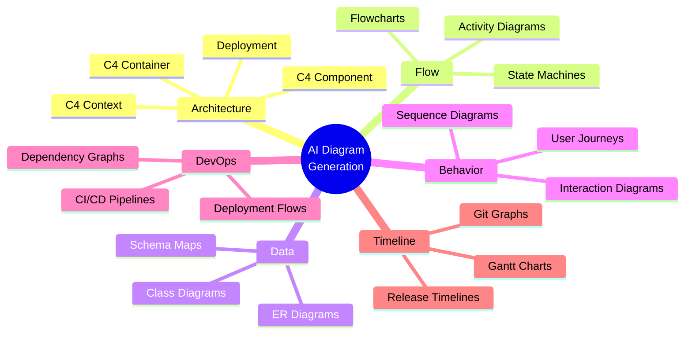
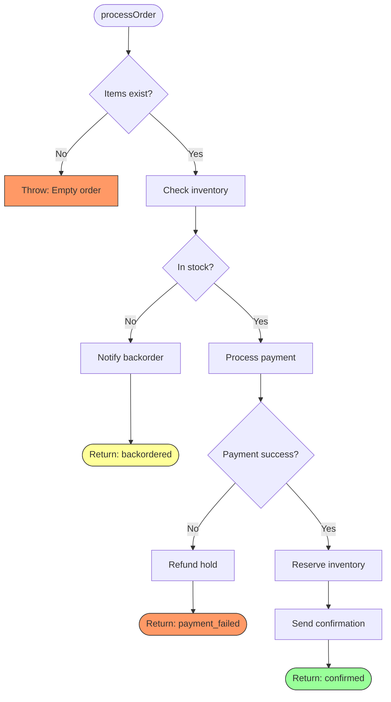
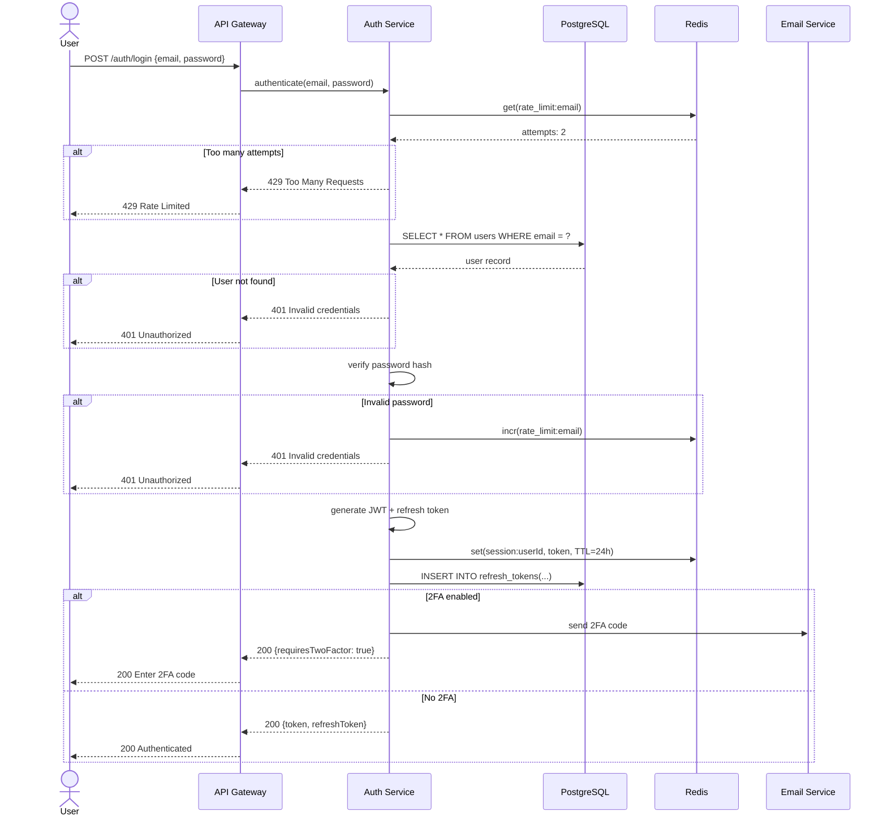
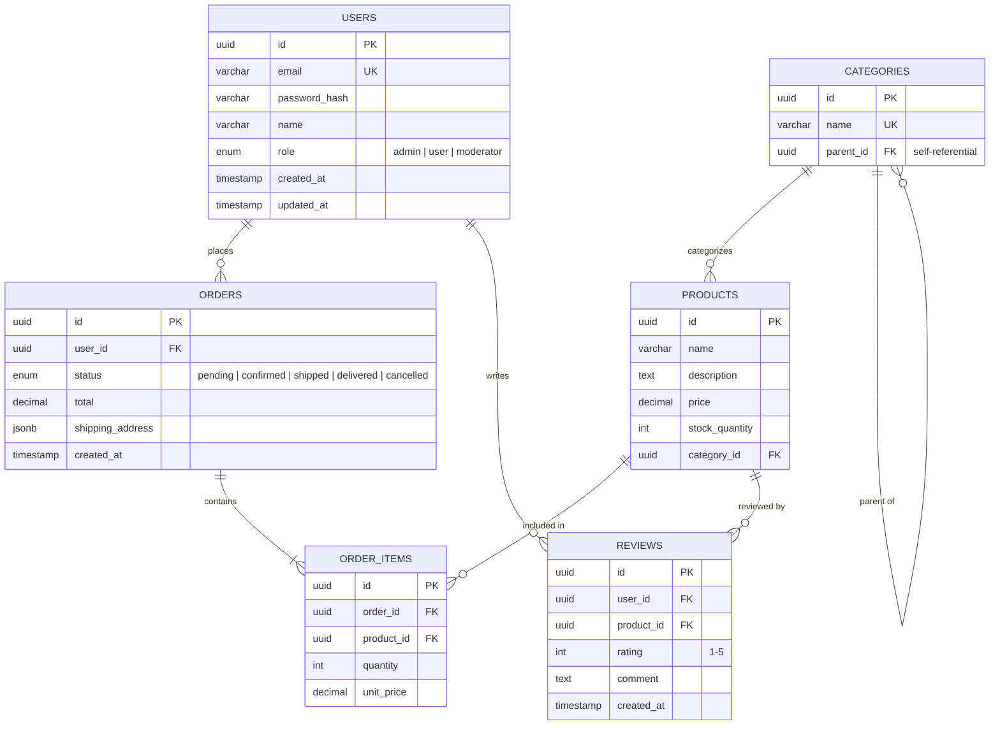
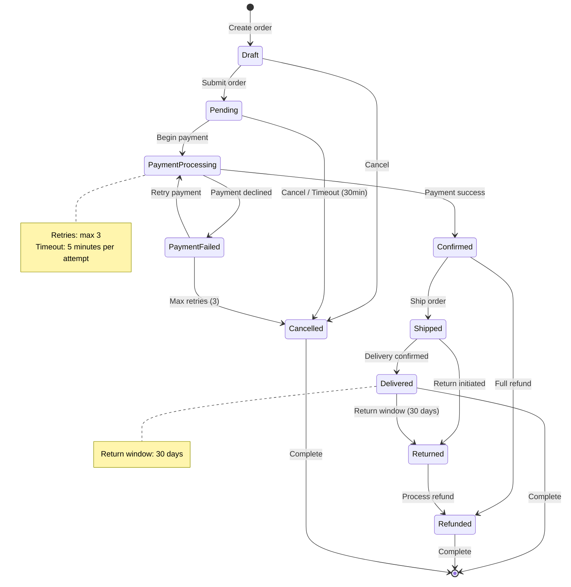
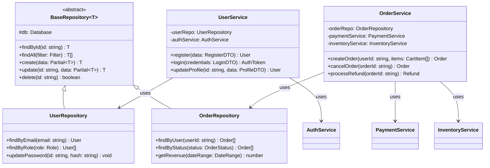
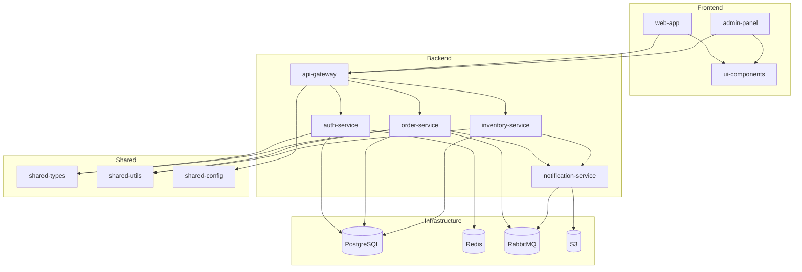
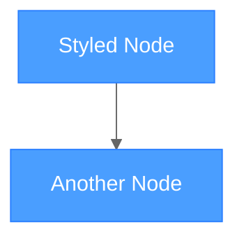

# AI Diagram Generation

> Generate mermaid diagrams from code: architecture views, flowcharts, ER diagrams, sequence diagrams, class diagrams, and more -- all using Claude Code skills, agents, and hooks.

---

## Overview

Diagrams are the fastest way to understand a system. AI can generate them by analyzing code structure, database schemas, API flows, and git history. Mermaid is the ideal target format because it is text-based (version-controllable), renders natively on GitHub, and can be edited by both humans and AI.

### Supported Diagram Types



---

## Working Skill: Diagram Generator

### Skill File: `~/.claude/skills/diagram_creator.md`

```markdown
# Skill: Mermaid Diagram Generator

## When to activate
Activate when the user asks to:
- Create any kind of diagram
- Visualize code structure, data flow, or architecture
- Generate ER diagrams from database schemas
- Create sequence diagrams from API flows
- Visualize CI/CD pipelines
- Map dependencies

## Instructions

### Diagram Type Selection
Based on what the user wants to visualize, choose the right diagram type:

| Need | Diagram Type | Mermaid Syntax |
|------|-------------|----------------|
| System overview | C4 Context | C4Context |
| Service architecture | C4 Container | C4Container |
| Module structure | C4 Component | C4Component |
| Process flow | Flowchart | graph TD/LR |
| API call sequence | Sequence | sequenceDiagram |
| Database schema | ER | erDiagram |
| Class relationships | Class | classDiagram |
| Object states | State | stateDiagram-v2 |
| User experience | User Journey | journey |
| Project timeline | Gantt | gantt |
| Git branching | Git Graph | gitGraph |
| Decision tree | Flowchart | graph TD |

### Generation Rules
1. Always use GitHub-compatible mermaid syntax
2. Keep diagrams readable:
   - Maximum 15-20 nodes per diagram
   - Split large diagrams into multiple focused views
   - Use subgraphs for logical grouping
   - Use consistent naming conventions
3. Add descriptive labels to all relationships
4. Use appropriate direction (TD for hierarchies, LR for flows)
5. Include a title comment above each diagram
6. For C4 diagrams, use the official C4 mermaid syntax

### Code Analysis Patterns

#### For Flowcharts (from function logic):
1. Find the function/method
2. Trace control flow: conditionals, loops, error paths
3. Map each branch to a decision diamond
4. Map each action to a process box
5. Include error/exception paths

#### For Sequence Diagrams (from API code):
1. Identify the entry point (HTTP handler, event listener)
2. Trace all function calls that cross module boundaries
3. Map external service calls (HTTP, database, cache, queue)
4. Include request and response data types
5. Show async operations with par/alt blocks

#### For ER Diagrams (from database schemas):
1. Read migration files, schema definitions, or ORM models
2. Extract entities and their attributes
3. Identify relationships (FK constraints, join tables)
4. Map cardinality (one-to-one, one-to-many, many-to-many)
5. Include attribute types and constraints

#### For Class Diagrams (from source code):
1. Identify classes, interfaces, and abstract classes
2. Map inheritance (extends) and implementation (implements)
3. Identify composition and aggregation relationships
4. Include key methods and properties (not all -- top 5-7)
5. Show visibility modifiers (+, -, #, ~)

#### For State Diagrams (from business logic):
1. Identify the entity with state (order, user, ticket)
2. Extract all possible states
3. Map transitions with trigger events
4. Include guard conditions
5. Mark initial and final states
```

---

## Diagram Examples from Code

### Flowchart from Function Logic

Given this code:

```javascript
async function processOrder(order) {
  if (!order.items.length) throw new Error('Empty order');

  const inventory = await checkInventory(order.items);
  if (!inventory.available) {
    await notifyBackorder(order);
    return { status: 'backordered' };
  }

  const payment = await processPayment(order);
  if (!payment.success) {
    await refundHold(payment.holdId);
    return { status: 'payment_failed' };
  }

  await reserveInventory(order.items);
  await sendConfirmation(order);
  return { status: 'confirmed' };
}
```

Generated diagram:



### Sequence Diagram from API Flow

Given an authentication endpoint, the AI traces the full call chain:



### ER Diagram from Database Schema

Given migration files or ORM models:



### State Diagram from Business Logic



### Class Diagram from Source Code



### CI/CD Pipeline Visualization

```mermaid
graph LR
    subgraph "Trigger"
        PUSH[Push to main]
        PR[Pull Request]
    end

    subgraph "Build"
        LINT[Lint & Format]
        TYPECHECK[Type Check]
        UNIT[Unit Tests]
        BUILD[Build]
    end

    subgraph "Test"
        INTEGRATION[Integration Tests]
        E2E[E2E Tests]
        SECURITY[Security Scan]
    end

    subgraph "Deploy"
        STAGING[Deploy Staging]
        SMOKE[Smoke Tests]
        APPROVE{Manual Approval}
        PROD[Deploy Production]
        MONITOR[Health Check]
    end

    PUSH --> LINT
    PR --> LINT
    LINT --> TYPECHECK
    TYPECHECK --> UNIT
    UNIT --> BUILD

    BUILD --> INTEGRATION
    INTEGRATION --> E2E
    E2E --> SECURITY

    SECURITY --> STAGING
    STAGING --> SMOKE
    SMOKE --> APPROVE
    APPROVE -->|Approved| PROD
    APPROVE -->|Rejected| ROLLBACK[Rollback]
    PROD --> MONITOR
    MONITOR -->|Unhealthy| ROLLBACK

    style PUSH fill:#4a9eff
    style PR fill:#4a9eff
    style PROD fill:#2ea44f
    style ROLLBACK fill:#f96
```



### Dependency Graph



---

## Working Agent: Diagram Audit Agent

```markdown
# Agent: Diagram Freshness Auditor

## Role
You are a diagram audit agent. Your job is to compare existing mermaid
diagrams against the current codebase and flag discrepancies.

## Trigger
Run weekly, or when user asks: claude "Audit diagrams for accuracy"

## Process

### 1. Inventory
- Find all .md files containing mermaid code blocks
- Catalog each diagram by type and what it documents
- Build a map: diagram -> source code it represents

### 2. Comparison
For each diagram:
- Re-analyze the source code it represents
- Generate a fresh version of the diagram
- Diff the existing vs fresh diagram
- Classify differences:
  - STALE: Code changed, diagram didn't
  - EXTRA: Diagram shows something not in code
  - MISSING: Code has something not in diagram
  - STYLE: Diagram is correct but could be clearer

### 3. Report
Generate `docs/diagrams/audit-report.md`:

| Diagram | Location | Status | Issues |
|---------|----------|--------|--------|
| System Context | docs/arch/context.md | CURRENT | None |
| ER Diagram | docs/data/schema.md | STALE | Missing: reviews table |
| Auth Flow | docs/api/auth.md | STALE | OAuth2 flow not shown |

### 4. Auto-Fix (with user approval)
For each STALE diagram:
- Show the diff between existing and proposed
- Ask user to approve the update
- Apply approved changes
```

---

## Working Hooks

### Post-Tool-Use: Auto-Generate Diagram on Schema Change

```json
{
  "hooks": {
    "PostToolUse": [
      {
        "matcher": {
          "tool": "edit",
          "path": "**/migrations/**"
        },
        "command": "bash -c 'echo {\"ok\": true, \"message\": \"Database migration changed. Consider regenerating ER diagram: claude \\\"Update ER diagram from current migrations\\\"\"}'",
        "description": "Suggest ER diagram update when migrations change"
      },
      {
        "matcher": {
          "tool": "edit",
          "path": "**/routes/**"
        },
        "command": "bash -c 'echo {\"ok\": true, \"message\": \"Route changed. Consider updating sequence diagrams for affected endpoints.\"}'",
        "description": "Suggest sequence diagram update when routes change"
      }
    ]
  }
}
```

### Pre-Push: Diagram Validation

```json
{
  "hooks": {
    "PrePush": [
      {
        "command": "bash -c 'python3 .claude/hooks/validate_mermaid.py'",
        "description": "Validate all mermaid diagrams in staged files"
      }
    ]
  }
}
```

**Hook Script: `.claude/hooks/validate_mermaid.py`**

```python
#!/usr/bin/env python3
"""
Pre-push hook: Validate mermaid syntax in all markdown files
that were changed. Uses mermaid-cli (mmdc) if available, otherwise
does basic syntax checks.
"""
import subprocess
import re
import sys
import json
import os
import tempfile

MERMAID_BLOCK = re.compile(r'```mermaid\n(.*?)```', re.DOTALL)

def get_changed_md_files():
    result = subprocess.run(
        ["git", "diff", "--name-only", "HEAD~1", "--", "*.md"],
        capture_output=True, text=True
    )
    return [f for f in result.stdout.strip().split("\n") if f.endswith(".md")]

def has_mmdc():
    """Check if mermaid-cli is installed."""
    try:
        subprocess.run(["mmdc", "--version"], capture_output=True)
        return True
    except FileNotFoundError:
        return False

def validate_with_mmdc(mermaid_code, filepath, index):
    """Validate using mermaid-cli."""
    with tempfile.NamedTemporaryFile(suffix=".mmd", mode="w", delete=False) as f:
        f.write(mermaid_code)
        f.flush()
        result = subprocess.run(
            ["mmdc", "-i", f.name, "-o", "/dev/null"],
            capture_output=True, text=True
        )
        os.unlink(f.name)
        if result.returncode != 0:
            return f"  {filepath} diagram #{index}: INVALID\n    {result.stderr.strip()}"
    return None

def basic_validate(mermaid_code, filepath, index):
    """Basic syntax check without mmdc."""
    valid_starts = [
        "graph ", "flowchart ", "sequenceDiagram", "classDiagram",
        "stateDiagram", "erDiagram", "journey", "gantt", "pie",
        "gitGraph", "C4Context", "C4Container", "C4Component",
        "mindmap", "timeline", "quadrantChart", "sankey",
    ]
    first_line = mermaid_code.strip().split("\n")[0].strip()
    if not any(first_line.startswith(s) for s in valid_starts):
        return f"  {filepath} diagram #{index}: Unknown diagram type: {first_line}"
    return None

def main():
    files = get_changed_md_files()
    if not files:
        print(json.dumps({"ok": True}))
        return

    use_mmdc = has_mmdc()
    errors = []

    for filepath in files:
        if not os.path.isfile(filepath):
            continue
        with open(filepath) as f:
            content = f.read()

        blocks = MERMAID_BLOCK.findall(content)
        for i, block in enumerate(blocks, 1):
            if use_mmdc:
                err = validate_with_mmdc(block, filepath, i)
            else:
                err = basic_validate(block, filepath, i)
            if err:
                errors.append(err)

    if errors:
        print("Mermaid diagram validation errors:")
        print("\n".join(errors))
        print(json.dumps({"ok": False, "reason": "Invalid mermaid diagrams found"}))
        sys.exit(1)

    print(f"Validated {sum(len(MERMAID_BLOCK.findall(open(f).read())) for f in files if os.path.isfile(f))} diagrams in {len(files)} files")
    print(json.dumps({"ok": True}))

if __name__ == "__main__":
    main()
```

---

## Best Practices for AI Diagram Generation

### 1. One Concept Per Diagram
Do not cram everything into one diagram. Split by concern:
- System context: who uses the system and what external systems exist
- Container: what are the deployable units
- Component: what modules exist inside a container
- Data flow: how data moves for a specific use case

### 2. Consistent Styling
Use a project-level style convention:



### 3. Version Control Diagrams
- Store diagrams as mermaid code in markdown (not images)
- Diffs are meaningful and reviewable
- CI can validate syntax
- AI can update them automatically

### 4. Link Diagrams to Code
Add comments in diagrams referencing source files:

```
%% Source: src/services/order-service.ts
%% Last generated: 2026-03-22
```

### 5. Progressive Detail
Start with the highest level and let readers drill down:
- Level 1: System Context (README.md)
- Level 2: Container diagram (docs/architecture/)
- Level 3: Component diagrams (docs/architecture/components/)
- Level 4: Code-level diagrams (inline in source docs)

---

## Sources

- [Mermaid.js: Generation of Diagrams from Text](https://mermaid.js.org/)
- [Mermaid Chart: AI-Powered Diagram Generation](https://www.mermaidchart.com/mermaid-ai)
- [Eraser.io: AI Mermaid Diagram Editor](https://www.eraser.io/ai/mermaid-diagram-editor)
- [Starmorph: Mermaid.js Tutorial - Complete Guide 2026](https://blog.starmorph.com/blog/mermaid-js-tutorial)
- [W3Resource: Mermaid.js Guide 2026](https://www.w3resource.com/javascript/mermaid-js-guide-to-create-diagrams-as-code.php)
- [Obsibrain: Mermaid Diagram Complete Guide 2026](https://www.obsibrain.com/blog/mermaid-diagram-a-complete-guide-to-diagrams-as-code-in-2026)
- [Claude Code Hooks Guide](https://code.claude.com/docs/en/hooks-guide)
