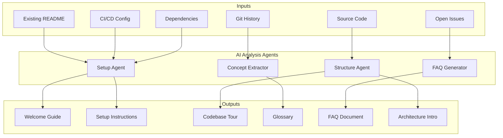
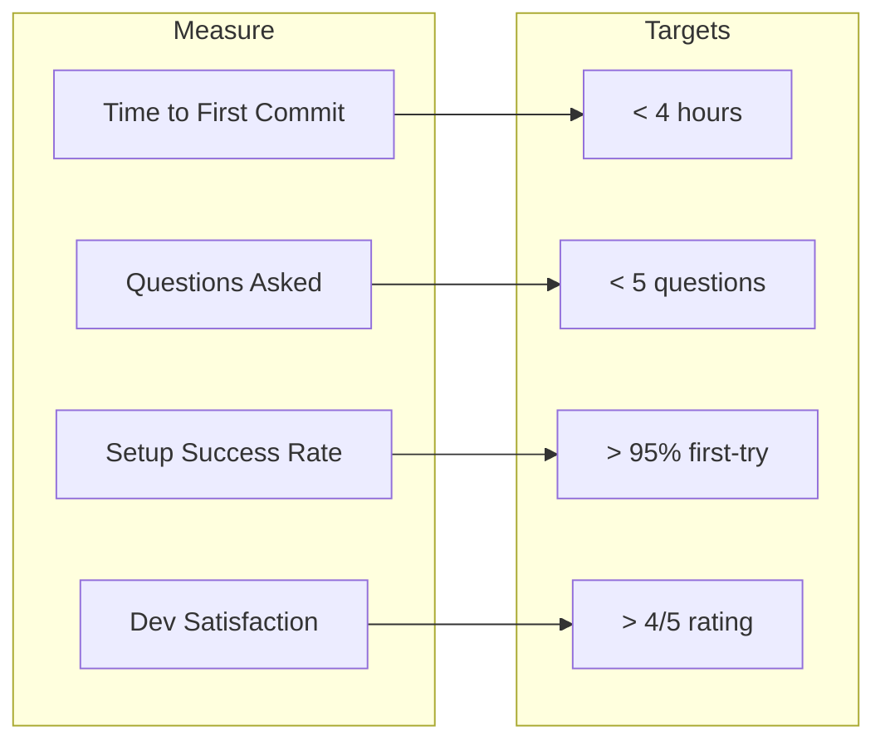

# AI-Generated Onboarding Documentation

> Automatically generate codebase walkthroughs, getting started guides, and FAQs that stay current as code evolves.

---

## Overview

New developer onboarding traditionally takes 1-2 weeks of reading code, asking questions, and building mental models. AI-powered onboarding documentation compresses this to hours by generating structured walkthroughs, annotated architecture tours, and living FAQ documents that update automatically when code changes.

### The Onboarding Pipeline



---

## Working Skill: Onboarding Guide Generator

### Skill File: `~/.claude/skills/onboarding_builder.md`

```markdown
# Skill: Onboarding Documentation Builder

## When to activate
Activate when the user asks to create onboarding documentation,
a getting started guide, a codebase walkthrough, or developer setup docs.

## Instructions

### Phase 1: Project Discovery
1. Read `README.md`, `CONTRIBUTING.md`, `package.json`/`go.mod`/`pyproject.toml`
2. Identify the tech stack:
   - Language(s) and versions
   - Framework(s)
   - Database(s)
   - External services
3. Scan for setup scripts: `Makefile`, `docker-compose.yml`, `scripts/setup.sh`
4. Identify test frameworks and how to run tests
5. Locate CI/CD configuration to understand the build pipeline
6. Check for environment variable requirements (`.env.example`)

### Phase 2: Generate Getting Started Guide
Create `docs/onboarding/getting-started.md` with:

1. **Prerequisites**
   - Required tools with exact version numbers
   - Platform-specific notes (macOS, Linux, Windows/WSL)
   - Required accounts/access (cloud providers, APIs)

2. **Clone and Setup** (copy-paste ready)
   ```bash
   git clone <repo-url>
   cd <project>
   # Tool installation (if not already present)
   # Dependency installation
   # Environment configuration
   # Database setup
   # Seed data
   ```

3. **Running the Project**
   - Development mode
   - Production build
   - Individual services (if microservices)

4. **Running Tests**
   - Unit tests
   - Integration tests
   - E2E tests
   - How to run a single test file

5. **Common Tasks**
   - Creating a new feature branch
   - Adding a database migration
   - Deploying to staging
   - Viewing logs

6. **Troubleshooting**
   - Port conflicts
   - Database connection issues
   - Missing environment variables
   - Common error messages and solutions

### Phase 3: Generate Codebase Tour
Create `docs/onboarding/codebase-tour.md` with:

1. **Directory Map** -- Annotated tree of top-level directories
   ```
   src/
     api/          # REST API route handlers
     services/     # Business logic layer
     models/       # Database models and schemas
     utils/        # Shared utility functions
     middleware/   # Express middleware (auth, logging, rate limiting)
     workers/      # Background job processors
   tests/
     unit/         # Unit tests (mirrors src/ structure)
     integration/  # API integration tests
     fixtures/     # Test data and factories
   infra/
     terraform/    # AWS infrastructure definitions
     docker/       # Docker configurations
   ```

2. **Request Flow** -- Trace a typical request through the codebase
   ```mermaid
   sequenceDiagram
       participant Client
       participant Middleware
       participant Router
       participant Service
       participant Model
       participant Database

       Client->>Middleware: HTTP Request
       Middleware->>Middleware: Auth check
       Middleware->>Router: Authenticated request
       Router->>Service: Business logic call
       Service->>Model: Data operation
       Model->>Database: SQL query
       Database-->>Model: Result set
       Model-->>Service: Domain object
       Service-->>Router: Response data
       Router-->>Client: HTTP Response
   ```

3. **Key Files** -- The 10-15 most important files a new dev should read first
4. **Naming Conventions** -- How files, functions, and variables are named
5. **Data Flow** -- How data moves through the system

### Phase 4: Generate FAQ
Create `docs/onboarding/faq.md` by analyzing:
- GitHub issues labeled "question" or "help wanted"
- README sections that assume knowledge
- Complex setup steps
- Non-obvious architectural decisions

Structure as:
- **Setup FAQs**: "Why does X fail on first run?"
- **Architecture FAQs**: "Why did we choose X over Y?"
- **Process FAQs**: "How do I deploy to staging?"
- **Debugging FAQs**: "How do I debug worker jobs?"

### Phase 5: Generate Glossary
Create `docs/onboarding/glossary.md` with:
- Domain-specific terms used in the codebase
- Acronyms and abbreviations
- Internal naming conventions
- Links to relevant code for each term
```

---

## Working Skill: Auto-Update on Code Changes

### Skill File: `~/.claude/skills/doc_freshness_keeper.md`

```markdown
# Skill: Documentation Freshness Keeper

## When to activate
Activate after significant code changes that would make onboarding docs stale:
- New directories or modules added
- Setup process changes (new dependencies, new env vars)
- API contract changes
- Database schema changes
- CI/CD pipeline changes

## Instructions

### Change Impact Analysis
1. Compare current code structure against documented structure in codebase-tour.md
2. Check if getting-started.md setup steps still work:
   - New dependencies in lock file?
   - New environment variables in .env.example?
   - Changed database schema?
   - New required tools?
3. Check if FAQ is still accurate:
   - Are answered questions still relevant?
   - Have new common issues appeared in recent issues/PRs?

### Update Strategy
- **Additive changes** (new directory, new feature): Append to existing docs
- **Modified steps** (changed setup process): Update in place, mark with date
- **Removed features**: Remove from docs, add to changelog
- **Breaking changes**: Add prominent notice at top of affected doc

### Auto-Update Markers
Insert markers in generated docs so AI can identify auto-generated sections:

<!-- auto-generated:start source=package.json section=prerequisites -->
<!-- auto-generated:end -->

Only modify content between auto-generated markers.
Preserve any content outside markers (human-written additions).

### Freshness Badge
Update the freshness badge at the top of each doc:

> Last verified: 2026-03-22 | Last code change: 2026-03-22 | Status: CURRENT
```

---

## Working Agent: Onboarding Audit Agent

```markdown
# Agent: Onboarding Documentation Audit

## Role
You are an onboarding quality auditor. Your job is to verify that onboarding
documentation is accurate, complete, and actually works.

## Process

### 1. Setup Verification
Simulate a fresh developer setup:
- Read getting-started.md step by step
- Check each command for correctness:
  - Do referenced files exist?
  - Are version numbers current?
  - Do scripts have execute permission?
  - Are all env vars documented?
- Flag any step that would fail

### 2. Completeness Check
Verify coverage against a checklist:
- [ ] Prerequisites listed with versions
- [ ] Clone and install instructions
- [ ] Environment variable documentation
- [ ] Database setup instructions
- [ ] How to run the app
- [ ] How to run tests
- [ ] How to create a branch and submit a PR
- [ ] Architecture overview with diagrams
- [ ] Key files identified and explained
- [ ] Glossary of domain terms
- [ ] FAQ with at least 10 entries
- [ ] Troubleshooting section

### 3. Readability Audit
- Are instructions written for the skill level of expected readers?
- Are there any assumptions that aren't explicitly stated?
- Are code examples copy-paste ready?
- Is the flow logical (no forward references to unexplained concepts)?

### 4. Staleness Detection
- Compare documented dependency versions against actual lock file
- Check if documented directory structure matches reality
- Verify documented environment variables against .env.example
- Test documented commands against actual Makefile/scripts

### 5. Report
Generate `docs/onboarding/audit-report.md`:

| Section | Status | Issues | Last Updated |
|---------|--------|--------|-------------|
| Prerequisites | PASS | None | 2026-03-20 |
| Setup | WARN | Node version outdated | 2026-03-15 |
| Codebase Tour | FAIL | Missing new /workers dir | 2026-02-28 |
```

---

## Working Agent: Interactive Onboarding Agent

```markdown
# Agent: Interactive Codebase Guide

## Role
You are an interactive codebase guide for new developers. When invoked,
you provide a conversational walkthrough of the codebase tailored to the
developer's background and questions.

## Activation
User runs: claude "I'm new to this codebase, help me understand it"

## Process

### 1. Context Gathering
Ask the developer:
- What's your primary language/framework experience?
- What area will you be working on? (frontend, backend, infra, etc.)
- Do you have any specific questions to start with?

### 2. Personalized Tour
Based on their answers:
- Highlight files and patterns relevant to their work area
- Explain conventions using analogies to their known frameworks
- Focus depth on their area, breadth on everything else
- Show how their area connects to the rest of the system

### 3. Progressive Disclosure
Start with the big picture:
1. What does this system do? (30-second version)
2. How is it structured? (directory tour)
3. How does a request flow? (sequence diagram)
4. What are the key design decisions? (link to ADRs)
5. How do I make my first change? (guided walkthrough)

### 4. Follow-Up Resources
Based on questions asked, recommend:
- Specific files to read next
- Relevant ADRs
- Related tests that demonstrate behavior
- Team members who own specific areas
```

---

## Working Hooks

### Post-Commit: Detect Onboarding Doc Staleness

```json
{
  "hooks": {
    "PostCommit": [
      {
        "command": "bash -c 'python3 .claude/hooks/check_onboarding_docs.py'",
        "description": "Check if onboarding docs need updating after code changes"
      }
    ]
  }
}
```

**Hook Script: `.claude/hooks/check_onboarding_docs.py`**

```python
#!/usr/bin/env python3
"""
Post-commit hook: Detect when code changes would make onboarding docs stale.
Checks for new directories, changed setup files, new env vars, etc.
"""
import subprocess
import json
import os

ONBOARDING_TRIGGERS = {
    "package.json": "Dependencies changed",
    "go.mod": "Dependencies changed",
    "requirements.txt": "Dependencies changed",
    "pyproject.toml": "Dependencies changed",
    ".env.example": "Environment variables changed",
    "docker-compose": "Docker setup changed",
    "Makefile": "Build commands changed",
    "Dockerfile": "Container setup changed",
    ".github/workflows": "CI/CD changed",
}

def get_last_commit_files():
    result = subprocess.run(
        ["git", "diff-tree", "--no-commit-id", "--name-only", "-r", "HEAD"],
        capture_output=True, text=True
    )
    return result.stdout.strip().split("\n") if result.stdout.strip() else []

def check_new_directories():
    """Check if any new top-level directories were added."""
    result = subprocess.run(
        ["git", "diff-tree", "--no-commit-id", "--name-only", "-r", "--diff-filter=A", "HEAD"],
        capture_output=True, text=True
    )
    new_files = result.stdout.strip().split("\n") if result.stdout.strip() else []
    new_dirs = set()
    for f in new_files:
        parts = f.split("/")
        if len(parts) > 1:
            new_dirs.add(parts[0] + "/" + parts[1])
    return new_dirs

def main():
    files = get_last_commit_files()
    triggers = []

    for f in files:
        for pattern, reason in ONBOARDING_TRIGGERS.items():
            if pattern in f:
                triggers.append({"file": f, "reason": reason})

    new_dirs = check_new_directories()

    if triggers or new_dirs:
        messages = []
        if triggers:
            messages.append("Setup-related files changed:")
            for t in triggers:
                messages.append(f"  - {t['file']}: {t['reason']}")
        if new_dirs:
            messages.append("New directories added:")
            for d in new_dirs:
                messages.append(f"  - {d}")
        messages.append("")
        messages.append("Consider updating: docs/onboarding/getting-started.md")
        print("\n".join(messages))

    print(json.dumps({"ok": True}))

if __name__ == "__main__":
    main()
```

### Pre-Push: Onboarding Doc Completeness Check

```json
{
  "hooks": {
    "PrePush": [
      {
        "command": "bash -c 'python3 .claude/hooks/onboarding_completeness.py'",
        "description": "Verify onboarding docs exist and are complete"
      }
    ]
  }
}
```

**Hook Script: `.claude/hooks/onboarding_completeness.py`**

```python
#!/usr/bin/env python3
"""
Pre-push hook: Verify that essential onboarding documentation exists.
"""
import os
import json

REQUIRED_DOCS = {
    "docs/onboarding/getting-started.md": "Getting started guide",
    "docs/onboarding/codebase-tour.md": "Codebase tour",
    "README.md": "Project README",
}

RECOMMENDED_DOCS = {
    "docs/onboarding/faq.md": "FAQ document",
    "docs/onboarding/glossary.md": "Glossary",
    "CONTRIBUTING.md": "Contributing guide",
}

def main():
    missing_required = []
    missing_recommended = []

    for path, name in REQUIRED_DOCS.items():
        if not os.path.isfile(path):
            missing_required.append(f"  MISSING: {name} ({path})")

    for path, name in RECOMMENDED_DOCS.items():
        if not os.path.isfile(path):
            missing_recommended.append(f"  MISSING: {name} ({path})")

    if missing_required:
        print("Required onboarding docs missing:")
        print("\n".join(missing_required))
        print(json.dumps({"ok": False, "reason": "Required onboarding docs missing"}))
        exit(1)

    if missing_recommended:
        print("Recommended onboarding docs missing (not blocking):")
        print("\n".join(missing_recommended))

    print(json.dumps({"ok": True}))

if __name__ == "__main__":
    main()
```

---

## Onboarding Metrics

Track onboarding effectiveness:



| Metric | Before AI Docs | After AI Docs | Improvement |
|--------|---------------|---------------|-------------|
| Time to first commit | 3-5 days | 2-4 hours | 90% reduction |
| Setup questions to team | 8-15 | 1-3 | 80% reduction |
| Setup success on first try | 40% | 95% | 137% improvement |
| Days to productive | 10-15 | 2-3 | 80% reduction |

---

## Sources

- [DEV Community: From 2 Weeks to 30 Seconds - AI-Powered Codebase Onboarding](https://dev.to/levdalba/from-2-weeks-to-30-seconds-ai-powered-codebase-onboarding-built-with-copilot-cli-55oh)
- [Martin Fowler: Onboarding to a Legacy Codebase with AI](https://martinfowler.com/articles/exploring-gen-ai/09-ai-help-onboarding-codebase.html)
- [Moxo: AI Tools for Developer Onboarding](https://www.moxo.com/blog/ai-tools-for-developer-onboarding)
- [Selleo: How to Onboard New Developers Faster](https://selleo.com/blog/how-to-onboard-new-developers-faster)
- [Workik: AI Codebase Documentation](https://workik.com/tutorials/codebase-documentation)
- [Claude Code Skills, Commands, Hooks & Agents Guide](https://genaiunplugged.substack.com/p/claude-code-skills-commands-hooks-agents)
