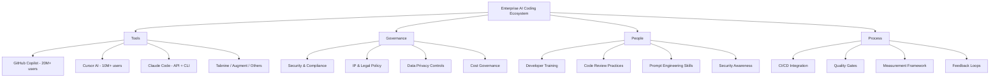

# Enterprise AI Coding Adoption

> A comprehensive guide for organizations adopting AI-powered coding tools at scale.

## Overview

Enterprise adoption of AI coding tools has reached a critical inflection point. As of early 2026, **84% of developers** use AI tools that now write **41% of all code**, while coding accounts for **$4.0 billion** (55%) of all departmental AI spend ([Panto AI Statistics](https://www.getpanto.ai/blog/ai-coding-assistant-statistics)). Google reports that AI generates over 25% of its new code, and GitHub Copilot alone has surpassed 20 million users with 50,000+ organizations onboard.

Yet adoption without governance creates risk. Gartner warns that by 2028, prompt-to-app approaches will increase software defects by **2,500%** ([Gartner Predicts 2026](https://www.armorcode.com/report/gartner-predicts-2026-ai-potential-and-risks-emerge-in-software-engineering-technologies)). Organizations that invest in structured rollout, training, compliance, and measurement frameworks are the ones capturing real business value.

## What This Guide Covers

| Document | Purpose |
|----------|---------|
| [Adoption Guide](adoption_guide.md) | Step-by-step enterprise rollout from assessment to measurement |
| [ROI Analysis](roi_analysis.md) | Productivity metrics, cost-benefit templates, and case studies |
| [Compliance](compliance.md) | IP ownership, data privacy, regulatory requirements, and audit trails |
| [Training Program](training_program.md) | 6-week curriculum plus ongoing mastery program for development teams |

## The Enterprise AI Coding Landscape (2026)

## Key Statistics at a Glance

| Metric | Value | Source |
|--------|-------|--------|
| Developers using AI tools | 84% | JetBrains 2025 |
| Code written by AI | 41% | Panto AI 2026 |
| Average time saved per developer | 3.6 hours/week (187 hours/year) | Index.dev 2026 |
| Task completion increase (high-adoption teams) | 21% more tasks | Faros AI |
| PR merge rate increase | 98% more PRs merged | Faros AI |
| Productivity gain (80-100% adoption) | >110% | McKinsey 2025 |
| GitHub Copilot task speed increase | 55% faster | GitHub Research |
| AI coding market size | $3.0-3.5B (2025) | Gartner |
| Enterprise AI coding spend | $4.0B (2025) | Menlo Ventures |
| PR review time increase | 91% longer | Index.dev |
| AI-generated code with security issues | 48% | Augment Code |

## The AI Productivity Paradox

Despite widespread individual adoption, many organizations report a disconnect: developers say they are working faster, but companies do not see measurable improvements in delivery velocity or business outcomes. This "AI productivity paradox" occurs because:

1. **Review bottlenecks** -- PR review time increases 91% as AI-generated code volume surges
2. **Quality debt** -- AI-assisted code can have ~1.7x more issues than human-written code
3. **Trust gaps** -- Only 33% of developers trust AI-generated output; 46% do not fully trust it
4. **Process misalignment** -- Testing, release pipelines, and review practices have not adapted to the new velocity

The guides in this directory address each of these challenges systematically.

## Quick Start

1. Read the [Adoption Guide](adoption_guide.md) to understand the phased approach
2. Use the [ROI Analysis](roi_analysis.md) to build your business case
3. Review [Compliance](compliance.md) with your legal and security teams
4. Launch your [Training Program](training_program.md) alongside the pilot

## Sources

- [Panto AI -- AI Coding Key Statistics & Trends 2026](https://www.getpanto.ai/blog/ai-coding-assistant-statistics)
- [Menlo Ventures -- State of Generative AI in the Enterprise 2025](https://menlovc.com/perspective/2025-the-state-of-generative-ai-in-the-enterprise/)
- [GitHub Blog -- Quantifying Copilot's Impact on Developer Productivity](https://github.blog/news-insights/research/research-quantifying-github-copilots-impact-on-developer-productivity-and-happiness/)
- [McKinsey -- Unleash Developer Productivity with Generative AI](https://www.mckinsey.com/capabilities/tech-and-ai/our-insights/unleashing-developer-productivity-with-generative-ai)
- [Gartner -- 75% of Engineers Will Use AI Code Assistants by 2028](https://www.gartner.com/en/newsroom/press-releases/2024-04-11-gartner-says-75-percent-of-enterprise-software-engineers-will-use-ai-code-assistants-by-2028)
- [Deloitte -- State of AI in the Enterprise 2026](https://www.deloitte.com/us/en/what-we-do/capabilities/applied-artificial-intelligence/content/state-of-ai-in-the-enterprise.html)
- [Index.dev -- Developer Productivity Statistics with AI Tools 2026](https://www.index.dev/blog/developer-productivity-statistics-with-ai-tools)
- [Faros AI -- Enterprise AI Coding Assistant Adoption](https://www.faros.ai/blog/enterprise-ai-coding-assistant-adoption-scaling-guide)
