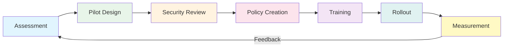
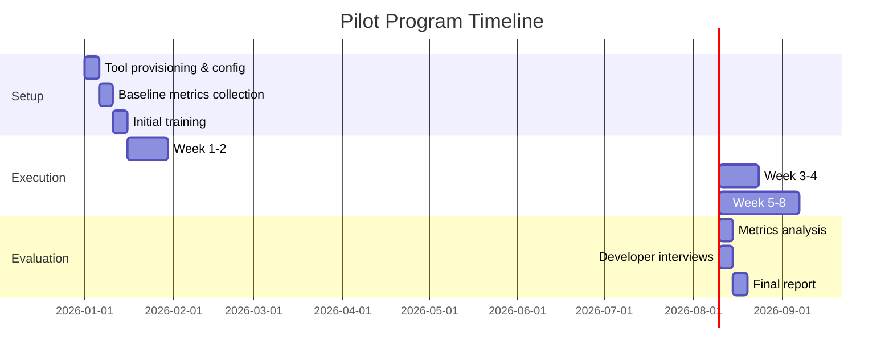
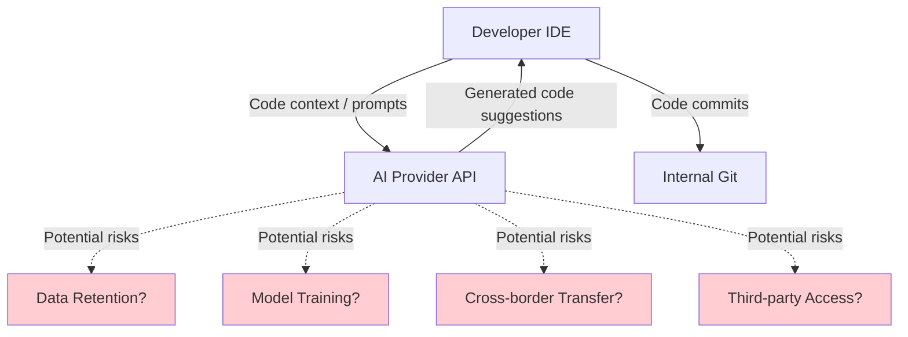
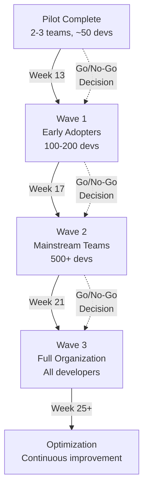
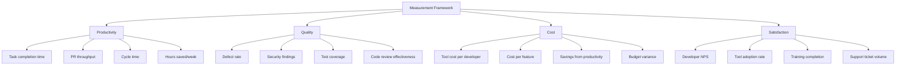

# Enterprise AI Coding Adoption Guide

> A phased approach to adopting AI coding tools across an engineering organization, from initial assessment through full-scale rollout and continuous measurement.

---

## Table of Contents

1. [Phase 1: Assessment](#phase-1-assessment-weeks-1-4)
2. [Phase 2: Pilot Program Design](#phase-2-pilot-program-design-weeks-5-8)
3. [Phase 3: Security Review](#phase-3-security-review-weeks-6-10)
4. [Phase 4: Policy Creation](#phase-4-policy-creation-weeks-9-12)
5. [Phase 5: Training Program](#phase-5-training-program-weeks-11-16)
6. [Phase 6: Rollout Strategy](#phase-6-rollout-strategy-weeks-13-26)
7. [Phase 7: Measurement Framework](#phase-7-measurement-framework-ongoing)

---

## Adoption Lifecycle Overview

---

## Phase 1: Assessment (Weeks 1-4)

### Objective
Understand the current development landscape, identify opportunities, and build the business case for AI coding tools.

### 1.1 Current State Analysis

**Developer Survey** -- Assess the existing toolchain, pain points, and attitudes toward AI:

| Survey Area | Key Questions |
|-------------|--------------|
| Current tools | What IDE, language, framework, and CI/CD tools are in use? |
| Pain points | Where do developers spend the most time on repetitive work? |
| AI familiarity | What percentage already use AI tools (officially or unofficially)? |
| Concerns | What are developers' top concerns about AI coding tools? |
| Willingness | How willing are teams to change their workflow? |

> **Shadow AI Risk**: Research shows that developers often adopt AI tools informally before official programs exist. Per Menlo Ventures, 25% of enterprises with 100+ engineers had already moved beyond testing by early 2025. Identify existing shadow usage early.

**Codebase Analysis**:
- Languages and frameworks in use (AI tools vary in effectiveness by language)
- Repository structure and access controls
- Existing code quality metrics (defect rates, test coverage, cycle time)
- Sensitive code areas (credentials, PII handling, regulated modules)

### 1.2 Tool Evaluation

Evaluate candidate tools against enterprise requirements:

| Criteria | GitHub Copilot | Cursor | Claude Code | Tabnine |
|----------|---------------|--------|-------------|---------|
| SOC 2 Type II | Yes | Yes | Yes | Yes |
| ISO 27001 | Yes | Varies | Yes | Yes |
| Zero data retention | Business+ | Configurable | API option | Enterprise |
| Self-hosted option | No | No | API-based | Yes |
| SSO/SAML | Enterprise | Business | Enterprise | Enterprise |
| Audit logging | Enterprise | Limited | API logs | Enterprise |
| Cost (per seat/month) | $19-39 | $20-40 | Usage-based | $39+ |
| Language breadth | Broad | Broad | Broad | Broad |
| IDE support | VS Code, JetBrains, Neovim | VS Code fork | Terminal/IDE | All major |

**Cost Projection** (based on 2025-2026 pricing data):

| Team Size | GitHub Copilot Business | Cursor Business | Tabnine Enterprise |
|-----------|------------------------|-----------------|-------------------|
| 100 devs | $22,800/yr | $38,400/yr | $46,800/yr |
| 500 devs | $114,000/yr | $192,000/yr | $234,000/yr |
| 1000 devs | $228,000/yr | $384,000/yr | $468,000/yr |

> **Warning**: Gartner predicts that by 2027, 40% of enterprises using consumption-priced AI coding tools will face unplanned costs exceeding **2x their expected budgets**. Build in a cost buffer and establish usage monitoring from day one.

### 1.3 Business Case Construction

Build the ROI case using the [ROI Analysis](roi_analysis.md) framework. Key data points:

- Average developer saves **3.6 hours/week** (187 hours/year) -- [Index.dev 2026](https://www.index.dev/blog/developer-productivity-statistics-with-ai-tools)
- Tasks completed **55% faster** with Copilot -- [GitHub Research](https://github.blog/news-insights/research/research-quantifying-github-copilots-impact-on-developer-productivity-and-happiness/)
- Positive ROI within **3-6 months** for most organizations -- [Worklytics](https://www.worklytics.co/blog/the-roi-of-github-copilot-for-your-organization-a-metrics-driven-analysis)
- Organizations with 80-100% adoption see **>110% productivity gains** -- [McKinsey](https://www.mckinsey.com/capabilities/tech-and-ai/our-insights/unleashing-developer-productivity-with-generative-ai)

### Deliverables
- [ ] Developer survey results and analysis
- [ ] Codebase assessment report
- [ ] Tool comparison matrix
- [ ] Cost projection (3-year)
- [ ] Draft business case with ROI model

---

## Phase 2: Pilot Program Design (Weeks 5-8)

### Objective
Design a controlled pilot that generates actionable data while managing risk.

### 2.1 Pilot Team Selection

Select 2-3 teams (20-50 developers total) with diverse characteristics:

| Team Characteristic | Why It Matters |
|--------------------|----------------|
| Mix of senior and junior developers | McKinsey found junior devs sometimes take 7-10% longer with AI tools |
| Different tech stacks | AI effectiveness varies by language/framework |
| Greenfield and brownfield projects | Different usage patterns for new vs. existing code |
| Willing participants | Forced adoption breeds resistance |
| Teams with good existing metrics | Need baseline for comparison |

### 2.2 Success Criteria

Define measurable outcomes before the pilot starts:

| Metric | Baseline | Target | How to Measure |
|--------|----------|--------|----------------|
| Task completion time | Current avg | 20-30% reduction | Time tracking / JIRA |
| PR throughput | Current avg | 15-25% increase | Git analytics |
| Code quality (defects) | Current rate | No more than 10% increase | Bug tracking |
| Developer satisfaction | Survey score | >7/10 satisfaction | NPS survey |
| Code review time | Current avg | Stable or decreasing | PR analytics |
| Test coverage | Current % | Maintained or improved | CI metrics |
| Security findings | Current rate | No increase | SAST/DAST tools |

### 2.3 Pilot Duration and Structure

**Recommended Duration**: 8-12 weeks

### 2.4 Data Collection Plan

Collect both quantitative and qualitative data:

**Quantitative** (automated where possible):
- Lines of code generated/accepted/retained
- PR cycle time, review time, merge rate
- Build success rate
- Test coverage delta
- Security scan findings
- Tool usage frequency and patterns

**Qualitative** (weekly check-ins + end-of-pilot interviews):
- Developer satisfaction and frustration points
- Workflow changes (positive and negative)
- Code quality perceptions
- Areas where AI helped most / least
- Concerns about continued use

### Deliverables
- [ ] Pilot team selection and justification
- [ ] Success criteria document (with measurable targets)
- [ ] Pilot timeline and milestones
- [ ] Data collection plan and tooling
- [ ] Pilot kickoff materials

---

## Phase 3: Security Review (Weeks 6-10)

### Objective
Ensure AI coding tools meet enterprise security, privacy, and compliance requirements.

### 3.1 Data Flow Analysis

Map exactly what data leaves your environment:

### 3.2 Security Evaluation Checklist

| Category | Requirement | Priority |
|----------|-------------|----------|
| **Data Privacy** | Zero data retention for prompts/code | Critical |
| **Data Privacy** | No use of customer data for model training | Critical |
| **Data Privacy** | Data residency options (EU, US, etc.) | High |
| **Encryption** | TLS 1.3 for data in transit | Critical |
| **Encryption** | Encryption at rest for any cached data | Critical |
| **Authentication** | SSO/SAML integration | High |
| **Authentication** | MFA support | High |
| **Access Control** | Role-based access controls | High |
| **Access Control** | Repository-level access restrictions | Medium |
| **Audit** | Comprehensive audit logging | High |
| **Audit** | Log export/SIEM integration | Medium |
| **Compliance** | SOC 2 Type II certification | Critical |
| **Compliance** | ISO 27001 certification | High |
| **Compliance** | ISO/IEC 42001 (AI-specific) | Medium |
| **Vendor** | Incident response SLA | High |
| **Vendor** | Penetration test results available | High |
| **Vendor** | Business continuity plan | Medium |

### 3.3 Code Scanning Integration

AI-generated code requires enhanced scanning:

- **SAST** (Static Application Security Testing) -- Run on all AI-generated code before merge
- **SCA** (Software Composition Analysis) -- Check for license-infringing patterns
- **Secret detection** -- AI may reproduce patterns that include credential formats
- **AI-specific scanners** -- Tools like Snyk, Cycode, and Black Duck now offer AI code-specific detection

> **Key Finding**: 48% of AI-generated code contains security vulnerabilities ([Augment Code](https://www.augmentcode.com/guides/ai-code-vulnerability-audit-fix-the-45-security-flaws-fast)). Automated scanning is not optional -- it is essential.

### 3.4 Vendor Security Assessment

Conduct a thorough vendor assessment:

- Request SOC 2 Type II report (not just Type I)
- Review data processing agreement (DPA) terms
- Verify "zero training on customer data" guarantees contractually
- Assess sub-processor list and data flow
- Review incident history and response times
- Verify compliance with your industry regulations (HIPAA, SOX, PCI-DSS, etc.)

### Deliverables
- [ ] Data flow diagram for each candidate tool
- [ ] Security evaluation scorecard
- [ ] Vendor security assessment report
- [ ] Code scanning pipeline design
- [ ] Risk register with mitigations

---

## Phase 4: Policy Creation (Weeks 9-12)

### Objective
Establish clear, enforceable policies for AI coding tool usage.

### 4.1 Acceptable Use Policy

Define what developers can and cannot do:

**Allowed**:
- Code completion and generation for non-sensitive modules
- Test generation and documentation
- Code refactoring and optimization suggestions
- Learning and exploration

**Restricted** (requires approval):
- AI usage in regulated code areas (HIPAA, PCI, SOX)
- AI-generated code in security-critical paths (auth, crypto, access control)
- Sending proprietary algorithms or trade secrets as context

**Prohibited**:
- Sending credentials, API keys, or secrets to AI tools
- Using AI tools on air-gapped or classified projects
- Disabling code review for AI-generated code
- Using unauthorized/personal AI tools for company code

### 4.2 Code Attribution and Review Policy

| Rule | Rationale |
|------|-----------|
| All AI-generated code must pass standard code review | Quality assurance |
| AI-generated code must be flagged in PR descriptions | Transparency and audit trail |
| Developers are responsible for all code they submit, regardless of origin | Accountability |
| AI-generated code in security-critical paths requires senior reviewer | Risk management |
| License scanning must run on all AI-generated code | IP protection |

### 4.3 Data Classification Policy

Map your data classification to AI tool permissions:

| Data Classification | AI Tool Usage | Example |
|--------------------|---------------|---------|
| Public | Unrestricted | Open-source code, public docs |
| Internal | Allowed with standard controls | Business logic, internal APIs |
| Confidential | Restricted -- requires DPA review | Customer data handling code |
| Highly Confidential | Prohibited | Encryption keys, auth systems, PII processors |

### 4.4 Cost Governance Policy

Per Gartner's warning about unplanned cost overruns:

- Set per-team and per-developer usage budgets
- Implement usage monitoring dashboards
- Establish escalation thresholds (e.g., alert at 75% of budget)
- Quarterly cost reviews with engineering leadership
- Evaluate consumption-based vs. flat-rate pricing quarterly

### 4.5 Governance Framework Alignment

Align with established frameworks:

- **NIST AI Risk Management Framework** -- GOVERN, MAP, MEASURE, MANAGE functions
- **ISO/IEC 42001:2023** -- AI Management System standard
- **EU AI Act** -- Particularly relevant for EU operations (fines up to EUR 35M or 7% of global turnover, high-risk rules effective August 2026)
- **Company-specific** -- Integrate with existing SDLC governance

### Deliverables
- [ ] AI Coding Acceptable Use Policy
- [ ] Code Attribution and Review Policy
- [ ] Data Classification Guide for AI Tools
- [ ] Cost Governance Framework
- [ ] Regulatory Compliance Checklist

---

## Phase 5: Training Program (Weeks 11-16)

### Objective
Equip developers with the skills to use AI coding tools effectively and safely.

See the detailed [Training Program](training_program.md) for the full 6-week curriculum.

### 5.1 Training Tiers

| Tier | Audience | Duration | Focus |
|------|----------|----------|-------|
| Foundations | All developers | 2 weeks | Basic usage, policies, security |
| Intermediate | Active users | 2 weeks | Prompt engineering, workflow integration |
| Advanced | Power users / leads | 2 weeks | Multi-file agents, custom patterns, CLAUDE.md |
| Ongoing | Everyone | Continuous | New features, pattern sharing, metrics |

### 5.2 Critical Training Topics

Based on enterprise adoption data:

1. **Security awareness** -- 48% of AI code has vulnerabilities; developers must know what to review
2. **Prompt engineering** -- Quality of output depends heavily on quality of input
3. **Code review for AI output** -- Different review patterns than human-written code
4. **When NOT to use AI** -- Complex tasks show <10% time savings; junior devs may be slower
5. **Policy compliance** -- Data classification, attribution, prohibited uses

### 5.3 Training Metrics

| Metric | Target |
|--------|--------|
| Training completion rate | >95% of all developers |
| Post-training competency score | >80% on assessment |
| Policy compliance rate | >98% (audit-verified) |
| Developer satisfaction with training | >7/10 |

### Deliverables
- [ ] Training curriculum (see [Training Program](training_program.md))
- [ ] Training materials and labs
- [ ] Assessment criteria and rubrics
- [ ] Training completion tracking system
- [ ] Ongoing learning plan

---

## Phase 6: Rollout Strategy (Weeks 13-26)

### Objective
Scale from pilot to organization-wide adoption in a controlled, measurable way.

### 6.1 Phased Rollout Plan

### 6.2 Wave Planning

**Wave 1 -- Early Adopters (Weeks 13-16)**:
- Teams that volunteered or showed interest during assessment
- Teams with strong code review practices
- Include "AI Champions" who can support peers
- Target: 100-200 developers

**Wave 2 -- Mainstream (Weeks 17-20)**:
- Remaining product engineering teams
- Infrastructure and platform teams
- QA and test automation teams
- Target: 500+ developers

**Wave 3 -- Full Organization (Weeks 21-24)**:
- All remaining development teams
- Contractors and vendor teams (with appropriate controls)
- DevOps and SRE teams
- Target: Organization-wide

### 6.3 Go/No-Go Criteria

Each wave requires passing these gates:

| Gate | Criteria | Threshold |
|------|----------|-----------|
| Quality | Defect rate not significantly increased | <15% increase over baseline |
| Security | No critical security incidents from AI code | Zero critical findings |
| Compliance | Policy compliance rate | >95% |
| Satisfaction | Developer NPS | >30 |
| Cost | Within budget projections | <120% of projected cost |
| Productivity | Measurable improvement in at least 2 metrics | >10% improvement |

### 6.4 Support Structure

| Role | Responsibility | Ratio |
|------|---------------|-------|
| AI Champions | Peer support, best practice sharing | 1:20 developers |
| AI Enablement Team | Training, tooling, policy updates | 1:100 developers |
| Security Liaison | Security review, incident response | 1:200 developers |
| Executive Sponsor | Budget, prioritization, blockers | 1 per org |

### Deliverables
- [ ] Wave plan with team assignments
- [ ] Go/No-Go criteria and review schedule
- [ ] Champion network roster
- [ ] Support escalation procedures
- [ ] Communication plan

---

## Phase 7: Measurement Framework (Ongoing)

### Objective
Continuously measure impact, identify improvement opportunities, and demonstrate ROI.

### 7.1 Metrics Dashboard

### 7.2 Reporting Cadence

| Report | Audience | Frequency | Content |
|--------|----------|-----------|---------|
| Team Dashboard | Engineering Managers | Real-time | Usage, productivity, quality |
| Adoption Report | VP Engineering | Monthly | Rollout progress, blockers, metrics |
| ROI Report | CTO / CFO | Quarterly | Cost-benefit analysis, business impact |
| Compliance Report | CISO / Legal | Quarterly | Policy compliance, incidents, audit findings |
| Strategy Review | Executive Team | Semi-annual | Strategic impact, future investment |

### 7.3 Continuous Improvement Loop

1. **Collect** -- Automated metrics + developer feedback
2. **Analyze** -- Identify patterns, bottlenecks, and opportunities
3. **Decide** -- Prioritize improvements (tools, training, policy)
4. **Implement** -- Roll out changes
5. **Measure** -- Verify impact
6. **Share** -- Broadcast wins and lessons learned

### 7.4 Long-term Success Indicators

| Timeframe | Indicator |
|-----------|-----------|
| 3 months | Positive ROI, >60% active usage |
| 6 months | Measurable productivity gains, stable quality |
| 12 months | AI integrated into standard SDLC, reduced time-to-market |
| 18 months | Organization viewed as AI-forward employer, competitive advantage |

### Deliverables
- [ ] Metrics dashboard (tool selection and configuration)
- [ ] Reporting templates
- [ ] Quarterly review process
- [ ] Continuous improvement backlog

---

## Sources

- [GitHub Blog -- Quantifying Copilot's Impact on Developer Productivity](https://github.blog/news-insights/research/research-quantifying-github-copilots-impact-on-developer-productivity-and-happiness/)
- [McKinsey -- Unleash Developer Productivity with Generative AI](https://www.mckinsey.com/capabilities/tech-and-ai/our-insights/unleashing-developer-productivity-with-generative-ai)
- [McKinsey -- Unlocking the Value of AI in Software Development](https://www.mckinsey.com/industries/technology-media-and-telecommunications/our-insights/unlocking-the-value-of-ai-in-software-development)
- [Gartner -- 75% of Engineers Will Use AI Code Assistants by 2028](https://www.gartner.com/en/newsroom/press-releases/2024-04-11-gartner-says-75-percent-of-enterprise-software-engineers-will-use-ai-code-assistants-by-2028)
- [Gartner -- Predicts 2026: AI Potential and Risks in Software Engineering](https://www.armorcode.com/report/gartner-predicts-2026-ai-potential-and-risks-emerge-in-software-engineering-technologies)
- [Menlo Ventures -- State of Generative AI in the Enterprise 2025](https://menlovc.com/perspective/2025-the-state-of-generative-ai-in-the-enterprise/)
- [Faros AI -- Enterprise AI Coding Assistant Adoption](https://www.faros.ai/blog/enterprise-ai-coding-assistant-adoption-scaling-guide)
- [Index.dev -- Developer Productivity Statistics with AI Tools 2026](https://www.index.dev/blog/developer-productivity-statistics-with-ai-tools)
- [Augment Code -- AI Code Vulnerability Audit](https://www.augmentcode.com/guides/ai-code-vulnerability-audit-fix-the-45-security-flaws-fast)
- [Augment Code -- SOC2 Compliance Enterprise Guide](https://www.augmentcode.com/tools/ai-coding-tools-soc2-compliance-enterprise-security-guide)
- [Worklytics -- ROI of GitHub Copilot](https://www.worklytics.co/blog/the-roi-of-github-copilot-for-your-organization-a-metrics-driven-analysis)
- [SitePoint -- AI Coding Tools ROI Calculator 2026](https://www.sitepoint.com/ai-coding-tools-cost-analysis-roi-calculator-2026/)
- [GetDX -- AI Coding Assistant Pricing 2025](https://getdx.com/blog/ai-coding-assistant-pricing/)
