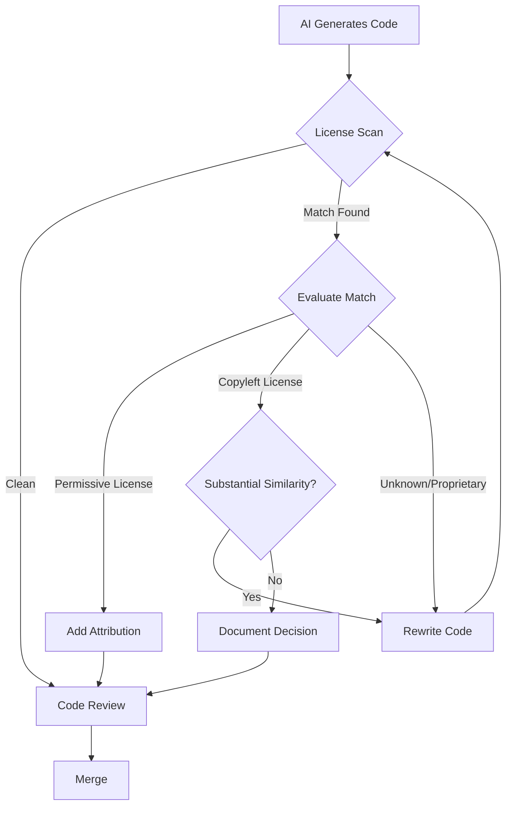
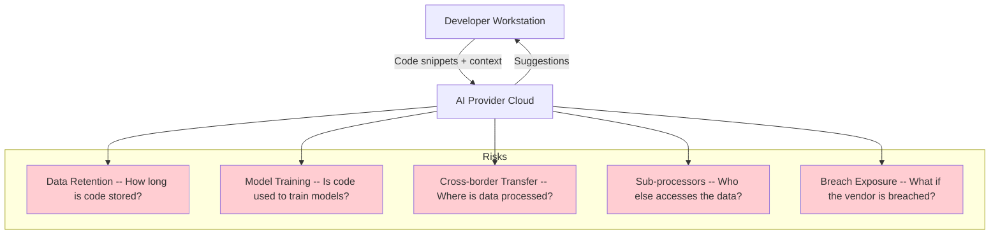
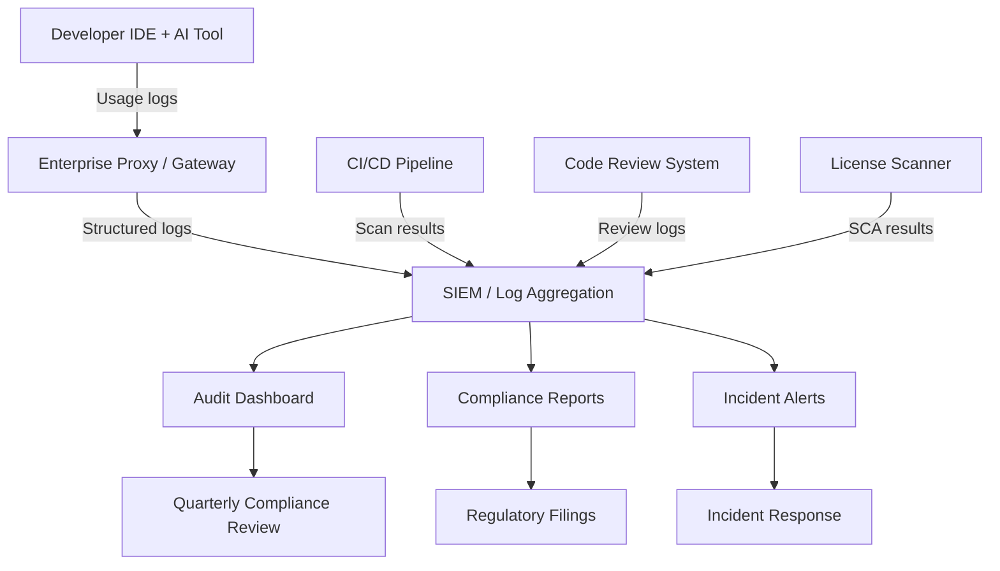

# Enterprise AI Coding Compliance & Legal Considerations

> IP ownership, data privacy, regulatory requirements, license compliance, and audit trail requirements for enterprise AI coding tool deployment.

---

## Table of Contents

1. [IP Ownership of AI-Generated Code](#1-ip-ownership-of-ai-generated-code)
2. [License Compliance](#2-license-compliance)
3. [Data Privacy](#3-data-privacy)
4. [Regulatory Requirements by Industry](#4-regulatory-requirements-by-industry)
5. [Audit Trail Requirements](#5-audit-trail-requirements)
6. [Compliance Checklist](#6-compliance-checklist)

---

## 1. IP Ownership of AI-Generated Code

### 1.1 Current Legal Landscape (as of March 2026)

The legal status of AI-generated code ownership remains evolving and jurisdiction-dependent.

**United States**:

| Development | Date | Implication |
|------------|------|-------------|
| U.S. Supreme Court declined Thaler appeal | March 2, 2026 | Works without human creators are ineligible for copyright protection |
| U.S. Copyright Office ruling on AI copyrightability | 2025-2026 | AI outputs can be protected **only where a human author has determined sufficient expressive elements** |
| Copyright Office Part 2 report on copyrightability | 2026 | Human-authored work perceptible in AI output, or human creative modifications, may qualify for protection |

**Key Principles**:
- **Pure AI output** (no significant human shaping): **Not copyrightable** in the U.S.
- **Human-directed AI output** (human selects, arranges, modifies): **May be copyrightable** depending on degree of human creative input
- **AI-assisted code** (human writes with AI suggestions): **Likely copyrightable** as the human author made creative choices

> **Source**: [U.S. Copyright Office -- Copyright and Artificial Intelligence](https://www.copyright.gov/ai/), [MBHB -- Navigating the Legal Landscape of AI-Generated Code](https://www.mbhb.com/intelligence/snippets/navigating-the-legal-landscape-of-ai-generated-code-ownership-and-liability-challenges/)

### 1.2 Patent Protection

- Patent laws require **novelty, utility, and non-obviousness** with clear human contribution
- Developers using AI to design algorithms may secure patents **if they can show their involvement was integral** to the invention process
- AI itself cannot be named as an inventor (Thaler v. Vidal, upheld through 2026)
- Document human contributions to the inventive process meticulously

### 1.3 Trade Secret Protection

Some companies protect AI-generated code through trade secrets:
- Keep AI-generated code confidential
- Restrict access through NDAs
- Implement access controls
- Does not require registration or disclosure (unlike patents)
- Risk: trade secret protection is lost if the code is independently discovered or reverse-engineered

### 1.4 Enterprise Recommendations

| Action | Priority | Rationale |
|--------|----------|-----------|
| Require human review and modification of all AI output | Critical | Strengthens copyrightability claims |
| Document human creative contributions | Critical | Evidence for IP disputes |
| Include AI-assisted development in employment agreements | High | Clarify ownership between employer and employee |
| Establish internal IP classification for AI-generated code | High | Different protection strategies for different code |
| Review AI tool vendor terms for IP provisions | High | Some vendors may claim rights to outputs |
| Consider trade secret protection for proprietary algorithms | Medium | Complements copyright/patent |

### 1.5 Vendor IP Terms Comparison

| Vendor | User Owns Output | No Training on Code | IP Indemnification |
|--------|-----------------|--------------------|--------------------|
| GitHub Copilot Business/Enterprise | Yes | Yes (Business+) | Yes (Enterprise) |
| Anthropic Claude (API) | Yes | Opt-out available | Limited |
| Cursor (Business) | Yes | Configurable | Check terms |
| Tabnine (Enterprise) | Yes | Yes (Enterprise) | Yes |

> **Warning**: Always verify current terms. Vendor agreements change frequently. Have legal counsel review the specific DPA and ToS.

---

## 2. License Compliance

### 2.1 The Risk

AI coding tools are trained on large code corpora that include open-source code under various licenses. AI suggestions may reproduce patterns, snippets, or structures that originate from copyleft or restrictively licensed code.

### 2.2 License Risk Matrix

| License Type | Risk Level | Concern |
|-------------|-----------|---------|
| MIT / BSD / Apache 2.0 | Low | Permissive; attribution usually sufficient |
| LGPL | Medium | Dynamic linking OK; static linking may trigger copyleft |
| GPL v2/v3 | High | Copyleft obligations if AI reproduces substantial GPL code |
| AGPL | Very High | Network use triggers copyleft; especially risky for SaaS |
| Proprietary | Critical | Any reproduction is infringement |
| SSPL | High | Restrictive server-side copyleft |

### 2.3 Mitigation Strategies

**Technical Controls**:
1. **SCA scanning** on all PRs -- tools like Black Duck, Snyk, and FOSSA can detect license-infringing patterns
2. **Copilot duplicate detection** -- GitHub Copilot Business+ includes a filter that blocks suggestions matching public code
3. **Pre-commit hooks** -- Scan for known code patterns before commit
4. **Repository-level policies** -- Block AI tool usage in repositories with strict licensing requirements

### 2.4 Attribution Requirements

Regardless of license type, maintain clear records:
- Flag AI-generated code in commit messages or PR descriptions
- Maintain an AI code registry (which files, which tool, when)
- Include license scan results in CI/CD pipeline artifacts
- Retain AI suggestion logs for audit purposes (where tool supports it)

---

## 3. Data Privacy

### 3.1 What Data Leaves Your Environment

When developers use cloud-based AI coding tools, the following data may be transmitted:

| Data Type | Risk Level | Example |
|-----------|-----------|---------|
| Code context (surrounding code) | High | Functions, classes, imports near the cursor |
| File contents | High | Full or partial files sent for analysis |
| Repository metadata | Medium | File names, directory structure, language |
| Prompt content | High | Developer questions about code |
| Embedded secrets | Critical | API keys, passwords, connection strings in code |
| PII in code/comments | High | Customer data in test fixtures, names in comments |

### 3.2 Data Flow Risks

### 3.3 GDPR Compliance

For organizations operating in the EU or processing EU residents' data:

| Requirement | Application to AI Coding Tools |
|-------------|-------------------------------|
| Lawful basis for processing | Legitimate interest or consent for sending code to AI APIs |
| Data Processing Agreement (DPA) | Required with every AI tool vendor |
| Data Protection Impact Assessment (DPIA) | Required for high-risk processing (recommended for all AI coding tool deployments) |
| Records of Processing Activities | Document what data is sent, where, why, and how long retained |
| Cross-border transfer safeguards | Standard Contractual Clauses (SCCs) if data leaves the EEA |
| Right to erasure | Ensure vendor can delete your data upon request |
| Data minimization | Send only necessary context, not full repositories |
| Breach notification | Vendor must notify within 72 hours |

> **Penalties**: Non-compliance with GDPR can result in fines up to EUR 20 million or 4% of annual global turnover, whichever is higher. For AI-specific violations under the EU AI Act, fines can reach EUR 35 million or 7% of global turnover.

**Sources**: [Graphite -- Privacy and Security Considerations](https://graphite.com/guides/privacy-security-ai-coding-tools), [Exabeam -- GDPR and AI](https://www.exabeam.com/explainers/gdpr-compliance/the-intersection-of-gdpr-and-ai-and-6-compliance-best-practices/), [Parloa -- AI Privacy Rules 2026](https://www.parloa.com/blog/AI-privacy-2026/)

### 3.4 Data Privacy Controls

| Control | Implementation |
|---------|---------------|
| **Data classification** | Classify repositories/directories by sensitivity; restrict AI tool access accordingly |
| **Secret scanning** | Pre-transmission filters that strip credentials and secrets before sending to AI |
| **DLP integration** | Data Loss Prevention rules that block PII from being sent to external APIs |
| **Proxy/gateway** | Route all AI API calls through an enterprise proxy for logging and filtering |
| **Data residency** | Select AI providers offering data processing in required jurisdictions |
| **Zero retention** | Contractually require zero data retention on prompts and code |
| **Zero training** | Contractually prohibit use of your code for model training |
| **Encryption** | TLS 1.3 for transit; verify at-rest encryption policies |

### 3.5 Specific Vendor Privacy Features

| Feature | GitHub Copilot Business+ | Claude API | Cursor Business | Tabnine Enterprise |
|---------|-------------------------|------------|-----------------|-------------------|
| Zero data retention | Yes | Yes (API) | Configurable | Yes |
| No model training | Yes | Opt-out | Configurable | Yes |
| Data residency (EU) | Yes | Limited | Limited | Yes |
| On-premises option | No | No (API-based) | No | Yes |
| Enterprise proxy | Via GitHub | Direct API | Configurable | Yes |
| SOC 2 Type II | Yes | Yes | Yes | Yes |

---

## 4. Regulatory Requirements by Industry

### 4.1 Healthcare (HIPAA)

| Requirement | Application |
|-------------|-------------|
| PHI protection | **Never** send Protected Health Information to AI coding APIs |
| Business Associate Agreement (BAA) | Required if AI tool could access PHI |
| Security Rule compliance | Encryption, access controls, audit logging |
| Risk assessment | Include AI tools in annual HIPAA risk assessment |
| Minimum necessary standard | Send only the minimum code context needed |
| Incident response | Include AI tool breaches in HIPAA incident response plan |

> **Key stat**: 73% of HIPAA violations stem from developers accidentally including patient data in prompts -- not vendor security failures ([Augment Code](https://www.augmentcode.com/guides/hipaa-compliant-ai-coding-guide-for-healthcare-developers)).

**Recent changes**: The HHS proposed the first major HIPAA Security Rule update in 20 years (January 6, 2025), removing the distinction between required and addressable safeguards and introducing stricter expectations for encryption and resilience.

**State laws**: California, Texas (TRAIGA, effective January 1, 2026), and other states have enacted AI-specific healthcare disclosure requirements.

### 4.2 Financial Services (SOX, GLBA, PCI-DSS)

| Regulation | Requirement for AI Coding |
|-----------|--------------------------|
| **SOX** (Sarbanes-Oxley) | Audit trail for all code changes to financial reporting systems; AI-generated code subject to same internal controls |
| **GLBA** (Gramm-Leach-Bliley) | Protect customer financial data; no customer data in AI prompts |
| **PCI-DSS** | AI tools must not process cardholder data; code touching payment systems requires enhanced review |
| **FFIEC guidance** | Model risk management applies to AI coding tools used in regulated systems |
| **SEC cybersecurity rules** | Material cybersecurity incidents (including from AI code vulnerabilities) must be disclosed |

### 4.3 Government / Defense (FedRAMP, ITAR, CMMC)

| Regulation | Requirement |
|-----------|-------------|
| **FedRAMP** | AI tools processing federal data must be FedRAMP authorized or equivalent |
| **ITAR** | Export-controlled code must never be sent to commercial AI APIs |
| **CMMC** | AI tools in DoD supply chain must meet applicable CMMC level |
| **FISMA** | Federal systems require FISMA-compliant AI tool deployments |
| **EO 14110** | Executive Order on Safe, Secure, and Trustworthy AI (October 2023) -- agencies must inventory AI use |

### 4.4 EU Operations (EU AI Act, GDPR, NIS2)

| Regulation | Effective Date | Key Requirements |
|-----------|---------------|-----------------|
| **EU AI Act** | High-risk rules: August 2026 | Risk classification, transparency, human oversight, fines up to EUR 35M / 7% revenue |
| **GDPR** | In effect | DPA, DPIA, data minimization, cross-border transfer controls |
| **NIS2** | In effect | Cybersecurity risk management, incident reporting, supply chain security |

### 4.5 Cross-Industry Standards

| Standard | Description | Relevance |
|----------|-------------|-----------|
| **ISO/IEC 42001:2023** | AI Management System standard | First global AI governance standard; covers impact assessment, data integrity, supplier management |
| **NIST AI RMF** | AI Risk Management Framework | GOVERN, MAP, MEASURE, MANAGE functions for AI risk |
| **ISO 27001** | Information Security Management | Foundation for AI tool security; ISO 42001 adds AI-specific controls |
| **SOC 2 Type II** | Service Organization Controls | Independent audit of security, availability, processing integrity |

> Organizations with ISO 27001 certification can achieve ISO 42001 compliance up to **40% faster** by leveraging the common Annex SL structure.

---

## 5. Audit Trail Requirements

### 5.1 What to Log

| Log Category | Data Points | Retention |
|-------------|-------------|-----------|
| **Tool usage** | Who used which AI tool, when, for what repository | 1-7 years (regulation-dependent) |
| **Code generation** | AI-generated code suggestions, acceptance/rejection | 1-3 years |
| **Prompts** | Developer prompts/questions to AI (where tooling supports) | 1-3 years |
| **Code review** | Review of AI-generated code, reviewer identity, approval | 3-7 years |
| **Policy compliance** | Data classification checks, DLP alerts, blocked prompts | 3-7 years |
| **Incidents** | Security findings in AI code, remediation actions | 7+ years |
| **License scans** | SCA results for AI-generated code | 3-7 years |

### 5.2 Audit Trail Architecture

### 5.3 Implementation Requirements

| Requirement | Implementation |
|-------------|---------------|
| Tamper-proof logs | Write-once storage or blockchain-anchored hashes |
| Retention policies | Align with industry regulations (SOX: 7 years, HIPAA: 6 years, GDPR: as needed) |
| Access controls | Restrict log access to compliance and audit teams |
| Search and retrieval | Logs must be searchable for audit and incident response |
| Integration | Logs must feed into existing GRC (Governance, Risk, Compliance) tools |
| Automated alerts | Real-time alerts for policy violations |

### 5.4 Audit-Ready Documentation

Maintain the following documentation for regulators and auditors:

- [ ] AI tool inventory (all tools, versions, configurations)
- [ ] Data Processing Agreements with each AI vendor
- [ ] Data Protection Impact Assessments (for GDPR)
- [ ] Security assessment reports for each AI tool
- [ ] Policy documents (acceptable use, data classification, code review)
- [ ] Training completion records
- [ ] Incident response plan (including AI-specific scenarios)
- [ ] Regular compliance assessment results
- [ ] Usage and adoption metrics
- [ ] Cost governance reports

---

## 6. Compliance Checklist

### Pre-Deployment

- [ ] Legal review of AI tool vendor terms (IP, data, liability)
- [ ] DPA executed with each AI tool vendor
- [ ] DPIA completed (GDPR jurisdictions)
- [ ] Security assessment (SOC 2 Type II report reviewed)
- [ ] Data classification policy updated for AI tools
- [ ] Acceptable use policy published
- [ ] Code review policy updated for AI-generated code
- [ ] License scanning pipeline configured
- [ ] Secret detection filters enabled
- [ ] Audit logging configured and tested
- [ ] Industry-specific compliance verified (HIPAA BAA, PCI-DSS scope, etc.)

### Ongoing

- [ ] Quarterly compliance reviews
- [ ] Annual vendor security reassessment
- [ ] Annual DPIA review and update
- [ ] Training completion tracking (>95% target)
- [ ] Policy compliance monitoring (>98% target)
- [ ] Incident response drills (including AI-specific scenarios)
- [ ] License scan results review
- [ ] Audit trail integrity verification
- [ ] Regulatory change monitoring (EU AI Act, state laws, etc.)
- [ ] Cost governance review

---

## Sources

- [U.S. Copyright Office -- Copyright and Artificial Intelligence](https://www.copyright.gov/ai/)
- [MBHB -- Navigating the Legal Landscape of AI-Generated Code](https://www.mbhb.com/intelligence/snippets/navigating-the-legal-landscape-of-ai-generated-code-ownership-and-liability-challenges/)
- [Computerlaw Group -- AI-Generated Code and IP Protection](https://www.computerlaw.com/blog/2025/01/ai-generated-code-and-intellectual-property-protection/)
- [Baker Donelson -- 2026 AI Legal Forecast](https://www.bakerdonelson.com/2026-ai-legal-forecast-from-innovation-to-compliance)
- [Bloomberg Law -- IP Issues with AI Code Generators](https://www.bloomberglaw.com/external/document/X4H9CFB4000000/copyrights-professional-perspective-ip-issues-with-ai-code-gener)
- [Augment Code -- HIPAA-Compliant AI Coding Guide](https://www.augmentcode.com/guides/hipaa-compliant-ai-coding-guide-for-healthcare-developers)
- [Augment Code -- SOC2 Compliance Enterprise Guide](https://www.augmentcode.com/tools/ai-coding-tools-soc2-compliance-enterprise-security-guide)
- [Graphite -- Privacy and Security Considerations](https://graphite.com/guides/privacy-security-ai-coding-tools)
- [Exabeam -- GDPR and AI Compliance](https://www.exabeam.com/explainers/gdpr-compliance/the-intersection-of-gdpr-and-ai-and-6-compliance-best-practices/)
- [Parloa -- AI Privacy Rules 2026](https://www.parloa.com/blog/AI-privacy-2026/)
- [Credo AI -- Latest AI Regulations 2026](https://www.credo.ai/blog/latest-ai-regulations-update-what-enterprises-need-to-know)
- [Tredence -- AI Governance Framework 2026](https://www.tredence.com/blog/ai-governance-framework)
- [Hung-Yi Chen -- AI Governance and Regulation 2026](https://www.hungyichen.com/en/insights/ai-governance-regulatory-landscape-2026)
- [Centraleyes -- Top AI Compliance Tools 2026](https://www.centraleyes.com/top-ai-compliance-tools/)
- [Black Duck -- AI-Generated Code Security](https://www.blackduck.com/solutions/artificial-intelligence-software-development.html)
- [Jimerson Firm -- Healthcare AI Regulation 2026](https://www.jimersonfirm.com/blog/2026/02/healthcare-ai-regulation-2025-new-compliance-requirements-every-provider-must-know/)
