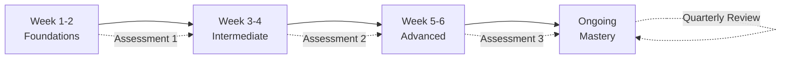
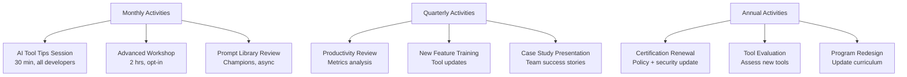
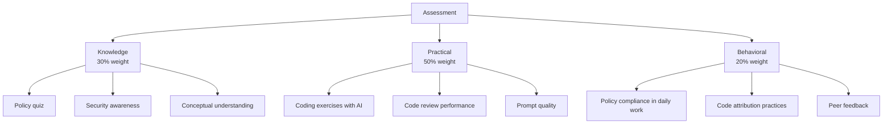
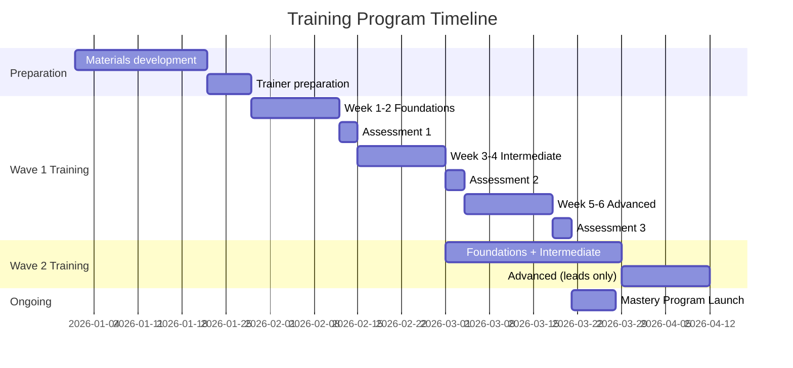

# Enterprise AI Coding Training Program

> A structured 6-week curriculum for onboarding development teams to AI coding tools, plus an ongoing mastery program.

---

## Table of Contents

1. [Program Overview](#program-overview)
2. [Week 1-2: Foundations](#week-1-2-foundations)
3. [Week 3-4: Intermediate](#week-3-4-intermediate)
4. [Week 5-6: Advanced](#week-5-6-advanced)
5. [Ongoing: Mastery](#ongoing-mastery-program)
6. [Assessment Criteria](#assessment-criteria)
7. [Program Management](#program-management)

---

## Program Overview

### Why Training Matters

Training is the single largest determinant of whether AI coding tool adoption produces real business value or becomes expensive shelfware.

| Finding | Source |
|---------|--------|
| Companies with 80-100% trained adoption see **>110% productivity gains** | [McKinsey](https://www.mckinsey.com/capabilities/tech-and-ai/our-insights/unleashing-developer-productivity-with-generative-ai) |
| Junior developers without training may be **7-10% slower** with AI tools | [McKinsey](https://www.mckinsey.com/capabilities/tech-and-ai/our-insights/unleashing-developer-productivity-with-generative-ai) |
| Only **30% of developers trust** AI-generated output | [McKinsey](https://www.mckinsey.com/capabilities/tech-and-ai/our-insights/unleashing-developer-productivity-with-generative-ai) |
| Accenture is training **~30,000 professionals** on AI tools | [Accenture](https://newsroom.accenture.com/news/2025/accenture-and-anthropic-launch-multi-year-partnership-to-drive-enterprise-ai-innovation-and-value-across-industries) |
| Untrained teams realize **2-3x fewer gains** than trained teams | Industry consensus |

### Program Structure

### Audience and Prerequisites

| Role | Required Weeks | Notes |
|------|---------------|-------|
| All developers | Weeks 1-2 (Foundations) | Mandatory for every developer using AI tools |
| Active AI tool users | Weeks 1-4 (Foundations + Intermediate) | Developers who will use tools daily |
| Tech leads / seniors | Weeks 1-6 (Full program) | Leads who will guide teams and review AI code |
| AI Champions | Weeks 1-6 + Mastery | Designated peer support resources |
| Engineering managers | Weeks 1-2 + Measurement module | Need policy and metrics understanding |
| Security engineers | Weeks 1-2 + Security deep-dive | Focus on security review practices |

**Prerequisites**: Working development environment, basic proficiency in at least one programming language, access to the approved AI coding tool(s).

---

## Week 1-2: Foundations

### Learning Objectives

By the end of Week 2, participants will be able to:
- Explain how AI coding tools work (at a conceptual level)
- Use basic code completion and generation features
- Follow the organization's AI coding policies
- Identify code that should NOT be sent to AI tools
- Perform basic security review of AI-generated code

### Week 1: Understanding AI Coding Tools

#### Day 1-2: How AI Coding Tools Work
- **Concepts**: Large language models, context windows, tokenization, probability-based generation
- **Key insight**: AI tools predict the most likely next tokens -- they do not "understand" code
- **Implications**: AI can generate plausible-looking code that is subtly wrong, insecure, or inefficient
- **Hands-on**: Set up the approved AI tool in your IDE; generate your first suggestions

#### Day 3: Company Policy and Security
- **Policies**: Acceptable use policy walkthrough
- **Data classification**: What can and cannot be sent to AI tools
- **Security**: Why 48% of AI-generated code contains vulnerabilities ([Augment Code](https://www.augmentcode.com/guides/ai-code-vulnerability-audit-fix-the-45-security-flaws-fast))
- **Hands-on**: Identify sensitive code areas in your project; practice classifying code for AI tool eligibility

#### Day 4-5: Basic Usage Patterns
- **Code completion**: Tab-complete with AI suggestions
- **Inline generation**: Writing code from comments/docstrings
- **Chat interface**: Asking questions about code
- **Hands-on**: Complete 5 coding exercises using AI assistance

### Week 2: Productive Basics

#### Day 6-7: Effective Prompting (Basics)
- **Clarity**: Specific, unambiguous instructions produce better output
- **Context**: Providing relevant context improves suggestions
- **Iteration**: First suggestions are rarely final; iterate
- **Anti-patterns**: Vague prompts, overly complex requests, missing constraints
- **Hands-on**: Prompt comparison exercise -- same task with good vs. bad prompts

#### Day 8: Code Review for AI Output
- **Why review matters**: AI code looks correct but may contain logic errors, security holes, or inefficiencies
- **What to look for**: Off-by-one errors, hardcoded values, missing edge cases, security vulnerabilities, license issues
- **Review checklist**: Standardized review checklist for AI-generated code
- **Hands-on**: Review 3 AI-generated code samples; identify issues

#### Day 9-10: Integration into Daily Workflow
- **When to use AI**: Boilerplate, tests, documentation, refactoring, exploration
- **When NOT to use AI**: Complex algorithms, security-critical code, regulated modules (without extra review)
- **Time management**: AI saves ~3.6 hours/week on average, but only if used for the right tasks
- **Hands-on**: Complete a realistic development task using AI; track time with and without

### Week 1-2 Assessment

| Criteria | Method | Passing Score |
|----------|--------|---------------|
| Policy knowledge | Multiple-choice quiz | 90% |
| Basic tool usage | Observed coding exercise | Completes 3/5 tasks with AI |
| Security awareness | Identify vulnerabilities in AI code samples | 80% |
| Data classification | Classify 10 code scenarios | 90% |

---

## Week 3-4: Intermediate

### Learning Objectives

By the end of Week 4, participants will be able to:
- Write effective multi-step prompts for complex tasks
- Integrate AI tools into their complete development workflow
- Generate and validate tests using AI
- Refactor code with AI assistance
- Measure their own productivity improvement

### Week 3: Prompt Engineering

#### Day 11-12: Advanced Prompting Techniques
- **Chain-of-thought**: Break complex tasks into steps
- **Few-shot examples**: Provide examples of desired output
- **Constraint specification**: Define what the code should NOT do
- **Role prompting**: Frame the AI as a specific type of expert
- **Hands-on**: Refactor a legacy module using structured prompts

#### Day 13: Context Management
- **Context windows**: Understanding token limits and what gets included
- **File context**: How to provide relevant files as context
- **Repository-level context**: Tools that understand your entire codebase
- **CLAUDE.md / project configuration**: How project-level instructions improve output
- **Hands-on**: Create a project-level configuration file for your team's repository

#### Day 14-15: Multi-Step Workflows
- **Plan-then-implement**: Have AI plan the approach before generating code
- **Iterative refinement**: Use feedback loops to improve output
- **Decomposition**: Break large tasks into AI-manageable subtasks
- **Hands-on**: Implement a feature end-to-end using multi-step AI assistance

### Week 4: Workflow Integration

#### Day 16-17: Test Generation
- **Unit tests**: Generate tests from existing code
- **Test-driven development with AI**: Write tests first, then generate implementation
- **Edge case generation**: Use AI to identify edge cases you missed
- **Test quality review**: Evaluate whether AI-generated tests are meaningful
- **Key stat**: Organizations report 30-40% increases in test coverage with AI
- **Hands-on**: Generate a complete test suite for an existing module

#### Day 18: Documentation Generation
- **Code documentation**: Generate docstrings, comments, and API docs
- **Architecture documentation**: Use AI to document existing systems
- **README generation**: Create project documentation from code
- **Hands-on**: Document an undocumented module using AI

#### Day 19-20: Debugging and Refactoring with AI
- **Bug diagnosis**: Describe symptoms, get diagnostic approaches
- **Code refactoring**: Improve code quality with AI suggestions
- **Performance optimization**: Use AI to identify bottlenecks
- **Legacy code modernization**: Migrate old patterns to modern ones
- **Hands-on**: Debug and refactor a provided legacy codebase

### Week 3-4 Assessment

| Criteria | Method | Passing Score |
|----------|--------|---------------|
| Prompt engineering | Write prompts for 5 complex scenarios | 4/5 produce good output |
| Workflow integration | Complete a feature with AI (observed) | Meets definition of done |
| Test generation | Generate and validate a test suite | >80% coverage, all tests meaningful |
| Productivity measurement | Self-report time savings on 3 tasks | Document with data |

---

## Week 5-6: Advanced

### Learning Objectives

By the end of Week 6, participants will be able to:
- Use AI agents for multi-file, multi-step tasks
- Create and maintain project-level AI configurations (CLAUDE.md)
- Lead code reviews of AI-generated code
- Design AI-augmented development workflows for their team
- Mentor others on effective AI tool usage

### Week 5: AI Agents and Automation

#### Day 21-22: AI Coding Agents
- **What agents are**: Autonomous AI that can execute multi-step tasks (edit files, run tests, iterate)
- **Agent capabilities**: Claude Code, GitHub Copilot Workspace, Cursor Composer
- **Safety controls**: Sandboxing, approval gates, scope limitations
- **Hands-on**: Use an AI agent to implement a multi-file feature with tests

#### Day 23: Project-Level Configuration
- **CLAUDE.md patterns**: Defining project rules, code style, architecture patterns, and workflow instructions
- **Best practices**: Keep it concise, test-driven, and focused on what AI cannot infer from code alone
- **Enterprise patterns**: Shared configurations across teams, security rules, compliance requirements
- **Hands-on**: Create a comprehensive CLAUDE.md for your team's primary repository

> CLAUDE.md is "the permanent brain for your project" -- mastering it is the highest-impact practice ([UX Planet](https://uxplanet.org/claude-md-best-practices-1ef4f861ce7c)).

#### Day 24-25: Custom Workflows and Automation
- **CI/CD integration**: AI-generated code in automated pipelines
- **Pre-commit hooks**: Automated checks for AI-generated code
- **Code generation pipelines**: Automated code generation for repetitive patterns
- **Hands-on**: Set up an AI-augmented CI/CD pipeline with quality gates

### Week 6: Leadership and Team Practices

#### Day 26-27: Leading AI Code Reviews
- **Review patterns**: What to focus on when reviewing AI-generated code
- **Common AI mistakes**: Patterns that AI tools frequently get wrong
- **Review efficiency**: How to review AI code without creating a 91% review bottleneck
- **Hands-on**: Lead a code review session for AI-generated PRs

#### Day 28: Team Workflow Design
- **Workflow assessment**: Evaluate where AI adds most value in your team's workflow
- **Process adaptation**: Modify sprint planning, code review, and testing processes for AI
- **Metrics**: Set up team-level productivity and quality metrics
- **Hands-on**: Design an AI-augmented workflow for your team; present to the cohort

#### Day 29-30: Mentoring and Knowledge Sharing
- **Champion role**: How to be an effective AI Champion for your team
- **Knowledge sharing**: Creating and maintaining a team prompt library
- **Troubleshooting**: Common issues and how to resolve them
- **Hands-on**: Create a team best-practices document; conduct a mock mentoring session

### Week 5-6 Assessment

| Criteria | Method | Passing Score |
|----------|--------|---------------|
| Agent proficiency | Complete a multi-file task with an agent | Feature works with tests |
| CLAUDE.md creation | Create project configuration; peer review | Passes peer review |
| Code review leadership | Lead a review of AI-generated PR | Identifies all planted issues |
| Workflow design | Present team workflow proposal | Approved by engineering manager |
| Mentoring readiness | Mock mentoring session | Rated effective by observer |

---

## Ongoing: Mastery Program

### Structure

The mastery program runs continuously after the initial 6-week curriculum.

### Monthly Activities

| Activity | Duration | Audience | Format |
|----------|----------|----------|--------|
| AI Tool Tips | 30 min | All developers | Lightning talks by Champions |
| Advanced Workshop | 2 hours | Opt-in | Deep-dive on specific technique |
| Prompt Library Update | Async | Champions | Curate and share best prompts |
| Metrics Review | 30 min | Team leads | Dashboard review, identify opportunities |

### Quarterly Activities

| Activity | Duration | Audience | Format |
|----------|----------|----------|--------|
| Productivity Review | 1 hour | Engineering leadership | Data-driven assessment of AI tool impact |
| New Feature Training | 1 hour | All developers | Training on new tool features and models |
| Case Study Presentation | 45 min | All developers | Teams share success stories and learnings |
| Policy and Security Update | 30 min | All developers | Regulatory changes, security updates |

### Annual Activities

| Activity | Duration | Audience | Format |
|----------|----------|----------|--------|
| Certification Renewal | 2 hours | All developers | Updated policy quiz + security assessment |
| Tool Evaluation | 2 weeks | Enablement team | Evaluate new tools, updated pricing, competitive landscape |
| Curriculum Redesign | 4 weeks | Enablement team | Update training materials for next year |
| ROI Report | Ongoing | Leadership | Annual cost-benefit analysis |

### Mastery Levels

| Level | Requirements | Recognition |
|-------|-------------|-------------|
| **Practitioner** | Complete Weeks 1-2; pass Assessment 1 | AI Tool Practitioner badge |
| **Professional** | Complete Weeks 1-4; pass Assessment 2; 3 months active usage | AI Tool Professional badge |
| **Expert** | Complete Weeks 1-6; pass Assessment 3; 6 months active usage | AI Tool Expert badge |
| **Champion** | Expert + mentoring certification; active in mastery program | AI Champion designation |
| **Master** | Champion + 12 months; contributed to prompt library; presented case study | AI Master designation |

---

## Assessment Criteria

### Assessment Framework

All assessments use a combination of knowledge checks and practical demonstrations.

### Detailed Rubrics

#### Assessment 1: Foundations (end of Week 2)

| Category | Criteria | Weight | Scoring |
|----------|---------|--------|---------|
| **Policy** | Correctly identify acceptable vs. prohibited uses | 15% | 90% correct = pass |
| **Security** | Identify vulnerabilities in AI code samples (5 samples) | 15% | 4/5 correct = pass |
| **Data Classification** | Classify code scenarios for AI eligibility (10 scenarios) | 10% | 9/10 correct = pass |
| **Basic Usage** | Complete 3 coding tasks using AI assistance | 40% | 3/5 completed satisfactorily |
| **Review** | Review 3 AI-generated code samples; identify planted issues | 20% | Identify >70% of issues |

#### Assessment 2: Intermediate (end of Week 4)

| Category | Criteria | Weight | Scoring |
|----------|---------|--------|---------|
| **Prompt Engineering** | Write effective prompts for 5 complex scenarios | 25% | 4/5 produce correct output |
| **Workflow** | Implement a feature end-to-end with AI assistance | 30% | Meets definition of done |
| **Testing** | Generate a meaningful test suite (>80% coverage) | 20% | Coverage + test quality review |
| **Productivity** | Document time savings with data on 3 tasks | 15% | Documented with evidence |
| **Context** | Create effective project-level configuration | 10% | Peer review positive |

#### Assessment 3: Advanced (end of Week 6)

| Category | Criteria | Weight | Scoring |
|----------|---------|--------|---------|
| **Agent Usage** | Complete multi-file feature with AI agent | 25% | Feature works with passing tests |
| **Code Review** | Lead review of AI-generated PR; find planted issues | 25% | Identify >90% of issues |
| **Workflow Design** | Design AI-augmented team workflow; present | 20% | Approved by engineering manager |
| **CLAUDE.md** | Create comprehensive project configuration | 15% | Passes peer review |
| **Mentoring** | Conduct mock mentoring session | 15% | Rated effective by observer |

### Passing Requirements

| Level | Required Score | Retake Policy |
|-------|---------------|---------------|
| Foundations | 80% overall, no category below 70% | Unlimited retakes; 1-week gap minimum |
| Intermediate | 80% overall, no category below 70% | 2 retakes; then 1-on-1 coaching required |
| Advanced | 85% overall, no category below 75% | 2 retakes; then 1-on-1 coaching required |

---

## Program Management

### Roles and Responsibilities

| Role | Count (per 500 devs) | Responsibilities |
|------|---------------------|------------------|
| Training Lead | 1 | Program design, materials, metrics |
| Trainers | 3-5 | Deliver sessions, assess participants |
| AI Champions | 25 (1:20 ratio) | Peer support, prompt library, mentoring |
| Engineering Managers | All | Allocate time, track completion, support adoption |
| Executive Sponsor | 1 | Budget, prioritization, visibility |

### Budget Estimate

| Item | Cost (500 developers) |
|------|----------------------|
| Training materials development | $25,000 - $50,000 |
| Trainer time (6 weeks) | $30,000 - $60,000 |
| Developer time (6 weeks, 4 hrs/week) | $300,000 - $450,000 |
| Champion program (ongoing, 5% time) | $125,000 - $187,500/year |
| External training resources | $10,000 - $25,000 |
| Assessment tooling | $5,000 - $15,000 |
| **Total Year 1** | **$495,000 - $787,500** |
| **Ongoing Annual** | **$200,000 - $350,000** |

### Success Metrics

| Metric | Target | Measurement |
|--------|--------|-------------|
| Training completion rate | >95% | LMS tracking |
| Assessment pass rate (first attempt) | >85% | Assessment scores |
| Developer satisfaction with training | >7/10 | Post-training survey |
| Tool adoption rate (30 days post-training) | >70% daily usage | Tool analytics |
| Tool adoption rate (90 days post-training) | >80% daily usage | Tool analytics |
| Productivity improvement (self-reported) | >20% | Developer survey |
| Productivity improvement (measured) | >15% | DORA/SPACE metrics |
| Policy compliance rate | >98% | Audit data |
| Security incident rate from AI code | <1 per quarter | Incident tracking |

### Timeline Integration

This training program maps to Phase 5 of the [Adoption Guide](adoption_guide.md):

---

## Sources

- [McKinsey -- Unleash Developer Productivity with Generative AI](https://www.mckinsey.com/capabilities/tech-and-ai/our-insights/unleashing-developer-productivity-with-generative-ai)
- [Accenture -- Accenture and Anthropic Partnership](https://newsroom.accenture.com/news/2025/accenture-and-anthropic-launch-multi-year-partnership-to-drive-enterprise-ai-innovation-and-value-across-industries)
- [Augment Code -- AI Code Vulnerability Audit](https://www.augmentcode.com/guides/ai-code-vulnerability-audit-fix-the-45-security-flaws-fast)
- [UX Planet -- CLAUDE.md Best Practices](https://uxplanet.org/claude-md-best-practices-1ef4f861ce7c)
- [Iternal -- AI Training for Employees Guide 2026](https://iternal.ai/ai-training-for-employees)
- [TechClass -- Integrating AI Training into Onboarding](https://www.techclass.com/resources/learning-and-development-articles/integrating-ai-training-into-your-onboarding-process-a-step-by-step-approach)
- [Lead with AI -- Enterprise AI Training](https://www.leadwithai.co/enterprise-ai-training)
- [Ajith VP -- AI Code Assistants Enterprise Adoption Guide](https://ajithp.com/2025/06/23/ai-code-assistants-enterprise-adoption-guide/)
- [Index.dev -- Developer Productivity Statistics with AI Tools 2026](https://www.index.dev/blog/developer-productivity-statistics-with-ai-tools)
- [Faros AI -- Enterprise AI Coding Assistant Adoption](https://www.faros.ai/blog/enterprise-ai-coding-assistant-adoption-scaling-guide)
