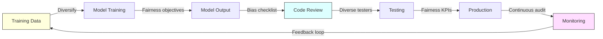

# Bias and Fairness in AI-Generated Code

> How bias enters AI-generated code, its real-world consequences, and strategies for detection and mitigation.

## How Bias Enters AI-Generated Code

### Training Data Bias

AI code generation models are trained on massive corpora of publicly available code -- primarily from GitHub, Stack Overflow, and documentation sites. This training data carries embedded biases:

1. **Demographic representation**: Open-source contributors skew male, Western, English-speaking, and from high-income countries. The code patterns, naming conventions, variable examples, and default assumptions reflect this population.
2. **Historical patterns**: Training data includes code written over decades, encoding outdated practices, deprecated security patterns, and cultural assumptions that were never challenged.
3. **Popularity bias**: Frequently-used patterns are over-represented. Niche but correct approaches (accessibility-first design, right-to-left language support, non-Western date formats) are underweight.
4. **Language bias**: Most training data is in English. Comments, variable names, error messages, and documentation defaults are English-centric, disadvantaging non-English-speaking developers and users.

### Bias in Code Output

AI-generated code can exhibit bias in several concrete ways:

| Bias Type | Example | Impact |
|-----------|---------|--------|
| **Name handling** | Validation that rejects names with accents, apostrophes, hyphens, or non-Latin characters | Excludes users with non-Western names |
| **Gender assumptions** | Default pronouns in templates (he/him), binary gender fields in forms | Excludes non-binary users |
| **Cultural defaults** | US-centric date formats (MM/DD/YYYY), US phone number validation, English-only error messages | Breaks for international users |
| **Accessibility gaps** | Missing ARIA labels, no keyboard navigation, color-dependent UI elements | Excludes users with disabilities |
| **Locale assumptions** | Hardcoded currency symbols ($), left-to-right text direction, ASCII-only string handling | Fails for non-US/UK users |
| **Algorithmic bias** | Sorting algorithms that deprioritize non-English content, search that favors Western naming patterns | Systematic disadvantage for non-Western users |

### The University of Melbourne Study (2025)

A 2025 study by the University of Melbourne explored AI bias in hiring tools and discovered that AI-powered systems struggled to accurately evaluate candidates with **speech disabilities or heavy non-native accents**. While focused on hiring, this finding illustrates how AI systems -- including code generation tools -- can perpetuate bias against people whose inputs deviate from the training data majority.

## Real-World Consequences

### In Application Code

When AI generates biased application code that ships to production:

- **Registration forms** that reject valid names containing special characters or non-Latin scripts.
- **Search algorithms** that rank English content above equally relevant non-English content.
- **Recommendation systems** that reflect majority-culture preferences as universal defaults.
- **Authentication flows** that assume Western phone number formats or postal code structures.
- **Healthcare applications** that use training data biased toward specific demographics, potentially leading to misdiagnosis or inappropriate treatment recommendations.

### In Development Tools

When AI coding tools themselves are biased:

- **Code suggestions** that assume US-centric libraries and frameworks.
- **Documentation generation** that defaults to English-only output.
- **Error messages** that use culturally specific idioms.
- **Example code** that uses stereotypical names (John, Jane) or culturally narrow scenarios.

### In Hiring and Assessment

- AI-powered coding assessments may penalize non-standard but valid approaches common in different programming traditions.
- Code review tools may flag culturally different coding styles as "incorrect."
- Resume screening tools may undervalue experience with non-Western tech stacks.

## Detection Strategies

### Code-Level Testing

**1. Input validation testing**
Test with diverse inputs:
- Names: O'Brien, Martinez-Garcia, Li Wei, Nguyễn, Bjork, Al-Rashid
- Addresses: International formats, non-Latin scripts, varying postal code lengths
- Phone numbers: International formats with country codes
- Dates: DD/MM/YYYY, YYYY-MM-DD, non-Gregorian calendars
- Currency: Multiple symbols, decimal conventions (comma vs period)

**2. Locale testing**
- Test with right-to-left languages (Arabic, Hebrew)
- Test with double-byte character sets (CJK)
- Test with combining characters and diacritical marks
- Test with non-Gregorian calendar systems

**3. Accessibility testing**
- Screen reader compatibility
- Keyboard-only navigation
- Color contrast compliance
- Motion sensitivity

**4. Algorithmic fairness testing**
- Test search and ranking with diverse content
- Test recommendations across demographic groups
- Test classification accuracy across subpopulations
- Use statistical parity, equal opportunity, and calibration metrics

### Process-Level Detection

**1. Diverse code review**
Ensure code reviewers represent different:
- Cultural backgrounds
- Language groups
- Ability levels
- Geographic regions
- Gender identities

**2. Bias checklists in code review**
Add explicit bias checks to the review process:

- [ ] Does this code handle non-English text correctly?
- [ ] Does this code assume a specific cultural context?
- [ ] Does this code work with assistive technologies?
- [ ] Does this code handle diverse name formats?
- [ ] Does this code assume binary gender?
- [ ] Does this code work with international address/phone/date formats?
- [ ] Does this code treat all user groups equitably in sorting, ranking, or recommendations?

**3. Automated bias scanning**
- Static analysis rules that flag hardcoded locale assumptions
- Test suites with internationalized test data
- Accessibility linting (axe, pa11y, lighthouse)

## Mitigation Strategies

### At the Prompt Level

When generating code with AI, explicitly include fairness requirements:

**Instead of:**
> "Generate a user registration form"

**Use:**
> "Generate a user registration form that supports international name formats (including accents, apostrophes, hyphens, and non-Latin characters), international phone numbers with country codes, does not require a binary gender selection, supports international address formats, and meets WCAG 2.2 AA accessibility standards"

Specific prompts produce less biased output because they override the model's majority-culture defaults.

### At the Review Level

1. **Treat all AI-generated code as potentially biased.** This is not cynicism; it is the natural consequence of training data composition.
2. **Apply the bias checklist** from the Detection Strategies section above.
3. **Test with diverse data** before approving AI-generated code.
4. **Require international test cases** as part of the definition of done.

### At the Organizational Level

1. **Diversify development teams.** Homogeneous teams are less likely to notice biases that do not affect them personally.
2. **Establish fairness KPIs.** The most successful bias-free AI systems in 2025 treat fairness as a measurable product feature with specific KPIs, dedicated resources, and clear success metrics (EY, 2025).
3. **Conduct regular bias audits.** Schedule periodic reviews of AI-generated code for bias patterns.
4. **Invest in inclusive training data.** Contribute diverse code examples to open-source projects that train AI models.
5. **Engage affected communities.** Include users from underrepresented groups in usability testing and feedback loops.

### At the Model Level

Current research identifies several technical approaches:

| Technique | Description | Effectiveness |
|-----------|-------------|---------------|
| **Dataset diversification** | Expanding training data to include more diverse code | Addresses root cause but limited by data availability |
| **Fairness-aware fine-tuning** | Training with explicit fairness objectives | Effective for known bias categories |
| **Post-deployment auditing** | Continuous monitoring of model outputs for bias | Catches emerging biases but is reactive |
| **Participatory design** | Involving diverse stakeholders in model development | Addresses unknown unknowns but is resource-intensive |
| **Debiasing filters** | Post-processing model output to remove identified biases | Quick to implement but may not catch subtle biases |

### The Integrated Framework

Frontiers in Big Data (2025) proposes an integrated framework coupling **statistical diagnostics with governance mechanisms** to enable bias mitigation across the entire AI lifecycle -- from data collection through deployment and monitoring. This is the current best practice: no single intervention is sufficient; bias mitigation requires layered approaches at every stage.

## Actionable Guidelines

### For Individual Developers

1. **Include diversity requirements in every AI prompt.** Explicitly specify international format support, accessibility, and inclusive design.
2. **Test with non-default data.** If your test data is all English names and US addresses, your testing is incomplete.
3. **Question defaults.** When AI generates code with hardcoded assumptions (en-US, USD, MM/DD/YYYY), replace them with configurable values.
4. **Learn about bias.** Understanding cognitive and algorithmic bias makes you a better reviewer of AI output.

### For Teams

1. **Add bias checks to code review checklists.** Make them explicit and required, not optional.
2. **Maintain diverse test datasets.** Create shared test fixtures with international names, addresses, and formats.
3. **Staff diverse review teams.** A reviewer who reads right-to-left will catch layout issues others miss.
4. **Track bias incidents.** When biased code reaches production, document it, fix it, and learn from it.

### For Organizations

1. **Treat fairness as a product requirement.** Not an afterthought -- a KPI with dedicated resources.
2. **Fund bias research.** Support academic and open-source efforts to improve AI fairness.
3. **Comply with regulations.** The EU AI Act and similar legislation will require bias documentation and mitigation.
4. **Publish transparency reports.** Share what you know about bias in your AI-generated code and what you are doing about it.

## Sources

- [Bias in AI: Examples, Causes & Mitigation Strategies 2025 - Kodexo Labs](https://kodexolabs.com/bias-in-ai/)
- [Building AI Fairness by Reducing Algorithmic Bias - CMU Tepper](https://tepperspectives.cmu.edu/all-articles/building-ai-fairness-by-reducing-algorithmic-bias/)
- [Algorithmic fairness: challenges to building an effective regulatory regime - Frontiers](https://www.frontiersin.org/journals/artificial-intelligence/articles/10.3389/frai.2025.1637134/full)
- [Bias in AI systems: integrating formal and socio-technical approaches - Frontiers in Big Data](https://www.frontiersin.org/journals/big-data/articles/10.3389/fdata.2025.1686452/full)
- [Addressing AI bias: a human-centric approach to fairness - EY](https://www.ey.com/en_us/insights/emerging-technologies/addressing-ai-bias-a-human-centric-approach-to-fairness)
- [Bias in AI: Examples and 6 Ways to Fix It in 2026 - AIMultiple](https://research.aimultiple.com/ai-bias/)
- [Artificial intelligence and algorithmic exclusion - Brookings](https://www.brookings.edu/articles/artificial-intelligence-and-algorithmic-exclusion/)

---

*Last updated: 2026-03-22*
