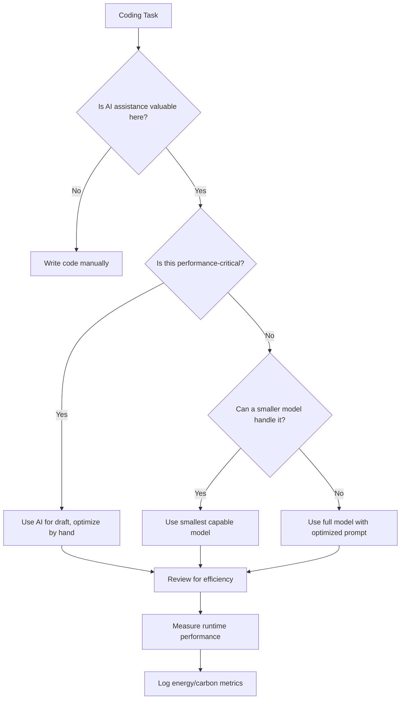

# Environmental Impact of AI Coding Tools

> The energy costs, carbon footprint, and sustainability strategies for AI-assisted software development.

## The Scale of the Problem

### Data Center Energy Consumption

By 2026, data center electricity consumption is expected to approach **1,050 terawatt-hours** -- enough to rank fifth globally between Japan and Russia if data centers were a country. Google alone expects to spend $75 billion on AI infrastructure in 2025.

### AI's Carbon Footprint

The AI boom released roughly as much CO2 as **New York City** in 2025. A Goldman Sachs Research analysis (August 2025) forecasts that approximately 60% of increasing electricity demands from data centers will be met by burning fossil fuels, increasing global carbon emissions by about **220 million tons**.

AI currently accounts for approximately **0.1% of global greenhouse gas emissions** -- equivalent to Sweden's entire yearly output. This figure is growing rapidly.

### AI-Generated Code Specifically

A **Nature Communications study (June 2025)** found that AI-generated code emits up to **19 times more CO2** than human-written code during the development process. This accounts for:

- The energy cost of model inference (generating the code)
- The iterative prompting process (multiple attempts to get correct output)
- The computational overhead of running larger, less efficient AI-generated code

A **2025 arXiv study** found that **87% of AI-generated code samples skipped energy-efficient design patterns entirely** -- AI tools optimize for correctness and speed of generation, not for runtime efficiency.

## Breaking Down the Costs

### Per-Query Energy Cost

| Activity | Approximate Energy | CO2 Equivalent |
|----------|-------------------|----------------|
| Google search | 0.3 Wh | 0.2g CO2 |
| ChatGPT query (GPT-4 class) | 3-10 Wh | 2-7g CO2 |
| AI code generation (complex prompt) | 10-50 Wh | 7-35g CO2 |
| AI code generation with iterative refinement | 50-200 Wh | 35-140g CO2 |

*Note: These are estimates based on published research and vary significantly by model, provider, and energy grid.*

### The Hidden Costs

Beyond direct inference:

1. **Training costs**: Training a large language model can emit hundreds of tons of CO2. This is a one-time cost amortized across all users, but it is substantial.
2. **Retraining and fine-tuning**: Models are regularly updated, each cycle consuming significant energy.
3. **Infrastructure**: Manufacturing GPUs, building data centers, and cooling systems all have embodied carbon costs.
4. **Network transfer**: Sending prompts and receiving responses consumes network energy.
5. **Redundant computation**: Multiple developers asking similar questions generate redundant inference costs.

### Positive Developments

Not all the data points in one direction:

- **Google (2025)**: Reports a **33x reduction in energy** and **44x reduction in carbon** for the median prompt compared with 2024, through model optimization and infrastructure improvements.
- **Model efficiency gains**: Smaller, more efficient models (distillation, quantization) are narrowing the gap.
- **Renewable energy procurement**: Major cloud providers are investing heavily in renewable energy for data centers.

## The Runtime Impact

AI-generated code does not just consume energy during generation -- it may also run less efficiently:

### Why AI Code Tends to Be Less Efficient

1. **Over-engineering**: AI often generates more code than necessary, with unnecessary abstractions.
2. **Inefficient algorithms**: AI may choose familiar patterns over optimal ones for a given context.
3. **Missing optimizations**: Database query optimization, caching strategies, and lazy loading are frequently omitted.
4. **Resource leaks**: AI-generated code may not properly manage connections, file handles, or memory.
5. **Redundant operations**: Unnecessary data transformations, repeated computations, and excessive logging.

### Compounding Effect

If AI-generated code is both more expensive to create AND less efficient to run, the environmental cost is compounded across the entire lifecycle of the software.

## Sustainable AI Coding Practices

### Strategy 1: Reduce AI Usage Where It Is Not Needed

Not every line of code benefits from AI assistance. Reserve AI for tasks where it provides genuine value:

- Use AI for **exploration and prototyping**, then optimize by hand.
- Write **performance-critical code** without AI assistance.
- Use AI for **initial drafts**, then refactor for efficiency.

### Strategy 2: Optimize Prompts

Fewer iterations means less energy consumed:

- Write **specific, detailed prompts** that produce correct output on the first attempt.
- Include **constraints and requirements** upfront rather than iterating.
- Use **system prompts and templates** to reduce per-query overhead.

### Strategy 3: Choose Efficient Models

| Approach | Energy Reduction |
|----------|-----------------|
| Use smaller models for simple tasks | 50-90% reduction |
| Model quantization | Up to 80% reduction |
| Model pruning | Up to 80% reduction |
| Local models for routine tasks | Eliminates network transfer costs |
| Caching AI inference results | Eliminates redundant computation |

### Strategy 4: Write Efficient Code (Regardless of Source)

MCML's 2025 research showed that developers using **Sustainable Green Coding practices cut energy use by up to 63%** without losing performance:

- **Reuse memory** instead of allocating new objects.
- **Cache frequently accessed data** to reduce computation and I/O.
- **Avoid unnecessary model calls** -- batch queries where possible.
- **Pick smaller models** when a lighter model can handle the task.
- **Optimize algorithms** -- O(n log n) instead of O(n^2) matters at scale.
- **Minimize data transfer** -- compress payloads, use efficient serialization.
- **Implement lazy loading** -- do not compute or fetch data until it is needed.

### Strategy 5: Time-Shift Computation

- **Schedule non-urgent AI tasks during off-peak hours** when the grid has more renewable energy.
- **Use carbon-aware scheduling** -- tools like the Green Software Foundation's Carbon Aware SDK can route computation to regions with cleaner energy.
- **Batch queries** instead of making many small requests.

### Strategy 6: Measure and Report

You cannot optimize what you do not measure:

- **Track AI tool usage** per developer, per project.
- **Estimate carbon footprint** using tools like CodeCarbon, Green Algorithms, or ML CO2 Impact.
- **Set reduction targets** -- treat AI energy use as a line item in sustainability reporting.
- **Compare AI-generated vs human-written code** for runtime efficiency in your specific context.

## Regulatory Landscape

### Current and Upcoming Requirements

| Regulation | Effective Date | Requirement |
|-----------|---------------|-------------|
| EU AI Act | August 2026 | Companies must report energy use for large AI models |
| California Digital Sustainability Act | TBD | Data centers over 5MW must publish carbon footprints |
| Corporate sustainability reporting (CSRD) | Already active in EU | AI energy use falls under Scope 2/3 emissions reporting |

### Industry Adoption

In 2025, **73% of large enterprises** said sustainability reporting was their main driver for adopting green coding practices, with financial services leading at 38% adoption.

## A Framework for Decision-Making

When deciding whether to use AI for a coding task, consider:

## Actionable Guidelines

### For Individual Developers

1. **Write specific prompts.** Reduce iteration count to minimize inference energy.
2. **Use the smallest model that works.** GPT-4 class models for complex tasks; lighter models for autocomplete.
3. **Review AI output for efficiency.** Check for unnecessary computation, memory allocation, and data transfer.
4. **Run AI tools locally when possible.** Local inference eliminates network costs and can use your own renewable energy.
5. **Batch your AI queries.** Accumulate questions rather than making one-off requests.

### For Teams

1. **Set team-level AI energy budgets.** Track and limit AI tool usage per sprint or project.
2. **Include efficiency in code review.** AI-generated code should meet the same performance standards as human code.
3. **Use shared prompt libraries.** Reduce redundant prompting across the team.
4. **Benchmark AI-generated code.** Compare runtime performance against hand-written alternatives.

### For Organizations

1. **Include AI in carbon reporting.** Treat AI tool energy consumption as a Scope 3 emission.
2. **Choose cloud providers with renewable energy commitments.** AWS, Google Cloud, and Azure all publish sustainability data.
3. **Invest in model efficiency research.** Smaller, faster models benefit everyone.
4. **Prepare for regulation.** The EU AI Act and similar legislation will require energy reporting.
5. **Set organizational sustainability targets** that account for AI usage growth.

## Sources

- [We did the math on AI's energy footprint - MIT Technology Review](https://www.technologyreview.com/2025/05/20/1116327/ai-energy-usage-climate-footprint-big-tech/)
- [Explained: Generative AI's environmental impact - MIT News](https://news.mit.edu/2025/explained-generative-ai-environmental-impact-0117)
- [Responding to the climate impact of generative AI - MIT News](https://news.mit.edu/2025/responding-to-generative-ai-climate-impact-0930)
- [The Carbon Footprint of AI - Climate Impact Partners](https://www.climateimpact.com/news-insights/insights/carbon-footprint-of-ai/)
- [Environmental impact of artificial intelligence - Wikipedia](https://en.wikipedia.org/wiki/Environmental_impact_of_artificial_intelligence)
- [The Real Environmental Footprint of Generative AI - OLC](https://onlinelearningconsortium.org/olc-insights/2025/12/the-real-environmental-footprint-of-generative-ai/)
- [Environmental Impact of Generative AI: Stats & Facts for 2026](https://thesustainableagency.com/blog/environmental-impact-of-generative-ai/)
- [Sustainability of AI Coding - BRICS Economics](https://brics-econ.org/sustainability-of-ai-coding-how-energy-cost-and-efficiency-trade-offs-are-reshaping-development)
- [Sustainable Coding: How to Reduce Energy Waste - DevTech Insights](https://devtechinsights.com/green-coding-guide/)
- [Green Software Engineering: Sustainable Coding Practices 2025](https://amquesteducation.com/blog/green-software-engineering/)
- [Green Coding: How to Write Energy-Efficient Software in 2025](https://www.besttechie.com/green-coding-how-to-write-energy-efficient-software-in-2025/)
- [The carbon emissions of writing and illustrating are lower for AI than for humans - Nature](https://www.nature.com/articles/s41598-024-54271-x)

---

*Last updated: 2026-03-22*
