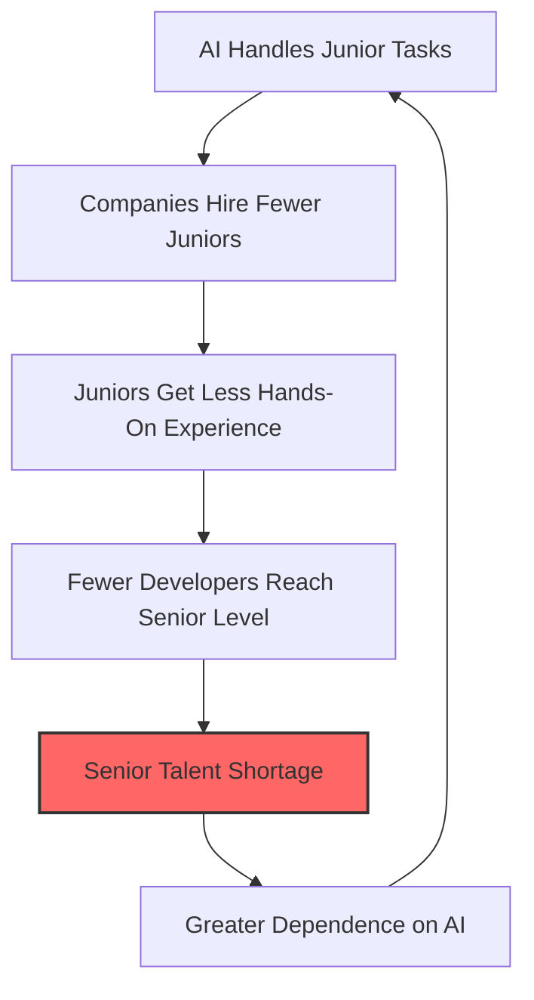

# Impact of AI Coding Tools on Developers

> Research-grounded analysis of how AI coding assistants are reshaping developer careers, skills, and the job market.

## The Data: What Research Shows

### Employment Impact

**Stanford Digital Economy Lab (2025)**: Employment for software developers aged 22-25 has declined nearly 20% from its peak in late 2022 through July 2025.

**Harvard Business School (2025)**: A study examining 285,000 U.S. firms and 62 million workers (2015-2025) found that when companies adopt generative AI, junior employment drops by 9-10% within six quarters, while senior employment barely changes.

**LeadDev Survey (2025)**: 54% of engineering leaders plan to hire fewer junior developers, citing AI copilots that enable senior engineers to handle more work.

**Handshake (2025)**: Tech-specific internship postings have declined 30% since 2023. Internships across all industries decreased 11% year-over-year.

### Productivity Impact

**GitHub/Microsoft (2023)**: An early randomized controlled trial found developers using GitHub Copilot completed tasks 55% faster. This study is frequently cited but has important limitations: it measured a narrow task type (HTTP server implementation) with relatively junior developers.

**METR Randomized Controlled Trial (2025)**: A more rigorous study of 16 experienced open-source developers completing 246 tasks in mature projects where they had an average of 5 years of prior experience found that AI tooling actually **slowed developers down by 19%**. This contradicts earlier studies and suggests that for experienced developers working in complex, familiar codebases, current AI tools may not provide net productivity gains.

**Key insight**: Productivity gains from AI tools appear to be task-dependent and experience-dependent. They help most with unfamiliar tasks and less-experienced developers, but may slow down experts working in their domain.

### Skill Development

**IGI Global (2025)**: Research on "The Deskilling of Software Development" documents how AI chatbots challenge foundational programming skills, as tasks that once provided learning opportunities (debugging, writing boilerplate, reading documentation) are increasingly handled by AI.

**Microsoft Report (2025)**: Students who used AI tools showed a 10% improvement on exams over peers who did not. However, the study did not measure long-term skill retention or ability to work without AI tools.

## The Junior Developer Crisis

### The Problem

Junior developers face a compounding challenge:

1. **Fewer entry-level positions**: Companies hire fewer juniors because AI amplifies senior developer productivity.
2. **Fewer learning opportunities**: Tasks traditionally assigned to juniors (bug fixes, small features, test writing) are now handled by AI.
3. **Higher expectations**: New hires are expected to be productive faster, with AI proficiency as a baseline skill.
4. **Reduced mentorship**: With fewer juniors on teams, mentorship structures atrophy.

### The Paradox

The industry needs experienced developers to review, guide, and correct AI output. But the pipeline that produces experienced developers -- years of hands-on junior work -- is being compressed or eliminated. This creates a long-term supply problem that may not manifest for 3-5 years.

### Contrasting Industry Positions

The industry is not monolithic on this issue:

- **Google (2025)**: Plans to hire more engineers, arguing AI-powered productivity means the company can pursue more projects.
- **Salesforce (2025)**: Announced it would stop hiring new software engineers, citing AI-driven productivity gains.
- **International Labour Organization (2025)**: Published research specifically examining how junior programmers will be affected, emphasizing the need for policy interventions.

## Deskilling: The Evidence

### What Deskilling Looks Like

Deskilling occurs when developers lose (or never develop) fundamental skills because AI tools abstract them away:

| Skill at Risk | How AI Abstracts It | Why It Still Matters |
|---------------|---------------------|---------------------|
| Debugging | AI suggests fixes without requiring root cause analysis | Understanding failure modes is essential for system design |
| Reading documentation | AI summarizes APIs and generates usage examples | Documentation literacy is needed when AI is wrong or unavailable |
| Algorithm design | AI generates implementations from descriptions | Understanding algorithmic complexity is critical for scaling |
| Code review | AI auto-reviews and auto-fixes | Human judgment catches architectural and business logic issues AI misses |
| Error handling | AI generates try/catch blocks | Understanding failure modes requires domain knowledge |
| Memory management | AI generates resource handling code | Performance debugging requires understanding system resources |

### Counterarguments

Some researchers and practitioners argue that:

- **Skill transformation, not loss**: Developers are developing new skills (prompt engineering, AI output evaluation, system integration) that may be equally valuable.
- **Historical precedent**: Every generation of tooling (IDEs, frameworks, cloud platforms) was predicted to deskill developers. Instead, it raised the abstraction level and let developers tackle harder problems.
- **Augmentation over replacement**: The most effective use of AI tools is as a pair programmer that handles routine work while the human focuses on architecture, design, and business logic.

### The Nuanced Reality

The METR 2025 study is particularly instructive: experienced developers were actually slowed down by AI in their areas of expertise. This suggests that AI tools are not universally superior -- they are contextually useful. The risk of deskilling is real for developers who use AI as a crutch rather than a tool, but the risk can be mitigated with intentional practice and learning strategies.

## Career Evolution

### Roles That Are Growing

- **AI-augmented senior engineers**: Developers who can effectively leverage AI while maintaining deep technical expertise.
- **AI code reviewers**: Specialists who evaluate AI-generated code for quality, security, and correctness.
- **Prompt engineers / AI interaction designers**: Those who optimize how development teams interact with AI tools.
- **AI ethics and governance specialists**: Professionals who ensure AI tool usage aligns with organizational policies.

### Roles Under Pressure

- **Pure code-writing roles**: Positions defined solely by code output volume.
- **Boilerplate-heavy roles**: Roles focused on repetitive, pattern-based coding.
- **Manual testing roles**: Where AI can generate and execute test suites faster.

### Skills That Become More Valuable

1. **System design and architecture**: AI can write functions; humans design systems.
2. **Domain expertise**: Understanding the business problem AI is being applied to.
3. **Communication and collaboration**: Explaining technical decisions to stakeholders.
4. **Critical evaluation**: Assessing whether AI output is correct, secure, and appropriate.
5. **Ethical reasoning**: Making judgment calls AI cannot.

## Impact on Education

### Curriculum Changes

- **70% of CS teachers** are already teaching AI in their courses (Code.org, 2025).
- The Computer Science Teachers Association released AI learning priorities emphasizing understanding how AI works, evaluating AI systems critically, and creating AI technologies responsibly.
- UC San Diego and other institutions are transforming CS curricula to integrate AI tools while preserving foundational skill development.

### The Pedagogical Challenge

Students who learn to code with AI from the start may develop a different (not necessarily worse) mental model of programming. The risk is that they become effective AI operators but struggle when AI tools are unavailable or produce incorrect results.

Research from a 2025 study on 10-17 year olds showed that a **hybrid approach** -- students collaborating with AI tools while also learning fundamentals independently -- produced the best outcomes.

## Actionable Guidelines

### For Individual Developers

1. **Practice without AI regularly.** Solve problems on paper or in a plain editor monthly. Maintain your ability to code without assistance.
2. **Understand before accepting.** Read and trace AI-generated code. If you cannot explain it, do not use it.
3. **Invest in non-automatable skills.** System design, architecture, domain expertise, communication.
4. **Track your AI dependency.** If you cannot complete your daily work without AI tools, that is a warning sign.
5. **Mentor actively.** Share your knowledge with junior developers. The pipeline depends on it.

### For Engineering Managers

1. **Protect junior learning paths.** Reserve meaningful tasks for junior developers even when AI could handle them faster.
2. **Measure outcomes, not output.** AI inflates code output metrics. Focus on system quality, incident rates, and knowledge growth.
3. **Invest in mentorship.** Pair junior developers with seniors on complex problems, not just AI tools.
4. **Create AI-free learning spaces.** Coding challenges, architecture reviews, and debugging sessions where AI tools are set aside.
5. **Hire for potential.** Junior developers who understand fundamentals and can learn will outperform those who only know how to prompt AI.

### For Organizations

1. **Do not eliminate junior roles.** The short-term savings create long-term talent pipeline problems.
2. **Fund continuous learning.** Provide time and resources for developers to maintain and grow skills beyond AI tool usage.
3. **Develop AI governance policies.** See [Responsible AI Coding](responsible_ai_coding.md) for a policy template.
4. **Monitor workforce health metrics.** Track skill development, not just productivity.
5. **Engage with educational institutions.** Support curricula that balance AI fluency with foundational skills.

## Sources

- [AI vs Gen Z: How AI has changed the career pathway for junior developers - Stack Overflow](https://stackoverflow.blog/2025/12/26/ai-vs-gen-z/)
- [Demand for junior developers softens as AI takes over - CIO](https://www.cio.com/article/4062024/demand-for-junior-developers-softens-as-ai-takes-over.html)
- [Is AI eradicating the junior developer? - CIO](https://www.cio.com/article/4120168/is-ai-eradicating-the-junior-developer.html)
- [New evidence strongly suggests AI is killing jobs for young programmers - Understanding AI](https://www.understandingai.org/p/new-evidence-strongly-suggest-ai)
- [The future of work: How will junior programmers be affected? - ILO](https://www.ilo.org/resource/article/future-work-how-will-junior-programmers-be-affected)
- [Measuring the Impact of Early-2025 AI on Experienced Open-Source Developer Productivity - METR](https://metr.org/blog/2025-07-10-early-2025-ai-experienced-os-dev-study/)
- [The Impact of AI on Developer Productivity: Evidence from GitHub Copilot - Microsoft Research](https://www.microsoft.com/en-us/research/publication/the-impact-of-ai-on-developer-productivity-evidence-from-github-copilot/)
- [The Deskilling of Software Development - IGI Global](https://www.igi-global.com/chapter/the-deskilling-of-software-development-and-the-impact-of-ai-chatbots-on-programmers-skills-and-roles/383159)
- [AI-Generated Code Statistics 2026 - NetCorp](https://www.netcorpsoftwaredevelopment.com/blog/ai-generated-code-statistics)
- [Junior Developers in the Age of AI - CodeConductor](https://codeconductor.ai/blog/future-of-junior-developers-ai/)
- [The Impact of AI on Computer Science Education - ACM](https://cacm.acm.org/news/the-impact-of-ai-on-computer-science-education/)
- [2025 State of AI + CS Education Report - Code.org](https://advocacy.code.org/stateofcs/)

---

*Last updated: 2026-03-22*
