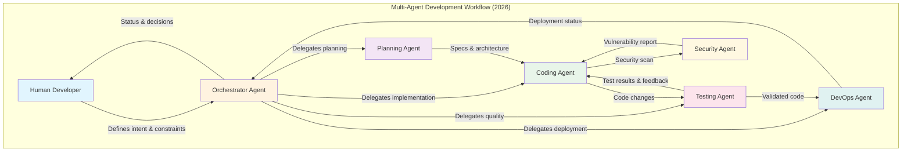
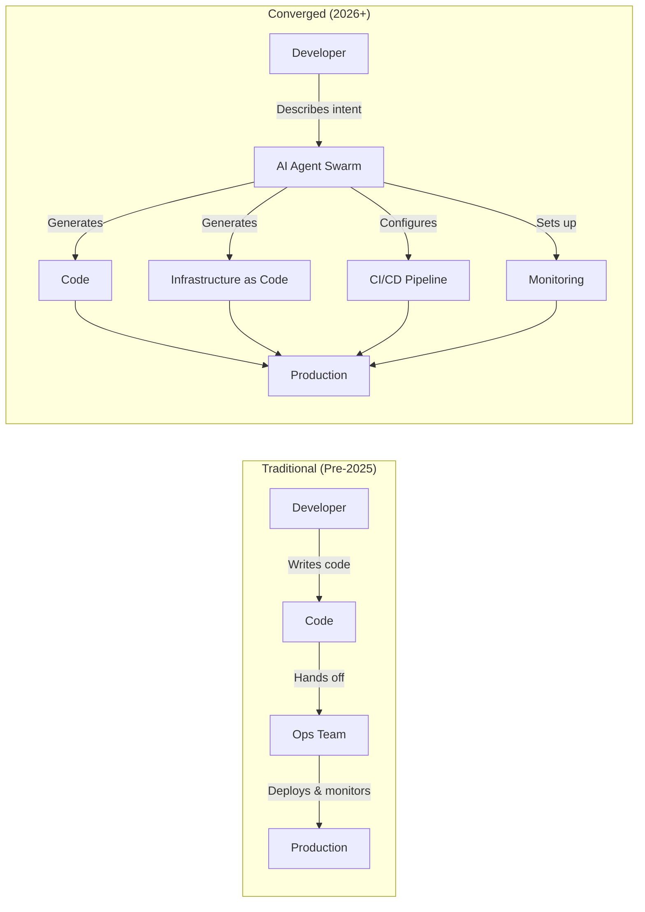
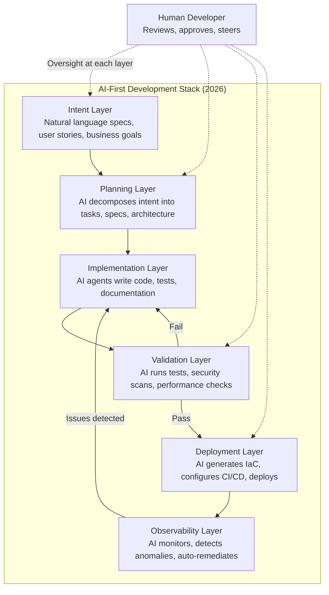
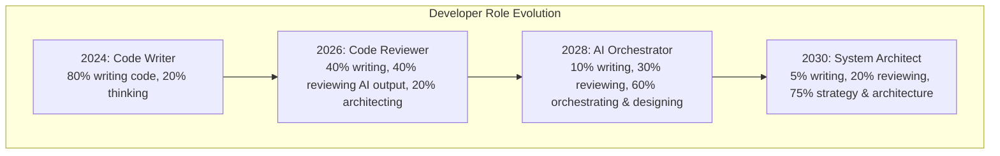

# The Future of Vibe Coding - March 2026

> Forward-looking analysis of where AI-assisted development is heading, the convergence of coding and operations, and what software engineering will look like by 2030.

---

## What is Vibe Coding?

Vibe coding is an AI-assisted software development paradigm where developers describe software features using natural language prompts, and AI converts those descriptions into executable code. Coined in early 2025, the term captures the shift from writing every line by hand to orchestrating AI agents that handle implementation details.

**Key statistics (March 2026):**
- 87% of Fortune 500 companies use at least one vibe coding tool
- 74% of developers report productivity increases
- Senior developers (10+ years) report 81% productivity gains
- AI used for: code completion (87%), debugging (72%), documentation (68%), test generation (54%)

---

## The Evolution Timeline

```mermaid
timeline
    title Evolution of AI-Assisted Development
    section 2022-2023 : Autocomplete Era
        Copilot launches : Single-line suggestions
        : Pattern-based completions
        : Developer stays in full control
    section 2024 : Chat Era
        ChatGPT coding : Cursor launches
        : Multi-line generation
        : Copy-paste from chat to editor
    section 2025 : Agentic Era
        Claude Code ships : Devin launches
        : Multi-file autonomous edits
        : Agents run tests and commit
        : Vibe coding goes mainstream
    section 2026 : Orchestration Era
        Multi-agent systems : Agent-first IDEs (Antigravity)
        : 85% developer adoption
        : Vibe shipping (code to deployed product)
        : $12.8B market
    section 2027-2028 : Autonomy Era
        AI handles multi-week projects : 90% use AI assistants
        : Spec-to-deployment pipelines
        : Human role shifts to review
    section 2029-2030 : Platform Era
        AI-native development platforms : Natural language as primary interface
        : Continuous autonomous improvement
        : Human as architect and auditor
```

---

## Where Vibe Coding is Heading

### From Vibe Coding to Vibe Shipping

The biggest shift of 2026: the industry moved from "generating code" to "shipping products." Founders and developers no longer want code files -- they want live, deployed applications. This evolution manifests as:

1. **Prompt to prototype** (2024): Generate code snippets from descriptions
2. **Prompt to application** (2025): Generate full applications with AI agents
3. **Prompt to deployed product** (2026): Generate, test, deploy, and monitor -- all AI-assisted
4. **Intent to maintained system** (2027+): Describe business goals; AI maintains the entire lifecycle

### The Orchestrator Role

The developer role is transforming from "person who writes code" to "person who orchestrates AI agents." This means:

- **Less time** writing boilerplate, debugging syntax, implementing patterns
- **More time** on architecture, system design, business logic, and quality review
- **New skills** needed: prompt engineering, agent orchestration, AI output evaluation, system thinking

---

## Multi-Agent Orchestration Trends

### The Multi-Agent Explosion

Gartner reported a **1,445% surge** in multi-agent system inquiries from Q1 2024 to Q2 2025. In February 2026, every major AI coding platform shipped multi-agent capabilities within the same two-week window.



### Key Frameworks

| Framework | Strengths | Use Case |
|---|---|---|
| **LangGraph** | State machines for agent workflows | Complex multi-step reasoning |
| **CrewAI** | Role-based agent teams | Collaborative task execution |
| **Langflow** | Low-code agent building | Rapid prototyping of agent pipelines |
| **Open SWE** | Enterprise self-hosted agents | Internal dev tooling |

### Results

- Multi-agent systems deliver **3x faster task completion** and **60% better accuracy** vs single agents
- Companies like Rakuten, TELUS, and Zapier run multi-agent coding workflows in production
- The trend moves from "human-in-the-loop" to "human-on-the-loop" -- humans supervise rather than approve every decision

---

## The Convergence of Coding and Ops

### AI is Collapsing the Dev/Ops Boundary



**What this convergence looks like in practice:**

1. **Natural language to IaC**: LLMs generate valid Terraform HCL, Helm charts, and K8s manifests from plain English descriptions, with policy enforcement at generation time
2. **AI remediation agents**: Automated incident response with rollback capability and approval workflows
3. **Predictive scaling**: AI agents that tune Kubernetes clusters and Terraform resources based on predicted load
4. **Security as code**: AI-generated security policies, vulnerability scanning, and compliance checks integrated at generation time

### Key Numbers

- ~90% of cloud users now employ Infrastructure as Code practices
- Terraform holds 32.8% of the IaC market
- AI-powered observability platforms (Datadog, Dynatrace, Grafana) are adding natural language interfaces
- AI test analyzers learn from past CI/CD failures to predict and prevent future ones

---

## AI-First Development Workflows

### The Emerging Stack



### What Developers Do Differently

**2024 workflow:**
1. Read ticket
2. Think about implementation
3. Write code manually
4. Write tests manually
5. Debug and iterate
6. Submit PR
7. Wait for review

**2026 workflow:**
1. Read ticket
2. Describe intent to AI agent
3. Review AI's plan and architecture proposal
4. Let AI implement across multiple files
5. Review generated code and tests
6. Steer corrections via natural language
7. AI submits PR with documentation

**2028+ projected workflow:**
1. Business stakeholder describes desired outcome
2. AI system creates full spec, gets human approval
3. AI implements, tests, deploys to staging
4. Human reviews deployed behavior (not code)
5. AI deploys to production and monitors
6. AI handles routine maintenance and scaling

---

## What Development Looks Like in 2027-2030

### 2027: The Autonomy Threshold

- **50% of software engineering orgs** use AI intelligence platforms to measure developer productivity (Gartner)
- **55% of teams** actively build LLM-based features
- **70% of platform teams** include GenAI capabilities in internal developer platforms
- AI handles **multi-week project** complexity autonomously
- Spec-driven development (Kiro-style) becomes standard for enterprise

### 2028: The Agent Workforce

- **90% of enterprise developers** use AI code assistants (up from 14% in 2024)
- **33% of enterprise applications** include agentic capabilities
- AI models achieve **beyond-human reasoning** in specific domains
- AI can autonomously complete projects lasting weeks
- The distinction between "developer" and "AI agent" becomes organizational rather than technical

### 2029-2030: The Platform Era

- **60%+ of enterprise applications** include agentic capabilities
- Natural language becomes the primary programming interface for most business logic
- AI systems maintain and evolve codebases autonomously
- Human engineers focus on:
  - System architecture and design principles
  - Ethical and safety guardrails
  - Business strategy alignment
  - Novel problem domains that AI hasn't seen
- Infrastructure bottlenecks (power, compute) may emerge around 2030



---

## Risks and Challenges

### Technical Risks

| Risk | Description | Mitigation |
|---|---|---|
| **Code quality degradation** | AI-generated code may introduce subtle bugs at scale | Mandatory human review for critical paths; AI-powered testing |
| **Security vulnerabilities** | AI may generate insecure patterns or leak secrets | Security-focused AI agents in pipeline; policy enforcement at generation time |
| **Dependency on AI providers** | Single points of failure if AI services go down | Multi-provider strategies; local model fallbacks |
| **Context window limits** | Even 1M tokens cannot capture all enterprise complexity | Hierarchical context management; RAG-based retrieval |
| **Benchmark gaming** | Models optimized for benchmarks may not reflect real-world capability | Use SWE-Bench Pro and real-world evaluations |

### Organizational Risks

| Risk | Description | Mitigation |
|---|---|---|
| **Skill atrophy** | Developers may lose fundamental coding skills | Deliberate practice rotations; AI-free coding sessions |
| **Junior developer gap** | Fewer opportunities to learn by writing code from scratch | Structured mentorship; AI-assisted learning paths |
| **Over-reliance** | Teams that cannot function without AI | Resilience planning; manual capability maintenance |
| **Cost unpredictability** | Agentic usage costs 5-20x more tokens than completions | Usage monitoring; budget caps; cost-per-task tracking |
| **IP and licensing** | AI-generated code may have unclear provenance | Code provenance tracking; license compliance tools |

### Societal Risks

- **Job displacement**: While 80% of programming jobs remain human-centric, the nature of those jobs is changing fundamentally
- **Concentration of power**: A few AI providers control the tools that power most software development
- **Quality floor vs ceiling**: AI raises the floor (everyone can produce working code) but may lower the ceiling (less incentive for deep expertise)
- **Monoculture**: If everyone uses the same AI tools, codebases may converge on similar patterns, reducing diversity of approaches

### The Open Source Counter-Movement

A significant counterbalance: Chinese AI labs released wave after wave of competitive open models in 2025-2026 (DeepSeek V3.2, Kimi K2, Qwen3-Coder, GLM-4.7, MiniMax-M2.1), each matching or exceeding proprietary solutions. This ensures:
- No single vendor monopoly on AI coding capability
- Cost pressure keeps pricing accessible
- Open-weight models enable self-hosting and customization
- Innovation continues from multiple global centers

---

## Key Takeaways

1. **Vibe coding is now mainstream** -- 87% of Fortune 500 companies use it, and the market is $12.8B
2. **The shift is from coding to orchestration** -- developers direct AI agents rather than write every line
3. **Multi-agent systems are the next frontier** -- 3x faster, 60% more accurate than single agents
4. **Dev and Ops are converging** -- AI collapses the boundary between writing code and running it
5. **By 2028, 90% of enterprise developers will use AI assistants** -- this is not optional
6. **The biggest risk is not AI replacing developers** -- it is developers who use AI replacing those who do not
7. **Open source and competition keep the ecosystem healthy** -- no single provider dominates

---

## Sources

- [Verdict - Vibe Coding Mainstream 2026](https://www.verdict.co.uk/vibe-coding-mainstream-in-2026/)
- [Vibe Coding Academy - 5 Trends 2026](https://www.vibecodingacademy.ai/blog/vibe-coding-news-2026)
- [Second Talent - Vibe Coding Statistics 2026](https://www.secondtalent.com/resources/vibe-coding-statistics/)
- [Medium - Vibe Coding Revolution: Orchestrators](https://medium.com/@techie.fellow/the-vibe-coding-revolution-why-2026-belongs-to-the-orchestrators-46b32d530133)
- [Codebridge - Multi-Agent Orchestration Guide 2026](https://www.codebridge.tech/articles/mastering-multi-agent-orchestration-coordination-is-the-new-scale-frontier)
- [AI Automation Global - Agentic Coding Multi-Agent Teams 2026](https://aiautomationglobal.com/blog/agentic-coding-revolution-multi-agent-teams-2026)
- [Deloitte - AI Agent Orchestration](https://www.deloitte.com/us/en/insights/industry/technology/technology-media-and-telecom-predictions/2026/ai-agent-orchestration.html)
- [Gartner - Strategic Trends in Software Engineering 2025+](https://www.gartner.com/en/newsroom/press-releases/2025-07-01-gartner-identifies-the-top-strategic-trends-in-software-engineering-for-2025-and-beyond)
- [Pragmatic Engineer - Future of Software Engineering with AI](https://newsletter.pragmaticengineer.com/p/the-future-of-software-engineering-with-ai)
- [AI 2027 - Timelines Forecast](https://ai-2027.com/research/timelines-forecast)
- [Spacelift - Terraform AI](https://spacelift.io/blog/terraform-ai)
- [IBM - Observability Trends 2026](https://www.ibm.com/think/insights/observability-trends)
- [Cortex - AI Tools for Developers 2026](https://www.cortex.io/post/the-engineering-leaders-guide-to-ai-tools-for-developers-in-2026)
