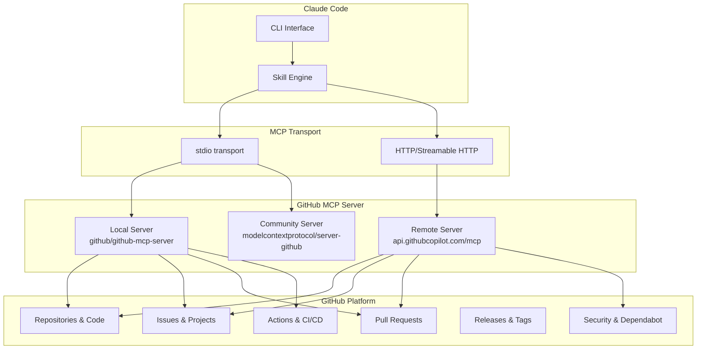

# Setting Up MCP Servers for GitHub

## Overview

The Model Context Protocol (MCP) connects Claude Code to GitHub's platform through the official GitHub MCP server, enabling AI-powered repository management, issue tracking, pull request automation, and CI/CD integration directly from your terminal.

## Architecture



## Prerequisites

```bash
# Verify requirements
node --version    # 18+ (for npx-based servers)
gh --version      # GitHub CLI (recommended)
claude --version  # Latest
```

## Option 1: GitHub's Official Remote MCP Server (Recommended)

The simplest setup uses GitHub's hosted remote MCP server with HTTP transport. No local installation required.

### Install via CLI

```bash
claude mcp add github \
  --transport http \
  --url https://api.githubcopilot.com/mcp \
  --header "Authorization: Bearer YOUR_GITHUB_PAT"
```

### Configuration File

```json
// .claude/mcp.json
{
  "mcpServers": {
    "github": {
      "type": "http",
      "url": "https://api.githubcopilot.com/mcp",
      "headers": {
        "Authorization": "Bearer ${GITHUB_TOKEN}"
      }
    }
  }
}
```

### JSON Add Command (Claude Code 2.1.1+)

```bash
claude mcp add-json github '{
  "type": "http",
  "url": "https://api.githubcopilot.com/mcp",
  "headers": {
    "Authorization": "Bearer '"$GITHUB_TOKEN"'"
  }
}'
```

## Option 2: GitHub's Official Local MCP Server

Run the official GitHub MCP server locally via Docker or binary.

### Docker Setup

```bash
# Pull and run the official container
docker run -i --rm \
  -e GITHUB_PERSONAL_ACCESS_TOKEN=your-token \
  ghcr.io/github/github-mcp-server
```

### Claude Code Configuration

```json
// .claude/mcp.json
{
  "mcpServers": {
    "github": {
      "command": "docker",
      "args": [
        "run", "-i", "--rm",
        "-e", "GITHUB_PERSONAL_ACCESS_TOKEN",
        "ghcr.io/github/github-mcp-server"
      ],
      "env": {
        "GITHUB_PERSONAL_ACCESS_TOKEN": "${GITHUB_TOKEN}"
      }
    }
  }
}
```

## Option 3: Community MCP Server (modelcontextprotocol)

The community-maintained server from the MCP organization.

```bash
claude mcp add github \
  --transport stdio \
  -- npx -y @modelcontextprotocol/server-github
```

```json
// .claude/mcp.json
{
  "mcpServers": {
    "github": {
      "command": "npx",
      "args": ["-y", "@modelcontextprotocol/server-github"],
      "env": {
        "GITHUB_PERSONAL_ACCESS_TOKEN": "${GITHUB_TOKEN}"
      }
    }
  }
}
```

## Authentication

### Create a Personal Access Token (PAT)

1. Go to https://github.com/settings/tokens?type=beta (Fine-grained tokens recommended)
2. Click "Generate new token"
3. Set an expiration (90 days recommended)
4. Select repository access (specific repos or all)
5. Set permissions based on your use case:

### Recommended Token Permissions

| Permission | Access | Use Case |
|-----------|--------|----------|
| **Contents** | Read & Write | Read code, create branches, push commits |
| **Issues** | Read & Write | Create, update, and comment on issues |
| **Pull requests** | Read & Write | Create PRs, add reviewers, merge |
| **Actions** | Read | Monitor CI/CD workflow runs |
| **Metadata** | Read | Required for all operations |
| **Workflows** | Read & Write | Trigger and manage workflow runs |
| **Commit statuses** | Read | Check CI status |
| **Dependabot alerts** | Read | Review security alerts |

### Using GitHub CLI Token

If you have `gh` CLI installed, reuse its token:

```bash
export GITHUB_TOKEN=$(gh auth token)
```

### Store Token Securely

```bash
# Option 1: Shell profile
echo 'export GITHUB_TOKEN="ghp_your_token"' >> ~/.zshrc

# Option 2: macOS Keychain
security add-generic-password -s "github-mcp" -a "$USER" -w "ghp_your_token"
export GITHUB_TOKEN=$(security find-generic-password -s "github-mcp" -w)
```

## MCP Server Tools

### Repository Operations

| Tool | Description |
|------|-------------|
| `get_file_contents` | Read file or directory contents from a repo |
| `search_code` | Search for code across repositories |
| `search_repositories` | Search repositories by name, topic, or language |
| `create_repository` | Create a new repository |
| `list_commits` | List recent commits on a branch |
| `get_commit` | Get details of a specific commit |

### Issue Operations

| Tool | Description |
|------|-------------|
| `list_issues` | List issues with filters (state, labels, assignee) |
| `get_issue` | Get full issue details |
| `create_issue` | Create a new issue |
| `update_issue` | Update issue fields |
| `add_issue_comment` | Add a comment to an issue |
| `search_issues` | Search issues and PRs across repos |

### Pull Request Operations

| Tool | Description |
|------|-------------|
| `create_pull_request` | Create a new PR |
| `get_pull_request` | Get PR details |
| `list_pull_requests` | List PRs with filters |
| `merge_pull_request` | Merge a PR |
| `get_pull_request_diff` | Get the diff of a PR |
| `get_pull_request_reviews` | Get review comments |
| `create_pull_request_review` | Submit a review |

### Branch and Reference Operations

| Tool | Description |
|------|-------------|
| `create_branch` | Create a new branch |
| `list_branches` | List repository branches |
| `create_or_update_file` | Create or update a file in a repo |
| `push_files` | Push multiple files in a single commit |

---

## Verification

After setup, verify the MCP server is connected:

```bash
# List configured MCP servers
claude mcp list

# Test the connection inside Claude Code
claude "List the 5 most recent issues in my current repo"

# Check server health
/mcp
```

## Troubleshooting

| Issue | Solution |
|-------|----------|
| `401 Unauthorized` | Verify PAT has not expired; regenerate if needed |
| `403 Forbidden` | Check token permissions match required scopes |
| `MCP server failed to start` | For local server: check Node.js 18+, try running `npx -y @modelcontextprotocol/server-github` standalone |
| `Rate limit exceeded` | GitHub API rate limits apply; use authenticated requests (5000/hr vs 60/hr) |
| `Repository not found` | Ensure PAT has access to the specific repository |
| `Docker not running` | Start Docker Desktop if using the Docker-based server |

## Sources

- [GitHub MCP Server - Official Repository](https://github.com/github/github-mcp-server)
- [GitHub MCP Server - Claude Installation Guide](https://github.com/github/github-mcp-server/blob/main/docs/installation-guides/install-claude.md)
- [Claude Code MCP Documentation](https://code.claude.com/docs/en/mcp)
- [Claude Code MCP Servers Guide (Builder.io)](https://www.builder.io/blog/claude-code-mcp-servers)
- [Connect Claude Code to GitHub (AI Hero)](https://www.aihero.dev/connect-claude-code-to-github)
