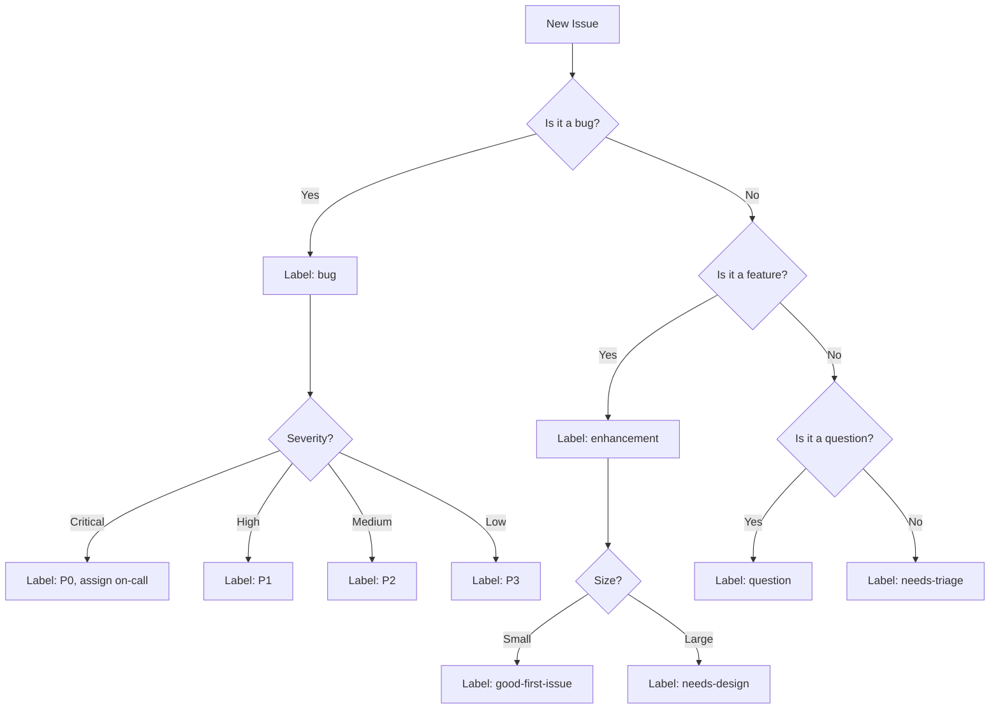

# GitHub Skills for Claude Code

## Overview

GitHub skills enable Claude Code to interact with repositories, pull requests, issues, and CI/CD pipelines as reusable, parameterized capabilities.

---

## Skill: PR Review

### `.claude/skills/gh-pr-review/SKILL.md`

```yaml
---
name: gh-pr-review
description: Review pull requests for bugs, security issues, performance, and code quality
allowed-tools:
  - Bash
  - Read
  - Grep
---
```

```markdown
# PR Review Skill

## Review Checklist

For every PR, evaluate:

### Correctness
- Does the code do what the PR description says?
- Are edge cases handled?
- Are error paths covered?
- Do types match expectations?

### Security
- SQL injection, XSS, CSRF vulnerabilities
- Hardcoded secrets or credentials
- Insecure deserialization
- Improper input validation
- Authorization/authentication gaps

### Performance
- N+1 queries
- Missing indexes for new database queries
- Unnecessary re-renders in frontend code
- Large payload sizes
- Missing pagination

### Maintainability
- Clear naming and documentation
- Single responsibility principle
- Test coverage for new code
- No dead code or commented-out blocks

## Output Format

Provide feedback as:

1. **Summary**: One paragraph overall assessment
2. **Critical Issues**: Must fix before merge (blocking)
3. **Suggestions**: Should fix, but not blocking
4. **Nits**: Style/preference (non-blocking)
5. **Praise**: Call out good patterns and well-written code

Use GitHub suggestion blocks for concrete fixes:
~~~
```suggestion
// corrected code here
```
~~~

## Commands

```bash
# Get PR diff
gh pr diff <number>

# Get PR files
gh pr view <number> --json files

# Get PR reviews
gh api repos/{owner}/{repo}/pulls/{number}/reviews

# Post review comment
gh api repos/{owner}/{repo}/pulls/{number}/reviews \
  -f body="Review comment" \
  -f event="COMMENT"
```
```

---

## Skill: Issue Triage

### `.claude/skills/gh-issue-triage/SKILL.md`

```yaml
---
name: gh-issue-triage
description: Triage GitHub issues - categorize, label, assign, and prioritize
allowed-tools:
  - Bash
  - Read
  - Grep
---
```

```markdown
# Issue Triage Skill

## Triage Workflow



## Assessment Criteria

### Bug Severity
- **P0 Critical**: Production down, data loss, security breach
- **P1 High**: Major feature broken, significant user impact
- **P2 Medium**: Feature degraded, workaround available
- **P3 Low**: Minor issue, cosmetic, edge case

### Feature Sizing
- **XS**: < 1 hour, single file change
- **S**: < 1 day, few files
- **M**: 1-3 days, multiple components
- **L**: 1-2 weeks, cross-cutting
- **XL**: > 2 weeks, needs design doc

## Actions

```bash
# Add labels
gh issue edit <number> --add-label "bug,P1"

# Assign
gh issue edit <number> --add-assignee username

# Add to project
gh project item-add <project-number> --owner <org> --url <issue-url>

# Comment with triage notes
gh issue comment <number> --body "Triage notes..."

# Close as duplicate
gh issue close <number> --reason "not planned" --comment "Duplicate of #123"
```

## Auto-Response Templates

For bugs:
> Thanks for reporting this! I've triaged this as a [severity] bug affecting [component]. [Assignee] will be looking into this.

For features:
> Thanks for the suggestion! I've categorized this as a [size] enhancement. We'll discuss it in our next planning session.
```

---

## Skill: CI/CD Management

### `.claude/skills/gh-cicd/SKILL.md`

```yaml
---
name: gh-cicd
description: Manage GitHub Actions CI/CD pipelines - create, debug, optimize workflows
allowed-tools:
  - Bash
  - Read
  - Write
  - Edit
---
```

```markdown
# CI/CD Management Skill

## Capabilities

### Create Workflows
Generate GitHub Actions workflow files for common patterns:
- Build and test
- Deploy to staging/production
- Release automation
- Scheduled maintenance tasks

### Debug Failures
1. Fetch failed workflow run logs: `gh run view <run-id> --log-failed`
2. Identify the failing step
3. Analyze error messages and context
4. Suggest fixes

### Optimize Performance
- Identify slow steps and suggest caching
- Recommend parallel job execution
- Optimize Docker layer caching
- Reduce unnecessary workflow triggers

## Workflow Templates

### Build & Test
```yaml
name: Build & Test
on:
  pull_request:
    branches: [main]
  push:
    branches: [main]

jobs:
  test:
    runs-on: ubuntu-latest
    strategy:
      matrix:
        node-version: [18, 20, 22]
    steps:
      - uses: actions/checkout@v4
      - uses: actions/setup-node@v4
        with:
          node-version: ${{ matrix.node-version }}
          cache: npm
      - run: npm ci
      - run: npm test
      - run: npm run lint
```

### Deploy with Claude Review Gate
```yaml
name: Deploy
on:
  push:
    branches: [main]

jobs:
  review:
    runs-on: ubuntu-latest
    permissions:
      contents: read
      pull-requests: write
    steps:
      - uses: actions/checkout@v4
        with:
          fetch-depth: 2
      - uses: anthropics/claude-code-action@v1
        with:
          anthropic_api_key: ${{ secrets.ANTHROPIC_API_KEY }}
          prompt: |
            Review the changes in this push. Check for:
            - Breaking changes
            - Missing migrations
            - Security issues
            If any critical issues found, create an issue and fail this check.

  deploy-staging:
    needs: review
    runs-on: ubuntu-latest
    steps:
      - uses: actions/checkout@v4
      - run: ./deploy.sh staging

  deploy-production:
    needs: deploy-staging
    runs-on: ubuntu-latest
    environment: production
    steps:
      - uses: actions/checkout@v4
      - run: ./deploy.sh production
```

## Useful Commands

```bash
# List recent workflow runs
gh run list --limit 10

# View a specific run
gh run view <run-id>

# View failed logs
gh run view <run-id> --log-failed

# Re-run failed jobs
gh run rerun <run-id> --failed

# View workflow file
gh workflow view <workflow-name>

# Disable/enable a workflow
gh workflow disable <workflow-name>
gh workflow enable <workflow-name>
```
```

---

## Skill: Release Management

### `.claude/skills/gh-release/SKILL.md`

```yaml
---
name: gh-release
description: Manage releases - create changelogs, tag versions, publish releases
allowed-tools:
  - Bash
  - Read
  - Write
  - Edit
---
```

```markdown
# Release Management Skill

## Workflow

1. Determine next version (semver: major.minor.patch)
2. Generate changelog from commits since last release
3. Create and push git tag
4. Create GitHub release with changelog
5. Trigger release workflow (if configured)

## Version Determination

- `fix:` commits -> patch bump
- `feat:` commits -> minor bump
- `BREAKING CHANGE:` or `!:` -> major bump

## Commands

```bash
# Get latest release
gh release view --json tagName,publishedAt

# List commits since last release
git log $(git describe --tags --abbrev=0)..HEAD --oneline

# Create release
gh release create v1.2.3 \
  --title "v1.2.3" \
  --notes-file CHANGELOG.md \
  --target main

# Create pre-release
gh release create v2.0.0-rc.1 --prerelease --title "v2.0.0 Release Candidate 1"
```

## Changelog Format

```markdown
## [v1.2.3] - 2026-03-22

### Added
- New feature description (#123)

### Fixed
- Bug fix description (#124)

### Changed
- Change description (#125)

### Breaking Changes
- Breaking change description (#126)
```
```

---

## Skill: Branch Management

### `.claude/skills/gh-branch/SKILL.md`

```yaml
---
name: gh-branch
description: Manage branches - create, cleanup stale branches, enforce naming conventions
allowed-tools:
  - Bash
---
```

```markdown
# Branch Management Skill

## Naming Convention

- `feat/description` - New features
- `fix/description` - Bug fixes
- `chore/description` - Maintenance tasks
- `docs/description` - Documentation updates
- `refactor/description` - Code refactoring

## Operations

```bash
# Create feature branch
git checkout -b feat/add-auth-flow main

# List stale branches (no commits in 30 days)
git for-each-ref --sort=committerdate --format='%(committerdate:short) %(refname:short)' refs/remotes/ | \
  awk -v cutoff=$(date -d '30 days ago' +%Y-%m-%d) '$1 < cutoff'

# Delete merged branches
gh pr list --state merged --json headRefName --jq '.[].headRefName' | \
  xargs -I {} git push origin --delete {}

# Protect main branch
gh api repos/{owner}/{repo}/branches/main/protection \
  -X PUT \
  -f required_status_checks='{"strict":true,"contexts":["test","claude-review"]}' \
  -f enforce_admins=true \
  -f required_pull_request_reviews='{"required_approving_review_count":1}'
```
```
