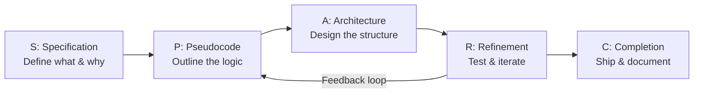
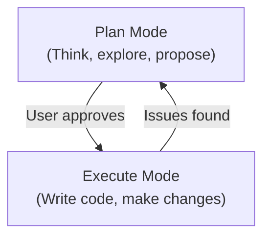

# Prompt Frameworks

> Reusable prompt frameworks extracted from research and practice. Evolving file -- updated each session.

Last updated: 2026-03-23

---

## Overview

This file contains ready-to-use prompt templates for common AI coding tasks. Each framework is a structured template you can fill in and use directly with Claude Code or other AI coding tools.

For the full library of 24 patterns with detailed explanations, see [patterns/prompt_patterns.md](../../patterns/prompt_patterns.md).

---

## Framework 1: SPARC

**Specification, Pseudocode, Architecture, Refinement, Completion**

SPARC is the most comprehensive framework for non-trivial features. It mirrors professional engineering methodology by breaking work into phases.



### When to Use

- Any feature that touches more than 2 files
- New modules or services
- Changes with architectural implications
- When you want the AI to think before coding

### Template

```
## Phase 1: Specification

I need a [system/feature/component] that [does what].

### Requirements
- [Requirement 1: specific, measurable]
- [Requirement 2: specific, measurable]
- [Requirement 3: specific, measurable]

### Constraints
- Language/framework: [e.g., TypeScript, Express.js]
- Performance: [e.g., must handle 1000 req/s]
- Dependencies: [e.g., use existing Redis connection, no new deps]
- Scope: [e.g., only modify files in src/auth/]

### Success criteria
- [How we know it works: tests pass, endpoint returns X, etc.]

## Phase 2: Pseudocode

Before writing any code, outline the logical flow in pseudocode.
Include sequence, branching, loop structures, and error paths.

## Phase 3: Architecture

Design the module structure, interfaces, and data flow.
Show how new components interact with existing code.
Use a mermaid diagram if helpful.

## Phase 4: Refinement

Review the implementation against requirements.
Add error handling, edge cases, input validation, and tests.

## Phase 5: Completion

Finalize with:
- Documentation (inline comments, README updates if needed)
- Deployment considerations
- Monitoring/observability hooks
```

### Example (Filled In)

```
## Phase 1: Specification

I need a rate limiter middleware for Express.js that supports per-user
limits with Redis backing.

### Requirements
- Per-IP rate limiting: 100 requests per 15-minute sliding window
- Per-user rate limiting (authenticated): 500 requests per 15-minute window
- Distributed counting via Redis (connection already in src/config/redis.ts)

### Constraints
- Language: TypeScript
- Framework: Express.js 5
- Must not add new npm dependencies (use existing ioredis)
- Only create files in src/middleware/

### Success criteria
- All existing tests pass
- New tests cover: normal usage, rate exceeded, Redis failure, authenticated vs anonymous

## Phase 2: Pseudocode first, then architecture, then implementation.
```

---

## Framework 2: CIF (Context, Instruction, Format)

**The minimum viable prompt structure.** Use this for every prompt, even simple ones.

### When to Use

- Every prompt. CIF is the baseline structure.
- Quick tasks that do not need SPARC's full rigor

### Template

```
## Context
[What exists now. Relevant files, current state, background.]
[Example: "The project uses Next.js 14 with App Router. Auth is handled
by NextAuth in src/lib/auth.ts. The user model is in prisma/schema.prisma."]

## Instruction
[What you want done. One clear action.]
[Example: "Add a password reset flow with email verification."]

## Format
[What the output should look like.]
[Example: "Create the following files:
- src/app/api/auth/reset/route.ts (API endpoint)
- src/app/reset-password/page.tsx (UI page)
- Add a test file for each in __tests__/"]
```

### Example (Filled In)

```
## Context
Express.js API in src/. PostgreSQL via Prisma. The User model has
email, passwordHash, and resetToken fields. No password reset flow exists yet.
Email sending is already configured in src/services/emailService.ts.

## Instruction
Add a password reset flow: POST /api/auth/forgot-password generates a
time-limited token, emails a reset link, and POST /api/auth/reset-password
validates the token and updates the password.

## Format
- New file: src/routes/auth/resetPassword.ts
- New file: src/services/resetTokenService.ts
- New file: tests/routes/auth/resetPassword.test.ts
- Update: prisma/schema.prisma (add resetTokenExpiry to User)
- Generate a Prisma migration
```

---

## Framework 3: Plan-Then-Execute

**Separate thinking from doing.** Forces the AI to plan before writing code, which catches architectural mistakes early.



### When to Use

- Refactoring or migration tasks
- When you are unsure of the best approach
- Any task where a wrong first move is expensive
- Complex changes spanning multiple files

### Template

```
Use plan mode. Do NOT make any changes yet.

I want to [describe the goal].

Current state:
- [What exists now]
- [Relevant files and their purposes]
- [Known constraints]

Please:
1. Analyze the current code structure
2. Propose 2-3 approaches with trade-offs
3. Recommend one approach with justification
4. List the files that will be created/modified
5. Identify risks or edge cases

I will review your plan before you proceed with implementation.
```

### Example (Filled In)

```
Use plan mode. Do NOT make any changes yet.

I want to extract the monolithic src/services/orderService.ts (450 lines)
into separate domain services.

Current state:
- orderService.ts handles order creation, payment processing, inventory
  checks, email notifications, and audit logging
- 12 other files import from orderService.ts
- Test file: tests/services/orderService.test.ts (38 tests, all passing)

Please:
1. Analyze orderService.ts and identify logical groupings
2. Propose 2-3 extraction strategies with trade-offs
3. Recommend one approach with justification
4. List every file that will be created or modified
5. Identify which tests might break and how to handle them

I will review your plan before you proceed.
```

---

## Framework 4: Constraint-First

**Lead with boundaries.** Especially useful when you want the AI to work within tight limits.

### When to Use

- When scope creep is a risk
- Security-sensitive changes
- When working in a large codebase where accidental changes are dangerous
- Performance-critical code

### Template

```
## Constraints (read these FIRST)
- DO NOT modify: [files/directories that are off-limits]
- DO NOT add: [no new dependencies, no new files in X, etc.]
- DO NOT change: [public interfaces, API contracts, database schema, etc.]
- Maximum: [line count, file count, complexity budget]
- Must preserve: [backward compatibility, test suite, etc.]

## Task
[What you want done, given the above constraints.]

## Acceptance criteria
[How you will verify the work is correct and within bounds.]
```

---

## Framework 5: Test-First

**Write the tests before the implementation.** Aligns the AI with TDD methodology and produces better-specified code.

### When to Use

- New features where requirements are clear
- Bug fixes (write the failing test first)
- When you want high confidence in the output

### Template

```
We are doing TDD. Follow the RED-GREEN-REFACTOR cycle.

## RED: Write failing tests first

Write tests for [feature/behavior] in [test file path].

Test cases:
1. [Happy path: describe expected behavior]
2. [Edge case: describe boundary condition]
3. [Error case: describe failure mode]
4. [Additional cases as needed]

Use [test framework: Jest/pytest/Go testing/etc.].
Run the tests to confirm they fail.

## GREEN: Implement the minimum code to pass

Now implement in [source file path].
Write the minimum code needed to make all tests pass.
Do not add features beyond what the tests require.

## REFACTOR: Clean up

Review the implementation for:
- Code clarity and naming
- Duplication
- Performance
- Error messages

Refactor while keeping all tests green.
```

---

## Quick Reference: Which Framework When?

| Situation | Framework | Why |
|-----------|-----------|-----|
| Simple, well-defined task | CIF | Minimum structure, fast |
| New feature (multi-file) | SPARC | Full engineering rigor |
| Uncertain approach | Plan-Then-Execute | Explore before committing |
| Tight constraints / security | Constraint-First | Prevent scope creep |
| Clear requirements, high quality | Test-First | TDD produces reliable code |
| Bug fix | Test-First + CIF | Write failing test, then fix |
| Refactoring | Plan-Then-Execute + Constraint-First | Plan the extraction, bound the scope |
| Code review | CIF | Context + focus areas + output format |

---

## The 24 Patterns

The frameworks above are the most commonly used. For the full library of 24 patterns including Chain of Thought, Scope Fence, Ping-Pong, Checkpoint Prompting, and more, see:

**[patterns/prompt_patterns.md](../../patterns/prompt_patterns.md)**

Additional pattern references:
- [patterns/anti_patterns.md](../../patterns/anti_patterns.md) -- What NOT to do
- [craft/conversation_patterns.md](../../craft/conversation_patterns.md) -- Session-level strategies
- [craft/context_management.md](../../craft/context_management.md) -- Managing token budgets
- [learning/guidance/prompt_guidance.md](../guidance/prompt_guidance.md) -- Evolving prompt quality feedback

---

## Session Log

*Framework refinements from each session are appended below.*

### 2026-03-23

- Initial frameworks document created with 5 core frameworks extracted from the prompt patterns research.

---

*Part of the [Claude Framework](../../README.md). Evolving file -- updated each session per the [Prime Directive](../../new_prime_directive.md).*
