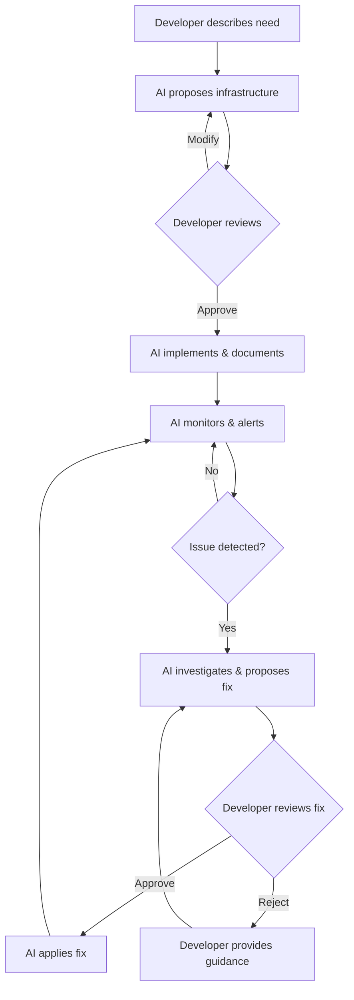
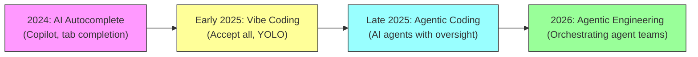
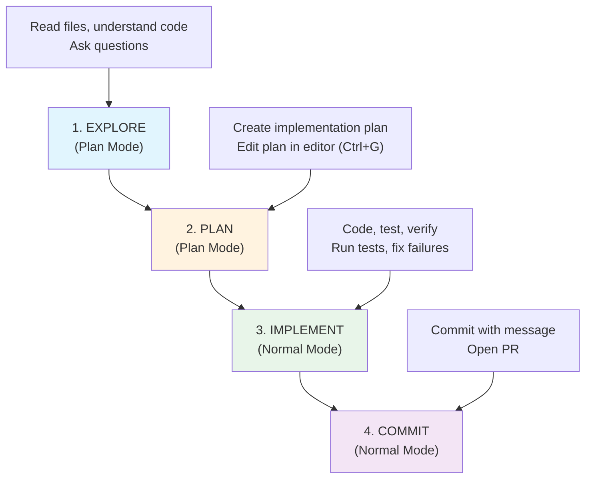
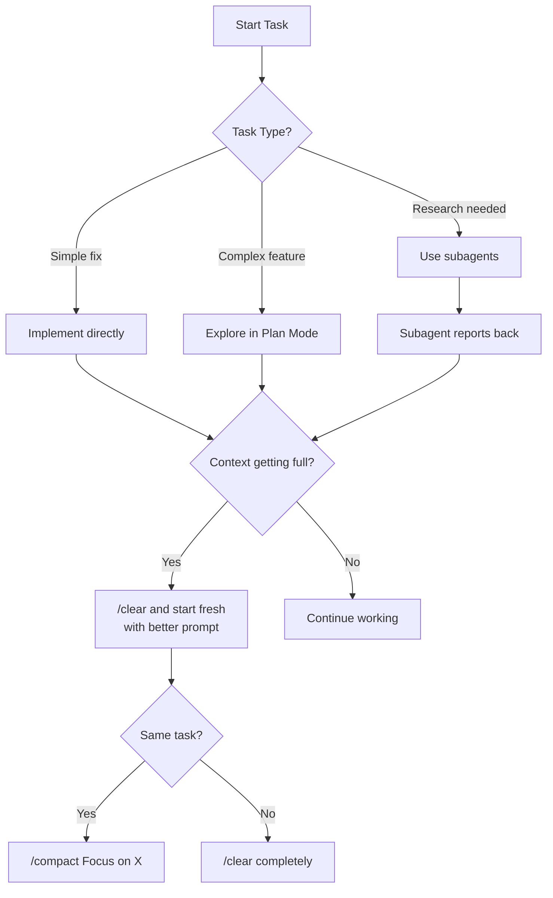

# Vibe Coding & Vibe Ops Methodology Guide

> A comprehensive methodology for AI-assisted development using Claude Code, covering philosophy, setup, workflows, and scaling patterns.

---

## Table of Contents

1. [What is Vibe Coding?](#what-is-vibe-coding)
2. [What is Vibe Ops?](#what-is-vibe-ops)
3. [The Evolution: From Vibe Coding to Agentic Engineering](#the-evolution)
4. [Claude Code: The Platform](#claude-code-the-platform)
5. [The CLAUDE.md System](#the-claudemd-system)
6. [MCP Servers](#mcp-servers)
7. [Skills & Custom Commands](#skills--custom-commands)
8. [Subagents](#subagents)
9. [Folder Structure & Repo Organization](#folder-structure--repo-organization)
10. [Workflow Methodology](#workflow-methodology)
11. [Commands Reference](#commands-reference)
12. [Scaling Patterns](#scaling-patterns)
13. [Anti-Patterns to Avoid](#anti-patterns-to-avoid)

---

## What is Vibe Coding?

### Origin

Vibe coding was coined by **Andrej Karpathy** (co-founder of OpenAI, former Tesla AI director) in February 2025:

> "There's a new kind of coding I call 'vibe coding', where you fully give in to the vibes, embrace exponentials, and forget that the code even exists."

### Definition

Vibe coding is a development approach where the programmer shifts from manually writing code to **guiding, testing, and giving feedback** about AI-generated source code. The core idea:

- **Describe** what you want in natural language (often via voice)
- **Accept** AI-generated changes without reading every diff
- **Copy/paste** error messages back to the AI for fixes
- **Iterate** based on outcomes rather than code review

### The Spectrum of AI-Assisted Development

Simon Willison drew an important distinction that helps frame the methodology:

```
Pure Vibe Coding                                    Traditional Development
|------------|------------|------------|------------|
Skip all     Review some  Review most  Review all
review       diffs        diffs        diffs
```

| Approach | Code Review | Best For |
|----------|-------------|----------|
| **Pure Vibe Coding** | None - accept all changes | Weekend projects, throwaway prototypes, learning |
| **Guided Vibe Coding** | Selective - review critical paths | Personal tools, internal apps, MVPs |
| **Agentic Engineering** | Full review with AI assistance | Production code, team projects, anything affecting users |
| **Traditional + AI** | Full manual review | Security-critical systems, regulated industries |

### When Vibe Coding is Appropriate

**Good fit:**
- Low-stakes weekend projects
- Personal tools and utilities
- Prototypes and proof-of-concepts
- Learning a new framework or language
- Rapid experimentation

**Not appropriate without oversight:**
- Production systems handling user data
- Security-sensitive applications
- Code that charges money or handles credentials
- Anything where failure has consequences beyond your own machine

### The Golden Rule

Simon Willison's "golden rule" for production: **never commit anything you couldn't explain to someone else.** If code is reviewed, tested, and understood -- regardless of LLM involvement -- it is software development, not vibe coding.

---

## What is Vibe Ops?

### Definition

Vibe Ops extends the vibe coding philosophy to **infrastructure, deployment, monitoring, and maintenance**. Instead of writing Terraform files or Kubernetes manifests manually, you describe your infrastructure needs in natural language and let AI handle the implementation.

### Core Principles

1. **Natural Language Infrastructure**: Describe infrastructure needs conversationally; AI proposes designs and configurations
2. **AI-Driven Incident Response**: When issues arise, describe the problem and let AI investigate logs, metrics, and system state
3. **Continuous Optimization**: AI monitors and suggests infrastructure improvements proactively
4. **Developer Flow Preservation**: Operations tasks happen without leaving the development environment

### How Vibe Ops Works in Practice



### Practical Vibe Ops Examples

**Deployment:**
```
"Deploy this to production with a health check on /api/health.
Roll back automatically if error rate exceeds 5% in the first 10 minutes."
```

**Incident Response:**
```
"The API is returning 500 errors intermittently. Check the logs from
the last hour, look at database connection pool metrics, and tell me
what's going on."
```

**Infrastructure Scaling:**
```
"We're seeing increased traffic on the auth service. Set up auto-scaling
with a target of 70% CPU utilization, min 2 max 10 instances."
```

### Impact (2025-2026)

Organizations adopting Vibe Ops patterns report:
- 78% reductions in Mean Time To Recovery (MTTR)
- Single engineers replacing entire outsourced operations contracts
- "AI SRE" tools becoming a new product category

---

## The Evolution

Karpathy himself has noted that "vibe coding" as originally described is becoming passe. The industry is moving toward what he calls **"agentic engineering"**:

> You are orchestrating agents who write code. You act as oversight, with an emphasis on expertise and craft.

This evolution maps cleanly to how Claude Code works:



---

## Claude Code: The Platform

### What It Is

Claude Code is an **agentic AI coding tool** built by Anthropic. Unlike chatbots that answer questions and wait, Claude Code can:

- Read your files and understand your entire codebase
- Run terminal commands
- Make changes across multiple files
- Autonomously work through problems
- Verify its own work by running tests

### Platform Availability

| Platform | Access Method |
|----------|---------------|
| Terminal (macOS/Linux) | `curl -fsSL https://claude.ai/install.sh \| bash` |
| Terminal (Windows) | `irm https://claude.ai/install.ps1 \| iex` |
| VS Code | Extension marketplace |
| JetBrains IDEs | Plugin |
| Web | claude.ai/code |
| Slack | Integration |

### How Anthropic Engineers Use It

Key insights from Anthropic's internal usage:

1. **Compounding Engineering**: Every time Claude does something wrong, add a note to CLAUDE.md so it never makes that class of error again. Each correction becomes permanent context.

2. **Remote Multi-Agent**: Anthropic engineers run Claude Code remotely with agents working in parallel in isolated environments (using tools like Coder).

3. **Beyond Coding**: Claude Code is used internally for deep research, video creation, note-taking, and many non-coding applications.

4. **Verification-First**: The single highest-leverage practice is giving Claude a way to verify its own work (tests, screenshots, expected outputs).

---

## The CLAUDE.md System

### Why It Matters

CLAUDE.md is a special file that Claude reads at the start of every conversation. It provides **persistent context that Claude cannot infer from code alone**. Think of it as the onboarding document for your AI pair programmer.

### The Reasoning Behind It

- Claude's context window is large (200K+ tokens) but **performance degrades as it fills**
- CLAUDE.md front-loads the most important information
- It compounds in value over time as you add corrections
- It is the single most important configuration for Claude Code behavior

### File Hierarchy

CLAUDE.md files can exist at multiple levels, and all applicable ones are loaded:

```
~/.claude/CLAUDE.md              # Personal - applies to ALL sessions
~/work/CLAUDE.md                 # Org-level for monorepo root
~/work/frontend/CLAUDE.md        # Package-specific
~/work/frontend/src/CLAUDE.md    # Subdirectory-specific (loaded on demand)
```

### What to Include vs. Exclude

| Include | Exclude |
|---------|---------|
| Bash commands Claude cannot guess | Anything Claude can figure out by reading code |
| Code style rules differing from defaults | Standard language conventions Claude already knows |
| Testing instructions and preferred runners | Detailed API documentation (link instead) |
| Repository etiquette (branch naming, PR conventions) | Information that changes frequently |
| Architectural decisions specific to your project | Long explanations or tutorials |
| Developer environment quirks (required env vars) | File-by-file descriptions of the codebase |
| Common gotchas or non-obvious behaviors | Self-evident practices like "write clean code" |

### Key Principles

1. **Keep it under 200 lines.** If longer, move rules into `.claude/rules/*.md` or use skills
2. **Use pointers, not copies.** Reference files (`@README.md`) rather than duplicating content
3. **Prune ruthlessly.** Ask: "Would removing this cause Claude to make mistakes?" If not, cut it
4. **Add emphasis for critical rules.** "IMPORTANT" or "YOU MUST" improves adherence
5. **Check it into git.** Your team should contribute to and benefit from it
6. **Use imports.** `@path/to/file` syntax allows recursive references (up to 5 levels)

### Example CLAUDE.md

```markdown
# Code style
- Use ES modules (import/export) syntax, not CommonJS (require)
- Destructure imports when possible (e.g., import { foo } from 'bar')
- IMPORTANT: Always use TypeScript strict mode

# Workflow
- Run `npm run typecheck` after making code changes
- Prefer running single tests (`npm test -- --grep "test name"`)
- NEVER run the full test suite unless explicitly asked

# Architecture
- State management: Zustand (see src/stores/ for patterns)
- API layer: tRPC (see src/server/routers/ for examples)
- Auth: NextAuth.js with JWT strategy

# Git
- Branch naming: feature/TICKET-description, fix/TICKET-description
- Commit messages: conventional commits (feat:, fix:, chore:, etc.)
- Always create PR descriptions with ## Summary and ## Test Plan

# Gotchas
- The database migration system requires running `npm run db:generate` after schema changes
- Environment variables are validated at build time - check .env.example
- The CI pipeline runs on Node 20, not Node 22

See @README.md for project overview.
See @docs/api-reference.md for API conventions.
```

---

## MCP Servers

### What They Are

MCP (Model Context Protocol) servers extend Claude Code with external tool access. They let Claude interact with services like GitHub, databases, design tools, and monitoring systems.

### How Many Do People Use?

The ecosystem has grown rapidly:
- **3,000+** MCP servers indexed on mcp.so
- **2,200+** servers on Smithery
- **1,200+** quality-verified servers on mcp-awesome.com
- Typical power users run **3-8** MCP servers simultaneously

### Most Popular MCP Servers

| Server | Purpose | Why It Matters |
|--------|---------|----------------|
| **GitHub** | Issues, PRs, CI/CD | Most widely used; eliminates API rate limits |
| **Filesystem** | Local file operations | Foundation for secure file management |
| **Playwright** | Browser automation | Test UIs, fill forms, take screenshots |
| **PostgreSQL** | Database queries | Natural language SQL, schema exploration |
| **Figma** | Design-to-code | Access layout data, components, tokens |
| **Notion** | Workspace management | Read/write docs, databases |
| **Slack** | Team communication | Read channels, send messages |
| **Sentry** | Error monitoring | Investigate production errors |
| **Sequential Thinking** | Reasoning | Structured problem-solving |

### Configuration Scopes

| Scope | Location | Purpose |
|-------|----------|---------|
| **Local** (default) | `~/.claude.json` | Personal tokens, available only to you |
| **Project** | `.mcp.json` in project root | Shared with team via git |
| **User** | `~/.claude.json` | Available across all your projects |

### Configuration Example (.mcp.json)

```json
{
  "mcpServers": {
    "github": {
      "type": "stdio",
      "command": "npx",
      "args": ["-y", "@modelcontextprotocol/server-github"],
      "env": {
        "GITHUB_PERSONAL_ACCESS_TOKEN": "${GITHUB_TOKEN}"
      }
    },
    "playwright": {
      "type": "stdio",
      "command": "npx",
      "args": ["-y", "@playwright/mcp@latest"]
    },
    "postgres": {
      "type": "stdio",
      "command": "npx",
      "args": ["-y", "@modelcontextprotocol/server-postgres"],
      "env": {
        "DATABASE_URL": "${DATABASE_URL}"
      }
    }
  }
}
```

### CLI Commands for MCP

```bash
# Add a server
claude mcp add github --scope user

# Add with full JSON config
claude mcp add-json github '{"command":"npx","args":["-y","@modelcontextprotocol/server-github"]}'

# List configured servers
claude mcp list

# Remove a server
claude mcp remove github

# Manage in-session
/mcp
```

### The Reasoning Behind MCP

Claude Code is most effective when it can **verify its own work** and **access real data**. MCP servers turn Claude from a code generator into a full-stack development assistant:

- Playwright lets Claude test its own UI changes
- GitHub lets Claude create PRs, read issues, and understand CI failures
- Database servers let Claude write and validate queries against real schemas
- Sentry lets Claude investigate production errors with actual stack traces

---

## Skills & Custom Commands

### What They Are

Skills are reusable instructions that extend Claude's knowledge and capabilities. They live in `SKILL.md` files and create `/slash-commands` you can invoke.

### The Reasoning

CLAUDE.md is loaded **every session**, which uses context. Skills load **on demand** -- Claude activates them when relevant or you invoke them manually. This keeps your context budget focused on what matters for the current task.

### Directory Structure

```
.claude/skills/              # Project skills (check into git)
  deploy/
    SKILL.md                 # Required: skill definition
    scripts/
      deploy.sh              # Optional: supporting files
  fix-issue/
    SKILL.md
  api-conventions/
    SKILL.md
    reference.md             # Optional: detailed docs
    examples.md              # Optional: usage examples

~/.claude/skills/            # Personal skills (all projects)
  explain-code/
    SKILL.md
  session-logger/
    SKILL.md
```

### Skill Types

**Reference Skills** -- Knowledge Claude applies to your current work:

```yaml
---
name: api-conventions
description: REST API design conventions for our services
---
# API Conventions
- Use kebab-case for URL paths
- Use camelCase for JSON properties
- Always include pagination for list endpoints
- Version APIs in the URL path (/v1/, /v2/)
```

**Task Skills** -- Step-by-step workflows invoked with `/skill-name`:

```yaml
---
name: fix-issue
description: Fix a GitHub issue
disable-model-invocation: true
---
Analyze and fix GitHub issue $ARGUMENTS.

1. Use `gh issue view` to get details
2. Search the codebase for relevant files
3. Implement the fix
4. Write and run tests
5. Create a descriptive commit
6. Push and create a PR
```

### Key Frontmatter Options

| Field | Purpose |
|-------|---------|
| `name` | Becomes the `/slash-command` |
| `description` | Helps Claude decide when to load it automatically |
| `disable-model-invocation` | Only you can trigger it (for side effects like deploy) |
| `user-invocable` | Set `false` for background knowledge only |
| `allowed-tools` | Restrict what Claude can do (e.g., read-only) |
| `context` | Set to `fork` for isolated subagent execution |
| `model` | Override the model for this skill |

### Bundled Skills (Built-in)

| Skill | Purpose |
|-------|---------|
| `/batch <instruction>` | Orchestrate large-scale changes in parallel across worktrees |
| `/claude-api` | Load Claude API reference for your language |
| `/debug [description]` | Troubleshoot current session |
| `/loop [interval] <prompt>` | Run a prompt repeatedly on schedule |
| `/simplify [focus]` | Review and fix code quality issues |

---

## Subagents

### What They Are

Subagents are specialized AI assistants that run in their **own context window** with custom system prompts, tool access, and permissions. They keep exploration out of your main conversation.

### The Reasoning

Context is your most precious resource. When Claude explores a codebase, it reads hundreds of files that consume your context window. Subagents run in separate context, report back summaries, and keep your main conversation clean.

### Built-in Subagents

| Agent | Model | Purpose |
|-------|-------|---------|
| **Explore** | Haiku (fast) | Read-only codebase search and analysis |
| **Plan** | Inherits | Research for plan mode |
| **General-purpose** | Inherits | Complex multi-step tasks |

### Custom Subagent Example

```markdown
# .claude/agents/security-reviewer.md
---
name: security-reviewer
description: Reviews code for security vulnerabilities. Use proactively after code changes.
tools: Read, Grep, Glob, Bash
model: sonnet
---

You are a senior security engineer. Review code for:
- Injection vulnerabilities (SQL, XSS, command injection)
- Authentication and authorization flaws
- Secrets or credentials in code
- Insecure data handling

Provide specific line references and suggested fixes.
Organize findings by severity: Critical, Warning, Info.
```

### Subagent Scopes

| Location | Scope | Priority |
|----------|-------|----------|
| `--agents` CLI flag | Current session only | Highest |
| `.claude/agents/` | Current project | High |
| `~/.claude/agents/` | All your projects | Medium |
| Plugin agents | Where plugin is enabled | Lowest |

### Key Features

- **Persistent Memory**: Subagents can accumulate knowledge across sessions (`memory: user` or `memory: project`)
- **Background Execution**: Run subagents concurrently while you continue working (Ctrl+B to background)
- **Up to 10** simultaneous subagents
- **Hook Support**: Pre/post tool use hooks for validation
- **Isolated Worktrees**: `isolation: worktree` gives the subagent its own copy of the repo

---

## Folder Structure & Repo Organization

### The Reasoning

Your folder structure directly controls what context Claude loads and when. Hierarchical CLAUDE.md files mean each directory can have its own instructions, and Claude loads them on demand when working in that area.

### Recommended Structure for a Claude Framework Repo

```
claude_framework/
  .claude/
    CLAUDE.md                    # Project-level instructions
    settings.json                # Permission config, hooks
    settings.local.json          # Local overrides (git-ignored)
    skills/                      # Project skills
      deploy/SKILL.md
      fix-issue/SKILL.md
      code-review/SKILL.md
    agents/                      # Project subagents
      security-reviewer.md
      data-analyst.md
    rules/                       # Path-specific rules
      frontend.md
      backend.md
  CLAUDE.md                      # Root-level instructions
  .mcp.json                      # Shared MCP server config
  claudefiles/                   # Decision & learning logs
    changelog.md
    context.md
    decisions/
    skills/
    agents/
    archive/
  learning/                      # Session & guidance logs
    sessions/
    frameworks/
    guidance/
    archive/
```

### Same Repo vs. Separate Library vs. Dedicated Framework

| Approach | When to Use | Pros | Cons |
|----------|-------------|------|------|
| **Same repo** | Skills/agents tightly coupled to project | Easy to maintain, version-controlled together | Can't reuse across projects |
| **Separate library** | Shared skills across team/org | Reusable, consistent standards | Extra maintenance, versioning overhead |
| **Dedicated framework repo** | Organization-wide patterns | Central source of truth, plugin distribution | Sync challenges, potential staleness |
| **Personal `~/.claude/`** | Individual developer preferences | Always available, no repo dependency | Not shareable, not version-controlled |

### The Hybrid Approach (Recommended)

```
~/.claude/                       # Personal defaults
  CLAUDE.md                      # Your personal coding style
  skills/                        # Skills you use everywhere
    explain-code/SKILL.md
    quick-commit/SKILL.md
  agents/                        # Agents you use everywhere
    general-reviewer.md

project-root/                    # Project-specific
  .claude/
    skills/                      # Project skills
    agents/                      # Project agents
  CLAUDE.md                      # Project instructions
```

---

## Workflow Methodology

### The Four-Phase Workflow

This is the recommended workflow from Anthropic's best practices documentation:



### When to Skip Planning

Skip the plan for tasks where:
- The scope is clear and the fix is small
- You could describe the diff in one sentence
- You are fixing a typo, adding a log line, or renaming a variable

### Context Management Strategy



### The Verification Loop

The single highest-leverage practice:

1. **Write the test first** or describe expected behavior
2. **Let Claude implement** the solution
3. **Claude runs tests** and validates its own work
4. **Fix failures** without your intervention
5. **You review** the final, tested result

### Session Management Best Practices

| Technique | When to Use |
|-----------|-------------|
| `/clear` | Between unrelated tasks |
| `/compact Focus on X` | When context is filling but task continues |
| `/rewind` or `Esc + Esc` | When Claude goes off track |
| `claude --continue` | Resume where you left off |
| `claude --resume` | Pick from recent sessions |
| `/rename "descriptive-name"` | Name sessions for easy resume |
| `/btw` | Quick side question without polluting context |

---

## Commands Reference

### Essential Slash Commands

**Session & Context:**
| Command | Purpose |
|---------|---------|
| `/clear` | Wipe conversation history |
| `/compact [focus]` | Summarize to free context |
| `/cost` | Show token usage and API cost |
| `/context` | Visualize context consumption |
| `/resume` | Pick previous session |
| `/rename [name]` | Name current session |
| `/rewind` | Rewind to checkpoint |
| `/diff` | View interactive diff |

**Configuration:**
| Command | Purpose |
|---------|---------|
| `/init` | Initialize CLAUDE.md for project |
| `/model [name]` | Switch model (sonnet/opus/haiku) |
| `/effort [level]` | Set reasoning level |
| `/permissions` | Manage tool permissions |
| `/mcp` | Manage MCP connections |
| `/memory` | View/edit CLAUDE.md |

**Project & Code:**
| Command | Purpose |
|---------|---------|
| `/security-review` | Scan for vulnerabilities |
| `/simplify` | Review code quality |
| `/batch [task]` | Run across parallel worktrees |
| `/debug [description]` | Troubleshoot session |
| `/pr-comments [PR]` | Fetch PR review comments |

### Essential Keyboard Shortcuts

| Shortcut | Action |
|----------|--------|
| `Esc` | Stop Claude mid-action |
| `Esc + Esc` | Rewind menu |
| `Shift+Tab` | Cycle permission modes |
| `Ctrl+G` | Open input in external editor |
| `Ctrl+B` | Background current task |
| `Ctrl+F` | Kill all background agents |
| `Option+P / Alt+P` | Switch model |
| `Option+T / Alt+T` | Toggle extended thinking |
| `\ + Enter` | New line (multiline input) |

### CLI Flags

```bash
# Start sessions
claude                          # Interactive session
claude "prompt"                 # Start with prompt
claude -c                       # Continue recent session
claude -r "name"                # Resume named session
claude -w branch                # Isolated git worktree

# Print mode (non-interactive, for CI/scripts)
claude -p "query"               # Process and exit
claude -p --output-format json "query"  # JSON output

# Model and effort
claude --model opus             # Use Opus model
claude --effort high            # High reasoning effort
claude --max-budget-usd 5.00   # Spending limit
claude --max-turns 3            # Limit agentic turns

# Agents
claude --agent code-reviewer    # Run session as specific agent
```

---

## Scaling Patterns

### Fan-Out Pattern

For large migrations or batch operations:

```bash
# 1. Generate task list
claude -p "List all files that need migrating" > files.txt

# 2. Process in parallel
for file in $(cat files.txt); do
  claude -p "Migrate $file from React to Vue. Return OK or FAIL." \
    --allowedTools "Edit,Bash(git commit *)" &
done
wait
```

### Writer/Reviewer Pattern

Run two sessions in parallel:

| Session A (Writer) | Session B (Reviewer) |
|--------------------|----------------------|
| Implement the feature | Wait for implementation |
| | Review the code in a fresh context |
| Address review feedback | |

### Agent Teams

For sustained parallel work with communication:

```bash
# Automated coordination of multiple sessions
# Each agent gets its own isolated context and worktree
/batch migrate src/ from Solid to React
```

The `/batch` skill:
1. Researches the codebase
2. Decomposes work into 5-30 independent units
3. Presents a plan for approval
4. Spawns one agent per unit in isolated git worktrees
5. Each agent implements, tests, and opens a PR

---

## Anti-Patterns to Avoid

### 1. The Kitchen Sink Session
**Problem:** Start with one task, ask something unrelated, go back. Context fills with irrelevant information.
**Fix:** `/clear` between unrelated tasks.

### 2. The Correction Loop
**Problem:** Claude does something wrong, you correct, it is still wrong, you correct again. Context is polluted with failed approaches.
**Fix:** After two failed corrections, `/clear` and write a better initial prompt incorporating what you learned.

### 3. The Over-Specified CLAUDE.md
**Problem:** CLAUDE.md is too long; Claude ignores half of it because important rules get lost in the noise.
**Fix:** Ruthlessly prune. If Claude already does something correctly without the instruction, delete it. Convert mandatory behaviors to hooks instead.

### 4. The Trust-Then-Verify Gap
**Problem:** Claude produces a plausible-looking implementation that does not handle edge cases.
**Fix:** Always provide verification (tests, scripts, screenshots). If you cannot verify it, do not ship it.

### 5. The Infinite Exploration
**Problem:** Ask Claude to "investigate" something without scoping. Claude reads hundreds of files, filling context.
**Fix:** Scope investigations narrowly or use subagents.

### 6. Never Updating CLAUDE.md
**Problem:** Claude keeps making the same mistakes because there is no feedback loop.
**Fix:** Every time Claude does something wrong, add a note to CLAUDE.md. This is "compounding engineering."

---

## Developing Your Intuition

The patterns in this guide are starting points. Pay attention to what works:

- When Claude produces great output, notice the prompt structure, context provided, and mode used
- When Claude struggles, ask why: was the context too noisy? The prompt too vague? The task too big?
- Sometimes vague prompts are exactly right -- you want to see how Claude interprets the problem
- Sometimes you should let context accumulate because you are deep in one complex problem
- Sometimes skip planning because the task is exploratory

Over time, you will develop an intuition that no guide can capture. The methodology is a foundation, not a cage.

---

## Sources

- [Andrej Karpathy's original tweet on vibe coding](https://x.com/karpathy/status/1886192184808149383)
- [Vibe coding - Wikipedia](https://en.wikipedia.org/wiki/Vibe_coding)
- [Simon Willison: Not all AI-assisted programming is vibe coding](https://simonwillison.net/2025/Mar/19/vibe-coding/)
- [Karpathy: Vibe coding is passe - The New Stack](https://thenewstack.io/vibe-coding-is-passe/)
- [Claude Code Product Page](https://claude.com/product/claude-code)
- [Claude Code Best Practices - Official Docs](https://code.claude.com/docs/en/best-practices)
- [Claude Code Skills Documentation](https://code.claude.com/docs/en/skills)
- [Claude Code Subagents Documentation](https://code.claude.com/docs/en/sub-agents)
- [Introducing Vibe Ops - Medium](https://medium.com/@nlauchande/introducing-vibe-ops-revolutionizing-developer-productivity-through-ai-driven-operations-0f172317712d)
- [Anthropic Engineers Running Claude Code Remotely with Coder](https://coder.com/blog/building-for-2026-why-anthropic-engineers-are-running-claude-code-remotely-with-c)
- [CLAUDE.md Best Practices - UX Planet](https://uxplanet.org/claude-md-best-practices-1ef4f861ce7c)
- [50+ Best MCP Servers for Claude Code](https://claudefa.st/blog/tools/mcp-extensions/best-addons)
- [Claude Code Cheat Sheet](https://computingforgeeks.com/claude-code-cheat-sheet/)
