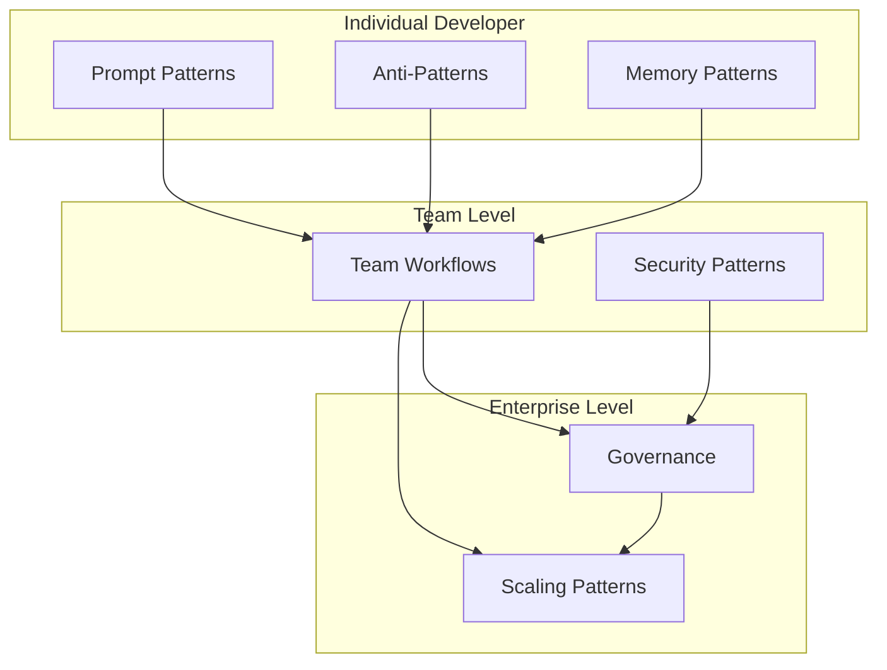
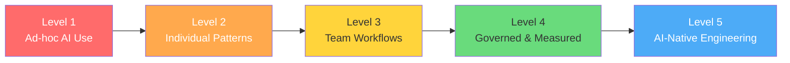

# Patterns & Anti-Patterns for AI-Assisted Development

> A comprehensive reference library for teams and individuals practicing AI-assisted software development, from prompt engineering to enterprise governance.

---

## Overview

This directory contains battle-tested patterns, anti-patterns, workflows, and checklists for effective AI coding. Each file is designed to be standalone but cross-references related material where appropriate.

---

## File Index

| File | Scope | Description |
|------|-------|-------------|
| [`prompt_patterns.md`](prompt_patterns.md) | Individual | 20+ prompt patterns for effective AI coding (SPARC, CIF, Chain of Thought, etc.) |
| [`anti_patterns.md`](anti_patterns.md) | Individual | Common mistakes, failure modes, and what to avoid |
| [`memory_patterns.md`](memory_patterns.md) | Individual / Team | Memory bank patterns, context management, session continuity |
| [`team_workflows.md`](team_workflows.md) | Team | Shared CLAUDE.md, PR review with AI, pair programming patterns |
| [`security_patterns.md`](security_patterns.md) | Team / Enterprise | Security checklist for AI-generated code, OWASP, supply chain |
| [`governance.md`](governance.md) | Enterprise | AI coding governance policies, audit trails, compliance |
| [`scaling_patterns.md`](scaling_patterns.md) | All levels | Scaling AI coding from individual to team to enterprise |

---

## How to Use This Library

### For Individual Developers
1. Start with **Prompt Patterns** to level up your AI interactions
2. Read **Anti-Patterns** to avoid common pitfalls
3. Implement **Memory Patterns** for session continuity

### For Team Leads
1. Adopt **Team Workflows** for shared standards
2. Enforce **Security Patterns** in your review process
3. Use **Scaling Patterns** to onboard the team

### For Enterprise Architects
1. Implement **Governance** frameworks for compliance
2. Use **Scaling Patterns** for organization-wide rollout
3. Combine **Security Patterns** with existing AppSec programs

---

## Maturity Model

| Level | What It Looks Like | Key Files |
|-------|-------------------|-----------|
| 1 - Ad-hoc | Developers use AI tools without guidelines | Start with `anti_patterns.md` |
| 2 - Individual | Developers follow prompt patterns, avoid anti-patterns | `prompt_patterns.md`, `memory_patterns.md` |
| 3 - Team | Shared CLAUDE.md, consistent workflows, AI-aware code review | `team_workflows.md`, `security_patterns.md` |
| 4 - Governed | Policies, audit trails, compliance, metrics | `governance.md` |
| 5 - AI-Native | Full agentic engineering with multi-agent teams | `scaling_patterns.md` |

---

## Contributing

When adding new patterns:
1. Place them in the most specific applicable file
2. Include a concrete example (not just theory)
3. Add a mermaid diagram if the pattern involves a workflow or decision
4. Cross-reference related patterns in other files
5. Tag with maturity level (Individual / Team / Enterprise)

---

## Sources & References

These patterns are synthesized from industry research, Anthropic documentation, OWASP frameworks, and real-world team experiences as of March 2026. Key sources include:

- [Anthropic's 2026 Agentic Coding Trends Report](https://resources.anthropic.com/2026-agentic-coding-trends-report)
- [Claude Code Best Practices Documentation](https://code.claude.com/docs/en/best-practices)
- [OWASP AI Exchange](https://owaspai.org/docs/ai_security_overview/)
- [SPARC Framework](https://github.com/ruvnet/sparc)
- [Agentic AI Coding Best Practices (CodeScene)](https://codescene.com/blog/agentic-ai-coding-best-practice-patterns-for-speed-with-quality)
- [GitHub AI Governance Pathways](https://resources.github.com/learn/pathways/copilot/essentials/empower-developers-with-ai-policy-and-governance/)
