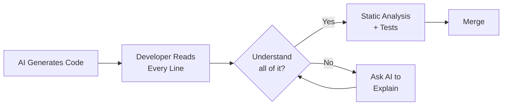
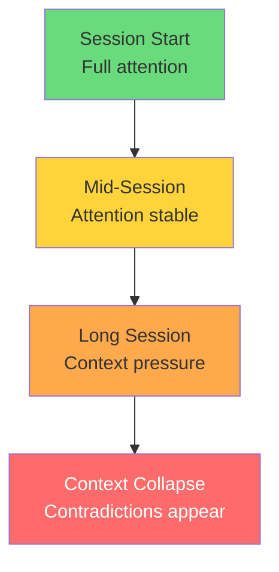
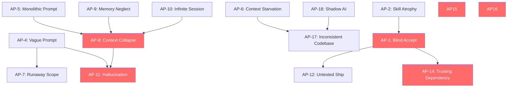

# Anti-Patterns in AI-Assisted Development

> What to avoid when coding with AI. Each anti-pattern includes a description, why it is dangerous, real-world consequences, and how to fix it.

---

## Table of Contents

1. [Over-Reliance Anti-Patterns](#over-reliance-anti-patterns)
2. [Prompt Anti-Patterns](#prompt-anti-patterns)
3. [Context & Memory Anti-Patterns](#context--memory-anti-patterns)
4. [Quality & Review Anti-Patterns](#quality--review-anti-patterns)
5. [Security Anti-Patterns](#security-anti-patterns)
6. [Team & Process Anti-Patterns](#team--process-anti-patterns)
7. [Anti-Pattern Detection Checklist](#anti-pattern-detection-checklist)

---

## Anti-Pattern Severity Scale

| Severity | Meaning | Action Required |
|----------|---------|----------------|
| CRITICAL | Can cause production incidents, data loss, or security breaches | Stop and fix immediately |
| HIGH | Accumulates significant technical debt or team dysfunction | Fix within current sprint |
| MEDIUM | Reduces effectiveness but not immediately dangerous | Plan to address |
| LOW | Suboptimal but livable | Improve opportunistically |

---

## Over-Reliance Anti-Patterns

### AP-1: The Blind Accept

**Severity: CRITICAL**

**What it looks like:** Accepting AI-generated code because it compiles and passes a superficial test, without understanding what it does.

**Why it is dangerous:** Code that runs is not necessarily correct, secure, or maintainable. AI models train on vast codebases that include outdated and vulnerable patterns. Studies show AI-authored pull requests contain 1.7x more issues than human-written code.

**Real-world consequence:** A developer accepts an AI-generated authentication flow that uses symmetric JWT signing with a hardcoded key. It works in tests but is trivially exploitable in production.

**The fix:**
- Read every line of AI-generated code as if you were reviewing a junior developer's PR
- Ask yourself: "Could I explain this code to someone else?"
- Run static analysis (SonarQube, Semgrep) on all AI output
- Only ask AI to write code you could write yourself (given unlimited time)

---

### AP-2: The Skill Atrophy Trap

**Severity: HIGH**

**What it looks like:** Developers stop learning fundamentals because "the AI handles that." Over time, they cannot debug AI output or evaluate correctness.

**Why it is dangerous:** When AI makes a mistake (and it will), no one on the team can catch it. Critical thinking and problem-solving skills degrade.

**The fix:**
- Maintain a rotation where developers write code from scratch regularly
- Use AI as a pair programmer, not a replacement programmer
- Review AI output as a learning exercise: "What pattern did it choose? Why? Is there a better one?"
- Set team standards: developers must be able to explain any code they commit

---

### AP-3: The Everything Hammer

**Severity: MEDIUM**

**What it looks like:** Using AI for tasks where it adds no value or actively makes things worse (e.g., simple file renames, trivial one-liners, tasks requiring deep institutional knowledge).

**Why it is dangerous:** Wastes context window, adds latency, creates over-engineered solutions for simple problems.

**The fix:**
- Define a "threshold of complexity" below which you just write the code
- Save AI for tasks where it genuinely accelerates: boilerplate, tests, multi-file refactors, unfamiliar APIs

---

## Prompt Anti-Patterns

### AP-4: The Vague Handwave

**Severity: HIGH**

**What it looks like:** "Make it better." "Fix the bug." "Add authentication."

**Why it is dangerous:** Ambiguous prompts produce ambiguous code. The AI fills in gaps with assumptions that may not match your intent, architecture, or constraints.

**Real-world consequence:** "Add authentication" produces a full OAuth2 implementation when you needed a simple API key check.

**The fix:**
- Use the CIF pattern (Context, Instruction, Format) at minimum
- Specify: what technology, what constraints, what the expected behavior is
- Bad: "Add caching"
- Good: "Add Redis caching to the getUser endpoint with a 5-minute TTL, cache invalidation on user update, and a fallback to database when Redis is unavailable. Use ioredis."

---

### AP-5: The Monolithic Prompt

**Severity: HIGH**

**What it looks like:** A single prompt asking the AI to build an entire feature with database schema, API routes, frontend components, tests, and deployment config.

**Why it is dangerous:** Exceeds the AI's ability to maintain coherence across all concerns. The later parts of the output degrade in quality. Errors in early decisions cascade.

**The fix:**
- Decompose into 3-7 focused prompts
- Use the SPARC framework or Incremental Complexity pattern
- Review output at each stage before proceeding
- Rule of thumb: if you would not review a 500-line PR in one pass, do not generate it in one prompt

---

### AP-6: The Context Starvation

**Severity: HIGH**

**What it looks like:** Asking the AI to write code without providing the relevant codebase context, conventions, or constraints.

**Why it is dangerous:** The AI invents its own conventions, uses different naming patterns, imports wrong modules, or duplicates existing utilities.

**The fix:**
- Always reference existing code: "Follow the pattern in src/services/userService.ts"
- Use CLAUDE.md to encode project conventions
- Provide the interface or type definition the code must conform to
- Show the AI the files it needs to read before asking for changes

---

### AP-7: The Runaway Scope

**Severity: MEDIUM**

**What it looks like:** The AI adds "helpful" extras you did not ask for — extra error handling, logging, metrics, comments, or entirely new features.

**Why it is dangerous:** Scope creep in AI output is harder to notice than scope creep in human work. Extra code means extra bugs, extra maintenance, and extra review burden.

**The fix:**
- Use Scope Fence prompting: explicitly state what to modify and what NOT to touch
- Use Negative Prompting: "Do NOT add logging, comments, or extra error handling beyond what I specify"
- Review diffs carefully for additions you did not request

---

## Context & Memory Anti-Patterns

### AP-8: Context Window Collapse

**Severity: CRITICAL**

**What it looks like:** In a long session, the AI begins contradicting its earlier architectural decisions, introducing inconsistent naming, or forgetting constraints it acknowledged earlier.

**Why it is dangerous:** The AI's attention degrades over long sessions. Code generated late in a session may be internally inconsistent with code generated earlier.

**Signs of context collapse:**
- Different naming conventions in the same file
- Re-importing modules already imported
- Contradicting a constraint it acknowledged earlier
- Hallucinating APIs or function signatures

**The fix:**
- Start new sessions for new tasks
- Use memory files (CLAUDE.md, context.md) to persist state across sessions
- For long tasks, periodically re-state key constraints
- Use the Checkpoint pattern to verify consistency

---

### AP-9: Memory Neglect

**Severity: HIGH**

**What it looks like:** Never updating CLAUDE.md or project memory files. Each session starts from zero. The AI re-discovers the same project conventions every time.

**Why it is dangerous:** Wastes context window on re-discovery. Produces inconsistent results across sessions.

**The fix:**
- Update CLAUDE.md when conventions are established or changed
- Use auto-memory features (Claude Code's `/memory` commands)
- Maintain a context.md with current project state
- See [memory_patterns.md](memory_patterns.md) for comprehensive strategies

---

### AP-10: The Infinite Session

**Severity: HIGH**

**What it looks like:** Running a single AI session for hours or days, hoping to maintain context through the entire feature.

**Why it is dangerous:** Leads to Context Window Collapse (AP-8). Long sessions accumulate stale context and conflicting instructions.

**The fix:**
- One session per task or sub-task
- Use git branches to isolate session work
- Save key decisions to memory files before ending a session
- Use the Checkpoint pattern to create clean handoff points

---

## Quality & Review Anti-Patterns

### AP-11: Hallucination Acceptance

**Severity: CRITICAL**

**What it looks like:** The AI references an API, package, or function that does not exist, and the developer uses it without verification.

**Common hallucinations:**
- Non-existent npm packages ("slopsquatting" — attackers register hallucinated package names)
- Invented API methods on real libraries
- Made-up configuration options
- Non-existent CLI flags

**The fix:**
- Verify every import and dependency against official documentation
- Run `npm audit` / `pip audit` on new dependencies
- Be especially suspicious of obscure packages with few downloads
- If you have not heard of a suggested library, look it up before installing it

---

### AP-12: The Untested Ship

**Severity: CRITICAL**

**What it looks like:** AI generates code that "looks right," so the developer ships it without tests.

**Why it is dangerous:** AI-generated code is more prone to subtle logic errors that are only caught by thorough testing. It often handles the happy path correctly but fails on edge cases.

**The fix:**
- Require tests for all AI-generated code (same standard as human code)
- Use Test-First prompting: write tests before asking for implementation
- Run the AI-generated tests, then write additional tests yourself
- AI-generated tests may miss the same edge cases as AI-generated code

---

### AP-13: The Cargo Cult Review

**Severity: HIGH**

**What it looks like:** Performing code review on AI output but only checking that it compiles and the tests pass, without understanding the logic.

**Why it is dangerous:** Creates a false sense of security. The review becomes rubber-stamping.

**The fix:**
- Limit review batches to 200-400 lines (industry standard for effective review)
- Use the Critique-Then-Fix prompt pattern to have AI assist with review
- Check for AI-specific issues: hallucinated imports, license violations, deprecated APIs
- Ask: "Why was this approach chosen over alternatives?"

---

## Security Anti-Patterns

### AP-14: The Trusting Dependency

**Severity: CRITICAL**

**What it looks like:** AI suggests a dependency and the developer installs it without checking its provenance, maintenance status, or known vulnerabilities.

**Why it is dangerous:** AI models frequently suggest dependencies with known CVEs or low-maintenance packages. Attackers have begun registering package names that AI commonly hallucinates.

**The fix:**
- Check every new dependency: last update, maintainer count, download stats, CVEs
- Use `npm audit`, `pip audit`, Snyk, or Dependabot
- Prefer well-known packages with active maintenance
- Have a pre-approved dependency list for your project
- See [security_patterns.md](security_patterns.md) for full checklist

---

### AP-15: The Hardcoded Secret

**Severity: CRITICAL**

**What it looks like:** AI generates code with placeholder secrets, API keys, or credentials, and they end up in version control.

**The fix:**
- Use pre-commit hooks to scan for secrets (gitleaks, trufflehog)
- Always use environment variables for secrets
- Add secret patterns to .gitignore
- Review every AI-generated config file for hardcoded values

---

### AP-16: The Insecure Default

**Severity: CRITICAL**

**What it looks like:** AI generates code with insecure defaults: CORS set to `*`, disabled CSRF protection, permissive file permissions, SQL string concatenation.

**Why it is dangerous:** AI code frequently omits input sanitization, implements authentication with subtle flaws, or uses outdated security patterns from its training data.

**The fix:**
- Maintain a security requirements section in CLAUDE.md
- Use the RICE pattern with a security reviewer role
- Run SAST tools on all AI output
- See [security_patterns.md](security_patterns.md) for OWASP checklist

---

## Team & Process Anti-Patterns

### AP-17: The Inconsistent Codebase

**Severity: HIGH**

**What it looks like:** Different team members use different prompting styles, and the AI produces code in different styles across the codebase. No shared CLAUDE.md or conventions.

**The fix:**
- Establish a shared CLAUDE.md with coding standards
- Use linters and formatters (enforced by pre-commit hooks)
- Create shared custom commands for common tasks
- See [team_workflows.md](team_workflows.md) for team setup

---

### AP-18: The Shadow AI

**Severity: HIGH**

**What it looks like:** Developers use AI tools without telling the team, leading to untracked AI-generated code with no review standards.

**Why it is dangerous:** No visibility into AI usage makes it impossible to audit quality, manage risk, or improve team practices.

**The fix:**
- Establish transparency requirements: document AI tool usage
- Tag AI-generated code in commit messages or PR descriptions
- Create an approved tools list
- See [governance.md](governance.md) for enterprise policies

---

### AP-19: The Open Source Flood

**Severity: MEDIUM**

**What it looks like:** Using AI to mass-generate PRs to open source projects. Low-quality submissions overwhelm maintainers.

**Why it is dangerous:** Damages the open source ecosystem. Maintainers report "good first issue" tickets being inundated with low-quality vibe-coded submissions. Many projects now reject suspected AI-generated contributions.

**The fix:**
- AI-assisted contributions must meet the same quality bar as human contributions
- Disclose AI usage in PRs
- Review and test thoroughly before submitting
- Respect maintainer guidelines

---

### AP-20: The Documentation Mirage

**Severity: MEDIUM**

**What it looks like:** AI generates extensive documentation that looks comprehensive but describes what the code should do rather than what it actually does.

**Why it is dangerous:** Creates false confidence. Outdated or inaccurate documentation is worse than no documentation.

**The fix:**
- Generate documentation from code, not alongside code
- Verify all AI-generated docs against actual implementation
- Use doc-testing tools where possible (doctests, example verification)
- Keep docs close to code (JSDoc/docstrings over separate files)

---

## Anti-Pattern Detection Checklist

Use this checklist in your code review process to catch AI-specific anti-patterns.

### Before Merging AI-Generated Code

- [ ] **Understand**: Can you explain every line of the generated code?
- [ ] **Verify imports**: Do all imported packages exist? Are versions current?
- [ ] **Check for secrets**: No hardcoded keys, tokens, passwords, or connection strings?
- [ ] **Validate APIs**: Are all function calls and methods real (not hallucinated)?
- [ ] **Review security**: Input validation, output encoding, auth checks present?
- [ ] **Test coverage**: Tests exist and cover edge cases (not just happy path)?
- [ ] **Scope check**: No unrequested additions or changes to other files?
- [ ] **Convention check**: Follows project naming, structure, and style conventions?
- [ ] **Dependency check**: Any new dependencies audited for CVEs and maintenance status?
- [ ] **License check**: No code that could violate licensing requirements?

### During Session

- [ ] **Context freshness**: Has the session been running for more than 1-2 hours?
- [ ] **Consistency check**: Are naming conventions and patterns consistent throughout?
- [ ] **Memory updated**: Have key decisions been saved to memory files?
- [ ] **Scope managed**: Have you explicitly stated what is in and out of scope?

---

## Anti-Pattern Relationship Map

---

## Sources

- [Vibe Coding Could Cause Catastrophic Explosions in 2026 (The New Stack)](https://thenewstack.io/vibe-coding-could-cause-catastrophic-explosions-in-2026/)
- [How to Secure Vibe Coded Applications (DEV Community)](https://dev.to/devin-rosario/how-to-secure-vibe-coded-applications-in-2026-208d)
- [AI Vibe Coding Threatens Open Source (InfoQ)](https://www.infoq.com/news/2026/02/ai-floods-close-projects/)
- [AI Code Review Checklist (ClackyAI)](https://clacky.ai/blog/code-review-checklist-ai-generated-code)
- [Practical Use of AI Coding Tools for the Responsible Developer (Smashing Magazine)](https://www.smashingmagazine.com/2026/01/practical-use-ai-coding-tools-responsible-developer/)
- [Vibe Coding Pros and Cons 2026 (Volumetree)](https://www.volumetree.com/2026/03/05/vibe-coding-pros-cons-2026/)
