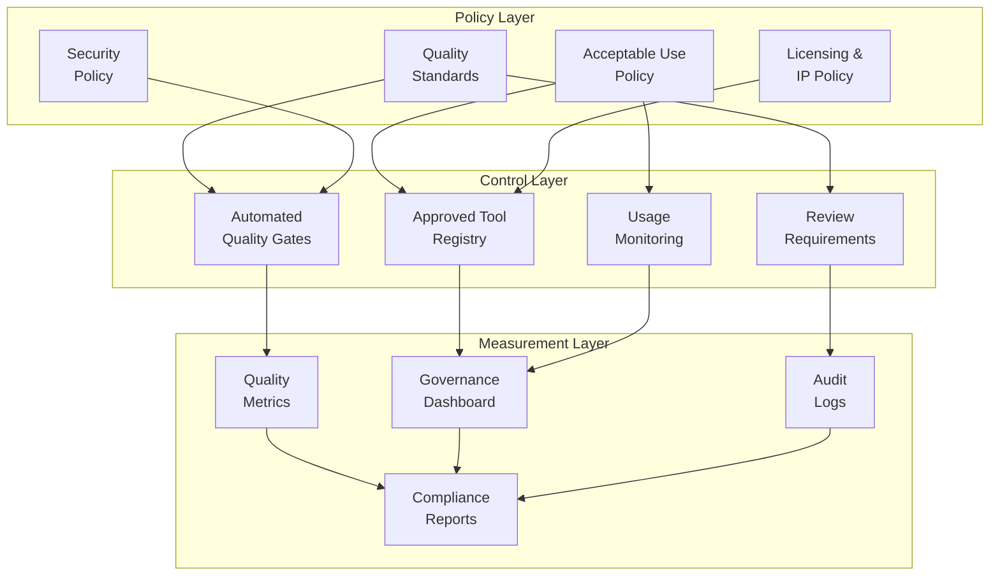
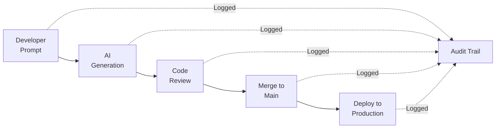
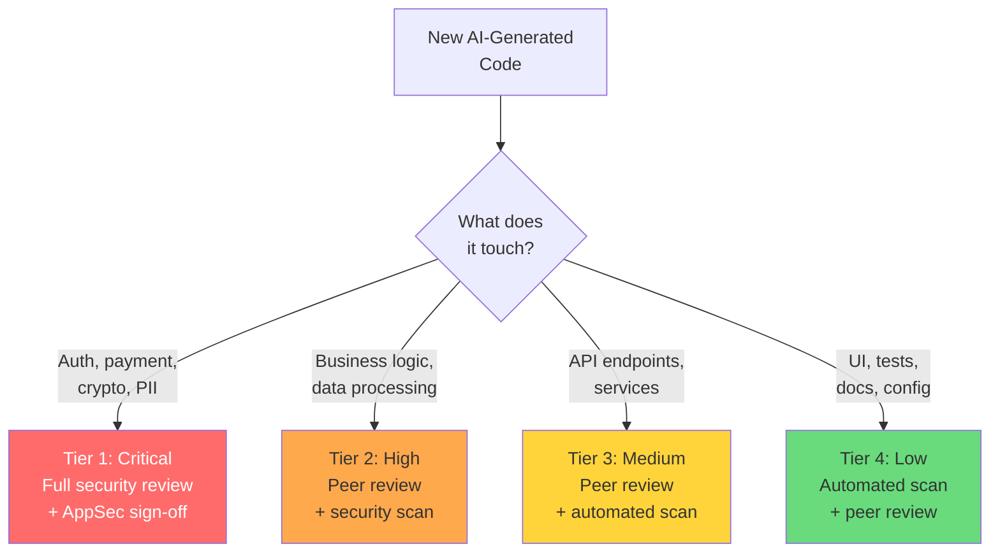
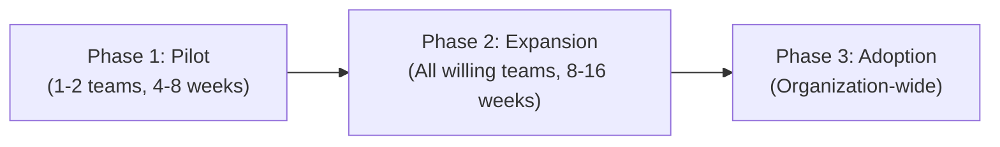

# AI Coding Governance for Enterprises

> Policies, audit trails, compliance frameworks, and oversight mechanisms for organizations adopting AI-assisted development at scale.

---

## Table of Contents

1. [Why Governance Matters](#why-governance-matters)
2. [Governance Framework Architecture](#governance-framework-architecture)
3. [Policy Templates](#policy-templates)
4. [Audit Trails and Traceability](#audit-trails-and-traceability)
5. [Compliance Mapping](#compliance-mapping)
6. [Risk Classification](#risk-classification)
7. [Metrics and Measurement](#metrics-and-measurement)
8. [Rollout Phases](#rollout-phases)
9. [Governance Checklist](#governance-checklist)

---

## Why Governance Matters

78% of organizations using AI coding assistants report higher developer productivity, and 72% point to faster time-to-market. However, 65% report that AI coding assistants increase risk. As of 2025, only 9% of enterprises have reached a "Ready" level of AI governance maturity (Deloitte).

Without governance:
- No visibility into what AI tools are being used and how
- No standard quality bar for AI-generated code
- No audit trail for compliance and incident response
- Inconsistent practices across teams multiply risk
- Liability and IP exposure from unmonitored AI usage

---

## Governance Framework Architecture



---

## Policy Templates

### 1. Acceptable Use Policy

**Purpose:** Define which AI tools are permitted, for what purposes, and with what restrictions.

```markdown
# AI Coding Tools - Acceptable Use Policy

## Approved Tools
| Tool | Version | Approved Use | Restrictions |
|------|---------|-------------|--------------|
| Claude Code | Latest | All development | No production secrets in prompts |
| GitHub Copilot | Business | Code completion | Enterprise plan only |
| [Custom tool] | [Version] | [Scope] | [Limits] |

## Permitted Use Cases
- Code generation and completion
- Code review assistance
- Test generation
- Documentation generation
- Debugging and analysis
- Refactoring suggestions

## Prohibited Use Cases
- Generating code for security-critical systems without human review
- Feeding proprietary algorithms or trade secrets into non-enterprise AI tools
- Using AI output without code review
- Generating code that processes PII without privacy review
- Bypassing code review by attributing AI code as human-written

## Developer Responsibilities
1. All AI-generated code must pass the same review standards as human code
2. AI usage must be disclosed in PR descriptions
3. Developers must understand all code they commit (no blind accepts)
4. New dependencies suggested by AI must be verified and audited
5. Security-critical code requires additional human review regardless of AI assistance
```

---

### 2. Quality Standards Policy

```markdown
# AI Code Quality Standards

## Minimum Requirements for All AI-Generated Code
- [ ] Passes all existing tests
- [ ] Includes new tests for new functionality
- [ ] Passes static analysis (zero Critical/High findings)
- [ ] Passes dependency audit (no known CVEs)
- [ ] Follows project coding standards (CLAUDE.md compliance)
- [ ] Reviewed by at least one human developer who understands the code

## Enhanced Requirements for Sensitive Code
Authentication, authorization, payment, PII handling, cryptography:
- [ ] Reviewed by a security champion or AppSec engineer
- [ ] Threat model updated
- [ ] Penetration testing scope updated
- [ ] Additional test cases for abuse scenarios

## Code Health Metrics
AI code must meet or exceed these thresholds:
- Test coverage: >= [N]% (same as human code)
- Cyclomatic complexity: <= [N]
- No TODO/FIXME without linked tickets
- No suppressed linter rules without justification
```

---

### 3. IP and Licensing Policy

```markdown
# AI-Generated Code - IP and Licensing

## Code Ownership
- AI-generated code committed to company repositories is company property
- The developer who prompts, reviews, and commits the code is responsible for it

## License Compliance
- AI-generated code must not violate open source licenses
- If AI output resembles a specific open source project, verify compatibility
- Run license scanning tools on all new dependencies
- Copyleft license contamination must be caught before merge

## Attribution
- AI tool usage should be noted in PR descriptions (not in code comments)
- Do not attribute AI-generated code to a specific human author in comments
- Maintain records of which code was AI-assisted for compliance audits

## Data Protection
- Do not paste proprietary code, trade secrets, or customer data into non-enterprise AI tools
- Use enterprise-tier AI tools with data retention and privacy guarantees
- Audit what data flows to AI providers periodically
```

---

## Audit Trails and Traceability

### What to Log

Every AI code generation event should have a traceable path from prompt to production.



### Audit Log Schema

| Field | Description | Example |
|-------|-------------|---------|
| `timestamp` | ISO 8601 timestamp | `2026-03-22T14:30:00Z` |
| `developer` | Who initiated the AI interaction | `jane.doe@company.com` |
| `tool` | Which AI tool was used | `claude-code-v2` |
| `model_version` | Model version used | `claude-sonnet-4-20260514` |
| `task_type` | Category of task | `code-generation` |
| `files_affected` | Which files were created or modified | `src/auth/login.ts` |
| `review_status` | Whether it was reviewed | `peer-reviewed` |
| `reviewer` | Who reviewed it | `john.smith@company.com` |
| `pr_number` | Associated pull request | `#1234` |
| `security_scan` | SAST/DAST results | `pass` |

### Implementation Approaches

**Minimal (Git-based):**
- Enforce PR descriptions that include AI disclosure
- Use git commit trailers: `AI-Assisted-By: claude-code`
- Review git logs for compliance audits

**Standard (CI-based):**
- CI pipeline extracts AI usage metadata from PRs
- Store in a structured database
- Generate periodic compliance reports

**Enterprise (Platform-based):**
- Centralized AI governance platform (Augment, Coder, Knostic)
- Real-time dashboards for usage, risk, and compliance
- Automated policy enforcement at the PR level

---

## Compliance Mapping

### How AI Coding Governance Maps to Regulations

| Regulation | Relevant AI Coding Concern | Governance Control |
|-----------|---------------------------|-------------------|
| **SOC 2** | Change management, access control | Audit trails, review requirements |
| **GDPR** | Data processing, privacy by design | No PII in prompts, privacy review for PII-handling code |
| **HIPAA** | Protected health information | Enhanced review for PHI systems, data flow audit |
| **PCI DSS** | Cardholder data security | Security review gate for payment code, dependency audit |
| **ISO 27001** | Information security management | Acceptable use policy, risk classification, monitoring |
| **SOX** | Financial reporting integrity | Audit trails for financial system code changes |
| **EU AI Act** | AI system transparency | AI usage disclosure, risk classification |

### Compliance-Ready Practices

1. **Traceability**: Every code change can be traced to a human decision-maker
2. **Review evidence**: All AI code has documented review records
3. **Tool inventory**: Complete list of AI tools in use with data handling details
4. **Risk assessment**: AI code in regulated systems has additional review gates
5. **Data handling**: Clear policies on what data flows to AI providers

---

## Risk Classification

### AI Code Risk Tiers



### Tier Definitions

| Tier | Scope | Review Requirement | Automation | SLA |
|------|-------|-------------------|------------|-----|
| 1 - Critical | Auth, payment, crypto, PII, admin | Security champion + peer | SAST + DAST + dependency | Before merge |
| 2 - High | Core business logic, data pipelines | Senior engineer peer review | SAST + dependency | Before merge |
| 3 - Medium | API routes, services, integrations | Peer review | SAST + dependency | Before merge |
| 4 - Low | UI components, tests, docs | Peer review (expedited) | SAST | Before merge |

---

## Metrics and Measurement

### Key Metrics to Track

**Usage Metrics:**
- Number of AI-assisted PRs per team per sprint
- Percentage of code that is AI-generated vs. human-written
- AI tool adoption rate across teams
- Most common AI use cases (generation, review, testing, docs)

**Quality Metrics:**
- Defect rate in AI-generated code vs. human code
- Security findings in AI-generated code vs. human code
- Time to merge for AI-assisted PRs
- Rework rate (how often AI code is modified in follow-up PRs)

**Compliance Metrics:**
- Percentage of PRs with AI disclosure
- Percentage of AI code passing all automated gates
- Number of policy violations detected
- Mean time to resolve policy violations

### Governance Dashboard

```markdown
## Monthly AI Coding Governance Report

### Usage Summary
- Total AI-assisted PRs: [N]
- Teams using AI tools: [N] / [Total]
- AI contribution estimate: [N]% of new code

### Quality Summary
- AI code defect rate: [N] per 1000 LOC (target: <= [N])
- Security findings (Critical/High): [N] (target: 0)
- Automated gate pass rate: [N]%

### Compliance Summary
- AI disclosure compliance: [N]%
- Policy violations this month: [N]
- Open violations: [N]

### Trends
[Mermaid chart showing metrics over time]
```

---

## Rollout Phases

### Three-Phase Adoption



### Phase 1: Pilot (4-8 weeks)

**Goals:** Validate tools, establish baseline policies, measure impact.

- [ ] Select 1-2 teams (one experienced, one eager)
- [ ] Deploy approved AI tools with enterprise configuration
- [ ] Establish baseline quality and velocity metrics
- [ ] Draft initial acceptable use policy
- [ ] Set up basic audit logging
- [ ] Run weekly retrospectives on AI effectiveness
- [ ] Document lessons learned

**Success criteria:** Measurable productivity improvement without quality regression.

### Phase 2: Expansion (8-16 weeks)

**Goals:** Scale to multiple teams, refine policies, automate governance.

- [ ] Onboard willing teams with training program
- [ ] Formalize policies based on pilot learnings
- [ ] Deploy automated quality gates in CI/CD
- [ ] Establish governance dashboard
- [ ] Create team-specific CLAUDE.md templates
- [ ] Train security champions on AI-specific risks
- [ ] Build custom commands library

**Success criteria:** Consistent practices across teams, automated enforcement working.

### Phase 3: Adoption (Ongoing)

**Goals:** Organization-wide standards, continuous improvement.

- [ ] Mandatory training for all developers
- [ ] Full compliance monitoring and reporting
- [ ] Integration with existing GRC tools
- [ ] Regular policy review cadence (quarterly)
- [ ] Advanced metrics and optimization
- [ ] Contribution to industry standards

**Success criteria:** AI coding is a governed, measured, continuously improving practice.

---

## Governance Checklist

### Foundation (Do First)

- [ ] Acceptable use policy written and communicated
- [ ] Approved tool list established
- [ ] AI usage disclosure requirement in PRs
- [ ] Basic audit trail (git-based minimum)
- [ ] Security scanning in CI pipeline
- [ ] Developer training on AI coding best practices

### Standard (Do Next)

- [ ] Quality standards policy formalized
- [ ] IP and licensing policy in place
- [ ] Risk classification for AI code
- [ ] Governance dashboard operational
- [ ] Automated policy enforcement in CI
- [ ] Regular compliance reporting

### Advanced (Mature State)

- [ ] Full traceability from prompt to production
- [ ] Integration with GRC tools
- [ ] Advanced metrics and trend analysis
- [ ] Cross-team consistency measurement
- [ ] Continuous policy improvement process
- [ ] External audit readiness

---

## Sources

- [AI Code Governance Framework for Enterprise Dev Teams (Augment Code)](https://www.augmentcode.com/guides/ai-code-governance-framework-for-enterprise-dev-teams)
- [Creating an AI Governance Framework (GitHub Resources)](https://resources.github.com/learn/pathways/copilot/essentials/empower-developers-with-ai-policy-and-governance/)
- [Governance for Your AI Coding Assistant (Knostic)](https://www.knostic.ai/blog/ai-coding-assistant-governance)
- [What Is AI Governance? (IBM)](https://www.ibm.com/think/topics/ai-governance)
- [AI Governance Add-On (Coder)](https://coder.com/docs/ai-coder/ai-governance)
- [What Is AI Governance? (Cycode)](https://cycode.com/blog/what-is-ai-governance/)
- [AI Code Generation: Best Practices for Enterprise Adoption (getdx)](https://getdx.com/blog/ai-code-enterprise-adoption/)
- [2026 Agentic Coding Trends Report (Anthropic)](https://resources.anthropic.com/2026-agentic-coding-trends-report)
