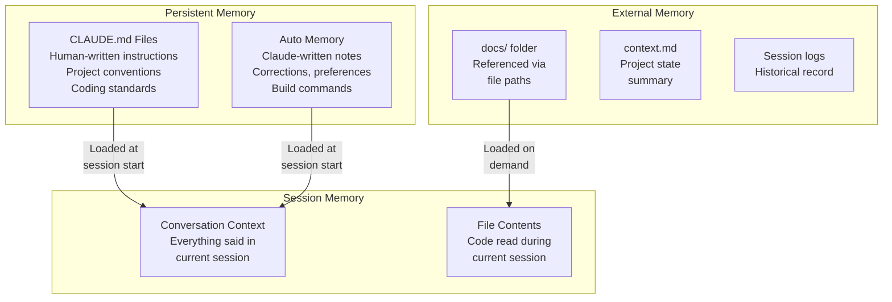
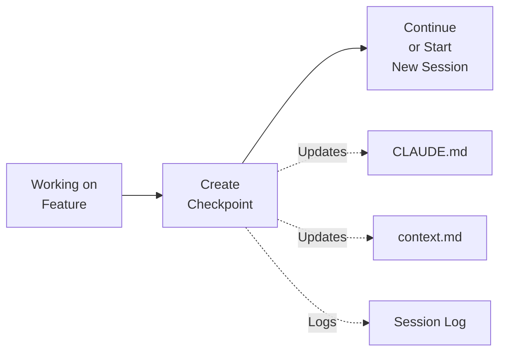
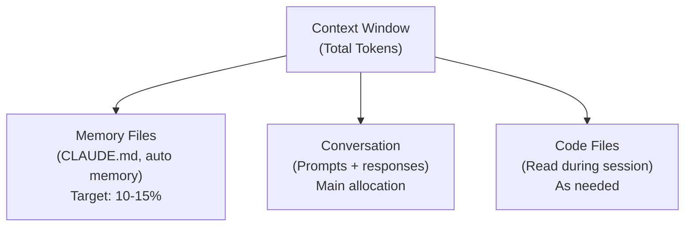
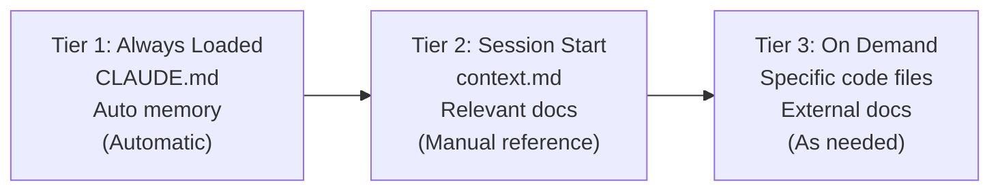
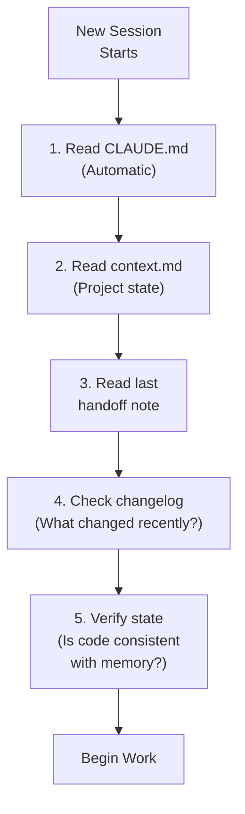
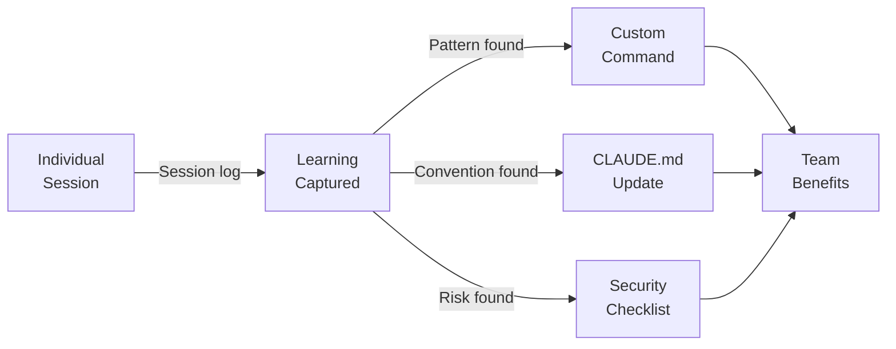
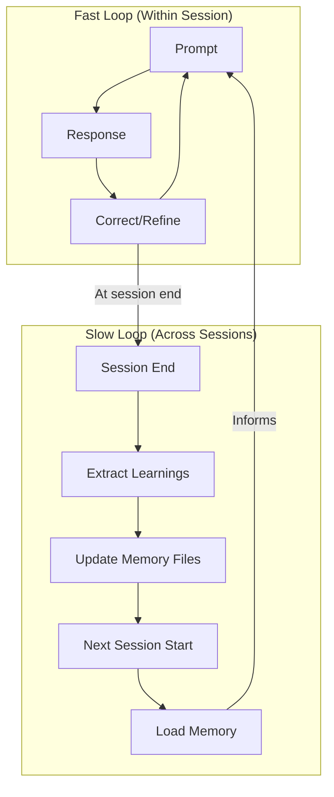

# Memory Patterns for AI Coding

> Memory bank patterns, context management strategies, and session continuity techniques for maintaining coherent AI-assisted development across sessions, tasks, and team members.

---

## Table of Contents

1. [How AI Memory Works](#how-ai-memory-works)
2. [Memory Architecture Patterns](#memory-architecture-patterns)
3. [Context Management Strategies](#context-management-strategies)
4. [Session Continuity Patterns](#session-continuity-patterns)
5. [Team Memory Patterns](#team-memory-patterns)
6. [Advanced Memory Techniques](#advanced-memory-techniques)
7. [Memory Anti-Patterns](#memory-anti-patterns)
8. [Memory Management Checklist](#memory-management-checklist)

---

## How AI Memory Works

AI coding assistants have no persistent memory between sessions by default. Every new session starts with a blank slate. Memory systems are external mechanisms that bridge this gap.

### Claude Code Memory Systems

Claude Code provides two complementary memory systems:



**CLAUDE.md files:** Human-written, checked into git. Loaded hierarchically from the working directory upward. Contains project conventions, rules, and instructions.

**Auto memory:** Claude writes notes itself based on corrections and preferences. Activated when Claude detects information useful for future sessions: build commands, debugging insights, architecture notes, code style preferences.

---

## Memory Architecture Patterns

### Pattern 1: The Hierarchical Memory Bank

Use CLAUDE.md file hierarchy to scope memory by directory.

```
CLAUDE.md                      # Project-wide: tech stack, conventions, git rules
src/CLAUDE.md                  # Source code: import patterns, error handling
src/frontend/CLAUDE.md         # Frontend: component patterns, state management
src/backend/CLAUDE.md          # Backend: API conventions, DB patterns
src/backend/auth/CLAUDE.md     # Auth: security requirements, token handling
tests/CLAUDE.md                # Testing: frameworks, mocking, coverage rules
infra/CLAUDE.md                # Infrastructure: deployment, environment config
```

**How it works:** Claude searches upward from the current working directory and loads every CLAUDE.md found. Subdirectory files only load when Claude accesses files in those directories, saving tokens.

**When to use:** Large projects with distinct domains that have different conventions.

**Key benefit:** Developers working on the frontend never load backend rules (and vice versa), keeping context focused.

---

### Pattern 2: The Bootstrap Pattern

Generate a comprehensive initial CLAUDE.md by having Claude analyze your codebase.

**Template:**
```
Analyze this codebase and generate a CLAUDE.md that captures:

1. Tech stack and versions
2. Project structure and what lives where
3. Build, test, and deploy commands
4. Coding conventions you observe in existing code
5. Common patterns used (error handling, logging, auth)
6. Things to avoid (based on comments, TODOs, deprecated code)

Format as a CLAUDE.md file I can commit to the repo root.
```

**When to use:** Starting AI-assisted development on an existing project. Like having Claude "interview" your codebase.

---

### Pattern 3: The Checkpoint Pattern

Create explicit memory snapshots before major changes.



**Template:**
```
Before we end this session, update the project memory:

1. What architectural decisions were made today?
2. What conventions were established or changed?
3. What is the current state of the feature being developed?
4. What should the next session start with?

Update CLAUDE.md with any new conventions.
Write a handoff note for the next session.
```

**When to use:** Before ending a session that made significant architectural decisions or established new patterns.

---

### Pattern 4: The Conditional Memory Pattern

Use YAML frontmatter to scope rules to specific files.

```markdown
---
paths:
  - "src/auth/**"
  - "src/middleware/auth*"
---

# Authentication Module Rules

- All auth endpoints must use rate limiting
- JWT tokens must have expiration (max 1 hour)
- Use asymmetric signing (RS256)
- Never log tokens or passwords
- All auth changes require security review
```

**When to use:** Rules that only apply to specific code areas. Reduces noise in unrelated contexts.

---

### Pattern 5: The Reference Memory Pattern

Keep detailed documentation in `docs/` and reference it from CLAUDE.md instead of inlining everything.

```markdown
# CLAUDE.md

## Architecture
See docs/architecture.md for system design details.

## API Conventions
See docs/api-conventions.md for endpoint design rules.

## Database Patterns
See docs/database-patterns.md for migration and query conventions.
```

**Why:** Saves tokens by not loading detailed docs in every session. Claude reads referenced files only when needed.

**When to use:** Projects with extensive documentation that would bloat CLAUDE.md beyond 200-300 lines.

---

## Context Management Strategies

### Strategy 1: Token Budget Management

Context window is finite. Every token in memory is a token not available for code.



**Rules of thumb:**
- Root CLAUDE.md: Keep under 200 lines (essential rules only)
- Subdirectory CLAUDE.md: Keep under 50 lines each
- Total loaded memory: Aim for under 15% of context window
- Move detailed docs to referenced files (loaded on demand)

---

### Strategy 2: The Freshness Protocol

Stale memory causes wrong decisions. Keep memory current.

| Memory Type | Update Frequency | Trigger |
|-------------|-----------------|---------|
| CLAUDE.md (root) | Monthly or on convention changes | New team decision, recurring AI mistake |
| CLAUDE.md (subdirectory) | When that area changes significantly | Major refactor, new patterns adopted |
| context.md | Every session (start and end) | Always |
| Auto memory | Automatic | Claude detects useful info |
| Session logs | Every session | Always |

**Staleness indicators:**
- CLAUDE.md references files that no longer exist
- Rules mention deprecated libraries or patterns
- Conventions in CLAUDE.md conflict with actual codebase
- Claude keeps making mistakes that CLAUDE.md should prevent

---

### Strategy 3: The Three-Tier Context Load



**Tier 1 (Always):** CLAUDE.md files and auto memory. Loaded automatically. Keep lean.

**Tier 2 (Session start):** Read context.md and any relevant docs at the beginning of a session. Provides state awareness without bloating every interaction.

**Tier 3 (On demand):** Specific files read during task execution. Claude reads these naturally as it works.

---

## Session Continuity Patterns

### Pattern 1: The Handoff Note

Write a structured note at session end that the next session can pick up.

```markdown
# Session Handoff - 2026-03-22

## What Was Done
- Implemented user authentication (JWT + refresh tokens)
- Created middleware in src/middleware/auth.ts
- Added tests for happy path

## Current State
- Auth module is functional but needs:
  - Rate limiting on login endpoint
  - Account lockout after 5 failed attempts
  - Password reset flow

## Key Decisions Made
- Chose RS256 for JWT signing (see claudefiles/decisions/)
- Stored refresh tokens in database (not Redis) for simplicity
- Using httpOnly cookies (not localStorage)

## Next Session Should
1. Add rate limiting to POST /api/auth/login
2. Implement account lockout
3. Add integration tests for auth failure scenarios

## Files Modified
- src/middleware/auth.ts (new)
- src/routes/auth.ts (new)
- src/types/auth.ts (new)
- tests/auth.test.ts (new)
```

---

### Pattern 2: The Session Recovery Protocol

When starting a new session, reconstruct context from multiple sources.



**Template for session start:**
```
Starting a new session. Please:

1. Read context.md for project state
2. Read the most recent session log in learning/sessions/
3. Check claudefiles/changelog.md for recent changes
4. Verify the current state of files mentioned in the handoff

Then summarize where we are and confirm the plan for this session.
```

---

### Pattern 3: The Incremental Save Pattern

Save progress at natural breakpoints, not just at session end.

**When to save:**
- After a design decision is made
- After a module or component is completed
- After a significant debugging session
- When switching tasks within a session
- Before any risky operation (major refactor, dependency upgrade)

**What to save:**
- Update context.md with current state
- Log the decision in claudefiles/decisions/
- Update CLAUDE.md if new conventions were established

---

## Team Memory Patterns

### Pattern 1: The Shared Memory Standard

Every team member benefits from the same CLAUDE.md, and every team member contributes to it.

**Contribution workflow:**
1. Developer notices AI keeps making the same mistake
2. Developer adds a rule to CLAUDE.md
3. Change goes through PR review
4. All team members benefit immediately

**Quarterly review:**
- Are all rules still relevant?
- Are there rules that should be added based on recurring issues?
- Can any verbose rules be simplified?
- Are subdirectory CLAUDE.md files still accurate?

---

### Pattern 2: The Team Context File

A shared context.md that any team member can read to understand project state.

```markdown
# Project Context

## What This Project Is
[1-2 paragraph description]

## Current State (Updated: 2026-03-22)
- Sprint: [N]
- Active features: [list]
- Blocked items: [list]
- Tech debt: [list]

## Architecture
[Mermaid diagram of current system]

## Recent Changes
[Last 5 changelog entries]

## Team Conventions
[Link to CLAUDE.md]

## Open Questions
[Decisions pending]
```

---

### Pattern 3: The Knowledge Capture Pipeline



Every session is an opportunity to capture knowledge that benefits the whole team.

---

## Advanced Memory Techniques

### Technique 1: Scoped Auto Memory

Claude's auto memory captures preferences and corrections. Guide it by being explicit:

```
Remember this for future sessions: when working in the payments module,
always use decimal types (not float) for money values, and always
include currency codes.
```

This creates a targeted memory entry that applies contextually.

---

### Technique 2: The Memory Bank MCP

For teams needing structured, queryable memory beyond CLAUDE.md, Memory Bank MCP servers provide:

- Structured storage of project knowledge
- Queryable memory across sessions
- Automatic context injection based on task

**Use case:** Large projects where CLAUDE.md would be too bloated to hold all necessary context.

---

### Technique 3: The Dual-Loop Memory System



**Fast loop:** Within a session, iteratively refine outputs through corrections. Claude's in-session memory handles this.

**Slow loop:** Across sessions, extract patterns and update persistent memory files. This is where CLAUDE.md, context.md, and session logs come in.

---

### Technique 4: Context Window Monitoring

Watch for signs that context is becoming strained:

| Signal | What It Means | Action |
|--------|--------------|--------|
| AI starts contradicting earlier decisions | Context window pressure | Start new session |
| Naming conventions become inconsistent | Attention degradation | Re-state key constraints |
| AI "forgets" a file it read earlier | Context limit reached | Reference the file again |
| Responses become shorter or less detailed | Near capacity | Start new session |
| AI re-suggests something you already rejected | Context loss | Start new session with handoff |

---

## Memory Anti-Patterns

### MAP-1: The Memory Hoarder

Putting everything into CLAUDE.md, making it thousands of lines. This wastes tokens on every session.

**Fix:** Keep CLAUDE.md lean (under 200 lines). Move details to referenced docs.

### MAP-2: The Stale Memory

Never updating CLAUDE.md after conventions change. Claude follows outdated rules.

**Fix:** Treat CLAUDE.md as living documentation. Update when the codebase evolves.

### MAP-3: The Memory Orphan

Creating memory files that are never read or referenced. Wasted effort.

**Fix:** Every memory file should be in the CLAUDE.md hierarchy or explicitly referenced.

### MAP-4: The Session Amnesia

Never writing handoff notes. Each session re-discovers project state from scratch.

**Fix:** Always end sessions with a handoff note. Always start sessions by reading context.

### MAP-5: The Conflicting Memory

Different CLAUDE.md files giving contradictory instructions. Claude picks one unpredictably.

**Fix:** Treat subdirectory CLAUDE.md files as additive overrides, not contradictions. Root CLAUDE.md is the base; subdirectory files add specificity.

---

## Memory Management Checklist

### Session Start
- [ ] CLAUDE.md loaded (automatic)
- [ ] Read context.md for project state
- [ ] Read last session handoff note
- [ ] Verify memory is current (no stale references)

### During Session
- [ ] Save progress at natural breakpoints
- [ ] Update context.md when state changes significantly
- [ ] Note new conventions for CLAUDE.md update
- [ ] Watch for context degradation signals

### Session End
- [ ] Write handoff note for next session
- [ ] Update context.md with current state
- [ ] Update CLAUDE.md if conventions were established
- [ ] Log session to learning/sessions/

### Monthly Maintenance
- [ ] Review CLAUDE.md for stale rules (all levels)
- [ ] Archive old session logs (90+ days)
- [ ] Consolidate context.md (remove resolved items)
- [ ] Verify subdirectory CLAUDE.md files match codebase reality
- [ ] Check auto memory for outdated entries

---

## Sources

- [How Claude Remembers Your Project (Claude Code Docs)](https://code.claude.com/docs/en/memory)
- [Claude Code's Memory: Working with AI in Large Codebases](https://medium.com/@tl_99311/claude-codes-memory-working-with-ai-in-large-codebases-a948f66c2d7e)
- [Claude Code Best Practices: Memory Management](https://cuong.io/blog/2025/06/15-claude-code-best-practices-memory-management)
- [Claude Code Session Memory: Automatic Cross-Session Context](https://claudefa.st/blog/guide/mechanics/session-memory)
- [claude-memory-bank (GitHub)](https://github.com/russbeye/claude-memory-bank)
- [Memory Bank MCP Server](https://lobehub.com/mcp/spideynolove-memory-bank-mcp)
- [Claude Code Setup with CLAUDE.md Memory Bank System](https://github.com/centminmod/my-claude-code-setup)
