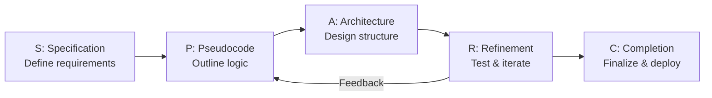
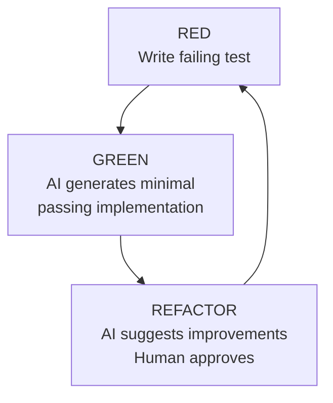
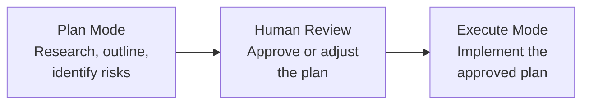
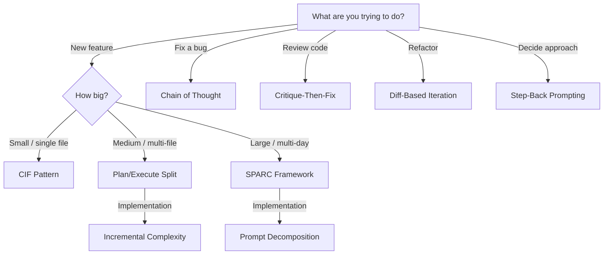

# Prompt Patterns for Effective AI Coding

> 20+ proven prompt patterns for getting high-quality code from AI assistants. Each pattern includes a description, when to use it, a template, and a concrete example.

---

## Table of Contents

1. [Foundational Frameworks](#foundational-frameworks)
2. [Reasoning Patterns](#reasoning-patterns)
3. [Specification Patterns](#specification-patterns)
4. [Iteration Patterns](#iteration-patterns)
5. [Collaboration Patterns](#collaboration-patterns)
6. [Meta Patterns](#meta-patterns)
7. [Quick Reference Card](#quick-reference-card)

---

## Foundational Frameworks

### 1. SPARC Framework

**Specification, Pseudocode, Architecture, Refinement, Completion**

The SPARC framework provides a phased approach to AI-assisted development that mirrors professional engineering methodology. It transforms vague requirements into structured, staged collaboration.



**When to use:** Any non-trivial feature or project. Especially valuable for multi-file changes.

**Template:**
```
Phase 1 - Specification:
I need a [system/feature] that [does X]. The key requirements are:
- [Requirement 1]
- [Requirement 2]
- Constraints: [language, framework, performance targets]

Phase 2 - Pseudocode:
Before writing code, outline the logical flow in pseudocode.
Include sequence, branching, and loop structures.

Phase 3 - Architecture:
Design the module structure, interfaces, and data flow.
Show how components interact.

Phase 4 - Refinement:
Review the implementation against requirements.
Add error handling, edge cases, and tests.

Phase 5 - Completion:
Finalize with documentation, deployment config, and monitoring.
```

**Example:**
```
Specification: I need a rate limiter middleware for Express.js that supports
per-user limits with Redis backing. It must handle 10,000 req/s and
degrade gracefully if Redis is unavailable.

Pseudocode first, then architecture, then implementation.
```

---

### 2. CIF Pattern (Context, Instruction, Format)

A structured prompt template that ensures the AI has everything it needs.

**When to use:** Every prompt. This is the minimum viable structure.

**Template:**
```
Context: [What the project is, relevant tech stack, current state]
Instruction: [What you want the AI to do, specifically]
Format: [How you want the output — code, markdown, diff, etc.]
```

**Example:**
```
Context: Next.js 14 app using App Router with Prisma ORM and PostgreSQL.
The User model has fields: id, email, name, role, createdAt.

Instruction: Create an API route at /api/users that supports GET (with
pagination and filtering by role) and POST (with Zod validation).

Format: Provide the route handler file and the Zod schema as separate
code blocks. Include error handling for all failure modes.
```

---

### 3. RICE Pattern (Role, Instruction, Context, Expectation)

Assigns a specific persona to the AI for domain-appropriate output.

**When to use:** When domain expertise matters (security reviews, performance optimization, accessibility audits).

**Template:**
```
Role: You are a [specific expert role].
Instruction: [Task description]
Context: [Relevant project information]
Expectation: [What success looks like, quality bar]
```

**Example:**
```
Role: You are a senior security engineer conducting a code review.
Instruction: Review this authentication module for vulnerabilities.
Context: This is a Node.js Express app handling OAuth2 flows with JWTs.
The tokens are stored in httpOnly cookies.
Expectation: Identify all OWASP Top 10 risks. For each finding, provide
severity (Critical/High/Medium/Low), the vulnerable code, and a fix.
```

---

## Reasoning Patterns

### 4. Chain of Thought (CoT) for Code

Forces step-by-step reasoning before code generation.

**When to use:** Complex algorithms, debugging, optimization decisions.

**Template:**
```
Think through this step by step before writing any code:

1. What are the inputs and expected outputs?
2. What are the edge cases?
3. What algorithm or data structure fits best and why?
4. What is the time/space complexity?
5. Now implement it.

Problem: [description]
```

**Example:**
```
Think through this step by step before writing any code:

1. What are the inputs and expected outputs?
2. What are the edge cases?
3. What algorithm fits best and why?
4. What is the time/space complexity?
5. Now implement it.

Problem: Given a stream of events with timestamps, find the maximum
number of concurrent events at any point in time. Events have a
start and end timestamp. The stream can have millions of events.
```

---

### 5. Structured Chain of Thought (SCoT)

Uses program structures (sequence, branch, loop) as reasoning scaffolds. This produces higher-quality code because the reasoning structure maps directly to code structure.

**When to use:** Code generation tasks where logic flow matters.

**Template:**
```
Before implementing, outline the logic using program structures:

SEQUENCE: [ordered steps]
BRANCH: [if/else conditions and their outcomes]
LOOP: [iterations, termination conditions]

Then implement based on this structure.
```

**Example:**
```
Before implementing the retry mechanism, outline using program structures:

SEQUENCE:
1. Receive request
2. Attempt operation
3. Return result or error

BRANCH:
- If success -> return result
- If retryable error -> enter retry loop
- If non-retryable error -> return error immediately

LOOP:
- While attempts < maxRetries AND error is retryable:
  - Wait (exponentialBackoff * attempt + jitter)
  - Retry operation
  - Increment attempt counter
- Exit when: success OR maxRetries reached OR non-retryable error

Now implement this as a TypeScript utility function with generics.
```

---

### 6. Step-Back Prompting

Ask the AI to consider high-level principles before diving into implementation.

**When to use:** Architectural decisions, choosing between approaches, design patterns.

**Template:**
```
Before solving this specific problem, step back and consider:
- What are the general principles that apply here?
- What patterns have proven effective for this class of problem?
- What are the trade-offs of different approaches?

Then apply those principles to: [specific problem]
```

---

### 7. Constraint-First Prompting

Lead with constraints to narrow the solution space.

**When to use:** When the AI tends to over-engineer or suggest inappropriate solutions.

**Template:**
```
Constraints (must follow all):
- No external dependencies beyond [X]
- Must work in [environment/runtime]
- Maximum [N] lines / [N]ms latency / [N]MB memory
- Must be backward-compatible with [version]

Given these constraints: [task description]
```

---

## Specification Patterns

### 8. Test-First Prompting

Provide tests before asking for implementation.

**When to use:** When you know the expected behavior clearly. Produces more correct code.

**Template:**
```
Here are the tests that must pass:

```[language]
[test code]
```

Write the implementation that makes all these tests pass.
Do not modify the tests.
```

---

### 9. Interface-First Prompting

Define the API contract before implementation.

**When to use:** Library design, API development, module boundaries.

**Template:**
```
Here is the interface/type definition:

```[language]
[interface/type definition]
```

Implement this interface. The implementation must:
- [Behavioral requirement 1]
- [Behavioral requirement 2]
- Handle these error cases: [list]
```

---

### 10. Example-Driven Prompting (Few-Shot for Code)

Provide input/output examples to define behavior.

**When to use:** Data transformations, parsing, formatting.

**Template:**
```
I need a function that transforms data as follows:

Input:  [example input 1]
Output: [example output 1]

Input:  [example input 2]
Output: [example output 2]

Input:  [example input 3 - edge case]
Output: [example output 3]

Implement this function in [language]. Handle edge cases gracefully.
```

---

### 11. Contract Prompting

Define preconditions, postconditions, and invariants.

**When to use:** Critical business logic, financial calculations, state machines.

**Template:**
```
Implement a function with these contracts:

Preconditions:
- [Input must satisfy X]
- [State must be Y]

Postconditions:
- [Output guarantees Z]
- [Side effects are limited to W]

Invariants:
- [Property P holds before and after execution]

Throw/return errors when preconditions are violated.
```

---

## Iteration Patterns

### 12. Red-Green-Refactor with AI

The classic TDD cycle adapted for AI pair programming.



**Template:**
```
Step 1: Here is a failing test: [test]
Step 2: Write the minimum code to make it pass.
Step 3: Now refactor for clarity and performance, keeping tests green.
```

---

### 13. Incremental Complexity

Build up from a simple version to the full solution.

**When to use:** Complex features that benefit from iterative development.

**Template:**
```
Let's build this incrementally:

V1 (MVP): [simplest version that works]
V2 (+ error handling): Add [specific error cases]
V3 (+ performance): Optimize for [specific metric]
V4 (+ edge cases): Handle [specific edge cases]

Start with V1. I'll review before moving to V2.
```

---

### 14. Diff-Based Iteration

Ask for changes as diffs rather than full file rewrites.

**When to use:** Modifying existing code. Reduces token usage and makes changes reviewable.

**Template:**
```
Here is the current code: [code or file reference]

Make the following change: [description]

Show only the diff (lines to add/remove/modify) with surrounding
context lines. Do not rewrite the entire file.
```

---

### 15. Critique-Then-Fix

Ask the AI to find problems in code before fixing them.

**When to use:** Code review, debugging, hardening.

**Template:**
```
Review this code and identify all issues:
- Bugs and logic errors
- Security vulnerabilities
- Performance problems
- Code style violations against [standard]

List each issue with severity. Then provide fixes for Critical and
High severity issues only.

[code]
```

---

## Collaboration Patterns

### 16. Plan Mode / Execute Mode Split

Separate planning from implementation.



**When to use:** Always for complex tasks. The #1 recommendation from Anthropic's own team.

**Template:**
```
[Plan Mode] Analyze this task and create a detailed implementation plan:
- Files to create or modify
- Key decisions and trade-offs
- Risks and mitigations
- Estimated complexity

Do NOT write any code yet. I will review the plan first.
```

Then after review:
```
[Execute Mode] Implement the plan we agreed on. Proceed file by file.
After each file, pause for my review.
```

---

### 17. Ping-Pong Pattern

Alternating turns between human and AI, each building on the other's work.

**When to use:** Interactive development sessions, exploratory coding.

**Flow:**
1. Human writes a test
2. AI writes implementation
3. Human reviews and adds another test
4. AI extends implementation
5. Repeat

---

### 18. Rubber Duck with Receipts

Use the AI as a sounding board, but demand it shows its work.

**Template:**
```
I'm thinking about [approach]. Before I commit to it:

1. What are the pros and cons?
2. What alternatives exist?
3. What would you recommend and why?
4. What could go wrong with each option?

Show your reasoning for each point.
```

---

### 19. Scope Fence

Explicitly limit what the AI should and should not touch.

**When to use:** When the AI tends to make changes outside the requested scope.

**Template:**
```
SCOPE:
- MODIFY: [files/functions to change]
- READ ONLY: [files to reference but not change]
- DO NOT TOUCH: [files/areas that are off limits]

Task: [description]
```

---

## Meta Patterns

### 20. Prompt Decomposition

Break a large task into smaller prompts that each produce a reviewable artifact.

**When to use:** Any task that would exceed 200 lines of output.

**Template:**
```
This is a large task. Let's decompose it:

Subtask 1: [description] -> Output: [expected artifact]
Subtask 2: [description] -> Output: [expected artifact]
Subtask 3: [description] -> Output: [expected artifact]

Start with Subtask 1 only.
```

---

### 21. Context Priming

Load the AI with project knowledge before asking for work.

**When to use:** Start of session, or when switching to a different area of the codebase.

**Template:**
```
Before we begin, read these files to understand the codebase:
- [file1] - [what it contains]
- [file2] - [what it contains]

Key conventions:
- [Convention 1]
- [Convention 2]

Now, with this context: [task]
```

---

### 22. Output Templating

Provide the exact structure you want the output in.

**When to use:** When you need consistent, parseable output.

**Template:**
```
Generate output in exactly this format:

## [Component Name]

### Purpose
[1-2 sentences]

### Interface
```[language]
[type definition]
```

### Implementation
```[language]
[code]
```

### Tests
```[language]
[test code]
```
```

---

### 23. Negative Prompting

Tell the AI what NOT to do.

**When to use:** When the AI repeatedly makes the same unwanted choices.

**Template:**
```
Do NOT:
- Use any deprecated APIs
- Add console.log statements
- Import lodash (use native methods)
- Use any patterns
- Create new files unless absolutely necessary

DO: [task description]
```

---

### 24. Checkpoint Prompting

Insert verification points in long tasks.

**When to use:** Multi-step implementations where errors compound.

**Template:**
```
Implement this in stages with checkpoints:

Stage 1: [description]
CHECKPOINT: Show me the output / run tests before continuing.

Stage 2: [description]
CHECKPOINT: Verify [specific condition] before continuing.

Stage 3: [description]
CHECKPOINT: Final verification against requirements.
```

---

## Quick Reference Card

| Pattern | Best For | Complexity |
|---------|----------|------------|
| CIF | Every prompt (baseline) | Low |
| SPARC | Full feature development | High |
| RICE | Domain-specific tasks | Medium |
| Chain of Thought | Algorithms, debugging | Medium |
| Structured CoT | Logic-heavy code | Medium |
| Step-Back | Architecture decisions | Medium |
| Constraint-First | Bounded implementations | Low |
| Test-First | Known behavior | Medium |
| Interface-First | API design | Medium |
| Example-Driven | Data transformations | Low |
| Contract Prompting | Critical business logic | High |
| Red-Green-Refactor | TDD workflows | Medium |
| Incremental | Complex features | Medium |
| Diff-Based | Modifying existing code | Low |
| Critique-Then-Fix | Code review | Medium |
| Plan/Execute Split | Complex tasks | Medium |
| Ping-Pong | Interactive sessions | Low |
| Rubber Duck | Decision-making | Low |
| Scope Fence | Targeted changes | Low |
| Prompt Decomposition | Large tasks | Medium |
| Context Priming | Session start | Low |
| Output Templating | Consistent output | Low |
| Negative Prompting | Correcting bad habits | Low |
| Checkpoint Prompting | Multi-step tasks | Medium |

---

## Pattern Selection Decision Tree



---

## Sources

- [SPARC Framework (GitHub)](https://github.com/ruvnet/sparc)
- [Structured Chain-of-Thought Prompting for Code Generation (ACM)](https://dl.acm.org/doi/10.1145/3690635)
- [Claude Code Best Practices](https://code.claude.com/docs/en/best-practices)
- [Vibe Coding Prompt Patterns (SitePoint)](https://www.sitepoint.com/vibe-coding-prompt-patterns/)
- [Chain-of-Thought Prompting Guide](https://www.promptingguide.ai/techniques/cot)
- [From Prompt to Product: How Vibe Coding Evolves into Agentic Engineering](https://medium.com/@dave-patten/from-prompt-to-product-how-vibe-coding-evolves-into-agentic-engineering-5427b46f9ef1)
