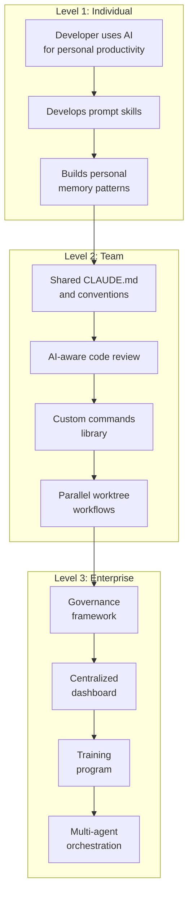
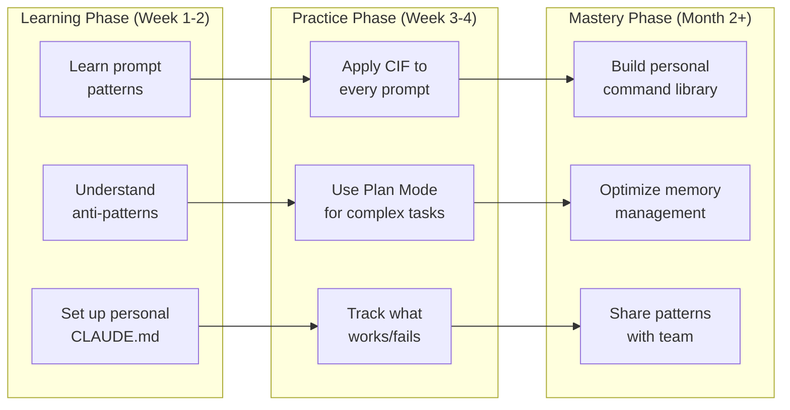
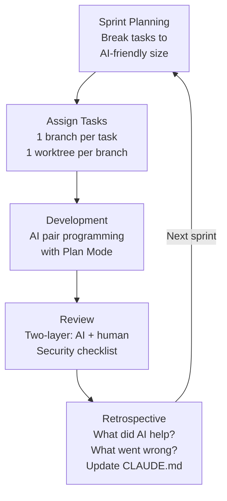
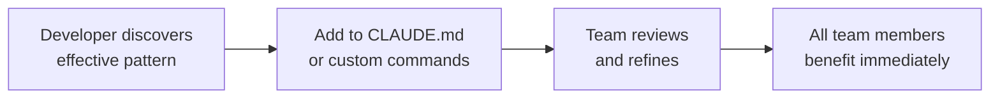
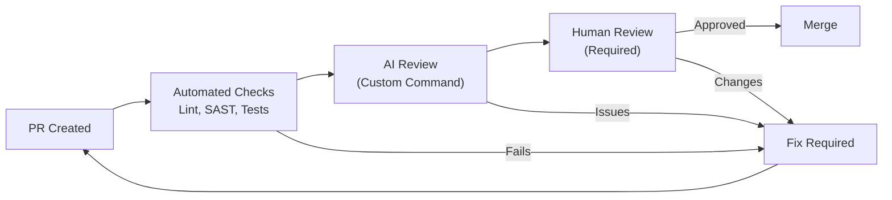
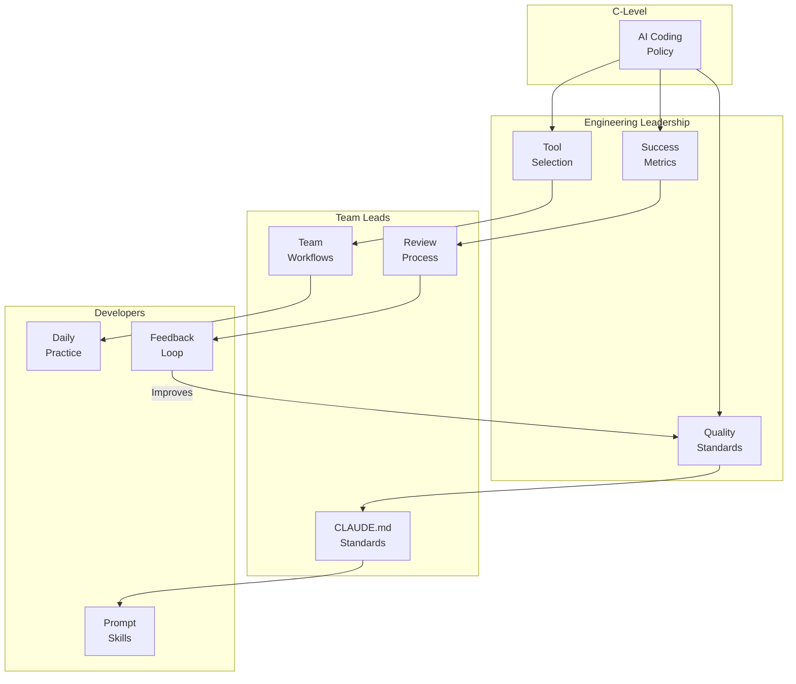
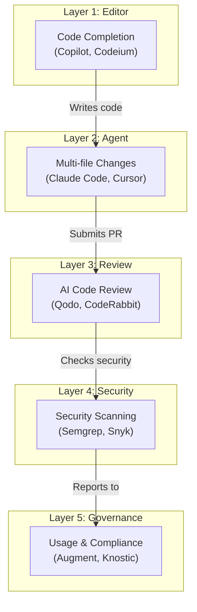
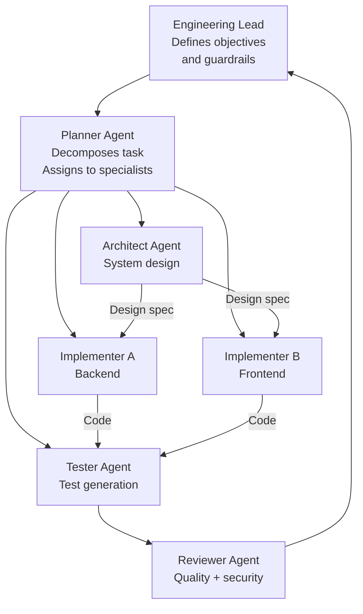
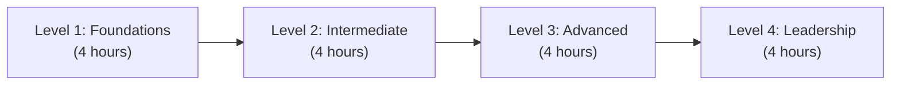

# Scaling AI Coding: Individual to Team to Enterprise

> Patterns for scaling AI-assisted development across organizational levels, from a single developer to multi-team enterprise adoption.

---

## Table of Contents

1. [The Scaling Journey](#the-scaling-journey)
2. [Individual Patterns](#individual-patterns)
3. [Team Patterns](#team-patterns)
4. [Enterprise Patterns](#enterprise-patterns)
5. [Tool Layering Strategy](#tool-layering-strategy)
6. [Training and Enablement](#training-and-enablement)
7. [Measuring Success at Each Level](#measuring-success-at-each-level)
8. [Common Scaling Failures](#common-scaling-failures)
9. [Scaling Checklist](#scaling-checklist)

---

## The Scaling Journey



### Key Principle: Discipline Over Tools

The difference between teams that thrive with AI coding tools and those that accumulate technical debt comes down to operating discipline, not tool selection. AI assistants are powerful junior contributors who need code review, not infallible machines.

---

## Individual Patterns

### The Personal Productivity Stack



### Highest ROI Use Cases for Individuals

Based on enterprise data, these use cases provide the highest return:

| Use Case | ROI | Why |
|----------|-----|-----|
| Stack trace analysis | Very High | AI excels at parsing and diagnosing errors |
| Test generation | Very High | Tedious for humans, natural for AI |
| Code refactoring | High | AI handles mechanical transformations well |
| Boilerplate generation | High | Repetitive code is AI's strength |
| Documentation | High | AI generates from code structure |
| Learning new APIs | High | AI provides contextual examples |
| Complex algorithms | Medium | Requires careful review |
| Architecture design | Medium | Good for brainstorming, needs human judgment |

### Personal CLAUDE.md Template

```markdown
# Personal Coding Preferences

## Style
- [Your preferred patterns, naming, formatting]

## Build & Test
- [Commands to build, test, lint your project]

## Common Tasks
- [Frequent tasks you want AI to handle consistently]

## Mistakes to Avoid
- [Patterns that have caused problems before]
```

---

## Team Patterns

### Pattern 1: The Shared Configuration Stack

Everything that makes AI behavior consistent across the team is checked into version control.

```
.claude/
  commands/
    review.md          # Team review command
    create-pr.md       # PR creation with team template
    add-tests.md       # Test generation with team conventions
    debug.md           # Debugging workflow
CLAUDE.md              # Root project conventions
src/
  CLAUDE.md            # Source-specific rules
  frontend/CLAUDE.md   # Frontend-specific rules
  backend/CLAUDE.md    # Backend-specific rules
tests/
  CLAUDE.md            # Testing conventions
```

**Rule:** CLAUDE.md changes go through code review, just like code.

---

### Pattern 2: The AI-Aware Sprint



**Task sizing for AI:** Break work into chunks that affect 1-3 files. Larger tasks should be decomposed into subtasks.

**Sprint retrospective additions:**
- What tasks benefited most from AI assistance?
- What AI-generated code had to be significantly reworked?
- Are there new anti-patterns to add to CLAUDE.md?
- What custom commands should be created?

---

### Pattern 3: Knowledge Amplification

When one developer learns something, the entire team benefits through shared configuration.



**Examples:**
- Developer finds AI keeps importing a deprecated module -> Add "Do NOT import X" to CLAUDE.md
- Developer creates effective test generation prompt -> Turn it into `.claude/commands/add-tests.md`
- Developer discovers AI handles database migrations poorly -> Add specific migration rules to `db/CLAUDE.md`

---

### Pattern 4: Parallel Worktree Fleet

Anthropic's team recommendation: run 3-5 git worktrees simultaneously, each with its own Claude session.

```bash
# Team setup script
#!/bin/bash
BRANCH=$1
TASK=$2

# Create worktree for the task
git worktree add "../project-${TASK}" "${BRANCH}"

# Start Claude in the worktree
cd "../project-${TASK}" && claude
```

**Coordination rules:**
- No two worktrees should modify the same file
- Each worktree has its own branch
- Merge through PRs, never directly
- Use a task board to track which worktree is doing what

---

### Pattern 5: The AI Code Review Pipeline



---

## Enterprise Patterns

### Pattern 1: The Governance Pyramid



---

### Pattern 2: The Platform Team Model

A dedicated platform team manages AI coding infrastructure for all product teams.

**Platform team responsibilities:**
- Maintain approved tool list and enterprise configurations
- Build and maintain shared CLAUDE.md templates
- Create and curate custom command libraries
- Operate the governance dashboard
- Run the training program
- Respond to security incidents involving AI code
- Evaluate new AI coding tools

**Product team responsibilities:**
- Follow established policies and workflows
- Customize CLAUDE.md for their domain
- Report issues and improvement suggestions
- Participate in training
- Maintain their own custom commands

---

### Pattern 3: The Tool Layering Architecture

Tools do not compete -- they layer. The best organizations define where each tool fits.



| Layer | Purpose | When Used |
|-------|---------|-----------|
| Editor completion | Speed up typing, inline suggestions | While writing code |
| Coding agent | Multi-file features, complex changes | Feature development |
| AI code review | Automated PR review | Every PR |
| Security scanning | Vulnerability detection | Every PR + CI pipeline |
| Governance | Usage tracking, policy enforcement | Continuous |

---

### Pattern 4: Multi-Agent Orchestration

At enterprise scale, coordinated squads of AI agents divide complex projects into parallel workstreams.



**Key principle:** Ownership of architecture, trade-offs, and outcomes remains human. AI agents handle first-pass execution; engineers review outputs for correctness, risk, and alignment.

---

### Pattern 5: The Inner Source Model

Large organizations treat shared AI coding patterns like inner source projects.

- Central repository of CLAUDE.md templates, custom commands, and patterns
- Teams contribute patterns that worked for them
- Pattern review board approves additions
- Regular "pattern harvest" sessions to extract reusable knowledge
- Internal documentation and training based on the shared library

---

## Training and Enablement

### Training Program Structure

Teams without proper AI prompting training see 60% lower productivity gains.



**Level 1 - Foundations (All developers):**
- What AI coding tools can and cannot do
- Prompt patterns: CIF, Chain of Thought
- Anti-patterns: Blind Accept, Hallucination Acceptance
- Security basics: checklist for AI-generated code
- Hands-on: solve 3 tasks with AI assistance

**Level 2 - Intermediate (After 2 weeks of use):**
- Advanced patterns: SPARC, Plan/Execute, Incremental Complexity
- Memory management and context optimization
- Team workflows: CLAUDE.md, custom commands
- Code review for AI-generated code
- Hands-on: build a feature using Plan Mode

**Level 3 - Advanced (After 1 month of use):**
- Multi-agent workflows and worktree parallelism
- Security-first prompting for sensitive systems
- Custom command development
- Performance optimization of AI workflows
- Hands-on: set up a team worktree workflow

**Level 4 - Leadership (Team leads, architects):**
- Governance framework design
- Metrics and measurement
- Risk classification
- Scaling strategies
- Hands-on: design a governance dashboard

---

## Measuring Success at Each Level

### Individual Metrics

| Metric | How to Measure | Target |
|--------|---------------|--------|
| Tasks completed per day | Compare before/after AI adoption | 30-50% improvement |
| Time to first working version | Track from task start to first passing tests | 40-60% reduction |
| Code quality (defect rate) | Track bugs per 1000 LOC | Same or better than before |
| Learning velocity | Time to become productive in new language/framework | 50% reduction |

### Team Metrics

| Metric | How to Measure | Target |
|--------|---------------|--------|
| Sprint velocity | Story points completed | 20-40% improvement |
| PR cycle time | Open to merge duration | 30% reduction |
| Code review coverage | Percentage of PRs reviewed | 100% (maintained) |
| AI usage consistency | CLAUDE.md compliance across team | 90%+ |
| Rework rate | Follow-up PRs to fix AI code | Below 15% |

### Enterprise Metrics

| Metric | How to Measure | Target |
|--------|---------------|--------|
| Developer productivity | Hours saved per developer per week | 5-10 hours |
| Time to market | Feature delivery cycle time | 25-40% reduction |
| Governance compliance | Policy adherence rate | 95%+ |
| Security posture | AI code vulnerability rate | Below human code baseline |
| Developer satisfaction | Survey scores | Improvement vs. baseline |
| Training completion | Percentage of developers trained | 100% within 6 months |

---

## Common Scaling Failures

### Failure 1: Tool-First, Process-Never

**What happens:** Organization buys AI coding tools for everyone without establishing processes, standards, or training.

**Result:** Inconsistent quality, no governance, accumulating technical debt.

**Fix:** Always pair tool deployment with process design and training.

### Failure 2: The Bottleneck Champion

**What happens:** One team member becomes the "AI expert" and all AI questions flow through them.

**Result:** Knowledge siloed, team dependent on one person, champion burns out.

**Fix:** Structured training for all team members. Shared commands and CLAUDE.md democratize knowledge.

### Failure 3: The Metrics Void

**What happens:** Organization adopts AI coding but never measures impact.

**Result:** Cannot justify investment, cannot identify problems, cannot improve.

**Fix:** Establish baseline metrics before rollout. Measure continuously.

### Failure 4: The Security Afterthought

**What happens:** AI coding rolls out without updating the security review process.

**Result:** New vulnerability patterns (hallucinated deps, insecure defaults) go undetected.

**Fix:** Update security practices before (not after) AI coding rollout.

### Failure 5: The Mandate Without Support

**What happens:** Leadership mandates AI coding without providing training, time to learn, or updated workflows.

**Result:** Developers resist, quality drops, morale suffers.

**Fix:** Invest in enablement. Start with volunteers, build success stories, expand.

---

## Scaling Checklist

### Individual Level
- [ ] Learned core prompt patterns (CIF minimum)
- [ ] Read anti-patterns document
- [ ] Set up personal CLAUDE.md
- [ ] Can explain all code committed (no blind accepts)
- [ ] Runs security checks on AI output

### Team Level
- [ ] Shared CLAUDE.md in repo
- [ ] Custom commands for common tasks
- [ ] AI-aware code review process
- [ ] PR template with AI disclosure
- [ ] Worktree workflow for parallel development
- [ ] Sprint retrospective includes AI effectiveness
- [ ] All team members completed Level 1-2 training

### Enterprise Level
- [ ] Acceptable use policy published
- [ ] Approved tool list and configurations
- [ ] Quality standards policy
- [ ] Security review process updated for AI
- [ ] Governance dashboard operational
- [ ] Training program running
- [ ] Compliance reporting in place
- [ ] Platform team established
- [ ] Inner source pattern library started
- [ ] Metrics tracked and reported quarterly

---

## Sources

- [2026 Agentic Coding Trends Report (Anthropic)](https://resources.anthropic.com/2026-agentic-coding-trends-report)
- [AI Coding Assistants in 2026: Best Practices for High-Quality Delivery](https://mdsanwarhossain.me/blog-ai-coding-assistants.html)
- [How to Use AI in Coding - 12 Best Practices (ZenCoder)](https://zencoder.ai/blog/how-to-use-ai-in-coding)
- [Agentic AI Coding: Best Practice Patterns (CodeScene)](https://codescene.com/blog/agentic-ai-coding-best-practice-patterns-for-speed-with-quality)
- [Agentic Engineering: Complete Guide (NxCode)](https://www.nxcode.io/resources/news/agentic-engineering-complete-guide-vibe-coding-ai-agents-2026)
- [AI Code Generation: Best Practices for Enterprise Adoption (getdx)](https://getdx.com/blog/ai-code-enterprise-adoption/)
- [Addy Osmani's LLM Coding Workflow](https://addyosmani.com/blog/ai-coding-workflow/)
- [How Agentic AI Will Reshape Engineering Workflows (CIO)](https://www.cio.com/article/4134741/how-agentic-ai-will-reshape-engineering-workflows-in-2026.html)
