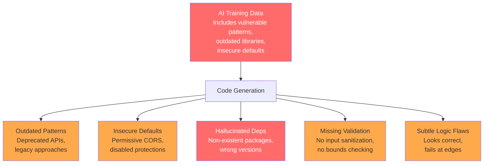
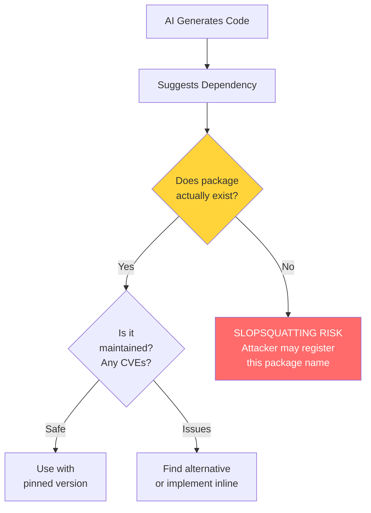
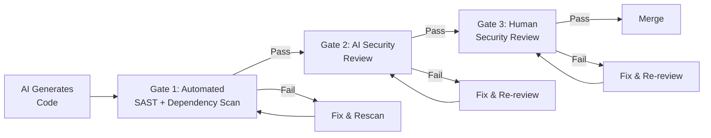
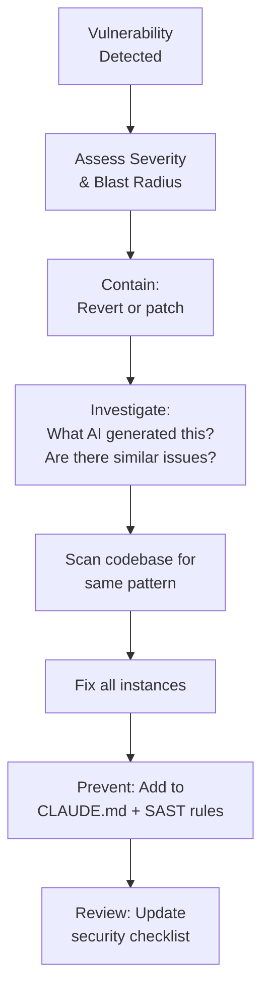

# Security Patterns for AI-Generated Code

> A comprehensive security checklist and pattern library for reviewing, hardening, and governing AI-generated code. Based on OWASP frameworks, industry research, and real-world incident patterns.

---

## Table of Contents

1. [AI-Specific Security Risks](#ai-specific-security-risks)
2. [Pre-Merge Security Checklist](#pre-merge-security-checklist)
3. [OWASP Top 10 for AI-Generated Code](#owasp-top-10-for-ai-generated-code)
4. [Supply Chain Security](#supply-chain-security)
5. [Security Review Workflow](#security-review-workflow)
6. [Secure Prompting Patterns](#secure-prompting-patterns)
7. [Automated Security Gates](#automated-security-gates)
8. [Incident Response for AI Code](#incident-response-for-ai-code)

---

## AI-Specific Security Risks

AI-generated code introduces a distinct risk profile that differs from human-written code. Studies show AI-authored pull requests are 2.74x more prone to XSS vulnerabilities and contain 1.7x more issues overall.

### Why AI Code Is Different



### Risk Categories

| Risk | Likelihood | Impact | Description |
|------|-----------|--------|-------------|
| Hallucinated dependencies | High | Critical | AI suggests packages that do not exist; attackers register them |
| Insecure defaults | High | High | CORS `*`, disabled CSRF, permissive file permissions |
| SQL injection | Medium | Critical | String concatenation instead of parameterized queries |
| Hardcoded secrets | Medium | Critical | API keys, passwords in source code |
| Missing input validation | High | High | No sanitization on user input |
| Outdated crypto | Medium | High | MD5/SHA1 for passwords, weak random number generation |
| Authentication flaws | Medium | Critical | Subtle JWT issues, session management errors |
| License violations | Medium | Medium | Code generated from copyleft-licensed training data |

---

## Pre-Merge Security Checklist

Use this checklist for every PR containing AI-generated code.

### Input Handling

- [ ] All user inputs are validated and sanitized
- [ ] Parameterized queries used (no SQL string concatenation)
- [ ] File upload validation includes type, size, and content checks
- [ ] URL inputs validated against SSRF (no internal network access)
- [ ] JSON/XML parsing uses safe parsers with depth limits
- [ ] Regular expressions checked for ReDoS (catastrophic backtracking)

### Authentication and Authorization

- [ ] No hardcoded credentials, keys, or tokens
- [ ] Passwords hashed with bcrypt/scrypt/argon2 (not MD5/SHA)
- [ ] JWT tokens use asymmetric signing (RS256, not HS256 with shared secret)
- [ ] Session tokens have appropriate expiration
- [ ] Authorization checks on every endpoint (not just authentication)
- [ ] Rate limiting on authentication endpoints

### Output Encoding

- [ ] HTML output properly escaped (XSS prevention)
- [ ] JSON responses use proper Content-Type headers
- [ ] Error messages do not leak stack traces or internal details
- [ ] Logging does not include sensitive data (passwords, tokens, PII)

### Dependencies

- [ ] All new dependencies verified to exist in official registries
- [ ] No known CVEs in any dependency (check `npm audit` / `pip audit`)
- [ ] Dependencies pinned to specific versions (no floating ranges)
- [ ] Minimal dependency footprint (no unnecessary packages)
- [ ] License compatibility verified

### Configuration

- [ ] CORS not set to `*` in production
- [ ] CSRF protection enabled
- [ ] Security headers set (CSP, HSTS, X-Frame-Options, etc.)
- [ ] TLS/HTTPS enforced
- [ ] Debug mode disabled in production configuration
- [ ] Environment variables used for all secrets and configuration

### Cryptography

- [ ] Using current algorithms (AES-256, RSA-2048+, SHA-256+)
- [ ] Cryptographically secure random number generation
- [ ] No custom crypto implementations
- [ ] TLS 1.2+ required for all connections

---

## OWASP Top 10 for AI-Generated Code

Mapped to AI-specific failure modes.

### 1. Injection (SQL, Command, LDAP)

**AI pattern:** AI frequently generates SQL via string concatenation, especially for dynamic queries.

**What to look for:**
```javascript
// DANGEROUS - AI often generates this
const query = `SELECT * FROM users WHERE id = ${userId}`;

// SAFE - parameterized query
const query = 'SELECT * FROM users WHERE id = $1';
const result = await db.query(query, [userId]);
```

**Automated check:** Semgrep rule for string concatenation in SQL contexts.

---

### 2. Broken Authentication

**AI pattern:** AI implements auth flows that work but have subtle flaws: tokens that never expire, secrets stored in localStorage, missing rate limiting.

**What to look for:**
- JWT without expiration (`exp` claim)
- Tokens in localStorage (vulnerable to XSS) instead of httpOnly cookies
- No account lockout or rate limiting on login
- Password reset tokens that do not expire

---

### 3. Sensitive Data Exposure

**AI pattern:** AI generates verbose error messages, logs sensitive data, and returns internal details in API responses.

**What to look for:**
```javascript
// DANGEROUS - AI loves helpful error messages
catch (error) {
  res.status(500).json({ error: error.message, stack: error.stack });
}

// SAFE
catch (error) {
  logger.error('Operation failed', { errorId: uuid(), error });
  res.status(500).json({ error: 'Internal server error', errorId });
}
```

---

### 4. XML External Entities (XXE)

**AI pattern:** AI uses default XML parser settings which often allow external entity resolution.

**Fix:** Disable DTD processing and external entity resolution in all XML parsers.

---

### 5. Broken Access Control

**AI pattern:** AI implements authentication but forgets authorization. Routes are protected by login but do not check if the user has permission to access the specific resource.

**What to look for:**
```javascript
// DANGEROUS - authenticates but doesn't authorize
app.get('/api/users/:id', authenticate, async (req, res) => {
  const user = await User.findById(req.params.id); // Any logged-in user can see any user
  res.json(user);
});

// SAFE - checks ownership
app.get('/api/users/:id', authenticate, async (req, res) => {
  if (req.user.id !== req.params.id && !req.user.isAdmin) {
    return res.status(403).json({ error: 'Forbidden' });
  }
  const user = await User.findById(req.params.id);
  res.json(user);
});
```

---

### 6. Security Misconfiguration

**AI pattern:** AI generates permissive defaults to "make things work" -- CORS `*`, disabled HTTPS checks, permissive CSP.

**Hardening checklist:**
- [ ] CORS: specific origins only
- [ ] CSP: restrictive policy, no `unsafe-inline`
- [ ] HSTS: enabled with appropriate max-age
- [ ] No default credentials anywhere
- [ ] Error pages do not reveal server info

---

### 7. Cross-Site Scripting (XSS)

**AI pattern:** AI-generated code is 2.74x more prone to XSS. Common: rendering user input without escaping, using `dangerouslySetInnerHTML`, template literals in HTML.

**Fix:** Use framework-provided escaping (React JSX, Angular templates), never raw HTML insertion.

---

### 8. Insecure Deserialization

**AI pattern:** AI uses `JSON.parse` without validation, `pickle.loads` on untrusted data, or `eval` for parsing.

**Fix:** Always validate deserialized data against a schema (Zod, Joi, Pydantic). Never use `eval` or `pickle` on untrusted input.

---

### 9. Using Components with Known Vulnerabilities

**AI pattern:** AI suggests outdated packages from its training data. It cannot know about CVEs published after its training cutoff.

**Fix:** Run `npm audit` / `pip audit` / Snyk on every build. Pin dependencies. Keep automated update tools running.

---

### 10. Insufficient Logging and Monitoring

**AI pattern:** AI either generates no logging (minimal implementation) or excessive logging (including sensitive data).

**Fix:** Log security-relevant events (auth attempts, access denials, input validation failures) without sensitive data (passwords, tokens, PII).

---

## Supply Chain Security

### The AI Dependency Problem



### Slopsquatting

Attackers register package names that AI frequently hallucinates. When a developer installs the hallucinated package, they get malicious code.

**Mitigation:**
- Verify every new dependency exists in official registries before installing
- Check download counts (very low = suspicious)
- Check publish date (very recent + AI-suggested = suspicious)
- Use an allowlist of approved packages for your project

### AI Bill of Materials (AI-BOM)

OWASP recommends constructing a real-time, signed AI Bill of Materials that inventories every model, plugin, adapter, training file, and third-party dependency in use.

For code projects, extend your SBOM to include:
- Which AI tools generated code
- Which model versions were used
- What prompts produced the code (at least the intent)
- What dependencies were AI-suggested vs. human-chosen

### Dependency Verification Checklist

- [ ] Package exists in official registry (npm, PyPI, etc.)
- [ ] Package has significant download count (not near-zero)
- [ ] Package last updated within 12 months
- [ ] Package has multiple maintainers (bus factor > 1)
- [ ] No known CVEs (`npm audit` / `pip audit` / Snyk)
- [ ] License is compatible with your project
- [ ] Version pinned in lockfile
- [ ] Package source code reviewed (for critical dependencies)

---

## Security Review Workflow

### Three-Gate Security Review



**Gate 1 - Automated Scanning (every PR):**
- SAST: Semgrep, SonarQube, CodeQL
- Dependency: npm audit, Snyk, Dependabot
- Secrets: gitleaks, trufflehog
- License: FOSSA, license-checker

**Gate 2 - AI Security Review (every PR):**
- Use RICE pattern with security reviewer role
- Focus on OWASP Top 10 mapping
- Check for AI-specific issues (hallucinated deps, insecure defaults)

**Gate 3 - Human Security Review (risk-based):**
- Required for: auth, payment, PII handling, crypto, admin functions
- Optional for: UI changes, documentation, test-only changes
- Senior engineer or security champion reviews

---

## Secure Prompting Patterns

### Security-First Prompt Template

```
Context: [project details]

Security requirements:
- All inputs must be validated using [Zod/Joi/Pydantic]
- No hardcoded secrets (use environment variables)
- Parameterized queries only (no string concatenation for SQL)
- All errors must be caught and return safe error messages
- Log security events but never log sensitive data
- Follow OWASP Top 10 mitigations

Instruction: [task]
Format: [output format]
```

### Security Review Prompt

```
Role: You are a senior application security engineer.

Review the following code for security vulnerabilities:
- Map findings to OWASP Top 10 categories
- Check all AI-specific risks (hallucinated deps, insecure defaults)
- Rate each finding: Critical / High / Medium / Low
- Provide a specific fix for each finding
- Verify all dependencies exist and have no known CVEs

[code]
```

---

## Automated Security Gates

### Pre-Commit Hooks

```yaml
# .pre-commit-config.yaml
repos:
  - repo: https://github.com/gitleaks/gitleaks
    rev: v8.18.0
    hooks:
      - id: gitleaks

  - repo: https://github.com/semgrep/semgrep
    rev: v1.60.0
    hooks:
      - id: semgrep
        args: ['--config', 'p/security-audit']
```

### CI Pipeline Security Steps

```yaml
# GitHub Actions example
security-scan:
  runs-on: ubuntu-latest
  steps:
    - name: Dependency audit
      run: npm audit --audit-level=high

    - name: SAST scan
      uses: semgrep/semgrep-action@v1
      with:
        config: >
          p/security-audit
          p/owasp-top-ten

    - name: Secret detection
      uses: gitleaks/gitleaks-action@v2

    - name: License check
      run: npx license-checker --failOn 'GPL-3.0'
```

### CLAUDE.md Security Section

Add this to your project's CLAUDE.md to encode security requirements:

```markdown
## Security Requirements (MANDATORY)

All generated code MUST follow these security rules:

1. NEVER hardcode secrets, API keys, or credentials
2. ALWAYS use parameterized queries for database operations
3. ALWAYS validate and sanitize user input
4. NEVER use eval(), pickle.loads() on untrusted data
5. ALWAYS use httpOnly, secure, sameSite cookies for session tokens
6. NEVER set CORS to '*' in production
7. ALWAYS return generic error messages to clients
8. NEVER log passwords, tokens, or PII
9. ALWAYS use bcrypt/argon2 for password hashing
10. ALWAYS pin dependency versions
```

---

## Incident Response for AI Code

### When a Vulnerability Is Found in AI-Generated Code



### Post-Incident Actions

1. **Identify the source prompt** that produced the vulnerable code
2. **Search the codebase** for the same vulnerability pattern
3. **Add a SAST rule** to catch this pattern automatically
4. **Update CLAUDE.md** with a specific rule against this pattern
5. **Notify the team** and update the security review checklist
6. **Log the incident** with root cause analysis

---

## Sources

- [OWASP AI Exchange](https://owaspai.org/docs/ai_security_overview/)
- [OWASP LLM Top 10 and Supply Chain Security (Sonatype)](https://www.sonatype.com/blog/the-owasp-llm-top-10-and-sonatype-supply-chain-security)
- [OWASP Software Supply Chain Security Cheat Sheet](https://cheatsheetseries.owasp.org/cheatsheets/Software_Supply_Chain_Security_Cheat_Sheet.html)
- [2025 CISO Guide to Securing AI-Generated Code (Checkmarx)](https://checkmarx.com/blog/ai-is-writing-your-code-whos-keeping-it-secure/)
- [AI Code Review Checklist (ClackyAI)](https://clacky.ai/blog/code-review-checklist-ai-generated-code)
- [How to Secure Vibe Coded Applications (DEV Community)](https://dev.to/devin-rosario/how-to-secure-vibe-coded-applications-in-2026-208d)
- [AI Code Review Checklist: Before Merging (mrq)](https://www.getmrq.com/blog/ai-code-review-checklist)
- [5 Best Practices for Reviewing AI-Generated Code (Bright Security)](https://brightsec.com/blog/5-best-practices-for-reviewing-and-approving-ai-generated-code/)

---

## See Also

- [Fuzzing and Security Testing](../testing/fuzzing_security.md) - Automated fuzz testing, property-based testing, and security test generation for AI-generated code
- [Enterprise Compliance](../enterprise/compliance.md) - Regulatory compliance frameworks (SOC 2, HIPAA, GDPR) and how they intersect with AI-generated code governance
- [ChatOps Incident Management](../chatops/incident_management.md) - AI-powered incident response workflows that operationalize security patterns in production
