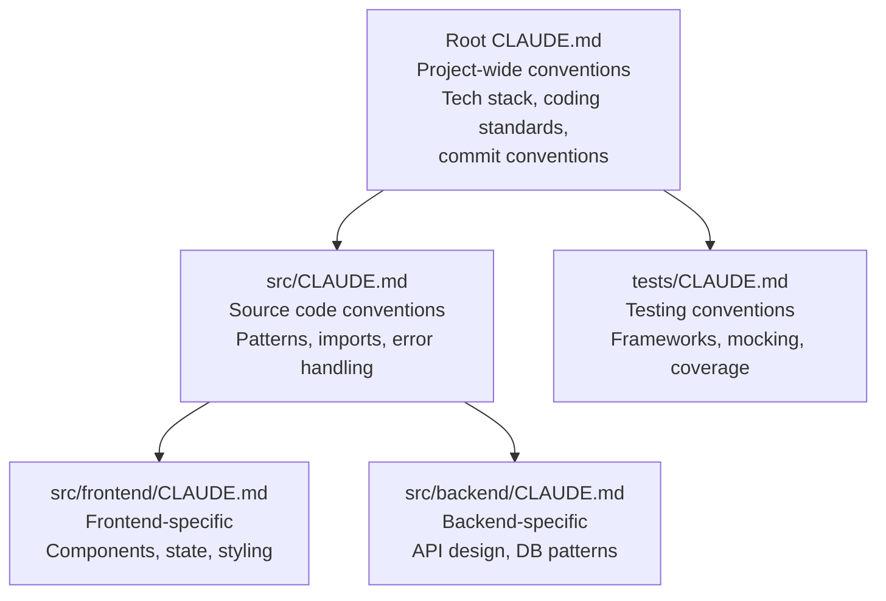
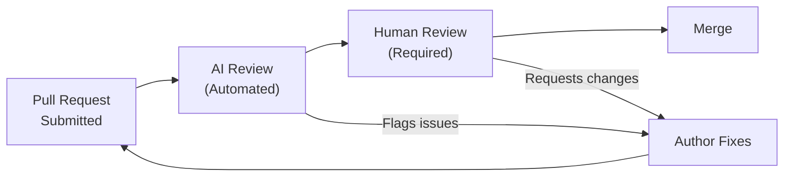
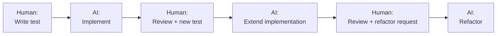
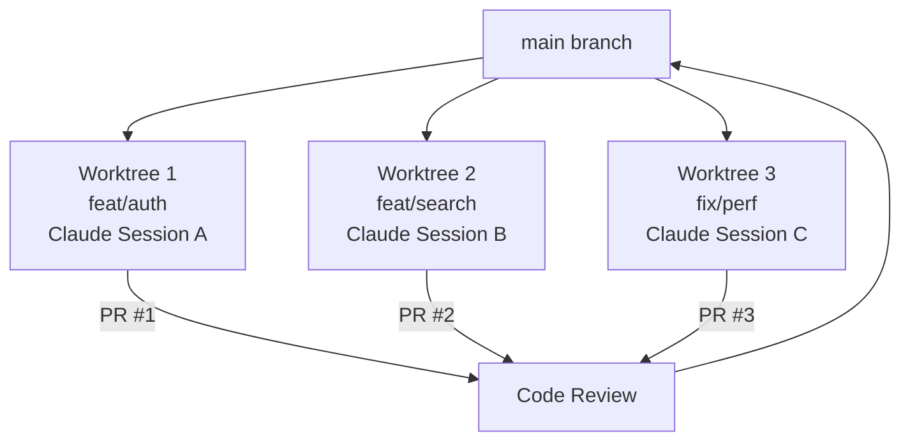
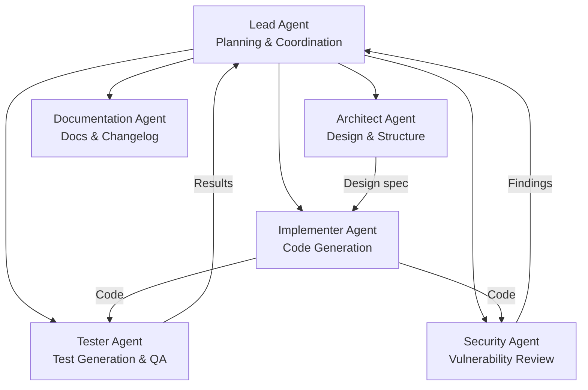
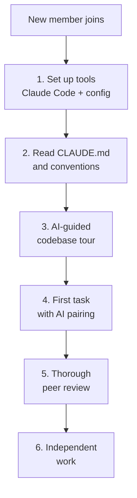

# Team Workflows for AI-Assisted Development

> How teams use AI coding tools together effectively: shared configuration, code review, pair programming patterns, and collaboration strategies.

---

## Table of Contents

1. [Shared CLAUDE.md Strategy](#shared-claudemd-strategy)
2. [PR Review with AI](#pr-review-with-ai)
3. [Pair Programming Patterns](#pair-programming-patterns)
4. [Parallel Development with Worktrees](#parallel-development-with-worktrees)
5. [Agent Teams and Multi-Agent Collaboration](#agent-teams-and-multi-agent-collaboration)
6. [Custom Commands as Team Knowledge](#custom-commands-as-team-knowledge)
7. [Onboarding New Team Members](#onboarding-new-team-members)
8. [Team Workflow Checklists](#team-workflow-checklists)

---

## Shared CLAUDE.md Strategy

CLAUDE.md is not just a readme -- it is a complete, structured knowledge base that gives the AI everything it needs to operate safely and consistently across the team.

### Hierarchy and Scoping



Claude searches upward from the working directory and loads every CLAUDE.md found. This means:
- **Root CLAUDE.md**: General guidelines applicable everywhere
- **Subdirectory CLAUDE.md**: Specific overrides loaded only when working in that directory

### What Belongs in a Team CLAUDE.md

```markdown
# Project: [Name]

## Tech Stack
- Runtime: Node.js 20 LTS
- Framework: Next.js 14 (App Router)
- Database: PostgreSQL 16 with Prisma ORM
- Testing: Vitest + React Testing Library

## Coding Standards
- Use TypeScript strict mode everywhere
- Prefer named exports over default exports
- Use Zod for all runtime validation
- Error handling: use Result types, never throw in service layer

## File Conventions
- Components: PascalCase (`UserProfile.tsx`)
- Utilities: camelCase (`formatDate.ts`)
- Tests: colocated (`UserProfile.test.tsx`)

## Git Conventions
- Branch naming: `type/TICKET-description` (e.g., `feat/PROJ-123-user-auth`)
- Commit format: `type(scope): description` (conventional commits)
- Always create a new branch per task

## Do NOT
- Use `any` type
- Import from `lodash` (use native methods)
- Use `console.log` (use the logger service)
- Modify files in `src/generated/`
```

### Team CLAUDE.md Review Process

1. CLAUDE.md changes go through code review like any other code
2. Schedule a quarterly review to prune outdated rules
3. Add new rules when the AI makes recurring mistakes
4. Use conditional rules with YAML frontmatter for file-specific guidance

---

## PR Review with AI

### The Two-Layer Review



AI review catches mechanical issues; human review catches architectural and business logic issues. Neither replaces the other.

### AI Review Checklist for PRs

Use a custom command or CI integration to run AI review on every PR:

```markdown
## AI Review Prompt Template

Review this pull request with the following focus areas:

1. **Correctness**: Does the code do what the PR description says?
2. **Security**: Any injection, XSS, CSRF, auth bypass, or secret exposure?
3. **Performance**: Any N+1 queries, unbounded loops, or memory leaks?
4. **Edge cases**: What inputs or states could break this code?
5. **Style**: Does it follow our conventions in CLAUDE.md?
6. **Tests**: Are tests present, meaningful, and covering edge cases?

For each issue found:
- Severity: Critical / High / Medium / Low
- Location: File and line number
- Description: What the issue is
- Fix: How to resolve it
```

### What AI Review Catches Well

- Style violations and inconsistencies
- Missing null checks and error handling
- Known vulnerability patterns (SQL injection, XSS)
- Missing tests for new code paths
- Dependency issues

### What AI Review Misses

- Business logic correctness (does this match the requirement?)
- Architectural fit (does this belong here?)
- Performance implications in context (will this scale with our data?)
- Security in the broader system context
- Whether the PR actually solves the problem

### PR Description Template for AI-Assisted Code

```markdown
## Summary
[What this PR does and why]

## AI Assistance
- Tool used: [Claude Code / Cursor / Copilot]
- AI contribution: [Generated / Assisted / Reviewed]
- Human modifications: [What was changed from AI output]

## Test Plan
- [ ] Unit tests pass
- [ ] Integration tests pass
- [ ] Manual testing completed for: [scenarios]

## Security Checklist
- [ ] No hardcoded secrets
- [ ] Input validation present
- [ ] New dependencies audited
```

---

## Pair Programming Patterns

### Pattern 1: Navigator-Driver

The classic pair programming model adapted for AI.

| Role | Human | AI |
|------|-------|-----|
| **Navigator** | Directs strategy, makes architectural decisions, reviews output | - |
| **Driver** | - | Generates implementation, suggests refactoring, explains alternatives |

**Best for:** Feature development, exploring unfamiliar APIs.

**Workflow:**
1. Human defines the task and approach (Navigator)
2. AI implements (Driver)
3. Human reviews and redirects
4. AI adjusts and continues

---

### Pattern 2: Ping-Pong TDD



**Best for:** Well-defined features where behavior can be specified through tests.

**Workflow:**
1. Human writes a failing test
2. AI writes minimum code to pass
3. Human writes the next test (increasing complexity)
4. AI extends the implementation
5. Human requests refactoring once all tests pass

---

### Pattern 3: Debugging Duo

**Best for:** Investigating bugs, analyzing stack traces.

**Workflow:**
1. Human provides: error message, stack trace, reproduction steps
2. AI analyzes and suggests likely causes
3. Human adds context about recent changes and business rules
4. AI narrows diagnosis and suggests fixes
5. Human validates fix against production behavior

---

### Pattern 4: Architecture Review Board

**Best for:** Design decisions that affect the team.

**Workflow:**
1. Developer proposes an approach
2. AI plays devil's advocate (using the Rubber Duck pattern)
3. AI generates a comparison matrix of alternatives
4. Developer presents the analysis to the team with the AI's findings
5. Team decides; AI implements the chosen approach

---

### Pattern 5: Knowledge Transfer Session

**Best for:** Onboarding, understanding legacy code.

**Workflow:**
1. Developer asks AI to explain a module/file
2. AI provides architecture overview with diagrams
3. Developer asks specific questions about patterns and decisions
4. AI generates a knowledge document for the team wiki

---

## Parallel Development with Worktrees

Git worktrees allow multiple Claude sessions to work on different tasks simultaneously, each in its own isolated branch.

### Setup

```bash
# Create worktrees for parallel development
git worktree add ../project-feat-auth feat/auth
git worktree add ../project-feat-search feat/search
git worktree add ../project-fix-perf fix/performance

# Run Claude in each worktree
cd ../project-feat-auth && claude
cd ../project-feat-search && claude
cd ../project-fix-perf && claude
```

### Naming Convention

Use shell aliases for quick switching:

```bash
alias wt-auth='cd ../project-feat-auth'
alias wt-search='cd ../project-feat-search'
alias wt-perf='cd ../project-fix-perf'
```

### Worktree Workflow



### Best Practices for Parallel Sessions

- Each worktree gets its own CLAUDE.md context (inherited from root)
- Avoid overlapping file changes across worktrees
- Use small, focused branches (one feature or fix per worktree)
- Anthropic's own team runs 3-5 worktrees simultaneously

---

## Agent Teams and Multi-Agent Collaboration

For complex projects, specialized AI agents with distinct roles coordinate on tasks.

### Agent Role Architecture



### When to Use Agent Teams

| Scenario | Approach |
|----------|----------|
| Single file change | Single agent |
| Multi-file feature | Single agent with Plan/Execute |
| Large feature (5+ files) | Two agents: Planner + Implementer |
| Cross-cutting refactor | Agent team with parallel worktrees |
| Full system design | Agent team with Architect lead |

### Setting Up Agent Teams

1. **Define roles and boundaries** in a planning phase
2. **Create a shared spec** the team references
3. **Use worktrees** for parallel execution
4. **Reconvene** for integration and review

---

## Custom Commands as Team Knowledge

If you do something more than once a day, turn it into a custom command. Commands checked into git become institutional knowledge.

### Example: Team Review Command

`.claude/commands/review.md`:
```markdown
Review the staged changes against our team conventions:

1. Check CLAUDE.md compliance
2. Verify test coverage
3. Look for security issues
4. Confirm naming conventions
5. Check for TODOs without ticket references

Output a review summary with severity ratings.
```

### Example: Team PR Command

`.claude/commands/create-pr.md`:
```markdown
Create a pull request for the current branch:

1. Summarize all commits since branching from main
2. Generate a PR description using our template
3. List files changed and their purpose
4. Add the AI assistance disclosure section
5. Create the PR with appropriate labels
```

### Command Library Best Practices

- Store in `.claude/commands/` (team) or `~/.claude/commands/` (personal)
- Name commands descriptively: `review.md`, `create-pr.md`, `add-tests.md`
- Include the "why" in command descriptions, not just the "what"
- Review command changes in PRs like any other code change

---

## Onboarding New Team Members

### AI-Assisted Onboarding Workflow



### Step 3: AI-Guided Codebase Tour

```
I'm new to this project. Give me an architecture overview:

1. What does this project do? (read README and key config files)
2. What is the directory structure and what lives where?
3. What are the main data flows?
4. Draw a mermaid diagram of the system architecture.
5. What are the most important files I should understand first?
```

### Step 4: First Task with AI Pairing

- Assign a small, well-defined task
- New member uses Plan Mode first, shares plan with team
- AI implements with the new member reviewing each step
- Thorough peer review teaches conventions by example

---

## Team Workflow Checklists

### Team Setup Checklist

- [ ] Shared CLAUDE.md committed to repo root
- [ ] Subdirectory CLAUDE.md files for specific areas
- [ ] Custom commands in `.claude/commands/`
- [ ] PR template includes AI assistance disclosure
- [ ] CI pipeline includes AI code review step
- [ ] Pre-commit hooks for secrets scanning and linting
- [ ] Team agreed on AI tool list and usage guidelines
- [ ] Worktree workflow documented for parallel development

### Sprint Workflow Checklist

- [ ] Sprint tasks broken down to AI-friendly size (1-3 files per task)
- [ ] Each task assigned to a branch (for worktree isolation)
- [ ] CLAUDE.md updated if new conventions established
- [ ] Custom commands created for repeated sprint tasks
- [ ] End-of-sprint: review AI-generated code quality metrics

### Code Review Checklist (AI-Generated Code)

- [ ] Reviewer understands all generated code (no blind accepts)
- [ ] AI review ran and findings addressed
- [ ] Security checklist completed
- [ ] Tests present and meaningful
- [ ] No scope creep (only changes described in PR)
- [ ] Follows conventions in CLAUDE.md
- [ ] New dependencies audited
- [ ] PR description includes AI disclosure

---

## Sources

- [Claude Code Best Practices (Anthropic)](https://code.claude.com/docs/en/best-practices)
- [How Anthropic Teams Use Claude Code (PDF)](https://www-cdn.anthropic.com/58284b19e702b49db9302d5b6f135ad8871e7658.pdf)
- [Claude Code Team Best Practices (SmartScope)](https://smartscope.blog/en/generative-ai/claude/claude-code-creator-team-workflow-best-practices/)
- [7 Claude Code Best Practices for 2026 (eesel.ai)](https://www.eesel.ai/blog/claude-code-best-practices)
- [Claude Code Agent Teams Guide](https://claudefa.st/blog/guide/agents/agent-teams)
- [10 Tips from Inside the Claude Code Team](https://paddo.dev/blog/claude-code-team-tips/)
- [Claude Code Configuration Blueprint (DEV Community)](https://dev.to/mir_mursalin_ankur/claude-code-configuration-blueprint-the-complete-guide-for-production-teams-557p)
- [Art of AI Pair Programming (Groundy)](https://groundy.com/articles/art-ai-pair-programming-patterns-that-actually/)
- [AI Pair Programming Best Practices (Graphite)](https://graphite.com/guides/ai-pair-programming-best-practices)
