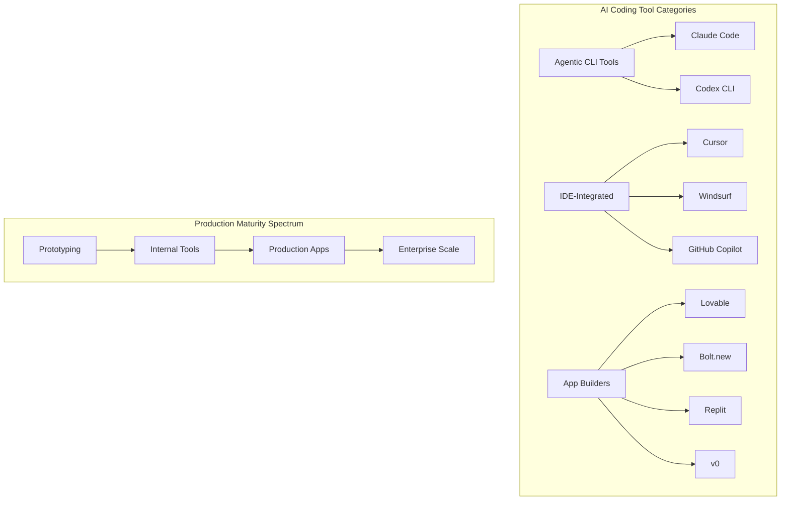

# Real-World AI Coding Implementations

> A comprehensive research collection on how teams, companies, and individuals are using AI coding tools in production. Last updated: 2026-03-22.

## What This Contains

| File | Description |
|------|-------------|
| [production_setups.md](production_setups.md) | 10+ documented production setups: CLAUDE.md patterns, MCP stacks, hooks, multi-agent workflows |
| [startup_stories.md](startup_stories.md) | Stories of products built primarily with AI coding tools -- what worked, what didn't, timelines, tech stacks |
| [platform_engineering.md](platform_engineering.md) | How platform engineering teams integrate AI coding into internal developer platforms -- golden paths, guardrails, self-service |
| [lessons_learned.md](lessons_learned.md) | Hard-won lessons from production: what works, what doesn't, common pitfalls, mitigation strategies |

## Key Statistics (as of early 2026)

- **85%** of developers now use AI coding tools ([10x.pub](https://tianpan.co/forum/t/85-of-devs-now-use-ai-coding-tools-but-claude-code-overtook-copilot-in-less-than-a-year-what-shifted/2402))
- **70%** of Fortune 100 companies use Claude ([Gradually AI](https://www.gradually.ai/en/claude-code-statistics/))
- **500+** organizations pay more than $1M/year for Claude access ([Gradually AI](https://www.gradually.ai/en/claude-code-statistics/))
- **195M** lines of code processed weekly by Claude Code (as of July 2025) ([Gradually AI](https://www.gradually.ai/en/claude-code-statistics/))
- **$2.96B** global vibe coding market in 2025, projected $12.3B by 2027 ([Volumetree](https://www.volumetree.com/2026/03/05/vibe-coding-pros-cons-2026/))
- **90%** of enterprises now have internal developer platforms, beating Gartner's 2026 prediction early ([CNCF](https://www.cncf.io/blog/2026/01/23/the-autonomous-enterprise-and-the-four-pillars-of-platform-control-2026-forecast/))
- **26-55%** productivity improvement reported across enterprise case studies ([Bloomberg](https://www.bloomberg.com/news/articles/2026-02-26/ai-coding-agents-like-claude-code-are-fueling-a-productivity-panic-in-tech))

## The Landscape

## How to Use This Research

1. **Starting a new project?** Read `startup_stories.md` for patterns that work at different scales.
2. **Setting up a team workflow?** Read `production_setups.md` for concrete CLAUDE.md and MCP configurations.
3. **Building a developer platform?** Read `platform_engineering.md` for golden path and guardrail patterns.
4. **Already in production?** Read `lessons_learned.md` to avoid known pitfalls.

## Sources

This research draws from Anthropic documentation, enterprise case studies, developer blog posts, academic research (METR, Georgetown CSET), industry reports (Gartner, DORA, Harness), and community experience shared on GitHub, Dev.to, Medium, and Hacker News. All sources are linked inline throughout each document.
