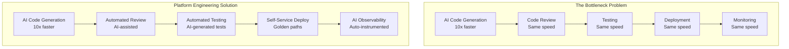
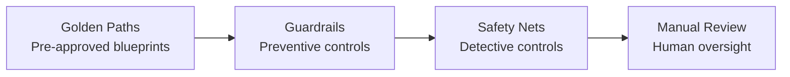
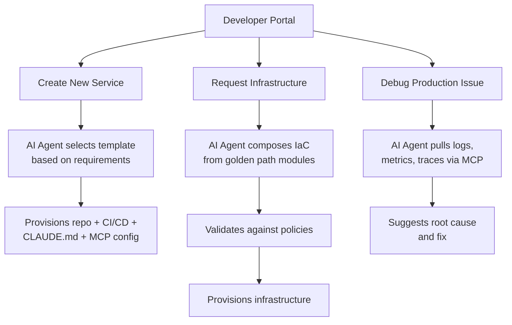
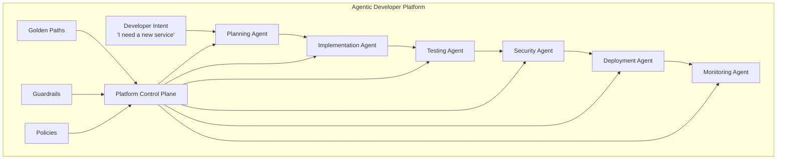

# Platform Engineering and AI Coding Tools

> How platform engineering teams integrate AI coding into internal developer platforms. Golden paths, guardrails, self-service patterns, and governance frameworks. Based on industry reports, enterprise case studies, and community knowledge from 2025-2026.

---

## Table of Contents

1. [The Convergence of Platform Engineering and AI](#the-convergence-of-platform-engineering-and-ai)
2. [Golden Paths for AI-Assisted Development](#golden-paths-for-ai-assisted-development)
3. [Guardrails and Safety Nets](#guardrails-and-safety-nets)
4. [Self-Service Patterns](#self-service-patterns)
5. [Governance Frameworks](#governance-frameworks)
6. [The Agentic Developer Platform](#the-agentic-developer-platform)
7. [Real-World Platform Configurations](#real-world-platform-configurations)
8. [Challenges and Anti-Patterns](#challenges-and-anti-patterns)

---

## The Convergence of Platform Engineering and AI

Platform engineering and AI are merging into one discipline. Developer experience (DevEx) in 2026 is defined by this convergence -- platform engineering is emerging as the gold standard for properly, safely, and efficiently deploying AI coding tools.

**Key statistics:**
- **90%** of enterprises now have internal developer platforms (surpassing Gartner's 2026 prediction of 80% a full year early)
- **94%** of organizations view AI as critical to the future of platform engineering
- **73%** of engineering leaders say "hardly any" teams have standardized golden paths (the gap is enormous)

Sources: [The New Stack](https://thenewstack.io/in-2026-ai-is-merging-with-platform-engineering-are-you-ready/), [CNCF](https://www.cncf.io/blog/2026/01/23/the-autonomous-enterprise-and-the-four-pillars-of-platform-control-2026-forecast/), [Jellyfish](https://jellyfish.co/library/platform-engineering/golden-paths/)

### Why Platform Engineering Matters for AI Coding

Organizations realized that simply providing AI coding assistants wasn't enough. The rest of the software delivery lifecycle -- CI/CD, testing, deployment, observability -- needed to mature to handle the increased code output. AI coding accelerated development, but DevOps maturity wasn't keeping pace.

Source: [Harness](https://www.prnewswire.com/news-releases/harness-report-reveals-ai-coding-accelerates-development-devops-maturity-in-2026-isnt-keeping-pace-302710937.html)



---

## Golden Paths for AI-Assisted Development

Golden paths are curated, pre-approved blueprints that make the secure, compliant choice the easiest choice for developers. In the AI era, golden paths extend to include AI tool configuration.

Source: [Google Cloud](https://cloud.google.com/blog/products/application-development/golden-paths-for-engineering-execution-consistency), [Mia Platform](https://mia-platform.eu/blog/paved-roads-golden-paths-guardrails-railroads/), [StackGen](https://stackgen.com/blog/2026-forecast-the-autonomous-enterprise-and-the-four-pillars-of-platform-control)

### What a Golden Path Includes (2026)

| Layer | Traditional | AI-Enhanced |
|-------|-------------|-------------|
| **Service template** | Scaffolding with approved frameworks | + CLAUDE.md with project-specific rules |
| **CI/CD pipeline** | Build, test, deploy | + AI code review step, security scanning for AI-generated code |
| **Infrastructure** | Terraform modules, Kubernetes manifests | + AI agent that composes IaC from requirements |
| **Observability** | Metrics, logs, traces | + AI-assisted incident response, auto-instrumentation |
| **Documentation** | READMEs, ADRs | + AI-maintained docs that update with code changes |
| **Security** | SAST, DAST, dependency scanning | + AI guardrails at IDE level, pre-prompt security checks |

### Golden Path Template: AI-Ready Service

```
my-service/
  CLAUDE.md                    # AI coding context and rules
  .claude/
    settings.json              # Hooks, MCP servers, permissions
    hooks/
      block-dangerous.sh       # Prevent force-push, env file access
      auto-format.sh           # Run formatter after edits
      pre-commit-check.sh      # Lint + type check before commits
  .github/
    workflows/
      ci.yml                   # Standard CI with AI review step
      claude-review.yml        # AI-powered PR review
  src/
    ...                        # Standard project structure
  tests/
    ...                        # Test scaffold
  docs/
    architecture.md            # For AI context
    api-patterns.md            # For AI context
  infrastructure/
    terraform/                 # IaC modules from golden path
```

### Self-Service Golden Path Provisioning

The 2026 vision: developers input high-level requirements (e.g., "I need a secure, scalable service for my application in AWS US-East"), and an AI agent fully composes, validates, and provisions compliant infrastructure according to pre-defined golden paths.

Source: [StackGen](https://stackgen.com/blog/2026-forecast-the-autonomous-enterprise-and-the-four-pillars-of-platform-control)

---

## Guardrails and Safety Nets

The enterprise control framework for AI coding in 2026 consists of four mechanisms:



Source: [CNCF](https://www.cncf.io/blog/2026/01/23/the-autonomous-enterprise-and-the-four-pillars-of-platform-control-2026-forecast/)

### Guardrail Implementations

#### 1. IDE-Level Guardrails (Pre-Prompt)

Cycode AI Guardrails uses native hooks exposed by AI coding assistants to enforce security controls at the IDE boundary -- before prompts are sent, before files are added to agent context, and before tool calls are executed.

Source: [Cycode](https://cycode.com/blog/ai-guardrails-real-time-ide-security/)

**What this blocks:**
- Secrets from being included in AI prompts
- Sensitive files from being read by AI agents
- Dangerous commands from being executed

#### 2. Claude Code Hooks as Guardrails

```json
{
  "hooks": {
    "PreToolUse": [
      {
        "matcher": "bash",
        "hooks": [{
          "type": "command",
          "command": ".claude/hooks/security-gate.sh"
        }]
      },
      {
        "matcher": "read",
        "hooks": [{
          "type": "command",
          "command": ".claude/hooks/block-sensitive-files.sh"
        }]
      }
    ]
  }
}
```

Example `block-sensitive-files.sh`:
```bash
#!/bin/bash
# Block reading sensitive files
INPUT=$(cat)
FILE=$(echo "$INPUT" | jq -r '.file_path // empty')

BLOCKED_PATTERNS=(".env" "credentials" "secrets" ".pem" ".key")
for pattern in "${BLOCKED_PATTERNS[@]}"; do
  if [[ "$FILE" == *"$pattern"* ]]; then
    echo "BLOCKED: Cannot read sensitive file matching '$pattern'" >&2
    exit 2
  fi
done
exit 0
```

#### 3. CI/CD Pipeline Guardrails

```yaml
# Guardrail: AI-generated code must pass additional security checks
ai-security-scan:
  runs-on: ubuntu-latest
  steps:
    - name: SAST Scan
      uses: securecodewarrior/sast-action@v2
      with:
        fail-on-severity: high
    - name: Dependency Audit
      run: npm audit --audit-level=high
    - name: Secret Detection
      uses: trufflesecurity/trufflehog-actions@v3
    - name: AI Code Quality Check
      run: |
        # Flag common AI-generated code patterns that need review
        # - Missing error handling
        # - Hardcoded values
        # - Missing input validation
        npx ai-code-linter --strict
```

#### 4. Organizational Policy Guardrails

| Policy | Implementation |
|--------|---------------|
| AI tools cannot access production databases | MCP server config excludes prod connection strings |
| All AI-generated code requires human review | Branch protection rules require approval |
| AI cannot modify security-critical files | Hook blocks writes to auth/, crypto/, etc. |
| AI-generated PRs must be labeled | CI step auto-labels PRs with AI-generated changes |
| Token rotation every 90 days | Automated rotation via secret manager |

---

## Self-Service Patterns

### Pattern 1: Service Catalog with AI Context

Platform teams maintain a service catalog where each template includes:
- Pre-configured CLAUDE.md with team conventions
- MCP servers for the team's tools (Jira, Confluence, etc.)
- Hooks matching the team's quality standards
- CI/CD pipeline with AI review steps

Developers pick a template, and the platform provisions everything -- including AI configuration.

### Pattern 2: AI-Powered Developer Portal



### Pattern 3: Graduated Autonomy

Teams earn AI capabilities as they demonstrate maturity:

| Level | AI Capabilities | Requirements |
|-------|----------------|--------------|
| **L1: Assisted** | Code completion, inline suggestions | Basic onboarding complete |
| **L2: Agentic** | Claude Code with standard hooks | Team has 80%+ test coverage |
| **L3: Autonomous** | Multi-agent pipelines, auto-deploy to staging | Full CI/CD, security scanning, monitoring |
| **L4: Self-Healing** | AI incident response, auto-rollback | Mature observability, runbook coverage |

---

## Governance Frameworks

### Enterprise AI Coding Governance Stack

Source: [CIO.com](https://www.cio.com/article/4122916/how-enterprise-cios-can-scale-ai-coding-without-losing-control.html), [Faros AI](https://www.faros.ai/blog/enterprise-ai-coding-assistant-adoption-scaling-guide)

```
Governance Layer          Controls
--------------------------------------------------------------
Access Control            Who can use which AI tools and models
Usage Logging             All AI interactions logged and auditable
Model Policy              Approved models, context window limits
Code Policy               Security scan requirements, review rules
Data Policy               What data can be sent to AI models
Deployment Policy         AI-generated code deployment restrictions
Measurement               Productivity metrics, quality metrics
```

### Rollout Strategy (Phased)

Enterprises that succeeded with AI coding tools followed a phased approach:

**Phase 1: Pilot (30 days)**
- Cross-functional squad of 25 engineers
- Mix of greenfield and legacy projects
- Establish baseline metrics

**Phase 2: Expansion (60-90 days)**
- Scale to 300 engineers (the EdTech example saw 1100% growth here)
- Refine governance based on pilot learnings
- Build internal champions network

**Phase 3: Enterprise Scale**
- Roll out to thousands of engineers
- Automated onboarding via golden paths
- Continuous measurement and optimization

### Measurement Framework

| Metric | What to Track | Pitfall to Avoid |
|--------|---------------|------------------|
| Code velocity | PRs merged, lines changed | Measuring output without quality |
| Quality | Bug density, security findings, test coverage | Ignoring the 91% increase in review time |
| Developer satisfaction | Survey scores, tool adoption rates | Assuming adoption = satisfaction |
| Business impact | Features shipped, time-to-market | Attributing team gains solely to AI |

---

## The Agentic Developer Platform

The 2026 consensus points toward "agentic developer platforms" -- platforms that leverage AI agents throughout the software delivery lifecycle.

Source: [DX](https://getdx.com/blog/platform-engineering/), [Growin](https://www.growin.com/blog/platform-engineering-2026/)

### Architecture



### Key Capabilities

1. **AI-Powered Service Provisioning**: Developers describe what they need; agents provision according to golden paths
2. **Automated Code Review**: AI agents review PRs against team conventions and security policies
3. **Self-Healing Infrastructure**: AI monitors production and takes corrective action within policy boundaries
4. **Intelligent Incident Response**: AI agents pull context from logs, metrics, and traces to suggest root causes
5. **Documentation-as-Code**: AI keeps documentation in sync with code changes

---

## Real-World Platform Configurations

### Configuration 1: Startup (5-20 Engineers)

```
Platform stack:
- GitHub for source control
- Claude Code for development
- Cursor for some team members
- Vercel/Railway for deployment
- Linear for project management

AI integration:
- Shared CLAUDE.md in repo root
- GitHub Actions with AI review step
- MCP servers: GitHub, Linear
- Hooks: auto-format, lint-on-save
```

### Configuration 2: Growth Company (50-200 Engineers)

```
Platform stack:
- GitHub Enterprise
- Internal developer portal (Backstage)
- Claude Code + Cursor (developer choice)
- Kubernetes + ArgoCD
- Datadog for observability

AI integration:
- CLAUDE.md templates per service type
- Centralized MCP server configs distributed via golden paths
- Standardized hooks enforced across teams
- AI PR review in CI/CD pipeline
- Graduated autonomy levels
```

### Configuration 3: Enterprise (1000+ Engineers)

```
Platform stack:
- GitHub Enterprise or GitLab
- Custom internal developer platform
- Approved AI tools with SSO integration
- Multi-cloud Kubernetes
- Enterprise observability (Datadog/Splunk/Dynatrace)

AI integration:
- Platform team maintains CLAUDE.md templates
- Centralized governance: access controls, logging, model policies
- CI policy gates for AI-generated code
- Security scanning with AI-specific rules
- Phased rollout with measurement at each stage
- Internal champions program
- Quarterly security audits of AI tool configurations
```

---

## Challenges and Anti-Patterns

### Challenge 1: The Bottleneck Shift

AI accelerates code generation, but review, testing, and deployment remain at human speed. Without platform investment, you create a bigger backlog faster.

**Mitigation:** Invest equally in AI-assisted review, automated testing, and self-service deployment.

### Challenge 2: Shadow AI

Developers adopt AI tools before the platform team provides official support, creating ungoverned usage.

**Mitigation:** Move fast to provide official golden paths. Make the sanctioned path easier than the shadow path.

### Challenge 3: Configuration Drift

Teams customize their CLAUDE.md and hooks in ways that drift from organizational standards.

**Mitigation:** Use golden path templates with locked sections. Audit configurations periodically.

### Challenge 4: Measuring the Wrong Things

Teams measure code output (lines, PRs) instead of outcomes (features shipped, bugs in production).

**Mitigation:** Focus measurement on business outcomes and quality metrics, not activity metrics.

### Anti-Pattern: "Just Add AI"

Adding AI coding assistants without investing in the surrounding platform (CI/CD, testing, review, deployment) amplifies existing problems rather than solving them.

---

## Recommended Reading

- [State of AI in Platform Engineering 2025](https://platformengineering.org/reports/state-of-ai-in-platform-engineering-2025) -- Comprehensive survey data
- [The Autonomous Enterprise and Four Pillars of Platform Control](https://www.cncf.io/blog/2026/01/23/the-autonomous-enterprise-and-the-four-pillars-of-platform-control-2026-forecast/) -- CNCF framework
- [Platform Engineering in the AI Era](https://getdx.com/blog/platform-engineering/) -- DX perspective
- [Harness State of DevOps 2026](https://www.prnewswire.com/news-releases/harness-report-reveals-ai-coding-accelerates-development-devops-maturity-in-2026-isnt-keeping-pace-302710937.html) -- The maturity gap
- [How Enterprise CIOs Can Scale AI Coding](https://www.cio.com/article/4122916/how-enterprise-cios-can-scale-ai-coding-without-losing-control.html) -- Governance perspective
