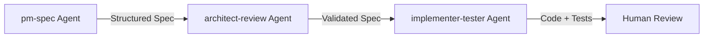

# Production Setups: How Teams Configure AI Coding Tools

> 10+ documented production configurations showing CLAUDE.md patterns, MCP stacks, hooks, multi-agent workflows, and team conventions. Based on real-world usage from open-source projects, enterprise deployments, and community reports.

---

## Table of Contents

1. [CLAUDE.md Configuration Patterns](#1-claudemd-configuration-patterns)
2. [MCP Server Stacks](#2-mcp-server-stacks)
3. [Hooks and Automation](#3-hooks-and-automation)
4. [Multi-Agent Architectures](#4-multi-agent-architectures)
5. [Team Workflow Configurations](#5-team-workflow-configurations)
6. [Complete Production Setups](#6-complete-production-setups)

---

## 1. CLAUDE.md Configuration Patterns

CLAUDE.md is the single most important configuration file for Claude Code. It loads automatically at session start and provides persistent context. The 2026 community consensus is that CLAUDE.md is as essential as `.gitignore`.

Sources: [UX Planet](https://uxplanet.org/claude-md-best-practices-1ef4f861ce7c), [eesel.ai](https://www.eesel.ai/blog/claude-code-best-practices), [Anthropic Docs](https://code.claude.com/docs/en/best-practices)

### Pattern 1: Minimal Root + Imports (Recommended)

Keep the root CLAUDE.md to 50-100 lines. For each line, ask: "Would removing this cause Claude to make mistakes?" If not, cut it.

```markdown
# Project: Acme API

## Tech Stack
- TypeScript 5.x, Node 22, Express
- PostgreSQL 16 + Drizzle ORM
- Vitest for testing

## Build & Test
- `pnpm dev` — start dev server
- `pnpm test` — run all tests
- `pnpm lint` — ESLint + Prettier check

## Architecture
- src/routes/ — Express route handlers
- src/services/ — Business logic (no direct DB access from routes)
- src/db/ — Drizzle schema and migrations

## Conventions
- All exports use named exports (no default exports)
- Error responses use RFC 7807 Problem Details format
- Every service function has a corresponding .test.ts file

@docs/api-patterns.md
@docs/database-conventions.md
@docs/testing-guide.md
```

### Pattern 2: Team Standards Enforcer

Used by teams to enforce consistent coding across developers. From [DEV Community production guide](https://dev.to/mir_mursalin_ankur/claude-code-configuration-blueprint-the-complete-guide-for-production-teams-557p):

```markdown
# Team Standards

## NEVER
- Never use `any` type in TypeScript
- Never commit console.log statements
- Never use default exports
- Never modify migration files after they've been committed

## ALWAYS
- Always write tests before implementation (TDD)
- Always use the logger from src/lib/logger.ts
- Always validate inputs with Zod schemas
- Always handle errors with the Result type from src/lib/result.ts

## Code Review Checklist
Before suggesting code is complete, verify:
1. Tests pass (`pnpm test`)
2. Types check (`pnpm typecheck`)
3. Linting passes (`pnpm lint`)
4. No new `any` types introduced
5. Error cases are handled
```

### Pattern 3: Monorepo Configuration

For monorepos, use directory-scoped CLAUDE.md files:

```
/CLAUDE.md              — Global conventions, monorepo structure
/packages/api/CLAUDE.md — API-specific patterns, DB conventions
/packages/web/CLAUDE.md — Frontend patterns, component library rules
/packages/shared/CLAUDE.md — Shared type conventions
```

Each sub-CLAUDE.md inherits from the root and adds domain-specific context.

### Pattern 4: Security-First Configuration

For teams handling sensitive data:

```markdown
# Security Rules (NON-NEGOTIABLE)

## Forbidden Actions
- NEVER hardcode secrets, tokens, or credentials
- NEVER log PII (email, name, SSN, etc.)
- NEVER use eval() or dynamic code execution
- NEVER disable CORS or CSP headers
- NEVER use HTTP (always HTTPS)

## Required Patterns
- All user input MUST be validated with Zod before processing
- All SQL MUST use parameterized queries (Drizzle enforces this)
- All API endpoints MUST check authentication middleware
- All file uploads MUST be scanned and size-limited

## Sensitive Files (NEVER read or modify)
- .env, .env.*
- **/secrets/**
- **/credentials/**
```

### Pattern 5: Context Size Management

When CLAUDE.md grows too long, important rules get buried. From [Morph LLM guide](https://www.morphllm.com/claude-code-best-practices):

```markdown
# CLAUDE.md (root — keep under 200 lines)

## Critical Rules (Claude reads these first)
[Most important 10 rules here]

## Quick Reference
[Build commands, test commands]

## Architecture Overview
[One paragraph + file tree]

## Detailed Guides (loaded on demand)
@docs/api-patterns.md      — REST API conventions
@docs/db-migrations.md     — Database migration workflow
@docs/deployment.md        — Deployment checklist
@docs/error-handling.md    — Error handling patterns
```

---

## 2. MCP Server Stacks

Model Context Protocol (MCP) servers connect Claude Code to external tools. The ecosystem has 50+ community servers as of February 2026.

Sources: [Anthropic MCP Docs](https://code.claude.com/docs/en/mcp), [Builder.io](https://www.builder.io/blog/claude-code-mcp-servers), [modelcontextprotocol/servers](https://github.com/modelcontextprotocol/servers)

### Setup 6: Full-Stack Development MCP Stack

```json
{
  "mcpServers": {
    "github": {
      "command": "npx",
      "args": ["-y", "@modelcontextprotocol/server-github"],
      "env": { "GITHUB_TOKEN": "env:GITHUB_TOKEN" }
    },
    "postgres": {
      "command": "npx",
      "args": ["-y", "@modelcontextprotocol/server-postgres"],
      "env": { "DATABASE_URL": "env:DATABASE_URL" }
    },
    "filesystem": {
      "command": "npx",
      "args": ["-y", "@modelcontextprotocol/server-filesystem", "/path/to/docs"]
    },
    "browser": {
      "command": "npx",
      "args": ["-y", "@anthropic/mcp-puppeteer"]
    }
  }
}
```

### Setup 7: Product Management MCP Stack

From [prodmgmt.world](https://www.prodmgmt.world/claude-code/mcp):

```json
{
  "mcpServers": {
    "linear": {
      "command": "npx",
      "args": ["-y", "mcp-linear"],
      "env": { "LINEAR_API_KEY": "env:LINEAR_API_KEY" }
    },
    "slack": {
      "command": "npx",
      "args": ["-y", "@anthropic/mcp-slack"],
      "env": { "SLACK_BOT_TOKEN": "env:SLACK_BOT_TOKEN" }
    },
    "notion": {
      "command": "npx",
      "args": ["-y", "@anthropic/mcp-notion"],
      "env": { "NOTION_API_KEY": "env:NOTION_API_KEY" }
    }
  }
}
```

### Setup 8: Observability-Integrated Stack

Using Last9 or similar tools to bring production context into development:

```json
{
  "mcpServers": {
    "last9": {
      "command": "npx",
      "args": ["-y", "@last9/mcp-server"],
      "env": {
        "LAST9_API_KEY": "env:LAST9_API_KEY",
        "LAST9_ORG": "env:LAST9_ORG"
      }
    },
    "sentry": {
      "command": "npx",
      "args": ["-y", "mcp-sentry"],
      "env": { "SENTRY_AUTH_TOKEN": "env:SENTRY_AUTH_TOKEN" }
    }
  }
}
```

### Transport Selection Guide

| Transport | Latency | Use Case |
|-----------|---------|----------|
| stdio | < 5ms | Local development, single-user |
| SSE | ~50ms | Remote streaming, multi-client |
| HTTP Streamable | ~20ms | Cloud production (recommended for server-to-server) |

### Security Best Practices for MCP

- Always use a secret manager for production environments (never hardcode tokens)
- Rotate tokens every 90 days
- Use `env:` prefix to reference environment variables
- Audit MCP server permissions regularly

---

## 3. Hooks and Automation

Hooks are deterministic shell commands that execute at specific lifecycle points. Unlike prompt-based instructions, hooks always run.

Sources: [Anthropic Hooks Guide](https://code.claude.com/docs/en/hooks-guide), [GitButler](https://blog.gitbutler.com/automate-your-ai-workflows-with-claude-code-hooks/), [Blake Crosley](https://blakecrosley.com/blog/claude-code-hooks-tutorial)

### Setup 9: Production Quality Gates

Configuration in `.claude/settings.json`:

```json
{
  "hooks": {
    "PostToolUse": [
      {
        "matcher": "write|edit",
        "hooks": [
          {
            "type": "command",
            "command": ".claude/hooks/auto-format.sh $CLAUDE_FILE_PATH"
          }
        ]
      }
    ],
    "PreToolUse": [
      {
        "matcher": "bash",
        "hooks": [
          {
            "type": "command",
            "command": ".claude/hooks/block-dangerous-commands.sh"
          }
        ]
      }
    ],
    "PostSession": [
      {
        "hooks": [
          {
            "type": "command",
            "command": ".claude/hooks/run-tests.sh"
          }
        ]
      }
    ]
  }
}
```

**Hook exit codes:**
- `0` = allow/proceed
- `2` = block the action (PreToolUse only; stderr message shown to Claude)
- Other non-zero = non-blocking error shown to user

### Why Hooks Exist

One developer created a PreToolUse hook after Claude force-pushed to main during a refactoring session when asked to "push the changes." Hooks provide deterministic safety that prompt instructions cannot guarantee.

### Setup 10: GitButler-Style Branch Management

GitButler uses one of the most sophisticated hook deployments, automatically managing Git branches and commits as Claude works. Their hooks:
- Create feature branches before code changes
- Auto-commit at logical checkpoints
- Run formatters after every file edit
- Validate commit messages match conventions

---

## 4. Multi-Agent Architectures

Claude Code supports up to 10 simultaneous subagents (as of 2026). Context editing automatically clears stale tool outputs, cutting token consumption by 84%.

Source: [DEV Community Production Guide](https://dev.to/lizechengnet/how-to-structure-claude-code-for-production-mcp-servers-subagents-and-claudemd-2026-guide-4gjn)

### Setup 11: Three-Stage Production Pipeline



1. **pm-spec agent** (Haiku model): Reads task input, writes a structured specification
2. **architect-review agent** (Opus model): Validates spec against platform constraints, flags risks
3. **implementer-tester agent** (Sonnet model): Writes code and tests per the validated spec

### Setup 12: Research + Implementation Split

```markdown
## Agent Configuration in CLAUDE.md

When spawning subagents:
- Use Haiku for research and exploration tasks
- Use Sonnet for implementation and test generation
- Use Opus for complex refactoring and code review
- Each teammate works on ONE task at a time
- Teammates communicate via SendMessage
```

### Context Management for Multi-Agent

- Start fresh sessions per task
- Use `/clear` between unrelated tasks
- Compact proactively at 70% context usage
- Delegate research to subagents to keep main context clean
- Scope each task narrowly

---

## 5. Team Workflow Configurations

### Setup 13: Spec-First Development (Recommended)

From [DataCamp best practices](https://www.datacamp.com/tutorial/claude-code-best-practices):

1. Write a structured spec (scope, constraints, acceptance criteria)
2. Open Claude Code in **Plan mode** to review implementation plan
3. Approve or iterate on the plan
4. Switch to implementation mode
5. Run tests and review output

This produces 1.7x fewer defects and 2.74x fewer security vulnerabilities compared to ad-hoc "vibe coding."

### Setup 14: TDD-Driven AI Workflow

From [byteiota TDD Framework](https://byteiota.com/superpowers-tutorial-claude-code-tdd-framework-2026/):

```markdown
## Workflow in CLAUDE.md

1. Write failing test first
2. Ask Claude to implement the minimum code to pass
3. Run tests to verify green
4. Ask Claude to refactor
5. Run tests again to verify still green
6. Repeat
```

### Setup 15: CI/CD Integration

Teams integrate Claude Code into their pipelines:

```yaml
# .github/workflows/claude-review.yml
name: Claude Code Review
on: pull_request

jobs:
  review:
    runs-on: ubuntu-latest
    steps:
      - uses: actions/checkout@v4
      - name: Run Claude Code Review
        uses: anthropics/claude-code-action@v1
        with:
          model: claude-sonnet-4-20250514
          prompt: |
            Review this PR for:
            1. Security vulnerabilities
            2. Performance issues
            3. Test coverage gaps
            4. Convention violations per CLAUDE.md
```

---

## 6. Complete Production Setups

### Setup 16: Anthropic's Internal Usage

Source: [The AI Corner](https://www.the-ai-corner.com/p/claude-ai-2026-guide-stats-workflows)

Anthropic's own teams use Claude Code as their "first stop" for any programming task:
- **Product Engineering**: Primary coding tool for all tasks
- **Security Team**: Traces control flow through codebases 3x faster during incidents
- **Legal Team**: Built prototype systems without traditional development resources
- **Non-technical Teams**: Created custom automation tools

### Setup 17: Enterprise Bank Deployment

Source: [Faros AI](https://www.faros.ai/blog/enterprise-ai-coding-assistant-adoption-scaling-guide)

A major bank deployed AI coding assistants to tens of thousands of engineers:
- Phased rollout: 30-day trial with cross-functional squad, then graduated expansion
- Governance: Access controls, logging, approved model policies, CI policy gates
- Results: 10-20% productivity boost
- Key lesson: Downstream testing, security, rollback processes were the real bottlenecks

### Setup 18: EdTech Rapid Scaling

Source: [Faros AI](https://www.faros.ai/blog/enterprise-ai-coding-assistant-adoption-scaling-guide)

An EdTech company achieved 1100% increase in AI coding adoption in 3 months:
- Scaled from 25 to 300 engineers
- Treated rollout like a product launch with milestones and feedback loops
- Measurement-driven decisions with real telemetry
- Reported 15,324% ROI based on 10,000+ developer telemetry

---

## Quick Reference: Configuration File Locations

| File | Scope | Purpose |
|------|-------|---------|
| `CLAUDE.md` (project root) | All sessions in project | Project context, conventions, commands |
| `*/CLAUDE.md` (subdirectories) | Sessions in that directory | Domain-specific rules |
| `~/.claude/CLAUDE.md` | All projects for user | Personal preferences |
| `.claude/settings.json` | Project | Hooks, permissions, MCP servers |
| `~/.claude/settings.json` | User | Global MCP servers, preferences |
| `.claude/hooks/*.sh` | Project | Hook scripts |
