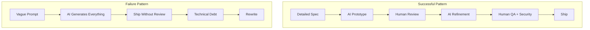

# Startup Stories: Products Built with AI Coding Tools

> Real stories of projects and products built primarily with AI coding tools. What worked, what didn't, timelines, and tech stacks. Based on publicly reported data from 2025-2026.

---

## Table of Contents

1. [The Vibe Coding Landscape](#the-vibe-coding-landscape)
2. [Breakout Startups](#breakout-startups)
3. [Y Combinator and the 95% AI Codebase](#y-combinator-and-the-95-ai-codebase)
4. [What Worked](#what-worked)
5. [What Didn't Work](#what-didnt-work)
6. [Common Patterns in Successful AI-Built Products](#common-patterns-in-successful-ai-built-products)
7. [The Prototype-to-Production Gap](#the-prototype-to-production-gap)

---

## The Vibe Coding Landscape

The term "vibe coding" was coined by Andrej Karpathy (co-founder of OpenAI, former AI lead at Tesla) in February 2025 to describe a development practice where developers describe tasks in natural language and AI generates the source code.

By 2025, the global vibe coding market was valued at **$2.96 billion**. Projections put it at **$12.3 billion by 2027**.

Sources: [Wikipedia](https://en.wikipedia.org/wiki/Vibe_coding), [Volumetree](https://www.volumetree.com/2026/03/05/vibe-coding-pros-cons-2026/)

---

## Breakout Startups

### Lovable (Sweden)

**The story:** A vibe-coding platform that lets non-technical users build full-stack apps through natural language.

| Metric | Value |
|--------|-------|
| ARR | $100M in 8 months from launch |
| Projected 2026 ARR | $250M |
| Users | 500,000+ building apps daily |
| Apps built | 25,000+ per day |
| Paying customers | 30,000+ |
| Stack | React + Supabase (constrained by design) |

**What worked:**
- Constraining to React/Supabase let them perfect one workflow instead of supporting everything
- Full environment from prototype to deployment in one place
- Developer who tried Bolt, then v0, settled on Lovable and "has not regretted that decision"

**What didn't work:**
- Limited to React/Supabase -- no flexibility for other frameworks
- Credit-based pricing becomes expensive for complex projects
- Design customization is limited
- Code quality degrades as projects grow ("the 50th prompt produces worse code than the 5th")

Sources: [TechPoint Africa](https://techpoint.africa/guide/lovable-vs-bolt-vs-cursor/), [Lovable.dev](https://lovable.dev/guides/cursor-vs-bolt-vs-lovable-comparison)

---

### Cursor

**The story:** An AI-first IDE that became the dominant tool for developers who write code but want AI assistance. Now the most valuable pure-play AI coding company.

| Metric | Value |
|--------|-------|
| Valuation | $29.3 billion (November 2025) |
| Daily active users | 1M+ |
| Latest release | Composer 2 model (March 2026) |
| Category | IDE-integrated AI (not app builder) |

**What worked:**
- Focused on developers who already code -- amplified existing skills
- Deep IDE integration (not a separate tool)
- Composer 2 model optimized specifically for programming tasks

**What didn't work:**
- Doesn't build UIs directly (unlike Lovable/Bolt)
- Steep learning curve for non-developers
- Requires coding knowledge to get the most out of it

Sources: [Nerdbot](https://nerdbot.com/2026/03/11/cursor-vs-lovable-vs-bolt-the-best-vibe-coding-tools-in-2026-tested-compared/), [SiliconAngle](https://siliconangle.com/2026/03/19/vibe-coding-startup-cursor-launches-programming-optimized-composer-2-model/)

---

### Anything

**The story:** A vibe-coding startup that achieved remarkable early traction.

| Metric | Value |
|--------|-------|
| ARR | $2M in first 2 weeks |
| Valuation | $100M |
| Funding | $11M |
| Timeline | Weeks from launch to significant revenue |

**What worked:**
- Extremely fast time-to-value for users
- Focused on getting apps deployed quickly

Sources: [TechCrunch](https://techcrunch.com/2025/09/29/vibe-coding-startup-anything-nabs-a-100m-valuation-after-hitting-2m-arr-in-its-first-two-weeks/)

---

### Emergent

**The story:** A vibe-coding platform with massive global reach.

| Metric | Value |
|--------|-------|
| Users | 5M+ across 190 countries |
| Current ARR | $50M |
| Projected ARR | $100M+ by April 2026 |
| Funding | $70M |

Sources: [CryptoRank](https://cryptorank.io/news/feed/3f652-emergent-ai-vibe-coding-funding)

---

### Claude Code's Rise

**The story:** Anthropic's CLI coding tool went from side project to the tool Google engineers prefer.

| Metric | Value |
|--------|-------|
| Weekly code processed | 195M lines (July 2025) |
| Developers | 115,000+ (July 2025) |
| Daily installs (30-day avg) | 17.7M growing to 29M+ (early 2026) |
| Notable adopter | Google engineers, including Jaana Dogan (Gemini API lead) |

**Key moment:** In January 2026, Google's Jaana Dogan revealed that Claude Code generated a distributed agent orchestration system in 60 minutes -- a problem her team had been iterating on throughout 2024.

Sources: [Medium](https://tasmayshah12.medium.com/claude-code-how-a-side-project-became-the-ai-coding-tool-google-engineers-prefer-in-2025-73aaa6a54371), [Gradually AI](https://www.gradually.ai/en/claude-code-statistics/), [Uncover Alpha](https://www.uncoveralpha.com/p/anthropics-claude-code-is-having)

---

## Y Combinator and the 95% AI Codebase

Y Combinator reported that **25% of startups in their Winter 2025 batch had codebases that were 95% AI-generated**. This marked a turning point in how the startup ecosystem views AI-first development.

The implications:
- Dramatically lower barrier to entry for non-technical founders
- Faster iteration cycles (days instead of months)
- New category of "AI-native" companies that never wrote code manually
- Raised questions about technical debt, maintainability, and competitive moats

Source: [Lovable.dev](https://lovable.dev/guides/cursor-vs-bolt-vs-lovable-comparison)

---

## What Worked

### 1. Constrained Stacks

Companies that limited their tech stack options (like Lovable with React/Supabase) achieved better results than those offering unlimited flexibility. Constraints let the AI specialize deeply.

### 2. Prototype-First Workflow

The most successful pattern: use AI to build a working prototype fast, then refine with human expertise. Teams using both Lovable (for prototype) and Cursor (for production) reported the best outcomes.

### 3. Focused, Small Tasks

Breaking work into small, testable chunks consistently outperformed asking for large, monolithic outputs. As Addy Osmani noted: "LLMs do best when given focused prompts: implement one function, fix one bug, add one feature at a time."

Source: [Addy Osmani](https://addyosmani.com/blog/ai-coding-workflow/)

### 4. Non-Technical Team Empowerment

At Anthropic, legal teams built prototype systems and non-technical teams created custom automation tools. Microsoft encouraged even non-developers to use Claude Code.

Sources: [The AI Corner](https://www.the-ai-corner.com/p/claude-ai-2026-guide-stats-workflows)

### 5. Specification-First Development

Writing detailed specs before generating code produced 1.7x fewer defects and 2.74x fewer security vulnerabilities compared to ad-hoc prompting.

Source: [DEV Community](https://dev.to/lizechengnet/how-to-structure-claude-code-for-production-mcp-servers-subagents-and-claudemd-2026-guide-4gjn)

---

## What Didn't Work

### 1. "Set and Forget" AI Coding

Every startup that tried to generate entire applications without human review accumulated technical debt rapidly. Bug density in projects with unreviewed AI-generated code was **23% higher**.

### 2. Scaling Beyond Prototypes Without Refactoring

Code quality degrades as projects grow. Multiple reports confirm that the 50th prompt produces worse code than the 5th. Teams that didn't invest in refactoring hit walls.

### 3. Security as an Afterthought

AI-generated code has **2.74x more vulnerabilities** than human-written code. Missing input validation is the most common flaw. Cross-Site Scripting has an **86% failure rate** in AI-generated code.

Source: [Endor Labs](https://www.endorlabs.com/learn/the-most-common-security-vulnerabilities-in-ai-generated-code), [SoftwareSeni](https://www.softwareseni.com/ai-generated-code-security-risks-why-vulnerabilities-increase-2-74x-and-how-to-prevent-them/)

### 4. Ignoring the Review Bottleneck

Teams that accelerated code generation without scaling their review process created backlogs. PR review time increased **91%** on teams with high AI adoption.

### 5. Over-Reliance on AI for Complex Architecture

AI excels at implementing well-specified components but struggles with novel architectural decisions. Senior developers were actually **19% slower** when using AI for complex, novel tasks.

Source: [METR](https://metr.org/blog/2025-07-10-early-2025-ai-experienced-os-dev-study/)

---

## Common Patterns in Successful AI-Built Products

### The Successful Team Profile

| Attribute | Description |
|-----------|-------------|
| Team size | 1-5 developers + AI tools |
| Human role | Architect, reviewer, spec writer |
| AI role | Implementer, researcher, test writer |
| Iteration speed | Multiple deployments per day |
| Code ownership | Human always accountable |
| Review process | Every AI-generated PR reviewed |

---

## The Prototype-to-Production Gap

The biggest lesson from 2025-2026 is that AI coding tools have largely solved the prototype problem but the production problem remains challenging.

**Prototyping (Solved):**
- Generate working apps in minutes
- Iterate on UI/UX rapidly
- Test ideas before investing engineering time

**Production (Still Hard):**
- Code quality degrades over time
- Security requires human expertise
- Performance optimization needs domain knowledge
- Monitoring and observability need careful setup
- Edge cases and error handling need attention

**The emerging solution:** Use AI for the 80% (boilerplate, standard patterns, tests) and human expertise for the 20% (architecture, security, performance, edge cases). Teams that embraced this split reported the best outcomes.

---

## Recommended Reading

- [Addy Osmani's LLM Coding Workflow](https://addyosmani.com/blog/ai-coding-workflow/) -- Practical production workflow
- [Claude Code Best Practices](https://code.claude.com/docs/en/best-practices) -- Official guidance
- [METR Study on AI and Developer Productivity](https://metr.org/blog/2025-07-10-early-2025-ai-experienced-os-dev-study/) -- Academic research
- [Vibe Coding (Wikipedia)](https://en.wikipedia.org/wiki/Vibe_coding) -- Background and context
