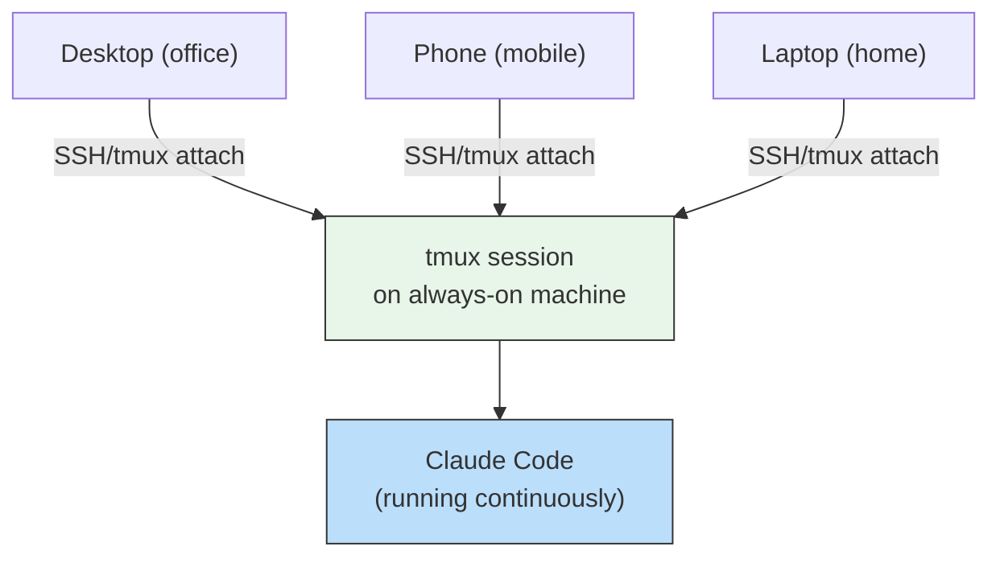
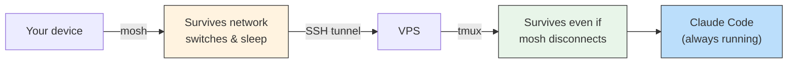
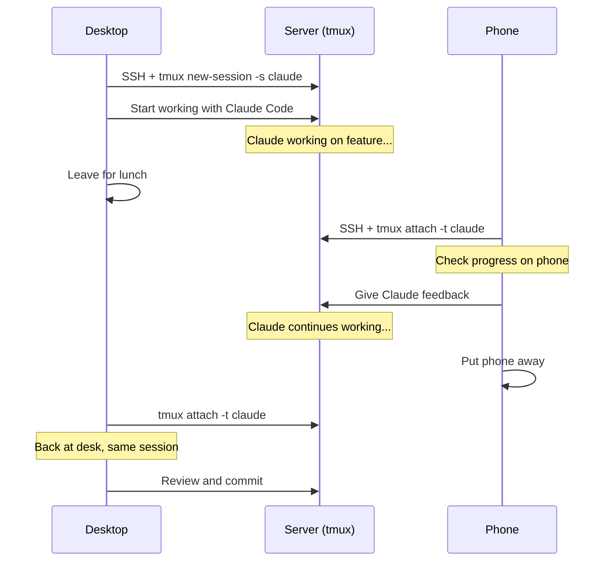

# Claude Code Remote Usage Guide

> How to use Claude Code from your phone, other computers, and remote servers. Covers SSH, tmux, mosh, notifications, mobile apps, and session continuity.

---

## Table of Contents

1. [Why Remote Access?](#why-remote-access)
2. [Architecture Overview](#architecture-overview)
3. [Option 1: Tailscale + tmux (Simplest)](#option-1-tailscale--tmux-simplest)
4. [Option 2: VPS + mosh + tmux (Most Robust)](#option-2-vps--mosh--tmux-most-robust)
5. [Option 3: SSH Jump Hosts (Corporate/Complex Networks)](#option-3-ssh-jump-hosts)
6. [Option 4: Claude Code on the Web](#option-4-claude-code-on-the-web)
7. [Mobile Setup](#mobile-setup)
8. [Notification Systems](#notification-systems)
9. [Session Continuity Across Devices](#session-continuity-across-devices)
10. [tmux Configuration for Claude Code](#tmux-configuration-for-claude-code)
11. [Security Best Practices](#security-best-practices)
12. [Troubleshooting](#troubleshooting)

---

## Why Remote Access?

Claude Code runs in your terminal. When you close your terminal, the session dies. Remote access solves three problems:

1. **Persistence**: Long-running Claude tasks continue even when you disconnect
2. **Mobility**: Start a task on your desktop, monitor from your phone on the couch
3. **Device Independence**: Same session available from any device, any network

The key insight: with tmux, you are **attaching to the same running process**. There is no resume, no context reload -- Claude Code is still right there, mid-thought.



---

## Architecture Overview

There are several approaches depending on your setup:

| Approach | Best For | Complexity | Reliability |
|----------|----------|------------|-------------|
| **Tailscale + tmux** | Home Mac/PC | Low | High |
| **VPS + mosh + tmux** | Always-on, any network | Medium | Highest |
| **SSH Jump Hosts** | Corporate environments | Medium | High |
| **Claude Code Web** | Quick access, no setup | None | Depends on internet |

---

## Option 1: Tailscale + tmux (Simplest)

This is the easiest setup: use Tailscale to create a secure network between your devices, and tmux for session persistence.

### Step 1: Install Tailscale

On your **development machine** (Mac/Linux):
```bash
# macOS
brew install tailscale
# or download from https://tailscale.com/download

# Linux
curl -fsSL https://tailscale.com/install.sh | sh
```

On your **phone**:
- iOS: Download Tailscale from App Store
- Android: Download Tailscale from Play Store

Sign in with the same account on both devices.

### Step 2: Enable SSH on Your Dev Machine

**macOS:**
```
System Settings -> General -> Sharing -> Remote Login -> Enable
```

**Linux:**
```bash
sudo apt install openssh-server
sudo systemctl enable ssh
sudo systemctl start ssh
```

### Step 3: Install and Configure tmux

```bash
# macOS
brew install tmux

# Linux
sudo apt install tmux
```

Create `~/.tmux.conf`:

```bash
cat > ~/.tmux.conf << 'EOF'
# Essential for mobile usage
set -g mouse on

# Increase scrollback buffer
set -g history-limit 50000

# Start windows and panes at 1
set -g base-index 1
setw -g pane-base-index 1

# Reduce escape time (important for SSH)
set -sg escape-time 10

# Status bar (minimal for mobile)
set -g status-style 'bg=colour235 fg=colour255'
set -g status-left '[#S] '
set -g status-right '%H:%M'

# Better key bindings
bind r source-file ~/.tmux.conf \; display "Config reloaded"

# Easy split panes
bind | split-window -h -c "#{pane_current_path}"
bind - split-window -v -c "#{pane_current_path}"

# PageUp for scroll mode (important for mobile)
bind -n PageUp copy-mode -eu
bind -n F1 copy-mode
EOF
```

### Step 4: Create a Persistent Claude Session

On your dev machine:

```bash
# Create a named tmux session for Claude
tmux new-session -s claude -c ~/projects/my-project
```

Inside the tmux session:
```bash
claude
```

### Step 5: Connect from Phone

Open Termius (or any SSH app) on your phone:

```
Host: your-machine-name  (Tailscale hostname)
# or use the Tailscale IP: 100.x.x.x
```

Once connected:
```bash
tmux attach -t claude
```

You are now connected to the same Claude session running on your desktop.

### Auto-Attach on SSH

Add to `~/.zshrc` or `~/.bashrc` on your dev machine:

```bash
# Auto-attach to tmux Claude session when SSHing in
if [[ -n "$SSH_CONNECTION" ]] && [[ -z "$TMUX" ]]; then
    tmux attach -t claude 2>/dev/null || tmux new-session -s claude
fi
```

---

## Option 2: VPS + mosh + tmux (Most Robust)

For true always-on persistence that survives your machine sleeping or turning off.

### Step 1: Set Up a VPS

Provision a small VPS (DigitalOcean, Hetzner, AWS EC2, etc.):
- **Minimum specs**: 1 CPU, 1GB RAM (Claude Code is a CLI, not compute-heavy)
- **OS**: Ubuntu 22.04 or newer
- **Region**: Close to you for low latency

### Step 2: Initial Server Setup

```bash
# SSH into your VPS
ssh root@your-vps-ip

# Create a non-root user
adduser claude-dev
usermod -aG sudo claude-dev

# Switch to new user
su - claude-dev

# Install essentials
sudo apt update && sudo apt install -y \
    curl git tmux mosh build-essential \
    nodejs npm jq

# Install Claude Code
curl -fsSL https://claude.ai/install.sh | bash

# Configure SSH keys (run on your LOCAL machine)
# ssh-copy-id claude-dev@your-vps-ip
```

### Step 3: Harden SSH

Edit `/etc/ssh/sshd_config`:

```
PermitRootLogin no
PasswordAuthentication no
PubkeyAuthentication yes
KbdInteractiveAuthentication no
```

```bash
sudo systemctl restart ssh
```

### Step 4: Install and Configure mosh

mosh handles flaky mobile connections gracefully -- it survives network switches, sleep/wake, and high latency.

**On the VPS:**
```bash
sudo apt install mosh
sudo ufw allow 60000:61000/udp  # mosh port range
```

**On your local machine / phone:**
```bash
# macOS
brew install mosh

# Termux (Android)
pkg install mosh
```

### Step 5: Configure tmux (Same as Option 1)

Use the same `~/.tmux.conf` from Option 1, plus add auto-start:

```bash
# Add to ~/.bashrc on the VPS
if [[ -z "$TMUX" ]]; then
    tmux attach -t claude 2>/dev/null || tmux new-session -s claude -c ~/projects
fi
```

### Step 6: Connect

```bash
# From desktop
mosh claude-dev@your-vps-ip

# From phone (Termux)
mosh claude-dev@your-vps-ip

# tmux auto-attaches, you're in Claude Code immediately
```

### The Resilience Chain



mosh handles the flaky connection. tmux handles session persistence. Together, they create a robust chain where Claude Code keeps running no matter what.

---

## Option 3: SSH Jump Hosts

For corporate environments where your dev machine is behind a firewall.

### Architecture

```
Phone --> Home Server (WireGuard/Tailscale) --> Work PC (SSH)
```

### SSH Config

On your connecting device, create `~/.ssh/config`:

```
Host home-server
    HostName 100.x.x.x  # Tailscale IP
    User you
    IdentityFile ~/.ssh/id_ed25519

Host work-pc
    HostName 192.168.1.x  # Local IP on work network
    User you
    ProxyJump home-server
    IdentityFile ~/.ssh/id_ed25519
```

Now connect:
```bash
ssh work-pc
# Automatically jumps through home-server
# Then: tmux attach -t claude
```

Or with mosh alias:
```bash
# In ~/.bashrc or fish config
alias cc="mosh home-server -- ssh -t work-pc 'tmux attach -t claude'"
```

---

## Option 4: Claude Code on the Web

The simplest option -- no setup required.

### claude.ai/code

Access Claude Code directly in your browser at `claude.ai/code`. This runs on Anthropic's secure cloud infrastructure in isolated VMs.

**Pros:**
- Zero setup
- Works from any device with a browser
- No SSH, tmux, or VPS needed
- Isolated environments

**Cons:**
- Requires internet
- Cannot access your local filesystem
- Limited to what is in the cloud environment
- May not have your full dev environment set up

### When to Use Web vs. Terminal

| Scenario | Use Web | Use Terminal (Remote) |
|----------|---------|----------------------|
| Quick fix on the go | Yes | Overkill |
| Working on your actual project codebase | No | Yes |
| Need local tools/database | No | Yes |
| Starting from scratch on a new idea | Yes | Either |
| Long-running task monitoring | Either | Better (tmux) |

---

## Mobile Setup

### Recommended Apps

| Platform | App | Purpose | Cost |
|----------|-----|---------|------|
| **iOS** | Termius | SSH/mosh client, gesture support | Free (premium available) |
| **iOS** | Blink Shell | SSH/mosh, great keyboard | Paid |
| **iOS** | Prompt 3 | SSH client by Panic | Paid |
| **Android** | Termux | Full terminal emulator | Free |
| **Android** | JuiceSSH | SSH client | Free |
| **Both** | Tailscale | VPN/networking | Free |

### iOS Setup with Termius

1. Install Termius from App Store
2. Install Tailscale from App Store
3. Configure SSH connection:
   - Host: Your Tailscale hostname or IP
   - Username: your-username
   - Authentication: SSH key (generate in Termius or import)
4. Enable "Keep Alive" in connection settings
5. Test connection: `ssh your-machine`
6. Attach to tmux: `tmux attach -t claude`

### iOS Tips

- **Two-finger swipe down** in Termius sends PageUp (for scrolling Claude output)
- **Use Wispr Flow or iOS dictation** for voice input instead of typing
- **External keyboard**: Pairs well with iPad for a laptop-like experience
- **Keep Alive**: Set SSH keep-alive interval to 30 seconds to prevent disconnects

### Android Setup with Termux

```bash
# Install in Termux
pkg update && pkg upgrade
pkg install openssh mosh tmux

# Generate SSH key
ssh-keygen -t ed25519

# Copy key to your server
ssh-copy-id user@your-server

# Create alias for quick connect
echo 'alias cc="mosh user@server -- tmux attach -t claude"' >> ~/.bashrc
source ~/.bashrc

# Connect
cc
```

### Voice Input for Mobile

Typing on a phone keyboard is slow. Use voice input:

- **iOS**: Built-in dictation (tap microphone on keyboard)
- **Wispr Flow**: Voice-to-text app optimized for technical input
- **SuperWhisper**: Karpathy's recommended voice-to-text tool (macOS/iOS)

Voice input is especially powerful for vibe coding -- describe what you want naturally and let Claude implement it.

---

## Notification Systems

When Claude is working autonomously on a remote machine, you need notifications to know when it finishes or needs input.

### ntfy (Recommended - Self-Hosted or Free)

[ntfy](https://ntfy.sh) is a simple HTTP-based notification service.

#### Setup

```bash
# Install ntfy CLI on your server
sudo apt install ntfy  # or: pip install ntfy

# Test
curl -d "Hello from server" https://ntfy.sh/your-unique-topic
```

Subscribe to `your-unique-topic` in the ntfy app (iOS/Android).

#### Claude Code Hook Integration

Add to `.claude/settings.json`:

```json
{
  "hooks": {
    "Stop": [
      {
        "hooks": [
          {
            "type": "command",
            "command": "if [ -n \"$SSH_CONNECTION\" ]; then curl -s -H 'Priority: default' -d 'Claude finished working' https://ntfy.sh/your-topic; fi"
          }
        ]
      }
    ],
    "AskUserQuestion": [
      {
        "hooks": [
          {
            "type": "command",
            "command": "if [ -n \"$SSH_CONNECTION\" ]; then curl -s -H 'Priority: high' -H 'Tags: question' -d 'Claude needs your input' https://ntfy.sh/your-topic; fi"
          }
        ]
      }
    ]
  }
}
```

The `$SSH_CONNECTION` check prevents notifications from firing when you are sitting at the machine.

#### Notification Script (More Sophisticated)

Create `~/.claude/hooks/notify.sh`:

```bash
#!/bin/bash
# Reads Claude Code hook event from environment
# Only notifies when accessed remotely

if [ -z "$SSH_CONNECTION" ]; then
    exit 0  # Not remote, skip notification
fi

TOPIC="your-unique-topic"
NTFY_URL="https://ntfy.sh/$TOPIC"

# Read event type from hook context
EVENT_TYPE="${CLAUDE_HOOK_EVENT:-unknown}"

case "$EVENT_TYPE" in
    "Stop")
        curl -s \
            -H "Title: Claude Code" \
            -H "Priority: default" \
            -H "Tags: white_check_mark" \
            -d "Task completed" \
            "$NTFY_URL"
        ;;
    "AskUserQuestion")
        curl -s \
            -H "Title: Claude Code - Input Needed" \
            -H "Priority: high" \
            -H "Tags: question" \
            -d "Claude is waiting for your response" \
            "$NTFY_URL"
        ;;
    "Error")
        curl -s \
            -H "Title: Claude Code - Error" \
            -H "Priority: high" \
            -H "Tags: x" \
            -d "An error occurred" \
            "$NTFY_URL"
        ;;
esac
```

```bash
chmod +x ~/.claude/hooks/notify.sh
```

### Alternative: Pushover

If you prefer Pushover over ntfy:

```bash
curl -s \
    --form-string "token=YOUR_APP_TOKEN" \
    --form-string "user=YOUR_USER_KEY" \
    --form-string "message=Claude finished task" \
    https://api.pushover.net/1/messages.json
```

### Alternative: Slack Notification

```bash
curl -X POST -H 'Content-type: application/json' \
    --data '{"text":"Claude Code finished working on your task"}' \
    YOUR_SLACK_WEBHOOK_URL
```

---

## Session Continuity Across Devices

### With tmux (Best)

tmux provides true session continuity -- you attach to the **exact same running process**:

```bash
# On device A: start a session
tmux new-session -s claude
claude

# Later, on device B: attach to the same session
ssh your-server
tmux attach -t claude
# Claude is right where you left it, mid-thought
```

### With Claude Code's Built-in Resume

If you cannot use tmux, Claude Code has built-in session persistence:

```bash
# On device A
claude
# Work on something, then exit

# On device B (same machine or shared filesystem)
claude --continue       # Resume most recent session
claude --resume         # Pick from list of recent sessions
```

Note: `--resume` reloads conversation context but starts a new process. The AI context is preserved but any running operations (test suites, builds) from the previous session are gone.

### Naming Sessions for Easy Resume

```
/rename oauth-migration
```

Later:
```bash
claude --resume
# Shows list with named sessions for easy identification
```

### Cross-Device Workflow



---

## tmux Configuration for Claude Code

### Optimized .tmux.conf

```bash
cat > ~/.tmux.conf << 'TMUXEOF'
# === General ===
set -g default-terminal "screen-256color"
set -ga terminal-overrides ",*256col*:Tc"
set -g mouse on
set -g history-limit 50000
set -sg escape-time 10
set -g focus-events on

# === Index ===
set -g base-index 1
setw -g pane-base-index 1
set -g renumber-windows on

# === Status Bar (mobile-friendly: minimal) ===
set -g status-position bottom
set -g status-style 'bg=#1a1a2e fg=#eee'
set -g status-left '#[fg=green][#S] '
set -g status-left-length 20
set -g status-right '#[fg=yellow]#H #[fg=white]%H:%M'
set -g status-right-length 40

# === Pane Borders ===
set -g pane-border-style 'fg=#3d3d5c'
set -g pane-active-border-style 'fg=#5c5c8a'

# === Keybindings ===
# Reload config
bind r source-file ~/.tmux.conf \; display "Config reloaded"

# Split panes
bind | split-window -h -c "#{pane_current_path}"
bind - split-window -v -c "#{pane_current_path}"

# Navigate panes with Alt+arrow (no prefix needed)
bind -n M-Left select-pane -L
bind -n M-Right select-pane -R
bind -n M-Up select-pane -U
bind -n M-Down select-pane -D

# Mobile scrolling
bind -n PageUp copy-mode -eu
bind -n F1 copy-mode

# Quick session switching
bind s choose-tree -s

# === Activity ===
setw -g monitor-activity on
set -g visual-activity off
TMUXEOF
```

### Useful tmux Commands

| Command | Action |
|---------|--------|
| `tmux new -s claude` | Create named session |
| `tmux attach -t claude` | Attach to session |
| `tmux ls` | List sessions |
| `tmux kill-session -t name` | Kill a session |
| `Ctrl+B d` | Detach (session keeps running) |
| `Ctrl+B [` | Enter scroll mode |
| `q` | Exit scroll mode |
| `Ctrl+B c` | New window |
| `Ctrl+B n` | Next window |
| `Ctrl+B p` | Previous window |

### Multiple Claude Sessions in tmux

```bash
# Create a tmux session with multiple windows
tmux new-session -s dev -n "claude-main"
# Ctrl+B c  (new window)
# Name it: Ctrl+B ,  then type "claude-review"
# Start another Claude session in the new window

# Switch between windows:
# Ctrl+B n  (next)
# Ctrl+B p  (previous)
# Ctrl+B 1  (window 1)
# Ctrl+B 2  (window 2)
```

---

## Security Best Practices

### SSH Key Authentication Only

```bash
# Generate a strong key
ssh-keygen -t ed25519 -C "your-email@example.com"

# Copy to server
ssh-copy-id user@server

# Disable password auth on server
# /etc/ssh/sshd_config:
# PasswordAuthentication no
# PubkeyAuthentication yes
```

### Use Tailscale or WireGuard

Never expose SSH directly to the internet. Use a VPN layer:

- **Tailscale**: Zero-config, works through NATs, free for personal use
- **WireGuard**: Lightweight, fast, kernel-level VPN

### Firewall Configuration

```bash
# On VPS, only allow SSH and mosh
sudo ufw default deny incoming
sudo ufw default allow outgoing
sudo ufw allow 22/tcp         # SSH
sudo ufw allow 60000:61000/udp  # mosh
sudo ufw enable
```

### Claude Code Permission Model

When running remotely, be more careful with permissions:

```json
{
  "permissions": {
    "deny": [
      "Bash(rm -rf *)",
      "Bash(sudo *)",
      "Bash(curl * | sh)",
      "Bash(wget * | sh)"
    ]
  }
}
```

### Never Store Secrets in CLAUDE.md

Keep API tokens and secrets in environment variables or `.env` files that are git-ignored. Reference them with `${VAR_NAME}` syntax in MCP configs.

---

## Troubleshooting

### Connection Drops Frequently

**Problem:** SSH disconnects after a few minutes of inactivity.

**Fix:** Add to `~/.ssh/config` on your connecting device:
```
Host *
    ServerAliveInterval 30
    ServerAliveCountMax 5
```

Or use mosh instead of raw SSH -- it handles intermittent connectivity natively.

### tmux Session Lost After Server Reboot

**Problem:** Server rebooted, tmux sessions are gone.

**Fix:** tmux sessions do not survive reboots. Options:
1. Use `tmux-resurrect` plugin to save/restore sessions
2. Set up a systemd service to auto-start tmux on boot:

```bash
# /etc/systemd/system/tmux-claude.service
[Unit]
Description=tmux Claude session
After=network.target

[Service]
Type=forking
User=claude-dev
ExecStart=/usr/bin/tmux new-session -d -s claude -c /home/claude-dev/projects
ExecStop=/usr/bin/tmux kill-session -t claude

[Install]
WantedBy=multi-user.target
```

```bash
sudo systemctl enable tmux-claude
sudo systemctl start tmux-claude
```

### Cannot Scroll Claude Output on Phone

**Problem:** Output scrolls past and you cannot read it.

**Fix:** In tmux, press `PageUp` or `F1` to enter scroll mode. Use swipe gestures or arrow keys to scroll. Press `q` to exit scroll mode.

In Termius: two-finger swipe down triggers PageUp.

### Claude Code Not Found After SSH

**Problem:** `claude: command not found` after SSH.

**Fix:** The Claude Code binary might not be in the SSH session's PATH. Add to `~/.bashrc` or `~/.zshrc`:

```bash
export PATH="$HOME/.claude/bin:$PATH"
```

### High Latency Makes Claude Code Unusable

**Problem:** Typing is laggy over SSH.

**Fix:**
1. Use mosh instead of SSH (handles latency with local echo)
2. Choose a VPS region closer to you
3. Use voice input instead of typing
4. Use Tailscale's DERP relay servers for better routing

---

## Sources

- [Seamless Claude Code Handoff: SSH From Your Phone With tmux](https://elliotbonneville.com/phone-to-mac-persistent-terminal/)
- [Claude Code from the Beach: Remote Setup with mosh, tmux and ntfy](https://rogs.me/2026/02/claude-code-from-the-beach-my-remote-coding-setup-with-mosh-tmux-and-ntfy/)
- [Running Claude Code from iPhone via SSH + tmux](https://dev.to/shimo4228/running-claude-code-from-iphone-via-ssh-tmux-4c10)
- [Claude Code Remote Control: Code From Your Phone](https://medium.com/@richardhightower/claude-code-remote-control-code-from-your-phone-3c7059c3b5de)
- [On Agentic Coding From Anywhere](https://kareemf.com/on-agentic-coding-from-anywhere)
- [Claude Code on a VPS: The Complete Setup](https://medium.com/@0xmega/claude-code-on-a-vps-the-complete-setup-security-tmux-mobile-access-2d214f5a0b3b)
- [Anthropic Engineers Running Claude Code Remotely with Coder](https://coder.com/blog/building-for-2026-why-anthropic-engineers-are-running-claude-code-remotely-with-c)
- [Why We Built Claude Remote on tmux](https://clauderc.com/blog/2026-02-28-tmux-architecture-and-session-persistence/)
