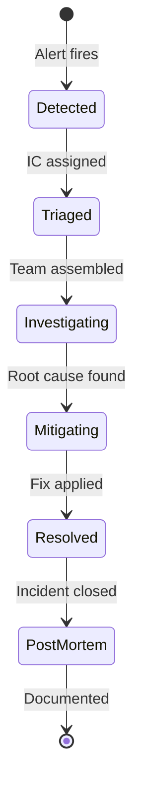
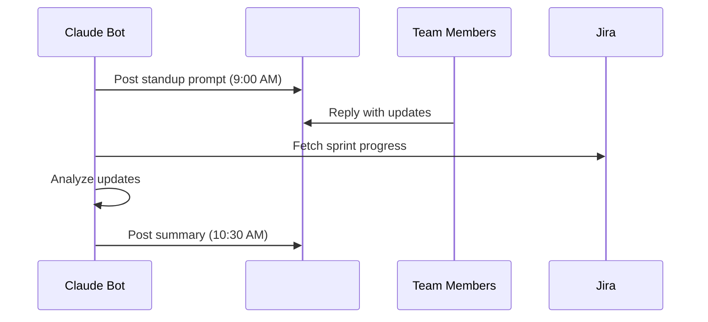

# Slack Integration Skills for Claude Code

---

## Skill: Slack Notify

### `.claude/skills/slack-notify/SKILL.md`

```yaml
---
name: slack-notify
description: Send structured notifications to Slack channels - deploys, alerts, reports
allowed-tools:
  - Bash
  - mcp__slack__*
---
```

```markdown
# Slack Notification Skill

## Notification Types

### Deployment Notification
```json
{
  "channel": "#deployments",
  "blocks": [
    {
      "type": "header",
      "text": {"type": "plain_text", "text": "Deployment: api-service v2.3.1"}
    },
    {
      "type": "section",
      "fields": [
        {"type": "mrkdwn", "text": "*Environment:*\nproduction"},
        {"type": "mrkdwn", "text": "*Status:*\n:white_check_mark: Success"},
        {"type": "mrkdwn", "text": "*Deployed by:*\n@alice via Claude Code"},
        {"type": "mrkdwn", "text": "*Duration:*\n3m 42s"}
      ]
    },
    {
      "type": "section",
      "text": {"type": "mrkdwn", "text": "*Changes:*\n- Fix auth timeout (#456)\n- Add rate limiting (#457)\n- Update dependencies (#458)"}
    },
    {
      "type": "actions",
      "elements": [
        {"type": "button", "text": {"type": "plain_text", "text": "View PR"}, "url": "https://github.com/org/repo/pull/459"},
        {"type": "button", "text": {"type": "plain_text", "text": "View Dashboard"}, "url": "https://app.datadoghq.com/dashboard/abc"},
        {"type": "button", "text": {"type": "plain_text", "text": "Rollback"}, "style": "danger", "action_id": "rollback_v2.3.1"}
      ]
    }
  ]
}
```

### Alert Notification
```json
{
  "channel": "#incidents",
  "blocks": [
    {
      "type": "header",
      "text": {"type": "plain_text", "text": ":rotating_light: ALERT: High Error Rate"}
    },
    {
      "type": "section",
      "fields": [
        {"type": "mrkdwn", "text": "*Service:*\ncheckout-service"},
        {"type": "mrkdwn", "text": "*Severity:*\nCRITICAL"},
        {"type": "mrkdwn", "text": "*Error Rate:*\n8.5% (threshold: 2%)"},
        {"type": "mrkdwn", "text": "*Started:*\n<!date^1711115520^{time}|14:32 UTC>"}
      ]
    },
    {
      "type": "section",
      "text": {"type": "mrkdwn", "text": "*AI Analysis:*\nCorrelates with deployment v2.3.1 at 14:30. NullPointerException in OrderService.processPayment(). Recommend immediate rollback."}
    }
  ]
}
```

### Status Report
```json
{
  "channel": "#engineering",
  "blocks": [
    {
      "type": "header",
      "text": {"type": "plain_text", "text": ":bar_chart: Daily Engineering Report"}
    },
    {
      "type": "section",
      "text": {"type": "mrkdwn", "text": "*PRs:* 5 merged, 3 opened, 1 closed\n*Issues:* 4 resolved, 6 opened\n*Deploys:* 3 to staging, 1 to production\n*Incidents:* 0 new, 1 resolved"}
    }
  ]
}
```

## Channel Routing

| Event Type | Channel | Mention |
|-----------|---------|---------|
| Production deploy | #deployments | @channel |
| Critical alert | #incidents | @oncall-sre |
| CI failure | #ci-notifications | PR author |
| Sprint update | #engineering | none |
| Security finding | #security | @security-team |
```

---

## Skill: Slack Incident

### `.claude/skills/slack-incident/SKILL.md`

```yaml
---
name: slack-incident
description: Manage incidents through Slack - create channels, coordinate response, track resolution
allowed-tools:
  - Bash
  - Read
  - Write
  - mcp__slack__*
  - mcp__datadog__*
  - mcp__atlassian__*
---
```

```markdown
# Slack Incident Management Skill

## Incident Lifecycle in Slack



## Incident Channel Creation

When an incident is declared:

1. Create incident channel: `#inc-YYYY-MM-DD-short-desc`
2. Set channel topic: "SEV-X: [description] | IC: @person | Status: Investigating"
3. Post initial context message with:
   - Alert that triggered the incident
   - Affected services
   - Current impact
   - Initial investigation links
4. Invite relevant team members
5. Pin the context message

## Incident Commands

In the incident channel:
- `/inc status` - Update incident status
- `/inc ic @person` - Assign incident commander
- `/inc impact [description]` - Update impact assessment
- `/inc timeline [event]` - Add to incident timeline
- `/inc resolve` - Mark incident as resolved
- `/inc postmortem` - Generate post-mortem draft

## Status Updates

Post regular updates (every 15-30 min for SEV-1):

```
:rotating_light: *Incident Update* - 15:00 UTC

*Status:* Investigating
*IC:* @alice
*Impact:* 5% of checkout requests failing with 500 errors

*What we know:*
- Error started at 14:32 after deployment v2.3.1
- Affects OrderService.processPayment()
- NullPointerException when payment provider returns null

*Next steps:*
- Rolling back v2.3.1 (ETA: 5 minutes)
- @bob investigating why null response from payment provider

*Next update:* 15:15 UTC or sooner if status changes
```
```

---

## Skill: Slack Thread Summary

### `.claude/skills/slack-summarize/SKILL.md`

```yaml
---
name: slack-summarize
description: Summarize Slack threads, channels, and conversations
allowed-tools:
  - Bash
  - mcp__slack__*
---
```

```markdown
# Slack Thread Summary Skill

## Capabilities

### Thread Summary
Summarize a long discussion thread into key points:
- Decisions made
- Action items assigned
- Open questions
- Dissenting opinions

### Channel Digest
Summarize a channel's activity for a time period:
- Key discussions
- Decisions made
- Links shared
- Questions asked and answered

### Meeting Notes
Extract meeting notes from a Slack huddle or call thread:
- Attendees
- Topics discussed
- Decisions and action items
- Follow-up items

## Output Format

```
## Thread Summary: [Topic]

### Key Points
1. [Point 1]
2. [Point 2]

### Decisions
- [Decision 1] (by @person)
- [Decision 2] (by @person)

### Action Items
- [ ] @alice: [task] (by [date])
- [ ] @bob: [task] (by [date])

### Open Questions
- [Question that wasn't resolved]
```
```

---

## Skill: Slack Standup

### `.claude/skills/slack-standup/SKILL.md`

```yaml
---
name: slack-standup
description: Facilitate async standups in Slack - collect updates, summarize, flag blockers
allowed-tools:
  - Bash
  - mcp__slack__*
  - mcp__atlassian__*
---
```

```markdown
# Slack Standup Skill

## Async Standup Flow



## Standup Prompt

```
Good morning team! :wave:

Time for our async standup. Reply in a thread with:

:white_check_mark: *Yesterday:* What did you complete?
:hammer_and_wrench: *Today:* What are you working on?
:no_entry: *Blockers:* Anything blocking your progress?

Sprint progress: [12/20 points done, 5 days remaining]
```

## Summary Format

```
## Standup Summary - March 22, 2026

### Team Activity
- 4/5 team members reported
- 3 tasks completed yesterday
- 2 blockers identified

### Blockers :rotating_light:
1. @alice: Waiting on API documentation from partner team
2. @bob: Staging environment down since yesterday

### Sprint Health
- 12/20 points completed (60%)
- 5 working days remaining
- Velocity needed: 1.6 pts/day (vs 1.2 avg)
- Risk: Moderate - may need to descope
```
```
