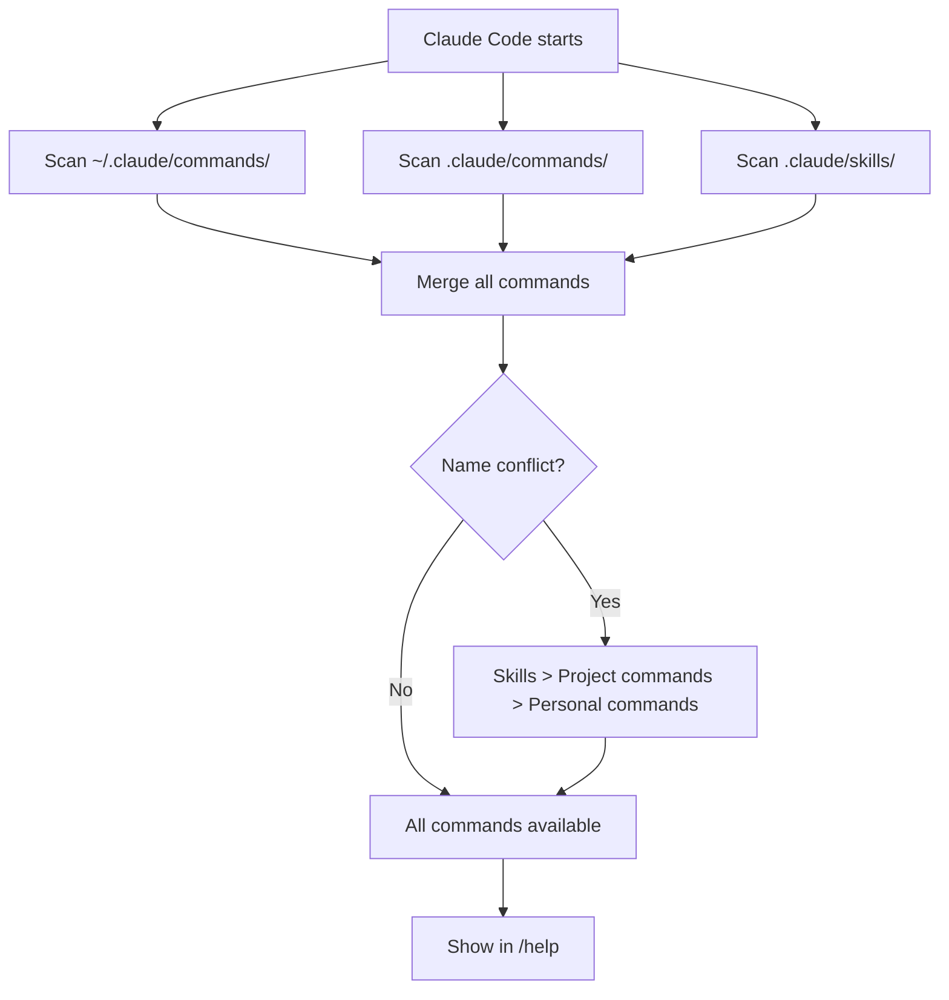
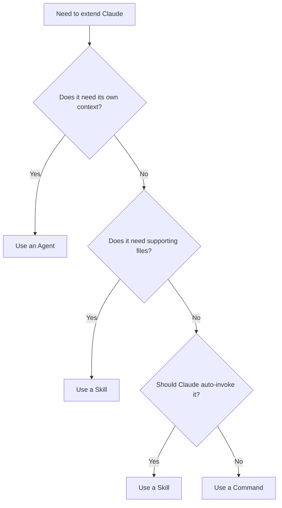

# Slash Command Setup Guide

> How to create, install, and share custom slash commands for Claude Code — including the full vibe coding/ops command suite.

---

## Table of Contents

1. [How Claude Code Slash Commands Work](#how-claude-code-slash-commands-work)
2. [The Commands Directory](#the-commands-directory)
3. [Command File Format](#command-file-format)
4. [The Vibe Coding/Ops Command Suite](#the-vibe-codingops-command-suite)
5. [Installing the Commands](#installing-the-commands)
6. [Sharing Commands Across Projects](#sharing-commands-across-projects)
7. [Commands vs Skills vs Agents](#commands-vs-skills-vs-agents)
8. [Tips and Best Practices](#tips-and-best-practices)

---

## How Claude Code Slash Commands Work

Claude Code supports custom slash commands — reusable prompts you invoke by typing `/command-name` in a session. Each command is a Markdown file that contains instructions Claude follows when you invoke it.

### The Basics

- Every `.md` file in `.claude/commands/` becomes a slash command
- The filename (minus `.md`) becomes the command name: `setup.md` becomes `/setup`
- Commands can accept arguments via the `$ARGUMENTS` placeholder
- Commands can include YAML frontmatter for metadata (description, tool restrictions, model override)
- Commands appear in `/help` and support tab-completion

### How It Works Under the Hood

When you type `/setup my-project`, Claude Code:

1. Finds `.claude/commands/setup.md`
2. Reads the file content
3. Replaces `$ARGUMENTS` with `my-project`
4. Injects the resulting text as a system-level prompt
5. Claude executes the instructions

This means your command file is essentially a detailed prompt that Claude follows step by step.

---

## The Commands Directory

### Project-Level Commands

```
your-project/
  .claude/
    commands/
      setup.md          → /setup
      incident.md       → /incident
      vibeops.md        → /vibeops
      framework.md      → /framework
```

Project commands are available only when Claude Code is running in that project directory. Check them into git so your entire team has access.

### User-Level (Personal) Commands

```
~/.claude/
  commands/
    my-command.md       → /my-command
    quick-fix.md        → /quick-fix
```

Personal commands are available in every project you work on. They are not shared with your team.

### Load Order and Priority

When Claude Code starts, it discovers commands from both locations. If a project command and a personal command share the same name, the **project command takes precedence**.



---

## Command File Format

### Minimal Command

The simplest possible command — just a markdown file with instructions:

```markdown
# Quick Commit

Look at `git diff` and create a well-formatted conventional commit for the staged changes.
```

Save as `.claude/commands/qc.md` and invoke with `/qc`.

### Command with Arguments

Use `$ARGUMENTS` to accept input:

```markdown
# Fix Issue

Fix GitHub issue $ARGUMENTS:

1. Run `gh issue view $ARGUMENTS` to get details
2. Search the codebase for relevant files
3. Implement the fix
4. Write tests
5. Create a commit referencing the issue
```

Save as `.claude/commands/fix.md` and invoke with `/fix 42`.

### Command with Frontmatter

YAML frontmatter between `---` markers adds metadata:

```markdown
---
description: Deploy to staging or production
allowed-tools: Read, Bash, Glob, Grep
model: opus
argument-hint: "[staging|production]"
---

# Deploy

Deploy the application to $ARGUMENTS.

1. Run all tests
2. Build the application
3. Deploy to the specified environment
4. Verify health checks
```

### Frontmatter Options

| Field | Type | Purpose |
|-------|------|---------|
| `description` | string | Shows in `/help` output; helps Claude decide when to suggest the command |
| `allowed-tools` | string | Comma-separated list of tools Claude can use (restricts access) |
| `model` | string | Override the model for this command (e.g., `opus`, `sonnet`, `haiku`) |
| `argument-hint` | string | Hint shown in `/help` for what arguments to pass |
| `disable-model-invocation` | boolean | If `true`, only the user can trigger this command (Claude will not auto-invoke it) |

---

## The Vibe Coding/Ops Command Suite

This framework includes four slash commands designed for vibe coding and vibe ops workflows. All command files live in `.claude/commands/`.

### `/setup` — Framework Bootstrap

**File**: `.claude/commands/setup.md`

Bootstraps a new project with the complete vibe coding/ops framework. Creates all directories, configuration files, the Prime Directive, logging infrastructure, and starter commands.

**Usage**:
```
/setup                    # Bootstrap current directory
/setup /path/to/project   # Bootstrap a specific directory
```

**What it creates**:
- `.claude/` directory with commands, skills, agents, and rules subdirectories
- `claudefiles/` directory with decisions, skills, agents, archive, changelog, and context
- `learning/` directory with sessions, frameworks, guidance, and archive
- `CLAUDE.md` and `.claude/CLAUDE.md` with starter templates
- `new_prime_directive.md` with the full governance rules
- `.gitignore` entries for Claude Code local files
- `.mcp.json` stub for MCP server configuration
- Session log and changelog entries recording the bootstrap

### `/incident` — Incident Management

**File**: `.claude/commands/incident.md`

Triggers a structured incident management workflow with five phases: triage, investigate, identify root cause, mitigate, and document.

**Usage**:
```
/incident SEV1 API returning 500 errors on /auth endpoint
/incident SEV2 Elevated latency on payment processing
/incident Database connection pool exhausted        # Defaults to SEV2
```

**What it does**:
- Creates an incident log in `claudefiles/incidents/`
- Runs diagnostic investigations (git history, code search, logs, MCP-connected services)
- Identifies root cause with evidence and confidence level
- Proposes ranked mitigation options (always asks before applying)
- Generates a postmortem stub with timeline and action items
- Updates the changelog and checks for skill extraction opportunities

### `/vibeops` — Operations Tasks

**File**: `.claude/commands/vibeops.md`

A task runner for common vibe ops operations. Supports eight subtasks.

**Usage**:
```
/vibeops                   # Show task menu
/vibeops deploy-check      # Pre-deployment readiness check
/vibeops infra-review      # Review infrastructure config
/vibeops deps-audit        # Audit dependencies
/vibeops health-check      # Full project health assessment
/vibeops monitor-setup     # Set up monitoring
/vibeops scale-plan        # Generate scaling plan
/vibeops cleanup           # Clean stale branches, deps, files
/vibeops status            # Full project status dashboard
```

### `/framework` — Methodology Explainer

**File**: `.claude/commands/framework.md`

A read-only reference command that explains the vibe coding/ops methodology. Useful for onboarding team members or refreshing your understanding.

**Usage**:
```
/framework                 # Show topic menu + full overview
/framework overview        # What is this framework?
/framework prime-directive # The governance system
/framework claude-md       # The CLAUDE.md configuration system
/framework skills          # Custom slash commands and skills
/framework agents          # Subagents and orchestration
/framework mcp             # MCP server integration
/framework workflow        # The four-phase development workflow
/framework structure       # Directory structure explained
/framework anti-patterns   # Common mistakes to avoid
```

### `/prime-directive` — Governance Activation

**File**: `.claude/commands/prime-directive.md` (included by default)

Activates the Prime Directive governance workflow for the current session. This initializes session logging, reads context, and ensures all rules are active.

**Usage**:
```
/prime-directive           # Activate governance for this session
```

---

## Installing the Commands

### Option 1: Clone This Repository (Recommended)

If you are starting from this framework repository:

```bash
# The commands are already in .claude/commands/
# Just start Claude Code in this directory
cd /path/to/claude_framework
claude
```

Verify with `/help` — you should see `/setup`, `/incident`, `/vibeops`, `/framework`, and `/prime-directive`.

### Option 2: Copy Commands to an Existing Project

```bash
# Create the commands directory
mkdir -p /path/to/your/project/.claude/commands

# Copy the command files
cp /path/to/claude_framework/.claude/commands/*.md \
   /path/to/your/project/.claude/commands/

# Verify
ls /path/to/your/project/.claude/commands/
# Should show: framework.md  incident.md  prime-directive.md  setup.md  vibeops.md
```

### Option 3: Install as Personal Commands (All Projects)

```bash
# Create the personal commands directory
mkdir -p ~/.claude/commands

# Copy commands you want everywhere
cp /path/to/claude_framework/.claude/commands/framework.md ~/.claude/commands/
cp /path/to/claude_framework/.claude/commands/vibeops.md ~/.claude/commands/

# Keep project-specific commands in the project
# (setup and prime-directive are usually project-specific)
```

### Option 4: Use `/setup` to Bootstrap

If you have the framework repo, you can use the setup command itself to bootstrap other projects:

```bash
# Start Claude Code in the framework repo
cd /path/to/claude_framework
claude

# Then run:
/setup /path/to/new/project
```

This creates the full directory structure, copies commands, and sets up governance files.

### Option 5: One-Liner Download (if hosted on GitHub)

If the framework repo is on GitHub:

```bash
# Download just the commands
mkdir -p .claude/commands
curl -sL https://raw.githubusercontent.com/YOUR_ORG/claude_framework/main/.claude/commands/setup.md \
  -o .claude/commands/setup.md
curl -sL https://raw.githubusercontent.com/YOUR_ORG/claude_framework/main/.claude/commands/incident.md \
  -o .claude/commands/incident.md
curl -sL https://raw.githubusercontent.com/YOUR_ORG/claude_framework/main/.claude/commands/vibeops.md \
  -o .claude/commands/vibeops.md
curl -sL https://raw.githubusercontent.com/YOUR_ORG/claude_framework/main/.claude/commands/framework.md \
  -o .claude/commands/framework.md
curl -sL https://raw.githubusercontent.com/YOUR_ORG/claude_framework/main/.claude/commands/prime-directive.md \
  -o .claude/commands/prime-directive.md
```

---

## Sharing Commands Across Projects

### User-Level vs Project-Level

| Scope | Location | Shared via | Best for |
|-------|----------|-----------|----------|
| **Project** | `.claude/commands/` | Git (checked in) | Team-wide workflows, project-specific tasks |
| **Personal** | `~/.claude/commands/` | Not shared (local only) | Personal preferences, cross-project utilities |

### Team Sharing Strategies

#### Strategy 1: Check Into Each Project

Add `.claude/commands/` to each project's repository. Every team member gets the commands when they clone.

**Pros**: Simple, version-controlled with the project
**Cons**: Duplicate files across projects, manual sync for updates

#### Strategy 2: Shared Framework Repository

Maintain a central framework repo (like this one) and copy commands to projects as needed.

**Pros**: Single source of truth, easy to update
**Cons**: Requires manual or scripted sync to projects

#### Strategy 3: Git Submodule

Add the framework repo as a git submodule:

```bash
git submodule add https://github.com/YOUR_ORG/claude_framework.git .claude/framework
```

Then symlink the commands:

```bash
ln -s .claude/framework/.claude/commands .claude/commands
```

**Pros**: Automatic updates via `git submodule update`
**Cons**: Submodule complexity, symlink handling

#### Strategy 4: Install Script

Create an install script in the framework repo:

```bash
#!/bin/bash
# install.sh — Install vibe coding commands to target project
TARGET="${1:-.}"
mkdir -p "$TARGET/.claude/commands"
cp .claude/commands/*.md "$TARGET/.claude/commands/"
echo "Installed $(ls .claude/commands/*.md | wc -l | tr -d ' ') commands to $TARGET/.claude/commands/"
```

Run it:
```bash
./install.sh /path/to/project
```

### Recommended Approach

Use a combination:
1. **Personal commands** in `~/.claude/commands/` for utilities you use everywhere
2. **Project commands** in `.claude/commands/` checked into git for team workflows
3. **Framework repo** as the central source for updates and new commands

---

## Commands vs Skills vs Agents

Claude Code has three extension mechanisms. Understanding when to use each one:

### Commands (`.claude/commands/*.md`)

- **Format**: Single markdown file
- **Invoked by**: User typing `/command-name`
- **Best for**: Simple workflows, quick actions, prompt templates
- **Example**: `/setup`, `/incident`

### Skills (`.claude/skills/<name>/SKILL.md`)

- **Format**: Directory with SKILL.md and optional supporting files
- **Invoked by**: User typing `/skill-name` OR Claude automatically (unless disabled)
- **Best for**: Complex workflows needing reference files, examples, or scripts
- **Example**: A deployment skill with shell scripts, a code review skill with a checklist file

### Agents (`.claude/agents/*.md`)

- **Format**: Single markdown file with agent-specific frontmatter
- **Invoked by**: Claude spawning a subagent, or user specifying `--agent`
- **Best for**: Specialized tasks that benefit from isolated context (security review, test writing, research)
- **Example**: A security reviewer that runs in its own context window

### Decision Guide



### Key Difference: Skills Can Be Auto-Invoked

Commands are only triggered by the user typing `/command-name`. Skills can also be triggered automatically by Claude when it determines the skill is relevant to the current task (unless `disable-model-invocation: true` is set in the frontmatter).

If you have a command that works well and you want Claude to use it proactively, migrate it to a skill:

```bash
# Command format
.claude/commands/code-review.md

# Skill format (same content, just moved)
.claude/skills/code-review/SKILL.md
```

---

## Tips and Best Practices

### 1. Start Simple, Add Complexity Later

Begin with a minimal command and iterate:

```markdown
# My Command
Do the thing with $ARGUMENTS.
```

Add frontmatter, detailed steps, and edge case handling as you discover what is needed.

### 2. Use `disable-model-invocation: true` for Side Effects

Any command that makes changes (deploys, commits, deletes) should include this frontmatter to prevent Claude from auto-triggering it:

```yaml
---
disable-model-invocation: true
---
```

### 3. Restrict Tools When Possible

Use `allowed-tools` to limit what Claude can do during a command. A read-only explainer should not need Write or Edit:

```yaml
---
allowed-tools: Read, Glob, Grep
---
```

### 4. Provide Clear Argument Hints

The `argument-hint` field helps users know what to pass:

```yaml
---
argument-hint: "[issue-number] [optional: priority P1|P2|P3]"
---
```

### 5. Handle Empty Arguments Gracefully

Always include a fallback for when `$ARGUMENTS` is empty:

```markdown
If `$ARGUMENTS` is empty, ask the user what they want to do.
```

### 6. Test Commands by Running Them

After creating a command, test it immediately:

```
/my-command test-argument
```

If something does not work as expected, iterate on the markdown.

### 7. Version Control Your Commands

Always check `.claude/commands/` into git. This creates a shared, versioned command library for your team.

### 8. Use Commands to Enforce Team Standards

Commands can encode your team's best practices:

```markdown
# PR Review Checklist

Before approving this PR, verify:
1. Tests cover the happy path and at least one error case
2. No TODO comments without linked issues
3. Type safety — no `any` types without justification
4. Commit messages follow conventional commits
...
```

---

## Sources

- [Slash Commands - Claude Code Docs](https://code.claude.com/docs/en/slash-commands)
- [Claude Code Skills Documentation](https://code.claude.com/docs/en/skills)
- [How to Create Custom Slash Commands in Claude Code](https://en.bioerrorlog.work/entry/claude-code-custom-slash-command)
- [Claude Code Slash Commands Guide](https://alexop.dev/posts/claude-code-slash-commands-guide/)
- [Claude Code Tips: Custom Slash Commands](https://cloudartisan.com/posts/2025-04-14-claude-code-tips-slash-commands/)
- [Claude Command Suite (GitHub)](https://github.com/qdhenry/Claude-Command-Suite)
- [Production-Ready Slash Commands Collection (GitHub)](https://github.com/wshobson/commands)
