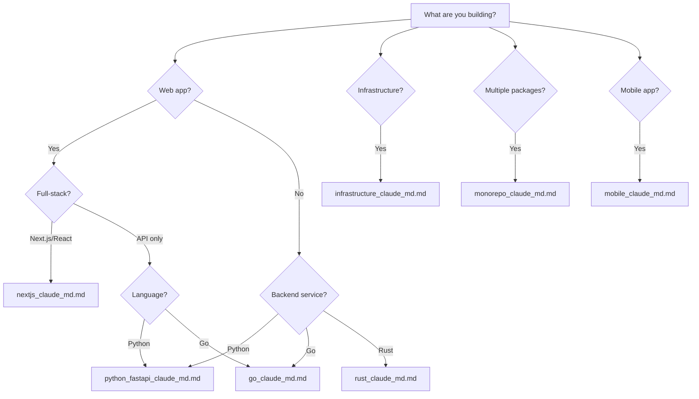

# Templates & Starter Kits

> Copy-paste-ready CLAUDE.md configurations and tool setups for every major project type.

## Quick Start

1. Pick the template that matches your stack
2. Copy the entire file into your project's `.claude/CLAUDE.md`
3. Customize the placeholders (marked with `<!-- CUSTOMIZE -->`)
4. Add MCP configs from `mcp_configs.md` if needed
5. Add hooks from `hooks_configs.md` for your team size

## Template Index

| Template | Best For | Key Tools |
|----------|----------|-----------|
| [Next.js/React/TypeScript](nextjs_claude_md.md) | Frontend apps, full-stack Next.js, React SPAs | Vitest/Jest, Tailwind, Vercel, Prisma |
| [Python FastAPI](python_fastapi_claude_md.md) | APIs, microservices, data pipelines | pytest, Docker, Alembic, Poetry/uv |
| [Go](go_claude_md.md) | CLIs, microservices, system tools | go test, golangci-lint, goreleaser |
| [Rust](rust_claude_md.md) | Systems programming, CLIs, WASM | cargo, clippy, criterion benchmarks |
| [Infrastructure/DevOps](infrastructure_claude_md.md) | Cloud infra, CI/CD, platform engineering | Terraform, Kubernetes, Docker, Pulumi |
| [Monorepo](monorepo_claude_md.md) | Multi-package projects, shared libraries | Turborepo, Nx, pnpm workspaces |
| [Mobile](mobile_claude_md.md) | iOS/Android apps | React Native, Flutter, Expo |
| [MCP Configs](mcp_configs.md) | Tool integrations | GitHub, Slack, AWS, Datadog, Jira |
| [Hooks Configs](hooks_configs.md) | CI gates, security, formatting | Pre-commit, post-commit, notification hooks |

## How to Choose



## Combining Templates

Many projects need more than one template. Common combinations:

- **Next.js + Monorepo**: Use monorepo as the root CLAUDE.md, Next.js template in the app package
- **FastAPI + Infrastructure**: Merge the two, putting infra conventions under a `## Infrastructure` section
- **Any template + MCP Configs**: Always add MCP configs — they work with every stack
- **Any template + Hooks**: Hooks configs scale from solo developer to enterprise teams

## Customization Guide

Every template follows this structure:

```
# Project Rules                    <-- Top-level conventions
## Build & Run Commands            <-- How to build, test, lint, deploy
## Code Conventions                <-- Style, naming, patterns
## Architecture                    <-- Project structure, key decisions
## Testing                         <-- Test strategy, coverage requirements
## Deployment                      <-- CI/CD, environments, rollbacks
## Common Tasks                    <-- Recipes for frequent operations
```

Sections marked `<!-- CUSTOMIZE -->` require project-specific values. Everything else works as sensible defaults.

## Template Philosophy

These templates encode **opinionated defaults** learned from production projects:

1. **Commands first** — Claude needs to know how to build, test, and lint before it can help effectively
2. **Patterns over rules** — Show the pattern you want, not just the rule
3. **Examples are king** — Every convention includes a concrete example
4. **Fail-safe testing** — Every template includes test commands that Claude can run to verify its work
5. **Security by default** — Sensitive file patterns, secret handling, and safety checks are built in
