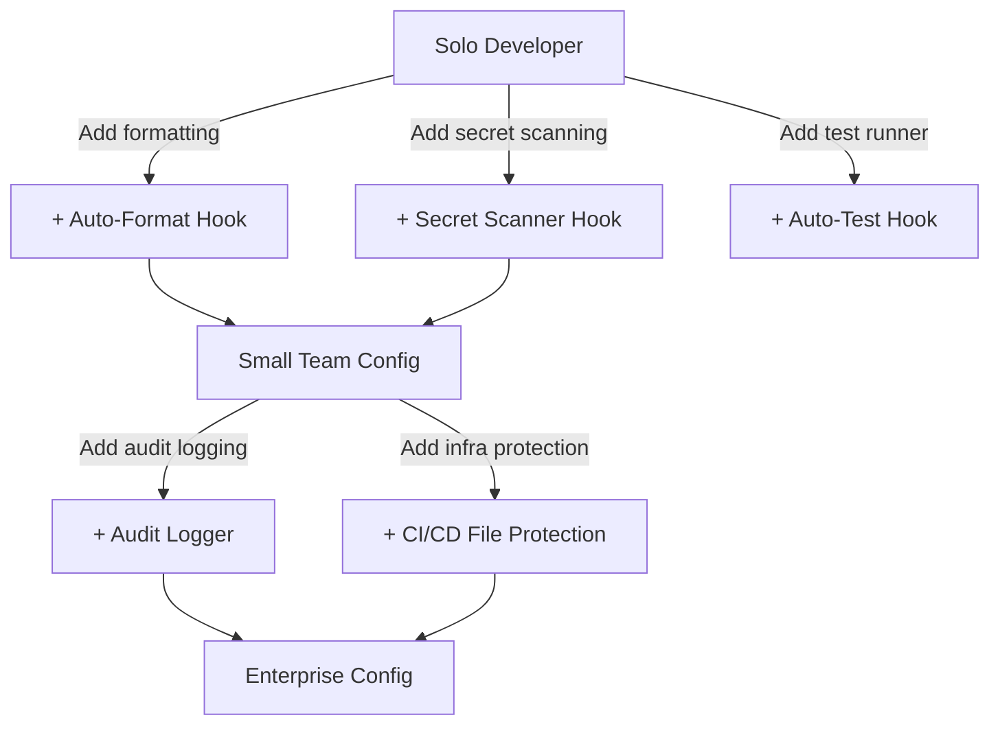

# Hooks Configurations — Production Ready

> Claude Code hooks run commands at specific points in the interaction lifecycle.
> These configurations are organized by team size and security requirements.

---

## How Hooks Work

Hooks are defined in `.claude/settings.json` under the `"hooks"` key. They execute at these lifecycle points:

| Hook | When It Runs | Use Cases |
|------|-------------|-----------|
| `PreToolUse` | Before Claude executes a tool | Validate, block, or modify tool calls |
| `PostToolUse` | After a tool completes | Log, audit, notify, post-process |
| `Notification` | When Claude wants to notify the user | Custom notification routing |
| `Stop` | When Claude finishes a response | Final checks, summaries, cleanup |

### Hook Config Structure
```json
{
  "hooks": {
    "PreToolUse": [
      {
        "matcher": "Bash",
        "hooks": [
          {
            "type": "command",
            "command": "your-command-here"
          }
        ]
      }
    ]
  }
}
```

### Hook Input/Output
- Hooks receive JSON on stdin with context about the tool call
- PreToolUse hooks can output JSON to modify behavior:
  - `{"decision": "block", "reason": "Blocked by policy"}` — prevent the tool call
  - `{"decision": "approve"}` — auto-approve without user confirmation
  - No output or empty = proceed normally

---

## Solo Developer — Lightweight Safety

> Minimal hooks for individual developers. Focus on preventing accidents without slowing you down.

```json
{
  "hooks": {
    "PreToolUse": [
      {
        "matcher": "Bash",
        "hooks": [
          {
            "type": "command",
            "command": "bash -c 'input=$(cat); cmd=$(echo \"$input\" | jq -r \".tool_input.command // empty\"); if echo \"$cmd\" | grep -qE \"rm\\s+-rf\\s+/|sudo\\s+rm|DROP\\s+DATABASE|DROP\\s+TABLE|truncate\\s+|format\\s+c:|:(){ :|:& };:\"; then echo \"{\\\"decision\\\": \\\"block\\\", \\\"reason\\\": \\\"Blocked: destructive system command detected\\\"}\"; fi'"
          }
        ]
      },
      {
        "matcher": "Bash",
        "hooks": [
          {
            "type": "command",
            "command": "bash -c 'input=$(cat); cmd=$(echo \"$input\" | jq -r \".tool_input.command // empty\"); if echo \"$cmd\" | grep -qE \"git\\s+push\\s+--force\\s+(origin\\s+)?(main|master)|git\\s+reset\\s+--hard\\s+origin\"; then echo \"{\\\"decision\\\": \\\"block\\\", \\\"reason\\\": \\\"Blocked: force push to main/master or hard reset to origin\\\"}\"; fi'"
          }
        ]
      }
    ],
    "PostToolUse": [
      {
        "matcher": "Write|Edit",
        "hooks": [
          {
            "type": "command",
            "command": "bash -c 'input=$(cat); file=$(echo \"$input\" | jq -r \".tool_input.file_path // empty\"); if echo \"$file\" | grep -qE \"\\.(env|pem|key|secret|credentials)$\"; then echo \"WARNING: Sensitive file modified: $file\" >&2; fi'"
          }
        ]
      }
    ]
  }
}
```

### What This Does
- **Blocks** `rm -rf /`, `DROP DATABASE`, fork bombs, and other destructive commands
- **Blocks** force pushes to main/master
- **Warns** when sensitive files (.env, .pem, .key) are modified

---

## Small Team (2-10 developers) — Standard Safety

> Balanced hooks for small teams. Adds formatting, secret scanning, and logging.

```json
{
  "hooks": {
    "PreToolUse": [
      {
        "matcher": "Bash",
        "hooks": [
          {
            "type": "command",
            "command": "bash -c 'input=$(cat); cmd=$(echo \"$input\" | jq -r \".tool_input.command // empty\"); if echo \"$cmd\" | grep -qE \"rm\\s+-rf\\s+/|sudo\\s+rm|DROP\\s+DATABASE|DROP\\s+TABLE|truncate\\s+|:(){ :|:& };:\"; then echo \"{\\\"decision\\\": \\\"block\\\", \\\"reason\\\": \\\"Blocked: destructive command detected\\\"}\"; fi'"
          }
        ]
      },
      {
        "matcher": "Bash",
        "hooks": [
          {
            "type": "command",
            "command": "bash -c 'input=$(cat); cmd=$(echo \"$input\" | jq -r \".tool_input.command // empty\"); if echo \"$cmd\" | grep -qE \"git\\s+push\\s+--force|git\\s+reset\\s+--hard|git\\s+clean\\s+-fd\"; then echo \"{\\\"decision\\\": \\\"block\\\", \\\"reason\\\": \\\"Blocked: destructive git operation. Use non-destructive alternatives.\\\"}\"; fi'"
          }
        ]
      },
      {
        "matcher": "Bash",
        "hooks": [
          {
            "type": "command",
            "command": "bash -c 'input=$(cat); cmd=$(echo \"$input\" | jq -r \".tool_input.command // empty\"); if echo \"$cmd\" | grep -qE \"curl\\s+.*\\|\\s*(bash|sh)|wget\\s+.*\\|\\s*(bash|sh)\"; then echo \"{\\\"decision\\\": \\\"block\\\", \\\"reason\\\": \\\"Blocked: piping remote content to shell\\\"}\"; fi'"
          }
        ]
      }
    ],
    "PostToolUse": [
      {
        "matcher": "Write|Edit",
        "hooks": [
          {
            "type": "command",
            "command": "bash -c 'input=$(cat); file=$(echo \"$input\" | jq -r \".tool_input.file_path // empty\"); if [ -n \"$file\" ] && echo \"$file\" | grep -qE \"\\.(ts|tsx|js|jsx)$\"; then npx prettier --write \"$file\" 2>/dev/null; fi'"
          }
        ]
      },
      {
        "matcher": "Write|Edit",
        "hooks": [
          {
            "type": "command",
            "command": "bash -c 'input=$(cat); file=$(echo \"$input\" | jq -r \".tool_input.file_path // empty\"); if [ -n \"$file\" ] && [ -f \"$file\" ]; then if grep -qE \"(AKIA[0-9A-Z]{16}|sk-[a-zA-Z0-9]{48}|ghp_[a-zA-Z0-9]{36}|xoxb-[0-9]{10,13}-[a-zA-Z0-9-]+|-----BEGIN (RSA |EC )?PRIVATE KEY)\" \"$file\" 2>/dev/null; then echo \"ALERT: Possible secret detected in $file\" >&2; fi; fi'"
          }
        ]
      }
    ],
    "Stop": [
      {
        "matcher": "",
        "hooks": [
          {
            "type": "command",
            "command": "bash -c 'input=$(cat); ts=$(date -u +\"%Y-%m-%dT%H:%M:%SZ\"); stop_reason=$(echo \"$input\" | jq -r \".stop_reason // \\\"unknown\\\"\"); echo \"$ts | stop_reason=$stop_reason\" >> .claude/session.log 2>/dev/null || true'"
          }
        ]
      }
    ]
  }
}
```

### What This Adds Over Solo
- **Blocks** all destructive git operations (force push, hard reset, clean -fd)
- **Blocks** piping remote content to shell (`curl | bash`)
- **Auto-formats** TypeScript/JavaScript files with Prettier after writes
- **Scans** for hardcoded secrets (AWS keys, API tokens, private keys)
- **Logs** session stop events with timestamps

---

## Enterprise Team (10+ developers) — Full Compliance

> Comprehensive hooks for enterprise environments. Adds audit logging, branch protection, and notifications.

```json
{
  "hooks": {
    "PreToolUse": [
      {
        "matcher": "Bash",
        "hooks": [
          {
            "type": "command",
            "command": "bash -c 'input=$(cat); cmd=$(echo \"$input\" | jq -r \".tool_input.command // empty\"); ts=$(date -u +\"%Y-%m-%dT%H:%M:%SZ\"); echo \"{\\\"timestamp\\\": \\\"$ts\\\", \\\"event\\\": \\\"pre_bash\\\", \\\"command\\\": $(echo \"$cmd\" | jq -Rs .)}\" >> .claude/audit.jsonl 2>/dev/null || true'"
          }
        ]
      },
      {
        "matcher": "Bash",
        "hooks": [
          {
            "type": "command",
            "command": "bash -c 'input=$(cat); cmd=$(echo \"$input\" | jq -r \".tool_input.command // empty\"); BLOCKED_PATTERNS=\"rm\\s+-rf\\s+/|sudo\\s+rm|DROP\\s+DATABASE|DROP\\s+TABLE|TRUNCATE\\s+TABLE|:(){ :|:& };:|mkfs\\.|dd\\s+if=|chmod\\s+-R\\s+777\"; if echo \"$cmd\" | grep -qiE \"$BLOCKED_PATTERNS\"; then echo \"{\\\"decision\\\": \\\"block\\\", \\\"reason\\\": \\\"SECURITY: Destructive system command blocked by enterprise policy\\\"}\"; fi'"
          }
        ]
      },
      {
        "matcher": "Bash",
        "hooks": [
          {
            "type": "command",
            "command": "bash -c 'input=$(cat); cmd=$(echo \"$input\" | jq -r \".tool_input.command // empty\"); if echo \"$cmd\" | grep -qE \"git\\s+push\\s+--force|git\\s+reset\\s+--hard|git\\s+clean\\s+-fd|git\\s+checkout\\s+\\.\"; then echo \"{\\\"decision\\\": \\\"block\\\", \\\"reason\\\": \\\"POLICY: Destructive git operations are blocked. Create a new commit to fix issues.\\\"}\"; fi'"
          }
        ]
      },
      {
        "matcher": "Bash",
        "hooks": [
          {
            "type": "command",
            "command": "bash -c 'input=$(cat); cmd=$(echo \"$input\" | jq -r \".tool_input.command // empty\"); if echo \"$cmd\" | grep -qE \"curl\\s+.*\\|\\s*(bash|sh)|wget\\s+.*\\|\\s*(bash|sh)|npm\\s+install\\s+-g|pip\\s+install(?!.*-r)|gem\\s+install\"; then echo \"{\\\"decision\\\": \\\"block\\\", \\\"reason\\\": \\\"POLICY: Remote execution and global installs are blocked. Use project-local dependency management.\\\"}\"; fi'"
          }
        ]
      },
      {
        "matcher": "Bash",
        "hooks": [
          {
            "type": "command",
            "command": "bash -c 'input=$(cat); cmd=$(echo \"$input\" | jq -r \".tool_input.command // empty\"); if echo \"$cmd\" | grep -qE \"docker\\s+run.*--privileged|docker\\s+run.*--net=host|docker\\s+run.*-v\\s+/:/\"; then echo \"{\\\"decision\\\": \\\"block\\\", \\\"reason\\\": \\\"SECURITY: Privileged Docker operations blocked\\\"}\"; fi'"
          }
        ]
      },
      {
        "matcher": "Write|Edit",
        "hooks": [
          {
            "type": "command",
            "command": "bash -c 'input=$(cat); file=$(echo \"$input\" | jq -r \".tool_input.file_path // empty\"); ts=$(date -u +\"%Y-%m-%dT%H:%M:%SZ\"); echo \"{\\\"timestamp\\\": \\\"$ts\\\", \\\"event\\\": \\\"pre_write\\\", \\\"file\\\": \\\"$file\\\"}\" >> .claude/audit.jsonl 2>/dev/null || true'"
          }
        ]
      },
      {
        "matcher": "Write|Edit",
        "hooks": [
          {
            "type": "command",
            "command": "bash -c 'input=$(cat); file=$(echo \"$input\" | jq -r \".tool_input.file_path // empty\"); if echo \"$file\" | grep -qE \"(Dockerfile|docker-compose|\\.github/workflows/|\\.gitlab-ci|Jenkinsfile|Makefile|terraform/.*\\.tf)$\"; then echo \"{\\\"decision\\\": \\\"block\\\", \\\"reason\\\": \\\"POLICY: Infrastructure and CI/CD files require manual review. Please make this change manually.\\\"}\"; fi'"
          }
        ]
      }
    ],
    "PostToolUse": [
      {
        "matcher": "Bash",
        "hooks": [
          {
            "type": "command",
            "command": "bash -c 'input=$(cat); ts=$(date -u +\"%Y-%m-%dT%H:%M:%SZ\"); exit_code=$(echo \"$input\" | jq -r \".tool_result.exit_code // 0\"); cmd=$(echo \"$input\" | jq -r \".tool_input.command // empty\" | head -c 200); echo \"{\\\"timestamp\\\": \\\"$ts\\\", \\\"event\\\": \\\"post_bash\\\", \\\"exit_code\\\": $exit_code, \\\"command_preview\\\": $(echo \"$cmd\" | jq -Rs .)}\" >> .claude/audit.jsonl 2>/dev/null || true'"
          }
        ]
      },
      {
        "matcher": "Write|Edit",
        "hooks": [
          {
            "type": "command",
            "command": "bash -c 'input=$(cat); file=$(echo \"$input\" | jq -r \".tool_input.file_path // empty\"); if [ -n \"$file\" ] && [ -f \"$file\" ]; then secrets_found=$(grep -cE \"(AKIA[0-9A-Z]{16}|sk-[a-zA-Z0-9]{20,}|ghp_[a-zA-Z0-9]{36}|xoxb-|xoxp-|-----BEGIN (RSA |EC |OPENSSH )?PRIVATE KEY|eyJ[a-zA-Z0-9_-]*\\.[a-zA-Z0-9_-]*\\.)\" \"$file\" 2>/dev/null || echo 0); if [ \"$secrets_found\" -gt 0 ]; then echo \"CRITICAL: $secrets_found potential secret(s) detected in $file\" >&2; ts=$(date -u +\"%Y-%m-%dT%H:%M:%SZ\"); echo \"{\\\"timestamp\\\": \\\"$ts\\\", \\\"event\\\": \\\"secret_detected\\\", \\\"file\\\": \\\"$file\\\", \\\"count\\\": $secrets_found}\" >> .claude/audit.jsonl 2>/dev/null || true; fi; fi'"
          }
        ]
      },
      {
        "matcher": "Write|Edit",
        "hooks": [
          {
            "type": "command",
            "command": "bash -c 'input=$(cat); file=$(echo \"$input\" | jq -r \".tool_input.file_path // empty\"); if [ -n \"$file\" ]; then ext=\"${file##*.}\"; case \"$ext\" in ts|tsx|js|jsx) npx prettier --write \"$file\" 2>/dev/null;; py) ruff format \"$file\" 2>/dev/null;; go) gofmt -w \"$file\" 2>/dev/null;; rs) rustfmt \"$file\" 2>/dev/null;; esac; fi'"
          }
        ]
      }
    ],
    "Notification": [
      {
        "matcher": "",
        "hooks": [
          {
            "type": "command",
            "command": "bash -c 'input=$(cat); msg=$(echo \"$input\" | jq -r \".message // empty\"); if command -v terminal-notifier &>/dev/null; then terminal-notifier -title \"Claude Code\" -message \"$msg\" -sound default; elif command -v notify-send &>/dev/null; then notify-send \"Claude Code\" \"$msg\"; fi'"
          }
        ]
      }
    ],
    "Stop": [
      {
        "matcher": "",
        "hooks": [
          {
            "type": "command",
            "command": "bash -c 'input=$(cat); ts=$(date -u +\"%Y-%m-%dT%H:%M:%SZ\"); stop_reason=$(echo \"$input\" | jq -r \".stop_reason // \\\"unknown\\\"\"); echo \"{\\\"timestamp\\\": \\\"$ts\\\", \\\"event\\\": \\\"session_stop\\\", \\\"reason\\\": \\\"$stop_reason\\\"}\" >> .claude/audit.jsonl 2>/dev/null || true'"
          }
        ]
      }
    ]
  }
}
```

### What This Adds Over Small Team
- **Full audit logging** — every Bash command and file write is logged to `.claude/audit.jsonl` (JSONL format for easy parsing)
- **Blocks** privileged Docker operations, global package installs, `chmod 777`
- **Blocks** direct modification of CI/CD files, Dockerfiles, and Terraform (requires manual review)
- **Multi-language auto-formatting** — Prettier for JS/TS, ruff for Python, gofmt for Go, rustfmt for Rust
- **Enhanced secret scanning** — detects AWS keys, API tokens, JWTs, private keys, Slack tokens
- **Desktop notifications** — native notifications when Claude needs attention (macOS + Linux)
- **Session logging** — complete audit trail of session stops

---

## Specialized Hook: Python Linting on Save

```json
{
  "hooks": {
    "PostToolUse": [
      {
        "matcher": "Write|Edit",
        "hooks": [
          {
            "type": "command",
            "command": "bash -c 'input=$(cat); file=$(echo \"$input\" | jq -r \".tool_input.file_path // empty\"); if [ -n \"$file\" ] && echo \"$file\" | grep -qE \"\\.py$\"; then ruff format \"$file\" 2>/dev/null && ruff check --fix \"$file\" 2>/dev/null; fi'"
          }
        ]
      }
    ]
  }
}
```

---

## Specialized Hook: Auto-Run Tests After Edits

> Automatically runs relevant tests whenever Claude edits a source file.

```json
{
  "hooks": {
    "PostToolUse": [
      {
        "matcher": "Write|Edit",
        "hooks": [
          {
            "type": "command",
            "command": "bash -c 'input=$(cat); file=$(echo \"$input\" | jq -r \".tool_input.file_path // empty\"); if [ -n \"$file\" ]; then test_file=\"\"; if echo \"$file\" | grep -qE \"\\.test\\.(ts|tsx|js|jsx)$\"; then test_file=\"$file\"; elif echo \"$file\" | grep -qE \"\\.(ts|tsx|js|jsx)$\"; then base=\"${file%.*}\"; for ext in test.ts test.tsx test.js test.jsx; do candidate=\"${base}.${ext}\"; if [ -f \"$candidate\" ]; then test_file=\"$candidate\"; break; fi; done; fi; if [ -n \"$test_file\" ] && [ -f \"$test_file\" ]; then npx vitest run \"$test_file\" --reporter=dot 2>&1 | tail -5; fi; fi'"
          }
        ]
      }
    ]
  }
}
```

---

## Specialized Hook: Branch Protection

> Prevent commits directly to main/master. Force feature branch workflow.

```json
{
  "hooks": {
    "PreToolUse": [
      {
        "matcher": "Bash",
        "hooks": [
          {
            "type": "command",
            "command": "bash -c 'input=$(cat); cmd=$(echo \"$input\" | jq -r \".tool_input.command // empty\"); if echo \"$cmd\" | grep -qE \"^git\\s+commit\"; then branch=$(git rev-parse --abbrev-ref HEAD 2>/dev/null); if [ \"$branch\" = \"main\" ] || [ \"$branch\" = \"master\" ]; then echo \"{\\\"decision\\\": \\\"block\\\", \\\"reason\\\": \\\"POLICY: Direct commits to $branch are not allowed. Create a feature branch first.\\\"}\"; fi; fi'"
          }
        ]
      }
    ]
  }
}
```

---

## Specialized Hook: Cost Guard for Cloud Commands

> Block potentially expensive cloud operations without explicit confirmation.

```json
{
  "hooks": {
    "PreToolUse": [
      {
        "matcher": "Bash",
        "hooks": [
          {
            "type": "command",
            "command": "bash -c 'input=$(cat); cmd=$(echo \"$input\" | jq -r \".tool_input.command // empty\"); if echo \"$cmd\" | grep -qE \"(terraform\\s+apply|terraform\\s+destroy|aws\\s+(ec2\\s+run-instances|rds\\s+create|eks\\s+create)|gcloud\\s+(compute\\s+instances\\s+create|sql\\s+instances\\s+create|container\\s+clusters\\s+create))\"; then echo \"{\\\"decision\\\": \\\"block\\\", \\\"reason\\\": \\\"COST GUARD: This command may provision expensive cloud resources. Run it manually after reviewing.\\\"}\"; fi'"
          }
        ]
      }
    ]
  }
}
```

---

## Composing Hooks

You can combine hooks from different tiers. Start with the Solo config and add specific hooks from higher tiers as needed:



### Merging Hooks
When combining, add hook entries to the same matcher array:

```json
{
  "hooks": {
    "PreToolUse": [
      {
        "matcher": "Bash",
        "hooks": [
          { "type": "command", "command": "hook-1-command" },
          { "type": "command", "command": "hook-2-command" }
        ]
      }
    ]
  }
}
```

All hooks for a matcher run in order. If any PreToolUse hook outputs a block decision, the tool call is prevented.
