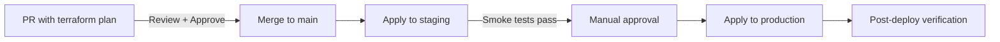

# Infrastructure / DevOps — CLAUDE.md Template

> Copy this entire file into `.claude/CLAUDE.md` at your project root.
> Replace all `<!-- CUSTOMIZE -->` sections with your project-specific values.

---

```markdown
# CLAUDE.md

<!-- CUSTOMIZE: Replace with your project name and description -->
## Project: Platform Infrastructure
Infrastructure-as-code for cloud resources, Kubernetes clusters, and CI/CD pipelines.

---

## Build & Run Commands

### Terraform
```bash
# Init & Plan
terraform init                              # Initialize providers and backend
terraform init -upgrade                     # Upgrade provider versions
terraform plan                              # Preview changes
terraform plan -target=module.vpc           # Plan specific resource
terraform plan -out=tfplan                  # Save plan to file

# Apply
terraform apply                             # Apply changes (interactive)
terraform apply tfplan                      # Apply saved plan
terraform apply -auto-approve               # Apply without prompt (CI only)
terraform apply -target=module.rds          # Apply specific resource

# State
terraform state list                        # List all resources
terraform state show aws_instance.web       # Inspect a resource
terraform state mv                          # Rename a resource
terraform import aws_s3_bucket.logs my-bucket  # Import existing resource

# Destroy
terraform destroy -target=module.staging    # Destroy specific module
terraform destroy                           # Destroy all resources (DANGEROUS)

# Validation
terraform validate                          # Syntax validation
terraform fmt -check -recursive             # Check formatting
terraform fmt -recursive                    # Auto-format
tflint                                      # Lint Terraform code
tfsec .                                     # Security scanning
checkov -d .                                # Policy-as-code scanning
infracost breakdown --path .                # Cost estimation
```

### Kubernetes
```bash
# Cluster
kubectl config get-contexts                 # List available clusters
kubectl config use-context staging          # Switch cluster

# Deploy
kubectl apply -f k8s/                       # Apply all manifests
kubectl apply -k overlays/staging           # Apply Kustomize overlay
helm upgrade --install myapp charts/myapp   # Helm release
helm diff upgrade myapp charts/myapp        # Preview Helm changes

# Status
kubectl get pods -n myapp                   # List pods
kubectl describe pod <name> -n myapp        # Pod details
kubectl logs -f deployment/myapp -n myapp   # Follow logs
kubectl top pods -n myapp                   # Resource usage

# Debug
kubectl exec -it <pod> -n myapp -- sh       # Shell into pod
kubectl port-forward svc/myapp 8080:80      # Local port forward
kubectl get events -n myapp --sort-by='.lastTimestamp'
```

### Docker
```bash
docker build -t myapp:latest .              # Build image
docker build --target test -t myapp:test .  # Build test stage
docker compose up -d                        # Start local stack
docker compose down -v                      # Stop and remove volumes
docker scout cves myapp:latest              # Vulnerability scan
```

---

## Code Conventions

### Terraform

#### File Organization
```
# Every Terraform root module follows this structure:
main.tf          # Primary resources and module calls
variables.tf     # Input variable declarations (with descriptions and validation)
outputs.tf       # Output values
providers.tf     # Provider configuration and version constraints
backend.tf       # State backend configuration
locals.tf        # Local values and computed expressions
data.tf          # Data sources
versions.tf      # Required provider versions (terraform block)
```

#### Naming
- Resources: `snake_case` — `aws_instance.web_server`
- Modules: `snake_case` — `module.vpc`, `module.rds_primary`
- Variables: `snake_case` with descriptive names — `vpc_cidr_block`, not `cidr`
- Outputs: match the resource attribute — `vpc_id`, `cluster_endpoint`
- Files: `snake_case.tf`
- Environments: separate directories or workspaces — `environments/staging/`, `environments/production/`

#### Module Rules
```hcl
# GOOD: Module with full variable documentation
variable "instance_type" {
  description = "EC2 instance type for the web servers"
  type        = string
  default     = "t3.medium"

  validation {
    condition     = can(regex("^t3\\.", var.instance_type))
    error_message = "Only t3 instance types are allowed."
  }
}

# GOOD: Tagging strategy — all resources get these tags
locals {
  common_tags = {
    Environment = var.environment
    Project     = var.project_name
    ManagedBy   = "terraform"
    Team        = var.team
  }
}
```

#### State Management
- **Remote state only** — never local state in shared environments
- Use S3 + DynamoDB (AWS) or GCS (GCP) for state backend
- One state file per environment per component
- Never run `terraform apply` without a plan review
- Lock state during applies (DynamoDB locking)

### Kubernetes

#### Manifest Organization
```
k8s/
  base/                        # Base manifests (Kustomize)
    deployment.yaml
    service.yaml
    hpa.yaml
    kustomization.yaml
  overlays/
    staging/
      kustomization.yaml       # Patches for staging
      replicas-patch.yaml
    production/
      kustomization.yaml       # Patches for production
      replicas-patch.yaml
      resource-limits-patch.yaml
```

#### Resource Conventions
- Always set resource requests AND limits
- Always set pod disruption budgets for production workloads
- Use `readinessProbe` and `livenessProbe` on every container
- Labels: `app.kubernetes.io/name`, `app.kubernetes.io/version`, `app.kubernetes.io/component`
- Namespaces: one per service or bounded context

```yaml
# GOOD: Production-ready deployment
apiVersion: apps/v1
kind: Deployment
metadata:
  name: myapp
  labels:
    app.kubernetes.io/name: myapp
    app.kubernetes.io/version: "1.2.3"
    app.kubernetes.io/component: api
spec:
  replicas: 3
  strategy:
    type: RollingUpdate
    rollingUpdate:
      maxUnavailable: 1
      maxSurge: 1
  selector:
    matchLabels:
      app.kubernetes.io/name: myapp
  template:
    spec:
      containers:
        - name: myapp
          image: myapp:1.2.3   # Always pin image tags, never use :latest
          resources:
            requests:
              cpu: 250m
              memory: 256Mi
            limits:
              cpu: 500m
              memory: 512Mi
          readinessProbe:
            httpGet:
              path: /healthz
              port: 8080
            initialDelaySeconds: 5
            periodSeconds: 10
          livenessProbe:
            httpGet:
              path: /healthz
              port: 8080
            initialDelaySeconds: 15
            periodSeconds: 20
          securityContext:
            runAsNonRoot: true
            readOnlyRootFilesystem: true
            allowPrivilegeEscalation: false
```

---

## Project Structure

<!-- CUSTOMIZE: Adjust to match your infrastructure layout -->

```
terraform/
  modules/                     # Reusable Terraform modules
    vpc/
    rds/
    ecs/
    s3/
  environments/
    staging/
      main.tf
      terraform.tfvars
      backend.tf
    production/
      main.tf
      terraform.tfvars
      backend.tf
  global/                      # Shared resources (IAM, DNS, state buckets)
    main.tf
k8s/
  base/                        # Kustomize base manifests
  overlays/
    staging/
    production/
  charts/                      # Helm charts
    myapp/
      Chart.yaml
      values.yaml
      values-staging.yaml
      values-production.yaml
      templates/
docker/
  Dockerfile.app               # Application Dockerfiles
  Dockerfile.worker
  docker-compose.yml           # Local development stack
  docker-compose.test.yml      # Test stack
scripts/
  setup.sh                     # Environment setup
  rotate-secrets.sh            # Secret rotation
  db-backup.sh                 # Database backup
.github/
  workflows/
    terraform-plan.yml         # PR: terraform plan
    terraform-apply.yml        # Merge: terraform apply
    docker-build.yml           # Build and push images
    k8s-deploy.yml             # Deploy to Kubernetes
```

---

## Safety Rules

### CRITICAL — Never Do Without Explicit Approval
- `terraform destroy` on production resources
- Delete or modify state files directly
- Apply changes to production without a reviewed plan
- Modify IAM policies that grant admin access
- Change network security groups to allow 0.0.0.0/0
- Delete persistent volumes or database instances

### Always Do
- Run `terraform plan` and review output before any apply
- Check `infracost` output for unexpected cost changes
- Run `tfsec` and `checkov` before applying security-related changes
- Use `-target` when applying changes to reduce blast radius
- Back up state before state manipulation operations
- Test infrastructure changes in staging before production

### Drift Detection
```bash
# Check for configuration drift (run in CI on schedule)
terraform plan -detailed-exitcode
# Exit code 0 = no changes, 1 = error, 2 = changes detected
```

---

## Environment Management

<!-- CUSTOMIZE: Define your environments -->

| Environment | Purpose | Terraform Workspace / Directory | K8s Context |
|-------------|---------|-------------------------------|-------------|
| Development | Local testing | `environments/dev/` | `docker-desktop` |
| Staging | Pre-production | `environments/staging/` | `staging-cluster` |
| Production | Live | `environments/production/` | `production-cluster` |

### Promotion Flow


---

## Secrets Management

- Never commit secrets, keys, or passwords to git
- Use AWS Secrets Manager, GCP Secret Manager, or HashiCorp Vault
- Reference secrets in Terraform via `data "aws_secretsmanager_secret_version"`
- In Kubernetes, use External Secrets Operator to sync from cloud secret managers
- Rotate secrets on a schedule (minimum quarterly)

---

## Common Tasks

### Add a new AWS resource
1. Create or update the relevant module in `terraform/modules/`
2. Add variables with descriptions and validation
3. Reference the module in the environment's `main.tf`
4. Run `terraform plan` and review
5. Apply to staging, verify, then production

### Add a new Kubernetes service
1. Create base manifests in `k8s/base/your-service/`
2. Add Kustomize overlays for each environment
3. Create Helm chart if the service is configurable
4. Add health check endpoints to the application
5. Configure HPA (Horizontal Pod Autoscaler) for production

### Respond to an incident
1. Check pod status: `kubectl get pods -n affected-namespace`
2. Check events: `kubectl get events -n affected-namespace --sort-by='.lastTimestamp'`
3. Check logs: `kubectl logs -f deployment/affected-service -n affected-namespace`
4. Check metrics: Grafana dashboards or `kubectl top pods`
5. If rollback needed: `kubectl rollout undo deployment/affected-service`
6. Document in incident log after resolution

### Rotate a secret
1. Generate new secret value
2. Update in secret manager (AWS Secrets Manager / Vault)
3. Trigger secret sync in Kubernetes (External Secrets Operator)
4. Verify application picks up new secret (check logs)
5. Invalidate old secret after confirmation
```
