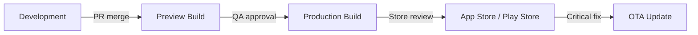

# Mobile (React Native / Flutter) — CLAUDE.md Template

> Copy this entire file into `.claude/CLAUDE.md` at your project root.
> Replace all `<!-- CUSTOMIZE -->` sections with your project-specific values.
> Choose either the React Native or Flutter section and delete the other.

---

## Option A: React Native (Expo)

```markdown
# CLAUDE.md

<!-- CUSTOMIZE: Replace with your project name and description -->
## Project: My Mobile App
A React Native application built with Expo, TypeScript, and React Navigation.

---

## Build & Run Commands

### Development
```bash
npx expo start                        # Start Expo dev server
npx expo start --ios                  # Start and open iOS simulator
npx expo start --android              # Start and open Android emulator
npx expo start --web                  # Start web version
npx expo start --clear                # Start with cleared cache
```

### Building
```bash
# EAS Build (cloud builds)
eas build --platform ios              # Build iOS (cloud)
eas build --platform android          # Build Android (cloud)
eas build --platform all              # Build both platforms
eas build --profile preview           # Build preview/staging version

# Local builds (requires Xcode / Android Studio)
npx expo run:ios                      # Local iOS build
npx expo run:android                  # Local Android build
```

### Testing
```bash
npm run test                          # Run all tests (Jest)
npm run test -- --watch               # Watch mode
npm run test -- --coverage            # Coverage report
npm run test -- -t "login flow"       # Run tests matching pattern
npm run test -- --testPathPattern="screens/Login"  # Specific file
```

### Code Quality
```bash
npm run lint                          # ESLint
npm run lint:fix                      # ESLint with auto-fix
npm run type-check                    # TypeScript check (tsc --noEmit)
```

### OTA Updates
```bash
eas update --branch production        # Push OTA update to production
eas update --branch preview           # Push OTA update to preview
eas update --message "Fix crash on login screen"
```

---

## Code Conventions

### React Native Specifics
- Use Expo SDK modules first (`expo-camera`, `expo-location`) before reaching for bare RN modules
- Always handle both iOS and Android — use `Platform.select()` or separate `.ios.tsx`/`.android.tsx` files
- Use `SafeAreaView` or `useSafeAreaInsets()` for all screens
- Avoid inline styles — use `StyleSheet.create()` or NativeWind (Tailwind for RN)

```typescript
// GOOD: Cross-platform style handling
import { Platform, StyleSheet } from "react-native";

const styles = StyleSheet.create({
  container: {
    paddingTop: Platform.select({ ios: 20, android: 0 }),
  },
  shadow: Platform.select({
    ios: {
      shadowColor: "#000",
      shadowOffset: { width: 0, height: 2 },
      shadowOpacity: 0.1,
      shadowRadius: 4,
    },
    android: {
      elevation: 4,
    },
  }),
});
```

### Navigation (React Navigation)
```typescript
// types/navigation.ts — Type-safe navigation
import { NativeStackScreenProps } from "@react-navigation/native-stack";

export type RootStackParamList = {
  Home: undefined;
  Profile: { userId: string };
  Settings: undefined;
};

export type RootStackScreenProps<T extends keyof RootStackParamList> =
  NativeStackScreenProps<RootStackParamList, T>;

// Usage in a screen
export function ProfileScreen({ route, navigation }: RootStackScreenProps<"Profile">) {
  const { userId } = route.params;
  // ...
}
```

### State Management
- Server state: TanStack Query (`@tanstack/react-query`)
- App state: Zustand (lightweight) or Jotai (atomic)
- Form state: React Hook Form
- Navigation state: React Navigation (built-in)
- Persistent state: MMKV (fast key-value) or AsyncStorage

### Performance Rules
- Use `FlashList` instead of `FlatList` for long lists
- Memoize expensive components with `React.memo()`
- Use `useCallback` for event handlers passed to child components
- Avoid re-renders: use Zustand selectors, not full store subscriptions
- Images: use `expo-image` with caching, specify dimensions

---

## Project Structure

```
app/                             # Expo Router file-based routing (if using)
  (tabs)/
    index.tsx                    # Home tab
    profile.tsx                  # Profile tab
    _layout.tsx                  # Tab navigator layout
  (auth)/
    login.tsx
    register.tsx
    _layout.tsx
  _layout.tsx                    # Root layout
src/
  components/
    ui/                          # Reusable primitives (Button, Input, Card)
    screens/                     # Screen-specific components
  hooks/                         # Custom hooks
  lib/
    api.ts                       # API client (axios/fetch wrapper)
    auth.ts                      # Auth utilities
    storage.ts                   # MMKV/AsyncStorage wrapper
    queryClient.ts               # TanStack Query setup
  stores/                        # Zustand stores
  types/                         # TypeScript types
  constants/                     # Colors, dimensions, config
  assets/                        # Images, fonts, animations
app.json                         # Expo config
eas.json                         # EAS Build/Update config
tsconfig.json
```

---

## Testing Strategy

### Unit Tests (Jest + React Native Testing Library)
```typescript
import { render, screen, fireEvent } from "@testing-library/react-native";
import { LoginScreen } from "../LoginScreen";

describe("LoginScreen", () => {
  it("shows error for invalid email", async () => {
    render(<LoginScreen />);

    fireEvent.changeText(screen.getByPlaceholderText("Email"), "not-an-email");
    fireEvent.press(screen.getByText("Log In"));

    expect(await screen.findByText("Invalid email address")).toBeTruthy();
  });

  it("calls login API with correct credentials", async () => {
    const mockLogin = jest.fn();
    render(<LoginScreen onLogin={mockLogin} />);

    fireEvent.changeText(screen.getByPlaceholderText("Email"), "user@test.com");
    fireEvent.changeText(screen.getByPlaceholderText("Password"), "password123");
    fireEvent.press(screen.getByText("Log In"));

    expect(mockLogin).toHaveBeenCalledWith("user@test.com", "password123");
  });
});
```

### E2E Tests (Detox or Maestro)
```yaml
# maestro/login-flow.yaml (Maestro)
appId: com.myorg.myapp
---
- launchApp
- tapOn: "Email"
- inputText: "test@example.com"
- tapOn: "Password"
- inputText: "password123"
- tapOn: "Log In"
- assertVisible: "Welcome back"
```

### What to Test
- Navigation flows (login -> home, deep links)
- Form validation and submission
- Error states (network errors, API errors)
- Platform-specific behavior
- Accessibility (labels, roles)

---

## Deployment

### EAS Build Profiles (eas.json)
```json
{
  "cli": { "version": ">= 5.0.0" },
  "build": {
    "development": {
      "developmentClient": true,
      "distribution": "internal"
    },
    "preview": {
      "distribution": "internal",
      "channel": "preview"
    },
    "production": {
      "channel": "production",
      "autoIncrement": true
    }
  },
  "submit": {
    "production": {
      "ios": { "appleId": "<!-- CUSTOMIZE -->" },
      "android": { "track": "production" }
    }
  }
}
```

### Release Flow

```

---

## Option B: Flutter

```markdown
# CLAUDE.md

<!-- CUSTOMIZE: Replace with your project name and description -->
## Project: My Mobile App
A Flutter application with Riverpod state management and GoRouter navigation.

---

## Build & Run Commands

```bash
# Development
flutter run                               # Run on connected device/emulator
flutter run -d chrome                     # Run on web
flutter run -d ios                        # Run on iOS simulator
flutter run -d android                    # Run on Android emulator
flutter run --release                     # Run in release mode

# Build
flutter build apk                        # Android APK
flutter build appbundle                   # Android App Bundle (Play Store)
flutter build ios                         # iOS (requires Xcode)
flutter build web                         # Web build

# Test
flutter test                              # Run all tests
flutter test test/unit/                   # Run unit tests only
flutter test test/widget/                 # Run widget tests only
flutter test --coverage                   # Coverage report
flutter test test/unit/auth_test.dart     # Specific test file

# Code Quality
flutter analyze                           # Dart analyzer (lint)
dart fix --apply                          # Auto-fix lint issues
dart format .                             # Format all Dart files
dart format --set-exit-if-changed .       # Check formatting (CI)

# Code Generation
dart run build_runner build               # Run code generation (freezed, json_serializable)
dart run build_runner watch               # Watch mode for codegen

# Dependencies
flutter pub get                           # Install dependencies
flutter pub upgrade                       # Upgrade dependencies
flutter pub outdated                      # Show outdated packages
```

---

## Code Conventions

### Dart Style
- Follow [Effective Dart](https://dart.dev/effective-dart)
- Use `final` by default — only use `var` when reassignment is needed
- Prefer named parameters for functions with more than 2 parameters
- Use `freezed` for immutable data classes
- Use `riverpod` for state management (code generation flavor)

```dart
// GOOD: Freezed data class
@freezed
class User with _$User {
  const factory User({
    required String id,
    required String email,
    required String name,
    @Default(UserRole.user) UserRole role,
  }) = _User;

  factory User.fromJson(Map<String, dynamic> json) => _$UserFromJson(json);
}

// GOOD: Riverpod provider
@riverpod
Future<User> currentUser(CurrentUserRef ref) async {
  final authState = ref.watch(authProvider);
  final client = ref.watch(apiClientProvider);
  return client.getUser(authState.userId);
}
```

### Naming
- Files: `snake_case.dart`
- Classes/enums: `PascalCase`
- Variables/functions: `camelCase`
- Constants: `camelCase` (Dart convention, not UPPER_SNAKE)
- Private members: `_leadingUnderscore`
- Providers: `camelCaseProvider` suffix (`currentUserProvider`)

---

## Project Structure

```
lib/
  main.dart                      # App entry point
  app.dart                       # MaterialApp configuration
  router/
    router.dart                  # GoRouter configuration
    routes.dart                  # Route definitions
  features/
    auth/
      data/
        auth_repository.dart     # Data layer
      domain/
        user.dart                # Domain model (freezed)
        auth_state.dart
      presentation/
        login_screen.dart        # UI
        login_controller.dart    # Controller (riverpod)
        widgets/                 # Feature-specific widgets
    home/
      data/
      domain/
      presentation/
  shared/
    widgets/                     # Reusable widgets
    extensions/                  # Dart extensions
    constants/                   # App-wide constants
    theme/                       # Theme data
    providers/                   # Shared providers (API client, etc.)
test/
  unit/                          # Pure Dart unit tests
  widget/                        # Widget tests
  integration/                   # Integration tests
  fixtures/                      # Test data
  helpers/                       # Test utilities
assets/
  images/
  fonts/
pubspec.yaml
analysis_options.yaml            # Lint rules
```

---

## Testing

### Unit Tests
```dart
// test/unit/auth_repository_test.dart
import 'package:flutter_test/flutter_test.dart';
import 'package:mocktail/mocktail.dart';

class MockApiClient extends Mock implements ApiClient {}

void main() {
  late AuthRepository repository;
  late MockApiClient mockClient;

  setUp(() {
    mockClient = MockApiClient();
    repository = AuthRepository(client: mockClient);
  });

  group('login', () {
    test('returns user on successful login', () async {
      when(() => mockClient.post(any(), data: any(named: 'data')))
          .thenAnswer((_) async => Response(data: userJson, statusCode: 200));

      final user = await repository.login('test@example.com', 'password');

      expect(user.email, 'test@example.com');
    });

    test('throws AuthException on invalid credentials', () async {
      when(() => mockClient.post(any(), data: any(named: 'data')))
          .thenThrow(DioException(response: Response(statusCode: 401)));

      expect(
        () => repository.login('test@example.com', 'wrong'),
        throwsA(isA<AuthException>()),
      );
    });
  });
}
```

### Widget Tests
```dart
// test/widget/login_screen_test.dart
import 'package:flutter_test/flutter_test.dart';

void main() {
  testWidgets('shows validation error for empty email', (tester) async {
    await tester.pumpWidget(
      ProviderScope(child: MaterialApp(home: LoginScreen())),
    );

    await tester.tap(find.text('Log In'));
    await tester.pumpAndSettle();

    expect(find.text('Email is required'), findsOneWidget);
  });
}
```
```
