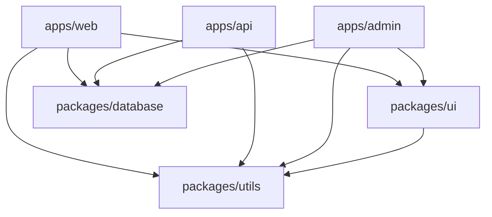

# Monorepo — CLAUDE.md Template

> Copy this entire file into `.claude/CLAUDE.md` at your project root.
> Replace all `<!-- CUSTOMIZE -->` sections with your project-specific values.
> Add stack-specific templates (Next.js, FastAPI, etc.) as CLAUDE.md files in individual packages.

---

```markdown
# CLAUDE.md

<!-- CUSTOMIZE: Replace with your project name and description -->
## Project: My Platform
A monorepo containing multiple applications and shared packages.

<!-- CUSTOMIZE: Pick your monorepo tool — delete the sections you don't use -->

---

## Monorepo Tool: Turborepo + pnpm

### Build & Run Commands

```bash
# Install
pnpm install                               # Install all dependencies

# Build
pnpm turbo build                           # Build all packages
pnpm turbo build --filter=@myorg/web       # Build specific package
pnpm turbo build --filter=@myorg/web...    # Build package + dependencies
pnpm turbo build --filter=./apps/*         # Build all apps
pnpm turbo build --filter=./packages/*     # Build all packages

# Development
pnpm turbo dev                             # Dev servers for all apps
pnpm turbo dev --filter=@myorg/web         # Dev server for one app

# Test
pnpm turbo test                            # Test all packages
pnpm turbo test --filter=@myorg/web        # Test specific package
pnpm turbo test --filter=...[HEAD~1]       # Test changed packages since last commit

# Lint & Format
pnpm turbo lint                            # Lint all packages
pnpm turbo format                          # Format all packages
pnpm turbo type-check                      # TypeScript check all packages

# Single package commands (run from root)
pnpm --filter @myorg/web add react         # Add dependency to specific package
pnpm --filter @myorg/web exec vitest       # Run command in package context
```

### Turborepo Configuration

```json5
// turbo.json
{
  "$schema": "https://turbo.build/schema.json",
  "globalDependencies": ["**/.env.*local"],
  "tasks": {
    "build": {
      "dependsOn": ["^build"],              // Build dependencies first
      "outputs": [".next/**", "dist/**"]    // Cache these outputs
    },
    "dev": {
      "cache": false,                        // Never cache dev
      "persistent": true                     // Long-running process
    },
    "test": {
      "dependsOn": ["build"],               // Build before testing
      "outputs": ["coverage/**"]
    },
    "lint": {
      "dependsOn": ["^build"]               // Need built types
    },
    "type-check": {
      "dependsOn": ["^build"]
    }
  }
}
```

---

## Monorepo Tool: Nx (Alternative)

### Build & Run Commands

```bash
# Build
npx nx build web                           # Build specific project
npx nx run-many -t build                   # Build all projects
npx nx affected -t build                   # Build affected projects

# Development
npx nx dev web                             # Dev server for one app

# Test
npx nx test web                            # Test specific project
npx nx run-many -t test                    # Test all projects
npx nx affected -t test                    # Test affected projects

# Lint
npx nx lint web
npx nx run-many -t lint
npx nx affected -t lint

# Generators
npx nx g @nx/react:component Button --project=ui  # Generate component
npx nx g @nx/node:application api                  # Generate new app
npx nx graph                                       # Visualize dependency graph
```

---

## Project Structure

<!-- CUSTOMIZE: Adjust to your actual layout -->

```
apps/
  web/                          # Next.js frontend application
    src/
    package.json
    tsconfig.json
    .claude/CLAUDE.md           # App-specific Claude instructions (Next.js template)
  api/                          # Backend API application
    src/
    package.json
    .claude/CLAUDE.md           # App-specific Claude instructions
  admin/                        # Admin dashboard
    src/
    package.json
packages/
  ui/                           # Shared UI component library
    src/
      components/
        Button/
          Button.tsx
          Button.test.tsx
          index.ts
      index.ts                  # Barrel export
    package.json
    tsconfig.json
  config-eslint/                # Shared ESLint config
    index.js
    package.json
  config-typescript/            # Shared TypeScript config
    base.json
    nextjs.json
    react-library.json
    package.json
  database/                     # Shared database client and types
    src/
      client.ts
      schema.ts
    package.json
  utils/                        # Shared utilities
    src/
    package.json
tooling/
  scripts/                      # CI/CD and automation scripts
turbo.json                      # Turborepo config (or nx.json for Nx)
pnpm-workspace.yaml             # Workspace package definitions
package.json                    # Root package.json
tsconfig.json                   # Root TypeScript config (references)
```

---

## Code Conventions

### Package Management
- **Internal packages**: Prefix with `@myorg/` — `@myorg/ui`, `@myorg/utils`
- **Versioning**: Use `"workspace:*"` protocol for internal dependencies
- **No hoisting conflicts**: Each package declares its own dependencies
- **Shared configs**: Extract ESLint, TypeScript, and Prettier configs into packages

```json5
// packages/ui/package.json
{
  "name": "@myorg/ui",
  "version": "0.0.0",
  "private": true,
  "exports": {
    ".": "./src/index.ts",
    "./button": "./src/components/Button/index.ts"
  },
  "dependencies": {
    "react": "^18.0.0"
  },
  "devDependencies": {
    "@myorg/config-typescript": "workspace:*",
    "@myorg/config-eslint": "workspace:*"
  }
}
```

### Cross-Package Rules
- **Shared packages must not import from apps** — dependencies flow one way: apps -> packages
- **Circular dependencies are forbidden** — run `npx turbo graph` or `npx nx graph` to verify
- **Type-only imports across packages**: Use `import type` to avoid runtime coupling where possible
- **Test in isolation**: Each package must be testable independently



### Shared TypeScript Configuration
```json5
// packages/config-typescript/base.json
{
  "$schema": "https://json.schemastore.org/tsconfig",
  "compilerOptions": {
    "strict": true,
    "esModuleInterop": true,
    "skipLibCheck": true,
    "forceConsistentCasingInFileNames": true,
    "resolveJsonModule": true,
    "isolatedModules": true,
    "declaration": true,
    "declarationMap": true,
    "sourceMap": true
  },
  "exclude": ["node_modules", "dist"]
}

// apps/web/tsconfig.json — extends the base
{
  "extends": "@myorg/config-typescript/nextjs.json",
  "compilerOptions": {
    "paths": {
      "@/*": ["./src/*"]
    }
  },
  "include": ["src", "next-env.d.ts"],
  "exclude": ["node_modules"]
}
```

---

## Testing Strategy

### Per-Package Testing
- Each package runs its own test suite
- Use `turbo test` / `nx test` to run them in dependency order
- Share test utilities via a `@myorg/test-utils` package

### Affected Testing
```bash
# Only test packages affected by changes (great for CI)
pnpm turbo test --filter=...[origin/main]

# Nx equivalent
npx nx affected -t test --base=origin/main
```

### Integration Testing
- E2E tests live in `apps/web/tests/` or a dedicated `tests/` app
- E2E tests run against deployed preview environments, not local dev
- Use Playwright with the monorepo — install at root, run per app

---

## CI/CD Patterns

### Turborepo Remote Caching
```bash
# Enable Vercel Remote Cache (fastest option)
npx turbo login
npx turbo link

# Or self-hosted cache
# Set TURBO_TOKEN and TURBO_TEAM environment variables
```

### Selective Deployment
```yaml
# .github/workflows/deploy.yml — deploy only changed apps
jobs:
  detect-changes:
    runs-on: ubuntu-latest
    outputs:
      web: ${{ steps.filter.outputs.web }}
      api: ${{ steps.filter.outputs.api }}
    steps:
      - uses: dorny/paths-filter@v3
        id: filter
        with:
          filters: |
            web:
              - 'apps/web/**'
              - 'packages/**'
            api:
              - 'apps/api/**'
              - 'packages/**'

  deploy-web:
    needs: detect-changes
    if: needs.detect-changes.outputs.web == 'true'
    # ... deploy web app

  deploy-api:
    needs: detect-changes
    if: needs.detect-changes.outputs.api == 'true'
    # ... deploy API
```

---

## Common Tasks

### Add a new app
1. Create `apps/your-app/` with `package.json`, `tsconfig.json`
2. Add `@myorg/` prefix to package name
3. Extend shared TypeScript and ESLint configs
4. Add turbo tasks in `turbo.json` or project.json for Nx
5. Add to CI pipeline path filters

### Add a shared package
1. Create `packages/your-package/` with source and package.json
2. Export via `exports` field in package.json
3. Add `"@myorg/your-package": "workspace:*"` to consuming packages
4. Run `pnpm install` to link
5. Add to `turbo.json` pipeline if it has build/test tasks

### Move code from an app to a shared package
1. Create the shared package with the extracted code
2. Add tests for the extracted code in the new package
3. Update imports in the original app to use `@myorg/new-package`
4. Run `pnpm turbo build` to verify no circular dependencies
5. Run `pnpm turbo test` to verify nothing is broken

### Upgrade a dependency across all packages
```bash
# Update a dependency everywhere it's used
pnpm update react --recursive
pnpm update react@latest --recursive --latest

# Check for outdated packages
pnpm outdated --recursive
```
```
