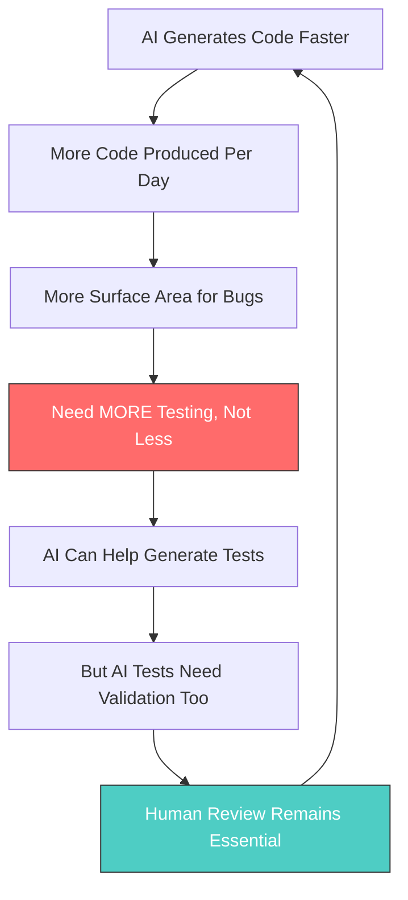
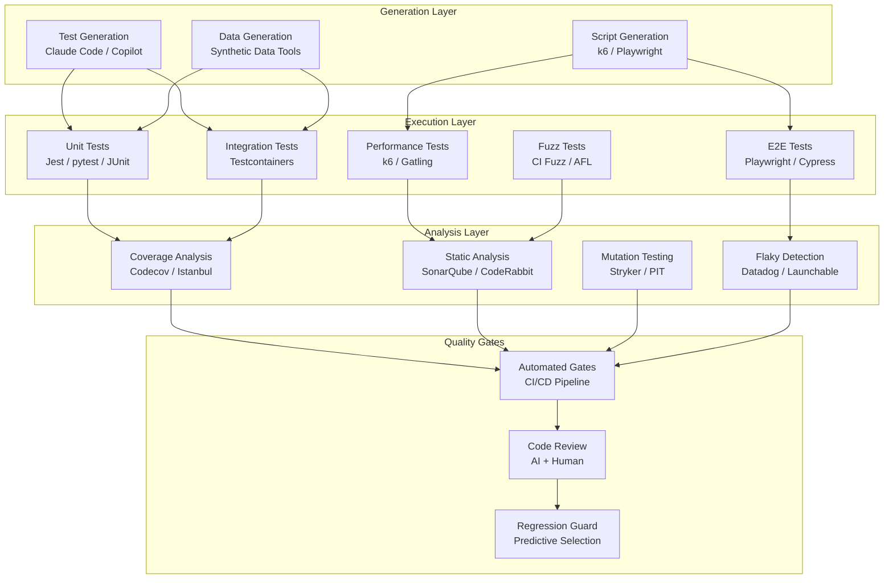

# AI-Assisted Testing: Landscape Overview

> A comprehensive guide to using AI — particularly Claude Code — for software testing, code quality, and reliability engineering. Based on 2025-2026 research, industry data, and production case studies.

---

## Why This Exists

In 2026, **81% of development teams use AI in their testing workflows**. Yet AI-generated code requires *more* testing, not less. This directory provides battle-tested strategies, working Claude Code skills, tool comparisons, and real effectiveness data to help teams build reliable software with AI assistance.

## The AI Testing Paradox



## Key Statistics (2025-2026)

| Metric | Value | Source |
|--------|-------|--------|
| Dev teams using AI in testing | 81% | Industry surveys 2025 |
| AI-generated test statement coverage (median) | 70.2% | Empirical study, arxiv 2406.18181 |
| AI-generated test branch coverage (median) | 52.8% | Empirical study, arxiv 2406.18181 |
| Tests accepted by engineers (Meta ACH) | 73% | Meta FSE 2025 |
| Property-based tests: bug detection vs example-based | 3x more bugs found | Research 2025 |
| Developers preferring Claude Code | 46% | Pragmatic Engineer survey, Mar 2026 |
| Flaky test maintenance reduction (Visual AI) | 78% | Applitools/Peloton case study |
| k6 memory efficiency vs JMeter | 3x less memory | Grafana benchmarks |

## Directory Contents

| File | What It Covers |
|------|---------------|
| [`test_generation.md`](test_generation.md) | AI test generation: unit, integration, e2e, property-based, mutation. Tool comparisons, effectiveness data, working Claude Code skills |
| [`quality_metrics.md`](quality_metrics.md) | Code quality metrics, automated quality gates, CI/CD configurations, benchmarks |
| [`test_strategies.md`](test_strategies.md) | Testing strategies for AI-generated code: coverage targets, review checklists, regression approaches |
| [`fuzzing_security.md`](fuzzing_security.md) | AI-assisted fuzzing and security testing: tools, techniques, Claude Code integration |

## The AI Testing Stack



## Quick Start: Claude Code Testing Workflow

### 1. Generate Tests for Existing Code

```bash
# Use Claude Code to generate unit tests
claude "Write comprehensive unit tests for src/services/auth.ts.
Use Jest. Include edge cases, error paths, and boundary conditions.
Aim for >90% branch coverage. Use property-based testing for input validation."
```

### 2. Review and Validate AI-Generated Tests

```bash
# Ask Claude to review its own tests critically
claude "Review the tests you just wrote. For each test:
1. Does it test behavior or implementation details?
2. Could it pass with a buggy implementation?
3. Is the assertion specific enough?
4. Would a mutation survive this test?"
```

### 3. Run Mutation Testing to Validate Test Quality

```bash
# Use Stryker to check if tests actually catch bugs
npx stryker run --mutate 'src/services/auth.ts'
```

### 4. Fill Coverage Gaps

```bash
# Ask Claude to target uncovered branches
claude "Here are the uncovered branches from our coverage report:
[paste coverage output]
Write tests that specifically cover these branches."
```

## Tool Landscape Summary

### AI Test Generation Tools (2026)

| Tool | Best For | AI Model | Language Support |
|------|----------|----------|-----------------|
| **Claude Code** | Complex logic, multi-file, architecture-aware tests | Claude Opus 4.6 | All major languages |
| **GitHub Copilot** | Inline test completion, quick unit tests | GPT-5.2 / Claude / Gemini | All major languages |
| **Amazon Q Developer** | AWS-specific, security scanning | Amazon models | Java, Python, JS, TS |
| **Qodo (CodiumAI)** | Test generation focused, behavior coverage | Multiple models | Python, JS, TS, Java |
| **Testim** | E2E with self-healing, visual testing | Proprietary | Web applications |
| **Mabl** | Low-code test automation, accessibility | Proprietary | Web applications |
| **Autonoma** | AI-native E2E from source analysis | Proprietary | Web applications |

### Static Analysis + AI Code Review (2026)

| Tool | AI Features | Best For |
|------|-------------|----------|
| **SonarQube** | AI CodeFix suggestions, 40% faster JS/TS analysis | Enterprise, multi-language |
| **CodeRabbit** | AI-powered PR review, auto-summarization | GitHub/GitLab teams |
| **CodeAnt.ai** | Line-by-line AI review, security risk flagging | Security-focused teams |
| **Codacy** | AI-assisted code patterns, security | Multi-repo organizations |
| **Snyk Code** | AI security scanning, fix suggestions | Security-first workflows |

### Performance & Load Testing (2026)

| Tool | AI Integration | Best For |
|------|---------------|----------|
| **k6 (Grafana)** | AI script generation from Swagger, anomaly detection | Developer-centric, CI/CD |
| **JMeter** | Limited AI (XML generation is error-prone) | Complex protocols, legacy |
| **Gatling** | Scala DSL, growing AI support | High-throughput scenarios |
| **Artillery** | YAML-based, easy AI generation | Node.js teams, quick setup |

## Principles for AI-Assisted Testing

1. **AI generates, humans validate**: Never trust AI tests without review
2. **Mutation testing is the quality check**: If mutants survive, tests are weak
3. **Property-based > example-based**: For AI code, test invariants not examples
4. **Coverage is necessary but not sufficient**: High coverage with weak assertions is theater
5. **Test the tests**: Use mutation testing scores as the real quality metric
6. **Flaky tests are debt**: Detect and fix immediately; AI can help identify root causes
7. **Security testing is non-negotiable**: AI-generated code has known vulnerability patterns
8. **Performance baselines before and after**: AI code often trades clarity for correctness, not performance

## Sources

- [Empirical Study of Unit Test Generation with LLMs](https://arxiv.org/html/2406.18181v1)
- [Meta ACH: Mutation-Guided LLM Test Generation](https://engineering.fb.com/2025/02/05/security/revolutionizing-software-testing-llm-powered-bug-catchers-meta-ach/)
- [Meta: LLMs Are the Key to Mutation Testing](https://engineering.fb.com/2025/09/30/security/llms-are-the-key-to-mutation-testing-and-better-compliance/)
- [Sonar: LLMs for Code Generation Quality Research](https://www.sonarsource.com/resources/library/llm-code-generation/)
- [Assessing Quality and Security of AI-Generated Code](https://arxiv.org/abs/2508.14727)
- [Claude Code Best Practices](https://code.claude.com/docs/en/best-practices)
- [Datadog Bits AI for Flaky Test Fixes](https://www.datadoghq.com/blog/bits-ai-test-optimization/)
- [k6 vs JMeter Comparison](https://grafana.com/blog/k6-vs-jmeter-comparison/)
